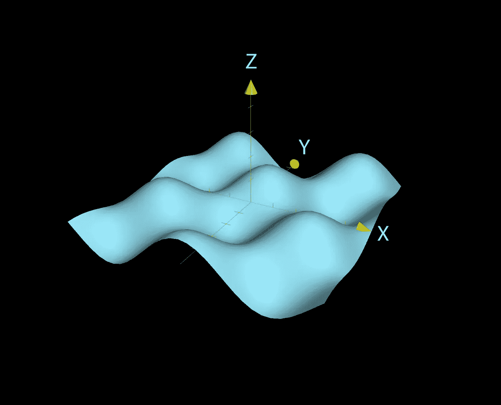
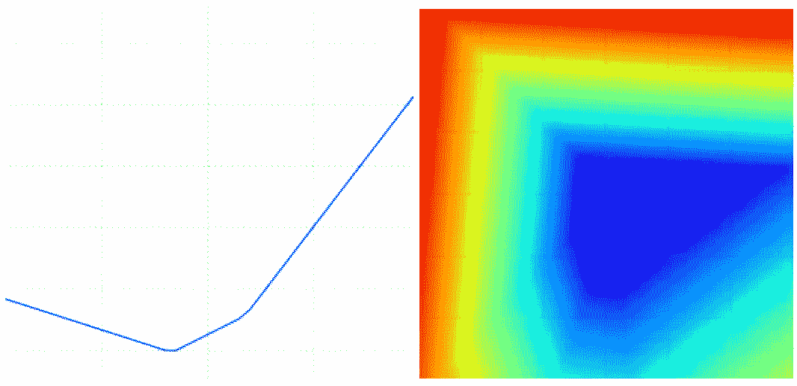
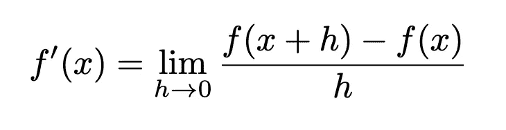
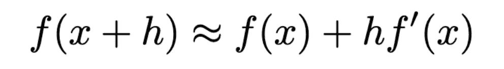
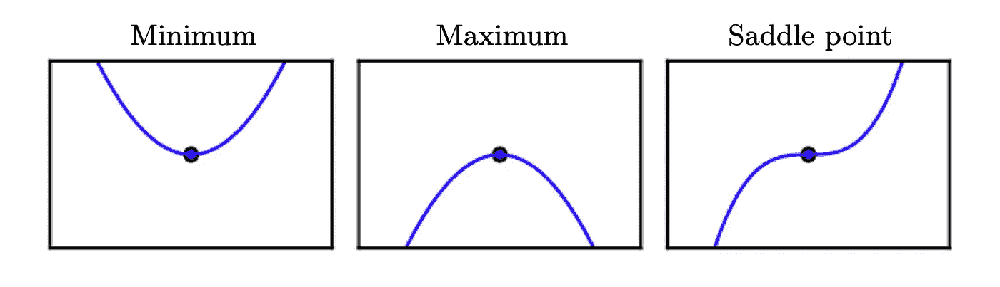
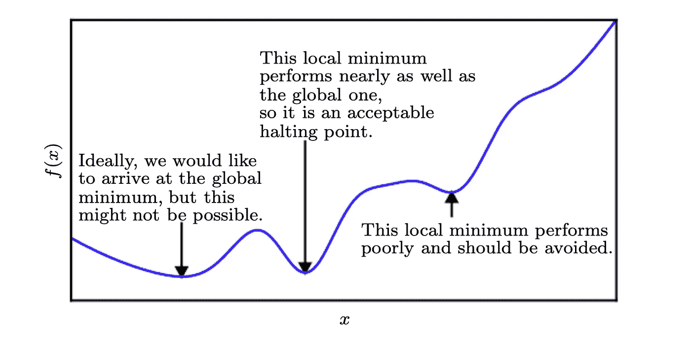
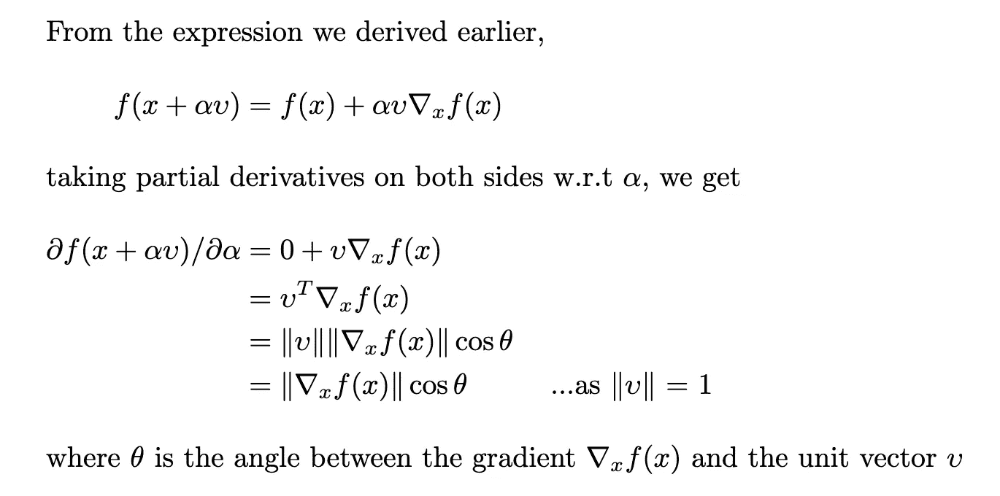
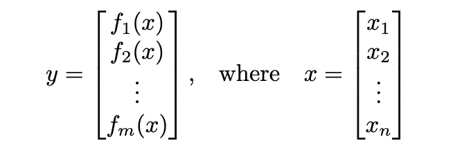
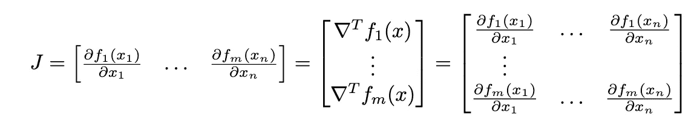
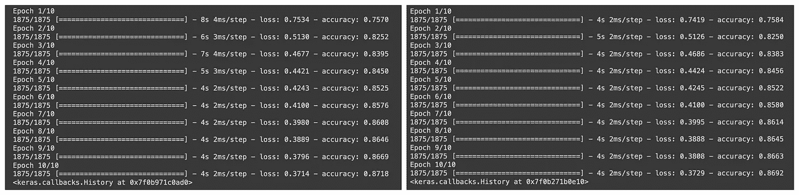

# 梯度下降优化

> 原文：<https://pub.towardsai.net/gradient-descent-optimization-15ee38e75e12?source=collection_archive---------4----------------------->

## 梯度下降优化算法



来源:图片来自[可汗学院](https://www.khanacademy.org/math/multivariable-calculus/thinking-about-multivariable-function/ways-to-represent-multivariable-functions/a/multidimensional-graphs)

大多数深度学习算法通过优化某种目标(或损失)函数来进行训练。我们通常试图最大化或最小化这些功能。基于梯度的优化是用于训练神经网络的最广泛使用的技术。

在本文中，我们将看到众所周知的梯度下降算法。我们将讨论它是什么，为什么它工作，最后，为张量流实现一个梯度下降优化器。

这篇文章是写给那些刚刚听说梯度下降的人，或者那些认为梯度下降是一个黑盒，对发生的事情有一个肤浅的理解，但想更深入地了解事情为什么是这样的人。

**注**:本文灵感来源于《 [**》深度学习教材**](https://www.deeplearningbook.org/) **:** [**第四章:数值计算**](https://www.deeplearningbook.org/contents/numerical.html) 》和《 [**斯坦福 CS class CS231n:用于视觉识别的卷积神经网络注**](https://cs231n.github.io/) 。”

# 内容

这是一篇相当长的文章，所有这些部分可能不会立刻引起读者的兴趣或关注。请随意使用以下列表导航并跳到与您相关的部分:

1.  [**损失函数**](#4219)
2.  [**优化**](#3832)1。[**随机搜索**](#4837)2。[**随机局部搜索**](#4ac1)3。[**基于梯度的优化**](#08d7)
3.  [**渐变下降**](#ec42)1。[**最小值**](#e131)2。[**为什么不能直接把导数等同于 0，求解 x？**](#ba09)3。[**参数更新公式**](#d322)a .**[**为什么负梯度是最陡下降的方向？**](#e7ba)b .**[**为什么我们说‘往渐变的反方向走’**](#7928)****
4.  ****[**雅各派和黑森派**](#1419)1。[**二阶导数测试和二阶优化**](#ce6c)2。[**为什么不对神经网络使用二阶优化算法？**](#4d8c)****
5.  ****[**计算渐变**](#ef32)1。[**利用有限差分**](#0dc6)2。[**利用微积分**](#a6e1)****
6.  ****[**实现**](#51a7)****
7.  ****[**结论**](#7fcb)****
8.  ****[参考文献 ](#0913)****

# ****损失函数****

****损失函数也称为目标函数、误差函数、成本函数或标准，可以是任何(可微分的)函数，有助于根据基本事实评估算法的输出。它可以是从连续值的[均方误差](https://en.wikipedia.org/wiki/Mean_squared_error)到概率分布的[交叉熵](https://en.wikipedia.org/wiki/Cross_entropy)损失的任何值。虽然损失函数非常有趣，但今天，我们只关心如何最小化它们。****

****为了理解我们到底想要什么，让我们想象一个损失函数。实际上，许多参数会改变损失，因此很难想象。为了简单起见，我们只考虑 2。****

****让我们定义一个损耗:`y = L(x, z)`其中`x, y, z`分别是沿 X、Y、Z 轴的笛卡尔坐标。
让我们取随机值`wx`和`wz`，我们得到空间中的点:`(wx, yw, wz)`。
现在，我们可以随机改变一些`m`作为`ywₘ = L(wx + m, z)`，这将给出沿 xy 平面的损耗值`yw`的线图，或者我们可以改变一些`m`和`n`作为`ywₘₙ = L(wx + m, z + n)`，这将给出三维图。下面是多阶层 SVM 损失的情况:****

********

****多类 SVM 的损失函数景观。**左:**仅改变`m`的一维损失。**右:**通过改变`m`和`n`得到二维损失切片。**蓝色** =低损耗，**红色** =高损耗。来源:图片由[斯坦福 CS CS231n 备注](https://cs231n.github.io/optimization-1/#vis)****

****所以我们最终想要的是找到一些`wx*`和`wz*`使得`yw`(即损失)最小(最暗的蓝点)。从任意值开始，逐步降低到这些“最佳”值，这被称为**优化**。****

# ****最佳化****

****在上一节中，我们看到了在这种情况下优化到底是什么。现在，让我们看看我们可以如何着手，并了解什么是基于梯度的优化，以及为什么它被用来训练神经网络。****

****首先，让我们想一些简单的方法来做到这一点:****

## ****随机搜索****

****让我们随机选取一些值，并记录能产生最佳损失的值:****

```
**x*, z* = 0, 0
bestloss = inf
for a few iterations
    x, z = random(), random()
    y = L(x, z)
    if y < bestloss then
        bestloss, x*, z* = y, x, z**
```

****坐标空间中有无穷多个点，以最优值结束的几率非常低。所以这是一个非常糟糕的方法。让我们看看我们是否能做得更好。****

## ****随机局部搜索****

****我们可以做一些类似于可视化损失函数时所做的事情。我们可以从随机值开始，生成一些小随机`Δx, Δz`，分别加到`x`和`z`上。如果新值改善了损失，我们保留它们:****

```
**x*, z* = random(), random()
bestloss = inf
for a few iterations
    Δx, Δz = random(), random()
    x, z = x* + Δx, z* + Δz
    y = L(x, z)
    if y < bestloss then
        bestloss, x*, z* = y, x, z**
```

****[类比:](https://cs231n.github.io/optimization-1/#optimization)把这想象成一个被蒙住眼睛的徒步旅行者试图爬下一座小山，在前进之前探测每一步。****

****虽然看起来不错，但这种方法仍然非常随意，缺乏结构。此外，更大的问题是它非常昂贵。在最坏的情况下，人们可能不得不探测函数上的每一点，这甚至是不可能的。****

## ****基于梯度的优化****

****让我们回到高中，回忆一下初等微积分。对于函数`y = *f*(x)`，导数`*f'*(x)`或`*d*y/*d*x`定义为`y`相对于`x`微小变化的变化率。也是`*f*(x)`在`x`点的斜率。****

********

****来源:图片由作者提供****

****这个表达式的解释和说明超出了今天讨论的范围，但是如果你仔细观察，你会发现它是不言自明的。也可以看作是标准的[斜率公式](https://www.google.com/search?q=slope+formula&rlz=1C5CHFA_enIN959IN959&oq=slope+formula&aqs=chrome..69i57j0i20i263i512j0i512l8.2000j0j7&sourceid=chrome&ie=UTF-8)。****

****我们可以进一步求解`*f*(x + h)`，并将其近似为:****

********

****来源:图片由作者提供****

****许多教科书和论文都假定了上述表达式。这就是它的来源。****

****从上面的表达式，我们可以求解并得出结论:****

```
**for a small enough ϵ, ***f*(x — ϵ sign(*f*’(x)))** is smaller than *f*(x)**
```

****所以看起来像是通过使用上面的导数，我们可以通过更新`x`来取一个‘足够小的’`ϵ`并逐步减少`*f*(x)`。这个技术叫做**梯度下降**。****

****然而，这个例子是一个单变量函数。通常，我们会处理多元函数(有时在神经网络的情况下会有数百万个变量)。每个变量代表在给定的'**方向**'上函数的大小所以对于多元函数，我们取[偏导数](https://en.wikipedia.org/wiki/Partial_derivative)，即每个方向(或变量)的单独导数 w.r.t。****

> ****梯度，∇ f 就是一个函数所有偏导数的向量****

****我们将在下一节更详细地讨论梯度下降。****

# ****梯度下降****

****到目前为止，我们已经看到了如何最小化一个函数。现在让我们考虑在哪里停止，也就是说，我们如何知道我们是否已经达到了函数的“最小”值？****

## ****最小值****

****`*f*’(x) = 0`定义斜率为 0 的点。在二维空间中，这些点是函数的斜率平行于 x 轴的点，因此为 0。类似的想法在更高的维度中也有。这些点被称为**临界点或静止点**。因为导数是 0，所以没有关于向哪个方向移动的信息。****

********

****临界点的三种类型。来源:图片来自 [deeplearningbook](https://www.deeplearningbook.org/)****

1.  ****给出`*f*(x)`的绝对最小值的点是**全局最小值**。而**局部最小值**是`*f*(x)`低于所有邻近点的点。
    **由于这里的导数为 0，我们不能向** `***f*(x)**` **的更低值移动。******
2.  ****反之亦然，对于**全局和局部最大值**。****
3.  ****最后，**鞍点**既不是最小值也不是最大值。****

****值得注意的是，我们之前看到的多类 SVM 损失函数属于一类叫做[凸函数](https://en.wikipedia.org/wiki/Convex_function)的函数。有一个独立的数学优化子领域致力于凸优化。****

****相反，神经网络是高度非线性的，并且损失是非凸的。这意味着我们从凸函数中得到的概念可能不容易应用于神经网络。****

****例如，一个严格凸函数只有一个最小值。然而，在深度学习的背景下，我们正在处理非常复杂的损失函数，这些函数可能具有多个局部和全局最小值，并且最有可能是崎岖不平的地形——使得梯度下降变得不平凡。****

****因此，很难，或者在某些情况下，甚至不可能达到全球最低水平。因此，我们满足于一个非常低的损失值，甚至可能不是最低值:****

********

****多个最小值的比较。来源:图片来自 [deeplearningbook](https://www.deeplearningbook.org/)****

****因此，当`*f'*(x) = 0`时，如果我们处于函数的极限，可能会有一个非常有效的问题:****

## ****为什么不能直接把导数等于 0，求解 x 呢？****

****这不就是我们在高中被教导的吗？那么这有什么问题呢？迭代梯度下降真的有必要吗？****

****哦，不！我们确实可以没有它而生活。****

****但让我们考虑一下这个问题——在经典线性回归的情况下，将成本函数的导数等于零并求解参数涉及对矩阵求逆([这里是为什么](http://faculty.cas.usf.edu/mbrannick/regression/regma.htm))。即使最有效的技术也有复杂度`O(n³)`，其中`n`是参数的数量。****

****现在有了神经网络，我们正在讨论数百万个参数。此外，它是一个比线性回归复杂得多的函数。所以解决起来会更加困难。此外，这些损失在任何地方都可能是可微的，也可能不是可微的。****

****像梯度下降这样的迭代方法为这些问题提供了一个更加实用和合理有效的解决方案。****

****当然，如果更容易或者更快的话，我们总是可以把导数等于 0。****

## ****参数更新公式****

****到目前为止，我们已经讨论了我们到底想要什么，然后我们讨论了各种方法，并专注于一个，然后我们看到了停止条件看起来像什么。现在让我们看看如何在每一步实际求解`x`。****

****首先，我们先退一步，回忆一下我们对`*f*(x — ϵ sign(*f*’(x)))`的推断。如果`ϵ`足够小，这个值将小于`*f*(x)`。让我们花点时间想想`x — ϵ sign(*f*’(x))`项——如果`*f*’(x)`为正，那么我们新的`x`将是`x — ϵ`，如果`*f*’(x)`为负，那么`x`将是`x + ϵ`。所以我们基本上只是用导数来表示它的符号，然后把它反过来。****

> ****在大多数关于梯度下降的教科书/论文/文章中，当他们说‘向梯度的相反方向走’时，这就是他们的意思。****

****然而，这只是一个变量。实际上，我们正在处理数以百万计的问题。那么这适用于多变量的情况吗？如果是，如何实现？让我们找出答案。****

******注意**从现在开始，我们将 x 表示为多个参数(变量)的集合。所以，****

```
**x = (x₁, x₂, x₃, …, xₙ) and
f(x) = f(x₁, x₂, x₃, …, xₙ)**
```

****因为我们在处理向量，我们将需要[方向导数](https://mathworld.wolfram.com/DirectionalDerivative.html)。****

****梯度向量`∇ₓ*f*(x)`的分量代表函数`*f*(x)`相对于其每个变量`xᵢ`的变化率。然而，我们希望知道`*f*(x)`随着其变量从一个给定点沿任何方向变化，它是如何变化的。****

****所以函数`*f*(x)`在方向`υ`(单位向量)上的方向导数，在点`x`处，由`*f*(x + αυ)` w.r.t `α`的偏导数给出。，即`α = 0`时的`∂f(x + αυ)/∂α`。基本上，`α`变化不大的`f(x + αυ)`的变化率，因为`υ`只是一个方向向量，不能改变。让我们来解决这个问题:****

********

****来源:图片由作者提供****

****从上面我们可以说，对于任何给定的方向`υ`，方向导数与函数`*f*(x)`在`x`点的梯度与方向本身之间的夹角余弦成正比。****

****现在在梯度下降的背景下，我们可以在给定点`x`取一个任意可能方向的单位向量，并朝那个方向移动。然而，最好是朝着`*f*`减少最快的方向移动。为此，方向导数必须是最大的，但方向相反，即`x`变化小的函数的变化率在`-υ`方向上最大。当`cosθ`值为`-1`时会发生这种情况。所以我们必须为`θ = π`选择一个`υ`。这就是矢量`-∇ₓ*f*(x)`。****

****利用这一点和前面的想法，我们可以得出以下更新:****

```
**x*'* = x - ϵ ∇ₓ*f*(x)     ... where ϵ is the learning rate**
```

****通常，我们为`ϵ`选择一个很小的值。有时我们可以这样求解`ϵ`使得`υᵀ∇ₓ*f*(x') = 0`。[把这想象成走下一座小山，直到你到达一个点，在那里你开始再次向上走](https://math.stackexchange.com/a/2846728/872052)(因为`υᵀ∇ₓ*f*(x') = 0`、`cosθ = 0`，因此`υ`和`∇ₓ*f*(x')`是正交的)。另一个策略是评估`ϵ`的几个任意值的`x’`，并选择一个给出`*f*(x')`最小值的值。这个策略叫做[线搜索](https://en.wikipedia.org/wiki/Line_search)。****

****这被称为最陡下降法或**梯度下降法**。****

# ****雅各宾派和黑森派****

****到目前为止，我们已经将梯度`∇ₓ*f*(x)`用于多元函数，这些函数将向量作为输入(`x = (x₁, x₂, …, xₙ)`)，输出标量(`y = *f*(x)`)。然而，在处理输入和输出向量的函数时，****

********

****来源:图片由作者提供****

****我们使用雅可比矩阵。它是所有偏导数的矩阵:****

********

****来源:图片由作者提供****

****这在应用[链式法则](https://www.khanacademy.org/math/ap-calculus-ab/ab-differentiation-2-new/ab-3-1a/v/chain-rule-introduction)时特别有用。****

****现在，如果我们对一个导数求导，我们得到一个**二阶导数**或者一个**二阶导数** ( `*f*”(x)`)。这个量将告诉我们，当我们改变输入时，一阶导数如何变化。我们可以将二阶
导数视为测量曲率。****

****二阶导数的使用超出了本文的范围，所以我们将简要地看看它是什么:****

## ****二阶导数检验和二阶优化****

****如果函数是一条线，仅仅梯度就足以告诉我们它的曲率(即，如果`slope < 0`那么函数下降；如果`slope > 0`那么它上升；而`slope = 0`表示一条平线，如前所述)。否则，我们可以使用二阶导数。比如对于一个二次函数，导数是一条线，那么我们可以取导数的导数，用上面的类比。****

****这对于评估临界点`*f*’(x) = 0`特别有用。这里，如果二阶导数`*f*”(x) > 0`，那么当我们向右移动时，`*f*’(x)`随着我们向左移动而增大和减小。这意味着我们处于局部最小值。同样，当`*f*”(x) < 0`时，我们处于局部最大值。然而很遗憾的是，在`*f*”(x) = 0`的时候，是鞍点还是平面没有定论。但是在多维度上，实际上在某些情况下是可以找到鞍点的正证据的。这被称为**二阶导数测试**。****

****在多维或多元函数的情况下，我们有[海森矩阵](https://en.wikipedia.org/wiki/Hessian_matrix)。这些就像雅可比，但是有二阶导数。同样，黑森是梯度的雅可比。****

****现在，如果你注意到，有了关于函数曲率的信息，我们实际上可以为参数更新确定一个正确的步长，它不会超过函数值。我们可以通过在优化中包含 Hessian 矩阵来做到这一点。一种最简单的方法叫做[牛顿法](https://en.wikipedia.org/wiki/Newton%27s_method_in_optimization):****

```
**x' = x - H⁻¹∇f**
```

****这属于使用海森矩阵的整个算法家族——**二阶优化**算法。另一方面，使用梯度的算法被称为**一阶优化**算法。****

## ****为什么不对神经网络使用**二阶优化**算法？****

****它们在速度和内存方面非常昂贵。为了构造 hessian 矩阵，我们需要所有变量和梯度组合的导数，也就是 O(n)。****

****此外，实现二阶导数非常困难。[这里列出了二阶优化算法的其他问题](https://stats.stackexchange.com/questions/394083/why-second-order-sgd-convergence-methods-are-unpopular-for-deep-learning)，这使得它们不适用于神经网络。****

# ****计算梯度****

****我们可以用两种方法做到这一点:有限差分公式和使用微积分。****

## ****使用有限差分****

****对于所有的偏导数，我们可以直接应用前面看到的公式。但是，建议使用修改后的版本:****

```
***f'*(x) = (*f*(x + h) − *f*(x − h)) / 2h**
```

****这部电影探索了问题的两面。要计算梯度:****

```
**enumerate all parameters with i
    backup = x[i]

    x[i] = backup - h
    fxminush = f(x)

    x[i] = backup + h
    fxplush = f(x)

    x[i] = backup

    gradient[i] = (fxplush - fxminush) / 2h**
```

****这种方法的明显缺点是它是近似的。此外，上述循环将在每次更新时运行。所以基本上，如果我们有一百万个参数和一千个步骤，这将运行`1000 * 1000000`次迭代。这非常昂贵，仅用于[梯度检查](https://cs231n.github.io/neural-networks-3/#gradcheck)健全性测试。****

## ****使用微积分****

****我们可以用函数导数的直接公式来代替近似公式。之后，我们可以使用这个导数获得梯度，它可以直接用于更新步骤。****

> ****然而，这并不是现代机器学习库的确切工作方式——相反，它们使用[自动微分](https://en.wikipedia.org/wiki/Automatic_differentiation)。其思想是，我们所做的所有运算最终都是初等算术(加、减、乘、除)运算和初等函数(sin、cos、log 等)的序列或组合。).因此人们可以记录执行的顺序并应用[链规则](https://www.khanacademy.org/math/ap-calculus-ab/ab-differentiation-2-new/ab-3-1a/v/chain-rule-introduction)。****

# ****履行****

****最后，让我们尝试为 TensorFlow 实现一个优化器。关于在 TensorFlow 中实现自定义优化器的更多信息，[参见此](https://www.tensorflow.org/api_docs/python/tf/keras/optimizers/Optimizer#creating_a_custom_optimizer_2)。****

****来源:作者代码****

****为了测试这一点，我首先针对[内置的 SGD 优化器](https://www.tensorflow.org/api_docs/python/tf/keras/optimizers/SGD)训练了一个用于[简单 MNIST 分类](https://www.tensorflow.org/tutorials/keras/classification)的模型，然后是这个模型，并比较了结果:****

********

****训练 MNIST 分类:**左:**内置 SGD，**右:**我们的优化器。来源:图片由作者提供****

****我们可以看到它运行良好。****

# ****结论****

****在这篇相当详尽的文章中，****

1.  ****我们讨论了优化的必要性。然后，我们看到了一些优化策略，并介绍了基于梯度的优化算法。****
2.  ****我们讲了梯度下降算法，回答了几个为什么，什么是 w.r.t 梯度下降。我们还推导了参数更新的表达式。****
3.  ****然后，我们简要地谈到了雅可比、黑森和二阶优化算法的思想。****
4.  ****我们看到了如何计算任意给定函数的梯度，并比较了两种方法。****
5.  ****最后，我们为张量流实现了一个简单的梯度下降优化器。****

# ****参考****

 ****[## 深度学习

### 深度学习教材是一个资源，旨在帮助学生和从业人员进入机器领域…

www.deeplearningbook.org](https://www.deeplearningbook.org/)**** ****[](https://cs231n.github.io/optimization-1/) [## 用于视觉识别的 CS231n 卷积神经网络

### 目录:在上一节中，我们介绍了图像分类环境中的两个关键组件…

cs231n.github.io](https://cs231n.github.io/optimization-1/) [](https://stats.stackexchange.com/questions/212619/why-is-gradient-descent-required) [## 为什么需要梯度下降？

### 感谢您为交叉验证提供答案！请务必回答问题。提供详细信息并分享…

stats.stackexchange.com](https://stats.stackexchange.com/questions/212619/why-is-gradient-descent-required) 

为什么梯度是最陡上升的方向:[https://www . khanacademy . org/math/multivariable-calculus/multivariable-derivatives/gradient-and-direction-derivatives/v/why-the-gradient-is-direction-ascend 的方向](https://www.khanacademy.org/math/multivariable-calculus/multivariable-derivatives/gradient-and-directional-derivatives/v/why-the-gradient-is-the-direction-of-steepest-ascent)

[](https://stats.stackexchange.com/questions/394083/why-second-order-sgd-convergence-methods-are-unpopular-for-deep-learning) [## 为什么二阶 SGD 收敛方法在深度学习中不受欢迎？

### 似乎，特别是对于深度学习，有一些非常简单的方法可以优化 SGD…

stats.stackexchange.com](https://stats.stackexchange.com/questions/394083/why-second-order-sgd-convergence-methods-are-unpopular-for-deep-learning) [](https://www.tensorflow.org/tutorials/keras/classification) [## 基本分类:对服装图像进行分类| TensorFlow 核心

### 本指南训练一个神经网络模型来分类服装图像，如运动鞋和衬衫。没关系，如果你…

www.tensorflow.org](https://www.tensorflow.org/tutorials/keras/classification)  [## TF . keras . optimizer . optimizer | tensor flow v 2 . 10 . 0

### Keras 优化器的基类。

www.tensorflow.org](https://www.tensorflow.org/api_docs/python/tf/keras/optimizers/Optimizer#creating_a_custom_optimizer_2)****