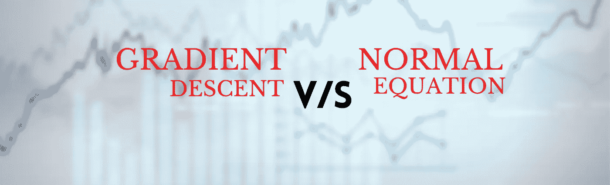
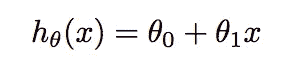
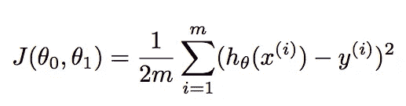
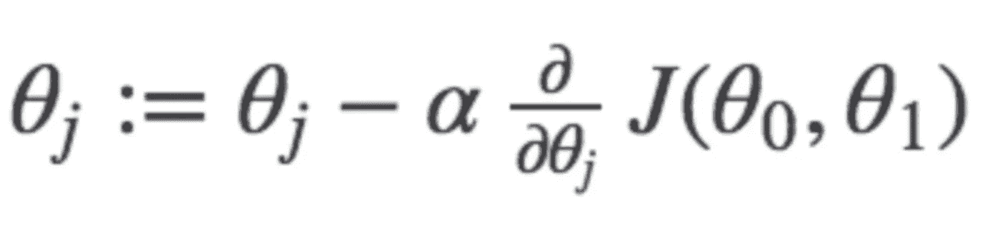
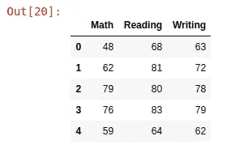
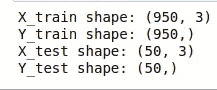
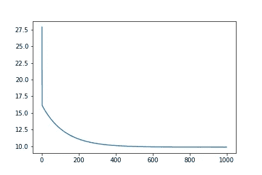
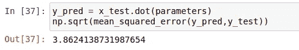
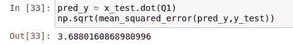

# 回归问题的梯度下降 v/s 正规方程

> 原文：<https://pub.towardsai.net/gradient-descent-v-s-normal-equation-for-regression-problems-e6c3cdd705f?source=collection_archive---------0----------------------->

## [机器学习](https://towardsai.net/p/category/machine-learning)

## 选择正确的算法以找到最小化成本函数的参数



梯度下降 v/s 正常方程

> 在本文中，我们将在实际方法中看到**梯度下降**和**法线方程**之间的实际差异。大多数新手机器学习爱好者在线性回归期间了解梯度下降，并进一步前进，甚至不知道最被低估的**正态方程**，它远没有那么复杂，并为**小**到**中等**大小的数据集提供非常好的结果。

如果你是机器学习的新手，或者不熟悉一个**法线**方程式**方程式**或**梯度** **下降**，不要担心我会尽力用 ***俗人的*** 术语解释这些。所以，我将从解释回归问题开始。

## 什么是线性回归？

就是入门级的 ***有监督的*** (特征和目标变量都给定)机器学习算法。假设，我们在空间中绘制所有这些变量，那么这里的主要任务是用这样一种方式将*拟合 ***最小化******代价函数*** 或*(不用担心我也会解释这一点)。有各种类型的线性回归，如简单(一个特征)、多元和逻辑(用于分类)。本文考虑了 ***多元线性回归*** 。实际的回归公式是:-**

****

**其中 **θ** ₀和 **θ** ₁是我们必须以最小化 ***损失*** 的方式找到的参数。在多元回归中，公式扩展得像**θ**₀+**θ**₁x₁+**θ**₂x₂.**成本函数**找出我们算法的 ***实际值*** 和 ***预测值*** 之间的误差。应该尽可能少。同样的公式是:-**

****

**其中 m =数据集中的示例数或行数，iᵗʰ示例的 xᶦ=feature 值，iᵗʰ示例的 yᶦ=actual 结果。**

## **梯度下降**

**它是一种 ***优化*** 技术，寻找 ***最小化******代价函数*** 的最佳参数组合。在这种情况下，我们从参数的随机值开始(在大多数情况下*)然后不断改变参数以减少 J( **θ** ₀， **θ** ₁)或成本函数，直到最后达到最小值。同样的公式是:-***

******

***其中 **j** 表示参数的编号， **α** 表示学习率。我就不深入讨论了。你可以在这里找到这些[的手写笔记](https://github.com/PushkaraSharma/medium_articles_code/tree/master/Gradientdescent_VS_NormalEquation)。***

## ***正态方程***

***这是一种不用梯度下降就能直接找到最佳参数值的方法。这是一个非常有效的算法，或者说公式(因为它只有一行😆)当您处理较小的数据集时。***

******

******法方程*** 的唯一问题是，在大型数据集中，寻找矩阵的 ***逆*** 的计算非常昂贵。***

**我知道这需要很多理论，但这是理解下面的代码片段所必需的。而我只触及了表面，所以请谷歌一下以上的主题，获取更深入的知识。**

# **先决条件:**

**我假设你熟悉 ***python*** 并且已经在你的系统中安装了 ***python 3*** 。这个教程我用了一个 ***jupyter 笔记本*** 。你可以使用你喜欢的 **IDE** 。所有需要的库都内置在 ***anaconda*** 套件中。**

# **让我们编码**

**我使用的数据集由 **3** 列组成，其中两列被认为是**特征**，另一列是**目标**变量。 [**GithHub**](https://github.com/PushkaraSharma/medium_articles_code/tree/master/Gradientdescent_VS_NormalEquation) 中可用的数据集。**

**首先，我们需要导入我们将在本研究中使用的库。这里，`numpy`用于创建 NumPy 数组，用于训练和测试数据。`pandas`用于制作数据集的数据框架，方便取值。`matplotlib.pyplot`绘制数据，如整体股票价格和预测价格。`mpl_toolkits`用于绘制 3d 数据，`sklearn`用于分割数据集和计算精度。我们还导入了`time`来计算每个算法花费的时间。**

```
****import** pandas as **pd**
**import** numpy as **np**
**from** mpl_toolkits **import** mplot3d
**import** matplotlib.**pyplot** as plt
**from** sklearn.metrics **import** mean_squared_error
**from** sklearn.model_selection **import** train_test_split
**import** time**
```

**我们已经将数据集加载到 ***pandas*** `dataframe`中，数据集的形状显示为 **(1000，3)** ，然后我们简单地打印带有`head()`的前 **5** 行。**

```
****df** = **pd**.read_csv('student.csv')
print(**df**.shape)
**df**.head()**
```

****

**所用数据集的预览**

**在这里， ***特性*** 值即 ***数学*** 和 ***读数*** 被保存在变量***【X1】***和***【X2】***中作为 NumPy 数组而 ***写作*** 列则被认为是 ***目标*** 变量然后我们绘制了这个 3D 数据。**

```
****X1** = **df**['Math'].values
**X2** = **df**['Reading'].values
**Y** = **df**['Writing'].valuesax = plt.axes(projection='3d')
ax.scatter(X1, X2, Y, c=Y, cmap='viridis', linewidth=0.5);**
```

****

**数据的三维可视化**

**现在， ***X₀*** 被初始化为一个 numpy 数组，该数组由与其他特征具有相同维数的元素组成(其作用类似于 bias)。之后，我们将所有的特性分组到一个变量中，并将它们转换成正确的格式。然后借助`train_test_split`和 ***将数据拆分为训练和测试，测试大小*** 为**±5%**即 ***50 行*** 进行测试。下面的截图给出了这些形状。**

```
****X0** = **np**.ones(len(**X1**))
**X** = **np**.array([**X0**,**X1**,**X2**]).T
**x_train**,**x_test**,**y_train**,**y_test** = train_test_split(**X**,**Y**,test_size=0.05)
print("X_train shape:",**x_train**.shape,"\nY_train shape:",**y_train**.shape)
print("X_test shape:",**x_test**.shape,"\nY_test shape:",**y_test**.shape)**
```

****

**训练、测试集的形状**

**这里， ***Q*** 表示参数列表，在我们的例子中是 3 个(X₀，X₁，X₂)，它们被初始化为(0，0，0)。 ***n*** 只是一个值等于训练样本数的整数。然后我们定义了我们的**成本函数**，它将在 ***梯度下降*** 函数中使用，以计算每个参数组合的*成本*。**

```
****Q** = **np**.zeros(3)
**n** = len(**X1**)
def cost_function(**X**,**Y**,**Q**):
    return **np**.sum(((**X**.dot(**Q**)-**Y**)**2)/(2***n**))**
```

**这是 ***梯度下降*** 函数，以**特征**、**目标**变量、**参数**、**历元**(迭代次数)、以及 **alpha** (学习速率)为自变量。在该函数中，`cost_history`被初始化以追加每个参数组合的成本。之后，我们开始一个循环，重复寻找参数的过程。然后，我们计算 ***损失*** 和梯度项，并更新参数集。在这里，你看不到*偏导数*项，因为这里的公式是在计算偏导数后使用的(作为参考，见上述公式中的平方项被分母中的 2 抵消)。最后，我们调用成本函数来计算成本，并将其添加到`cost_history`中。**

```
**def **gradient_descent**(**X**,**Y**,**Q**,**epochs**,**alpha**):
    cost_history = **np**.zeros(epochs)
    for **i** in range(**epochs**):
        **pred** = X.dot(Q)
        **loss** = pred-Y
        **gradient** = X.T.dot(loss)/n
        **Q** = Q-gradient*alpha
        cost_history[i] = **cost_function**(X,Y,Q)
    return cost_history,Q**
```

**这里，在调用上述函数之前，我们已经启动了 ***定时器*** ，并设置 ***epochs =1000*** 和 ***alpha =0.0001*** (应尽可能低)，定时器在函数执行后立即停止。所以我们的**梯度下降**大约需要 **82 毫秒**来执行(1000 个历元)。**

```
**start = time.time()
**cost_his**,**parameters** = **gradient_descent**(x_train,y_train.flatten(),Q,1000,0.0001)
end = time.time()
print(end - start)**
```

**在这里，我们绘制了`cost_history`的图表。正如我们可以看到的，图形在大约 400 个时期收敛，所以我运行梯度下降函数，时期=400，这一次花费了大约 25.3 毫秒**。这个你可以用我的[***GitHub***](https://github.com/PushkaraSharma/medium_articles_code/tree/master/Gradientdescent_VS_NormalEquation)的笔记本自己测试。****

```
****x** = [i for i in range(1,1001)]
plt.plot(x,cost_his)**
```

****

**迭代 V/S 成本**

**考验的时候到了。`mean squared error`出来是在 **3.86** 左右，这是非常可以接受的。**

```
****y_pred** = **x_test**.dot(parameters)
**np**.sqrt(mean_squared_error(**y_pred**,**y_test**))**
```

****

**使用梯度下降的精度**

****法线方程****

*****正规方程*** 非常简单，你可以在代码本身中看到这一点(只有 ***单行*** 行)。如上所述，我们已经测量了公式计算参数所花费的时间。不要担心不可逆矩阵，NumPy 在这里涵盖了它们。大约需要 **3 毫秒**(平均)。是不是很棒！**

```
**start = time.time()
**Q1** = **np**.linalg.inv(**x_train**.T.dot(**x_train**)).dot(**x_train**.T).dot(**y_train**)
end = time.time()
print(end - start)**
```

**最后，我们计算了法方程的`mean squared error`，结果是 **3.68****

```
****pred_y** = **x_test**.dot(**Q1**)
**np**.sqrt(mean_squared_error(**pred_y**,**y_test**))**
```

****

**使用正规方程的精度**

****

**考虑梯度下降前的正常方程**

# **结论**

**事实证明， ***法方程*** 计算参数花费的时间更少，给出的结果在精度方面几乎相同，并且非常容易使用。在我看来，在数据集规模不太大 **(~2 万)的情况下， ***法方程*** 比 ***梯度下降*** 。**由于当今现代系统良好的计算能力，法线方程是回归情况下首先要考虑的算法。**

**源代码在 [**GitHub**](https://github.com/PushkaraSharma/medium_articles_code/tree/master/Gradientdescent_VS_NormalEquation) 上有。请随意改进。**

**谢谢你宝贵的时间。😊我希望你喜欢这个教程。**

**还有，查一下我的教程上的一个 [***简单文字总结器***](https://towardsdatascience.com/simple-text-summarizer-using-extractive-method-849b65c2dc5a) 。**

**[](https://towardsdatascience.com/simple-text-summarizer-using-extractive-method-849b65c2dc5a) [## 使用提取方法的简单文本摘要

### 自动对包含最重要句子的文章进行简短总结。

towardsdatascience.com](https://towardsdatascience.com/simple-text-summarizer-using-extractive-method-849b65c2dc5a) [](https://medium.com/towards-artificial-intelligence/predict-the-stock-trend-using-deep-learning-5a4b7df1d152) [## 使用深度学习预测股票趋势

### 使用深度学习模型(递归神经网络)预测股票的未来趋势

medium.com](https://medium.com/towards-artificial-intelligence/predict-the-stock-trend-using-deep-learning-5a4b7df1d152)**