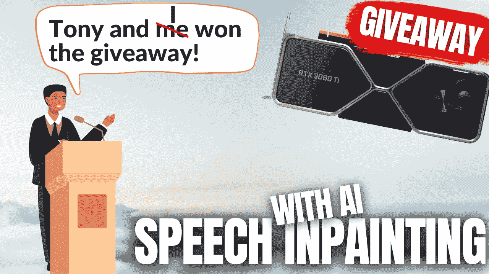
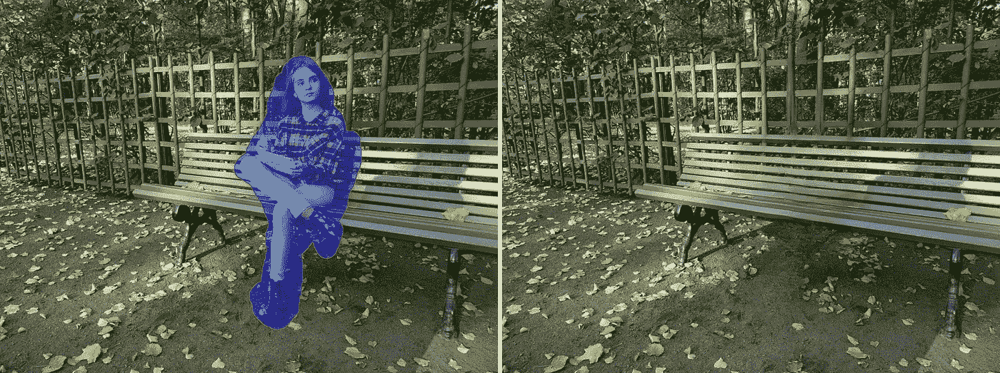
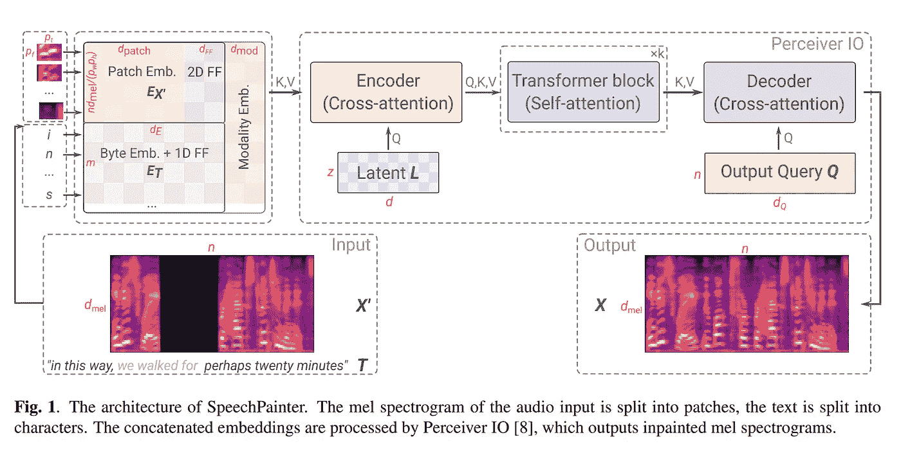

# 用人工智能纠正语法、发音和背景噪音！

> 原文：<https://pub.towardsai.net/grammar-pronunciation-background-noise-correction-with-ai-7a088e121e29?source=collection_archive---------1----------------------->

## [人工智能](https://towardsai.net/p/category/artificial-intelligence)

## 用人工智能进行语音修复！

> 原载于 [louisbouchard.ai](https://www.louisbouchard.ai/speech-inpainting-with-ai/) ，前两天在[我的博客](https://www.louisbouchard.ai/speech-inpainting-with-ai/)上看到的！

## 观看视频(并听到结果！)

我们已经看到了[图像修复](https://www.youtube.com/watch?v=Ia79AvGzveQ&t=27s)，它旨在从图片中移除不需要的对象。基于机器学习的技术不仅仅是移除物体，它们还理解图片，并用背景应该看起来的样子来填充图像的缺失部分。

来自 [LaMa](https://www.youtube.com/watch?v=Ia79AvGzveQ&t=27s) 的图像修复示例。

正如我们所见，最近的进步令人难以置信，就像结果一样，这种修复任务对许多应用程序非常有用，如广告或改善你未来的 Instagram 帖子。我们还讨论了一个更具挑战性的任务:[视频修复](https://www.youtube.com/watch?v=MAxMYGoN5U0&t=15s)，将相同的过程应用于视频以移除物体或人物。

来自 [STTN](https://www.youtube.com/watch?v=MAxMYGoN5U0&t=15s) 的图像修复示例。

视频的挑战在于保持帧与帧之间的一致性，没有任何瑕疵。但是现在，如果我们正确地从电影中删除一个人，而声音仍然在那里，没有变化，会发生什么？嗯，我们可能会听到鬼的声音，毁了我们所有的工作。

这就是我从未在我的频道上报道过的一项任务的由来:**语音修复**。你没听错，谷歌的研究人员刚刚发表了一篇旨在修复语音的论文，正如我们将看到的，结果令人印象深刻。好吧，我们可能更愿意听到而不是看到结果，但你明白了。它可以纠正你的语法，发音，甚至消除背景噪音。所有我肯定需要继续努力的事情，或者…简单地使用他们的新模型…听听我的视频或项目网站中的例子！

*p.s .最后还有一个大惊喜* [*视频*](https://www.youtube.com/watch?v=zIIc4bRf5Hg) *那个缩略图和标题可能已经剧透了，你肯定想看看！*

让我们进入这篇文章最激动人心的部分:这三位来自谷歌的研究人员如何创建 SpeechPainter，他们的语音修复模型。为了理解他们的方法，我们必须首先定义语音修复的目标。

基于感知者 IO 的画师模型。图片来自[论文](https://arxiv.org/pdf/2202.07273.pdf)。

在这里，我们想要获取一个音频剪辑及其副本，并绘制音频剪辑的一小部分。您在左下方看到的文本是音频轨道的抄本，浅灰色部分从音频剪辑中移除，并由网络进行修复。

该模型不仅执行语音修复，而且在保持说话者身份和跟随文本行的记录环境的同时也执行语音修复。多酷啊。！*还是那句话，花一秒钟听听视频里的例子或者上* [*作者的项目网站*](https://google-research.github.io/seanet/speechpainter/examples/) *！*

现在我们知道了模型能做什么，它是如何实现的呢？正如你所怀疑的，这非常类似于图像修复，我们替换图像中丢失的像素。相反，我们在一个特定的抄本后面替换音轨中丢失的数据。因此，该模型知道要说什么，其目标是填补音频轨道中的空白，跟随文本并模仿人的声音和轨道的整体氛围，以感受真实。

基于感知者 IO 的画师模型。图片来自[论文](https://arxiv.org/pdf/2202.07273.pdf)。

由于图像和语音修复是相似的任务，它们将使用相似的体系结构。他们使用了一个名为“感知者 IO”的模型，如上图所示。它将做与图像相同的事情，您将对您的图像进行编码，提取最有用的信息并执行修改，然后对其进行解码，以重建您想要实现的另一个图像。在修补的例子中，新的图像只是相同的，但是一些像素发生了变化。

在这种情况下，感知者 IO 架构可以处理几乎任何类型的数据，而不是来自图像的像素，包括 mel 光谱图，这基本上是我们使用频率表示音轨的声纹。然后，这个声谱图和文本抄本被编码、编辑和解码，以用应该出现的内容替换声谱图中的间隙。正如你在上面看到的，这就像生成一幅图像，我们使用与图像修复相同的过程，但输出和输入数据是光谱图，或者基本上是原声的图像。

如果你有兴趣了解更多关于感知者 IO 架构的知识，我强烈推荐你观看 Yannic Kilcher 的视频。

他们在语音数据集上训练他们的模型，在音轨中创建随机间隙，并试图填充这些间隙。然后，他们使用 GAN 方法进行训练，以进一步提高结果的真实性。

发电机和鉴别器解释清楚。图片来自[Packt；甘斯](https://subscription.packtpub.com/book/big-data-and-business-intelligence/9781788629416/4/ch04lvl1sec24/principles-of-gans)原理。

很快，有了 GANs，就有了我们看到的模型，叫做生成器，还有另一个模型叫做鉴别器。生成器将被训练生成新数据，在我们的例子中，是修复的音轨。同时，鉴别器将被馈送来自训练数据集和生成的样本的样本，并且将试图猜测该样本是从训练集中生成的、被称为假的还是真实的。理想情况下，我们希望我们的鉴别器有一半时间是正确的，这样它基本上是随机选择的，这意味着我们生成的样本听起来就像真的一样。然后，鉴别器将惩罚发电机模型，以使其听起来更真实。

瞧！你最终会得到一个模型，它可以根据语音及其转录来纠正你的语法或发音，甚至可以根据你的声音和音轨的氛围来填补空白。这太酷了。

所以你只需要在一个通用数据集上训练这个模型一次，然后用你自己的音轨来使用它，因为它应该，理想地，能够很好地概括和工作！当然，也有一些失败的案例，但结果是相当令人印象深刻的，你可以在下面链接的他们的项目页面上听到更多的例子。

感谢您的阅读，观看[视频](https://www.youtube.com/watch?v=zIIc4bRf5Hg)以了解示例！

免费注册 GTC22(别忘了留下评论并订阅以获得赠品，视频[中的步骤](https://www.youtube.com/watch?v=zIIc4bRf5Hg)！):[https://nvda.ws/3upUQkF](https://nvda.ws/3upUQkF)

如果你喜欢我的工作，并想与人工智能保持同步，你绝对应该关注我的其他社交媒体账户( [LinkedIn](https://www.linkedin.com/in/whats-ai/) 、 [Twitter](https://twitter.com/Whats_AI) )并订阅我的每周人工智能[简讯](http://eepurl.com/huGLT5) ！

## 支持我:

*   跟我来这里上 [**中**](https://whats-ai.medium.com/) **。**
*   想进入 AI 或者提升技能，[看这个](https://www.louisbouchard.ai/learnai/)！

## 参考

*   z .博尔索斯、m .沙里菲和 m .塔利亚萨基，2022 年。语音修复:文本条件下的语音修复。[https://arxiv.org/pdf/2202.07273.pdf](https://arxiv.org/pdf/2202.07273.pdf)
*   听听所有的例子:[https://Google-research . github . io/seanet/speech painter/examples/](https://google-research.github.io/seanet/speechpainter/examples/)