# 用于密码交易欺诈检测的图形神经网络

> 原文：<https://pub.towardsai.net/graph-neural-networks-for-fraud-detection-in-crypto-transactions-6b252325633f?source=collection_archive---------1----------------------->

在本教程中，我们将应用图卷积网络(GCN)和图注意力网络(GAT)来检测欺诈性比特币交易。还有，我们会比较他们的表现。


照片由 [DeepMind](https://unsplash.com/@deepmind?utm_source=medium&utm_medium=referral) 在 [Unsplash](https://unsplash.com?utm_source=medium&utm_medium=referral) 上拍摄

## 目录

*   介绍
*   基于频谱的卷积 GNN
*   基于注意力的空间卷积 GNN
*   资料组
*   使用 PyTorch 几何(PyG)的 GCN/GAT 节点分类
*   参考

## 介绍

尽管在诸如计算机视觉、自然语言/音频处理、时间序列预测等深度学习领域取得了重大进展。大多数问题与非欧几里德几何数据一起工作，并且作为这种数据的一个例子，社交网络连接、物联网传感器拓扑、分子、基因表达数据等等。数据的非欧几里得性质意味着欧几里得向量空间 **R^n** 的所有性质不能应用于这样的数据样本；例如，对于卷积神经网络(CNN)来说，平移不变性是一个重要的属性，但它并没有拯救她。在[1]中，作者解释了如何使用图结构的谱卷积表示将卷积运算转化到非欧几里德域。目前，图形神经网络(GNN)已经在许多领域得到了应用:

*   物理学(粒子系统模拟、机器人学、物体轨迹预测)
*   化学和生物学(药物和蛋白质相互作用、蛋白质界面预测、癌症亚型检测、分子指纹、化学反应预测)
*   组合优化(用于解决 [NP 难问题](https://en.wikipedia.org/wiki/NP-hardness)，如[旅行商问题](https://en.wikipedia.org/wiki/Travelling_salesman_problem#:~:text=The%20travelling%20salesman%20problem%20(also,an%20NP%2Dhard%20problem%20in)、[最小生成树](https://en.wikipedia.org/wiki/Minimum_spanning_tree#:~:text=A%20minimum%20spanning%20tree%20(MST,minimum%20possible%20total%20edge%20weight.)
*   交通网络(交通预测、出租车需求问题)
*   推荐系统(用户和内容项目之间的链接预测，社交网络推荐)
*   计算机视觉(场景图形生成、点云分类、动作识别、语义分割、少镜头图像分类、视觉推理)
*   自然语言处理(文本分类、序列标记、神经机器翻译、关系提取、问题回答)

在最新的 gnn 类别中，我们可以将它们区分为递归 gnn、卷积 gnn、图形自动编码器、生成 gnn 和时空 gnn。

在本教程中，我们将考虑使用图卷积网络和图注意网络的半监督节点分类问题，并在包含加密交易数据的椭圆数据集上比较它们的性能。此外，我们将强调他们的积木概念，这来自基于频谱和基于空间的卷积表示。

## 基于频谱的卷积 GNN

基于频谱的模型的数学基础来自图形信号处理领域；已知的模型有切布内、GCN、AGCN 和 DGCN。为了理解这类模型的原理，让我们考虑谱卷积的概念[2，3]。

假设我们有一个来自 **R^n 的图信号 **x** ，**它是一个图的所有节点的特征向量，x_i 是第 I 个节点**的值。**通过应用傅立叶变换进行卷积运算，该图形信号首先被变换到频谱域。卷积后，使用逆图傅立叶变换将结果信号转换回来。这些变换定义为:

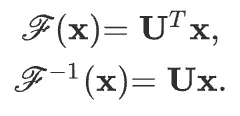

这里 **U** 是归一化图拉普拉斯的特征向量矩阵

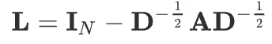

其中 **D** 为度矩阵， **A** 为图的邻接矩阵， **I_ *N*** 为单位矩阵。归一化图拉普拉斯算子可以分解为

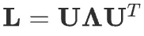

基于卷积定理，滤波器 **g** 的卷积运算可定义为:

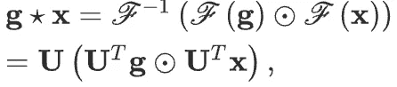

如果我们将滤波器表示为 **g** 作为 **U^T** * **g** 的可学习对角矩阵，那么我们得到

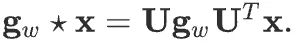

我们可以把 **g_w** 理解为 **L** 的特征值的函数。与特征向量矩阵 **U** 相乘的评估需要 O(N)时间复杂度；为了克服这个问题，在契布内和 GCN 的论文中，使用了切比雪夫多项式。对于 ChebNet，谱卷积运算表示如下。

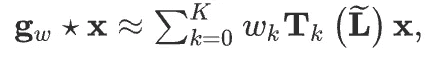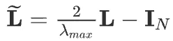

为了避免过拟合的问题，在 **GCN** 中，使用了 K=1 和λ_ max = 2 的切比雪夫近似。卷积运算符将变成如下形式。


假设，w = w_0 = -w_1，我们得到

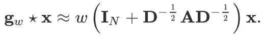

GCN 进一步引入了一个归一化技巧来解决爆炸/消失梯度问题

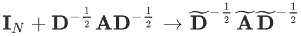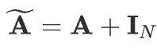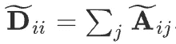

最后，GCN 的紧凑形式被定义为

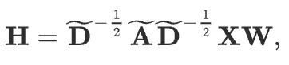

这里 **X** 是输入特征矩阵，dim( **X** ) = N x F^0，n 是节点数，每个节点输入特征的 F^0 数；

**A** 是邻接矩阵，dim(**A**)= N×N；

**W** 为权重矩阵，dim(**W**)= F×F’，F 为输入特征数，F’为输出特征数；

**H** 代表图神经网络的一个隐层，dim(**H**)= N x F’。

在每个第 I 层 **H_i** 处，使用传播规则 f(例如 sigmoid/relu)聚合特征以形成下一层的特征，因此特征在每个连续层处变得越来越抽象，这提醒了 CNN 的原理。

## 基于注意力的空间卷积 GNN

在基于空间的卷积 GNN 模型中，以下模型广为人知:GraphSage、GAT、MoNet、GAAN、DiffPool 等。工作原理类似于 CNN 卷积运算符应用于图像数据，除了空间方法将卷积应用于图形的不同大小的节点邻居。

由于在 NLP 任务中使用的模型，注意机制获得了广泛的流行(例如，注意的 LSTM，变形金刚)。在 GNN 具有注意机制的情况下，相邻节点对所考虑节点的贡献既不相同也不预先定义，例如在 GraphSage 或 GCN 模型中。

我们来看看 GAT 的注意机制[4]；该模型的标准化关注系数可通过以下公式计算:

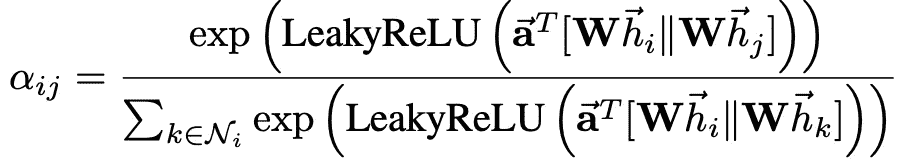

这里， *T* 表示换位，||是串联运算；

**h** 是一组节点特征(N 是节点数，F 是每个节点中的特征数)

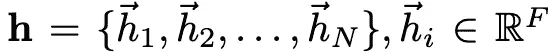

**W** 是权重矩阵(线性变换为 a 特征)，dim(**W**)= F’x F

向量 **a** 是单层前馈神经网络的权重向量

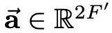

softmax 函数确保关注权重总计为第 I 个节点的一个整体邻居。

最后，使用这些标准化的关注系数来计算与其对应的特征的线性组合，以作为每个节点的最终输出特征。

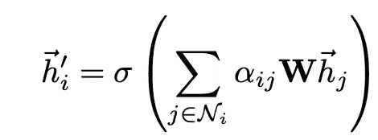

使用单个自我注意会导致不稳定性，在这种情况下，使用具有 K 个独立注意机制的多头注意

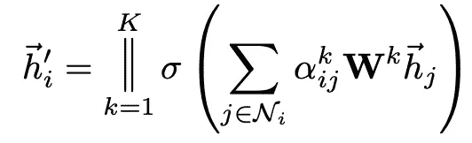

## 资料组

这里，对于节点分类任务，我们将使用[椭圆数据集](https://www.kaggle.com/datasets/ellipticco/elliptic-data-set)。数据集由 203 769 个节点和 234 355 条边组成。有三类节点:“合法”、“非法”或“未知”。如果相应的交易是由属于合法的实体(交易所、钱包提供商、矿工、金融服务提供商等)创建的，则节点被视为“合法”/“非法”。)或非法(骗局、恶意软件、恐怖组织、勒索软件、庞氏骗局等。)类别。该数据集的详细描述可在下面的文章中获得，“椭圆数据集:在区块链上开启机器学习”。

## 使用 PyTorch 几何(PyG)的 GCN/GAT 节点分类

这里我们将考虑使用 PyG 库的半监督节点分类问题，其中节点将是事务，边将是事务流。

您可以简单地使用下面的说明从 PyG 预安装的数据集中导入椭圆比特币数据集，但为了清楚起见，让我们自己构建 PyG 数据集对象。原始数据可以通过[这个链接](https://www.kaggle.com/datasets/ellipticco/elliptic-data-set)下载。

```
from torch_geometric.datasets import EllipticBitcoinDatasetdataset = EllipticBitcoinDataset(root=’./data/elliptic-bitcoin-dataset’)
```

**数据加载/准备**

为了数据准备，我用了这个 [Kaggle 笔记本](https://www.kaggle.com/code/divyareddyyeruva/elliptic-gcn-pyg)作为基础。

```
# here column 0 stands for node_id, column 1 is the time axis
df_features.head()
```

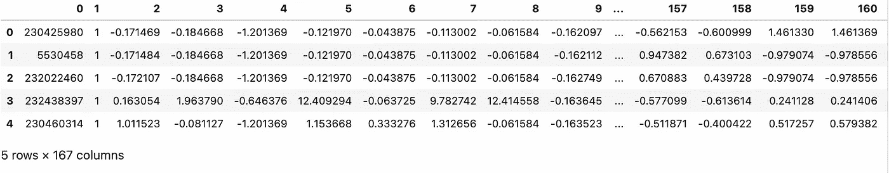

```
df_edges.head()
```

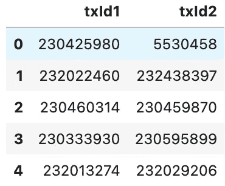

```
df_classes.head()
```

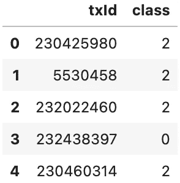

0 —合法
1 —欺诈
2 —未知类别

```
df_classes['class'].value_counts()
```

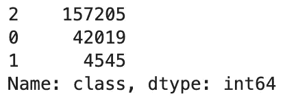

**准备边缘**

```
Total amount of edges in DAG: torch.Size([2, 234355])
```

**准备节点**

让我们忽略时间轴，考虑欺诈检测的静态情况。

**PyG 数据集**

```
Number of nodes: 203769
Number of node features: 165
Number of edges: 234355
Number of edge features: 165
Average node degree: 1.15
Number of classes: 2
Has isolated nodes: False
Has self loops: False
Is directed: True
```

```
Train dataset size: 39579
Validation dataset size: 6985
Test dataset size: 157205
```

**型号**

**培训/测试助手**

**火车 GCN**

```
Epoch   0 | Train Loss: 0.759 | Train Acc:  62.16% | Val Loss: 0.73 | Val Acc: 64.07%
Saving model for best loss
Epoch  10 | Train Loss: 0.307 | Train Acc:  86.43% | Val Loss: 0.30 | Val Acc: 87.16%
Saving model for best loss
Epoch  20 | Train Loss: 0.258 | Train Acc:  89.52% | Val Loss: 0.25 | Val Acc: 89.61%
Saving model for best loss
Epoch  30 | Train Loss: 0.244 | Train Acc:  90.49% | Val Loss: 0.24 | Val Acc: 90.32%
Saving model for best loss
Epoch  40 | Train Loss: 0.230 | Train Acc:  91.32% | Val Loss: 0.22 | Val Acc: 91.40%
Saving model for best loss
Epoch  50 | Train Loss: 0.219 | Train Acc:  91.85% | Val Loss: 0.22 | Val Acc: 91.77%
Saving model for best loss
Epoch  60 | Train Loss: 0.214 | Train Acc:  92.35% | Val Loss: 0.21 | Val Acc: 92.61%
Saving model for best loss
Epoch  70 | Train Loss: 0.210 | Train Acc:  92.60% | Val Loss: 0.21 | Val Acc: 92.80%
Saving model for best loss
Epoch  80 | Train Loss: 0.201 | Train Acc:  92.86% | Val Loss: 0.20 | Val Acc: 92.81%
Saving model for best loss
Epoch  90 | Train Loss: 0.195 | Train Acc:  93.15% | Val Loss: 0.20 | Val Acc: 92.81%
Saving model for best loss
Epoch 100 | Train Loss: 0.194 | Train Acc:  93.25% | Val Loss: 0.19 | Val Acc: 93.53%
Saving model for best loss
```

**测试 GCN**

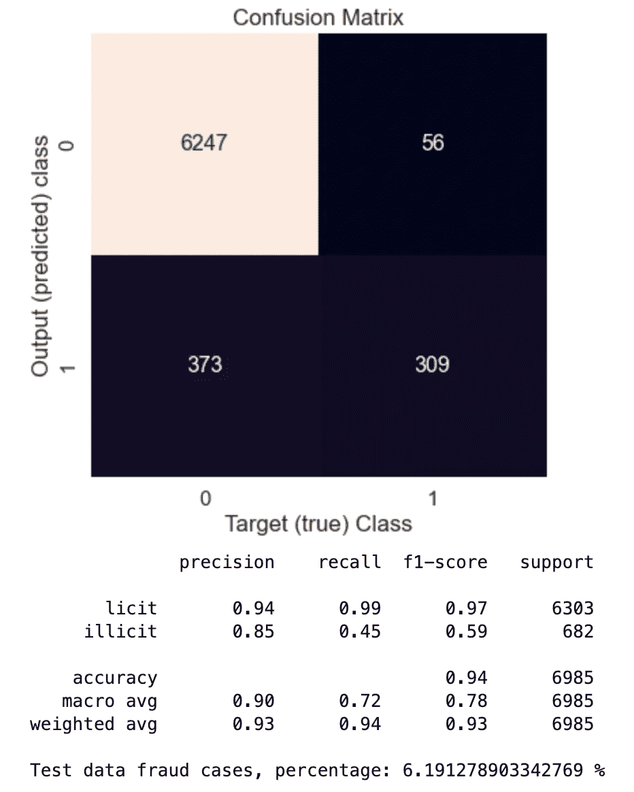

**火车 GAT**

```
Epoch   0 | Train Loss: 1.176 | Train Acc:  68.34% | Val Loss: 1.01 | Val Acc: 68.33%
Saving model for best loss
Epoch  10 | Train Loss: 0.509 | Train Acc:  88.63% | Val Loss: 0.48 | Val Acc: 88.70%
Saving model for best loss
Epoch  20 | Train Loss: 0.489 | Train Acc:  90.09% | Val Loss: 0.49 | Val Acc: 89.94%
Epoch  30 | Train Loss: 0.465 | Train Acc:  89.87% | Val Loss: 0.48 | Val Acc: 89.76%
Saving model for best loss
Epoch  40 | Train Loss: 0.448 | Train Acc:  89.81% | Val Loss: 0.44 | Val Acc: 90.15%
Saving model for best loss
Epoch  50 | Train Loss: 0.445 | Train Acc:  90.04% | Val Loss: 0.44 | Val Acc: 89.89%
Epoch  60 | Train Loss: 0.443 | Train Acc:  90.22% | Val Loss: 0.44 | Val Acc: 90.45%
Epoch  70 | Train Loss: 0.439 | Train Acc:  90.38% | Val Loss: 0.43 | Val Acc: 90.16%
Saving model for best loss
Epoch  80 | Train Loss: 0.426 | Train Acc:  90.57% | Val Loss: 0.43 | Val Acc: 90.41%
Saving model for best loss
Epoch  90 | Train Loss: 0.423 | Train Acc:  90.72% | Val Loss: 0.42 | Val Acc: 90.38%
Saving model for best loss
Epoch 100 | Train Loss: 0.418 | Train Acc:  90.72% | Val Loss: 0.42 | Val Acc: 90.74%
Saving model for best loss
```

**测试门**

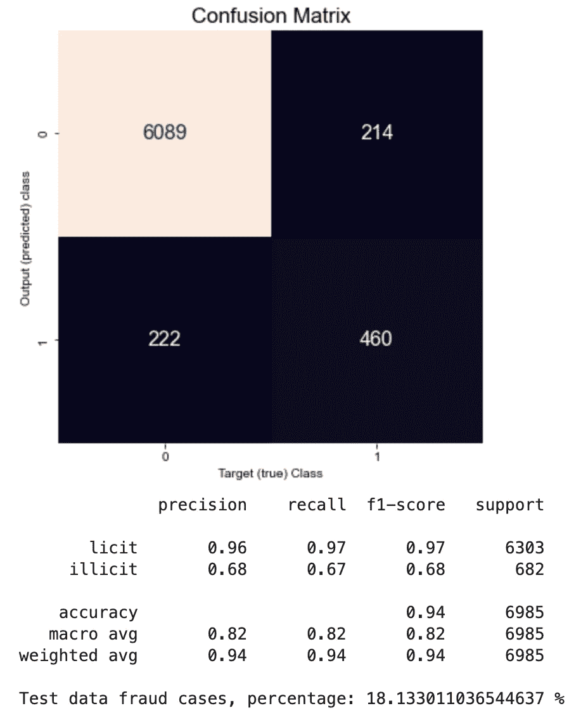

👉🏻完整的代码也可以通过我的 GitHub 获得。

**结论**

从计算结果可以看出，GAT 模型与 GCN 相比收敛较慢，训练/验证精度略低于 GCN。然而，从验证数据(标记数据)构建的混淆矩阵显示，召回度量从 0.45 (GCN)提高到 0.67 (GAT)。因此，GAT 模型比 GCN 模型更清楚地识别欺诈者，但对合法案件也更严格。对包含 157205 个样本的未标记数据的测试表明，在 GCN 的情况下，只有 6 %的欺诈案件，而在 GAT 的情况下，这一数量约为 18 %。

## **参考文献**

1.  布朗斯坦 m .等人，几何深度学习:超越欧几里德数据(2017)，IEEE SIG PROC MAG，【https://arxiv.org/pdf/1611.08097.pdf 
2.  Kipf T. N .，Welling M .利用图卷积网络的半监督分类(2017)，https://arxiv.org/pdf/1609.02907.pdf[ICLR](https://arxiv.org/pdf/1609.02907.pdf)
3.  周军等，图形神经网络:方法与应用综述(2020)，人工智能开放，第 1 卷，[https://doi.org/10.1016/j.aiopen.2021.01.001](https://doi.org/10.1016/j.aiopen.2021.01.001)
4.  Velickovic P .等人，图形注意力网络(2018)，https://arxiv.org/pdf/1710.10903.pdf ICLR