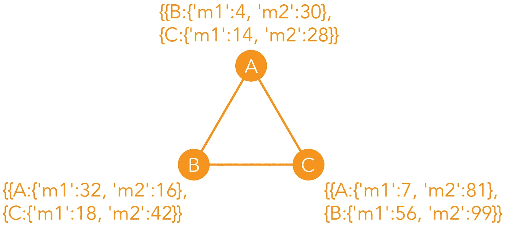
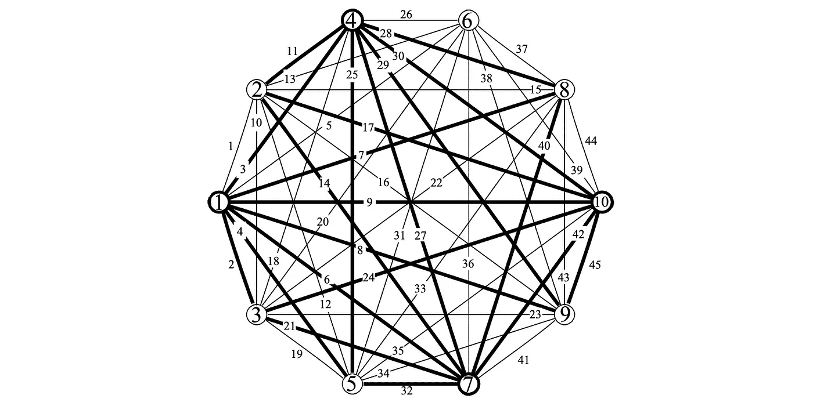
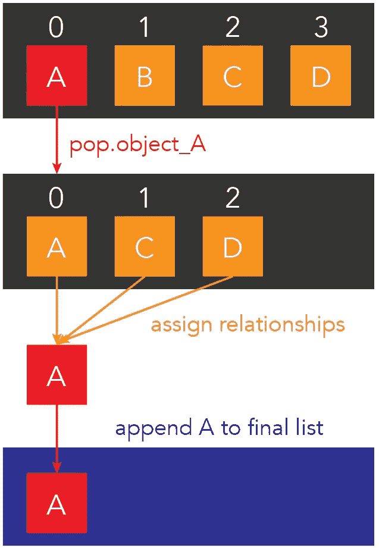

# 图论:用 Python 创建关系网络

> 原文：<https://pub.towardsai.net/graph-theory-creating-a-relationship-network-in-python-f7b6ecf7f50?source=collection_archive---------0----------------------->

## [编程](https://towardsai.net/p/category/programming)

## 使用代码模拟具有多个指标的完整图形。完整的代码可在我的回购[。](https://github.com/arditoibryan/Projects/tree/master/20210414_Relationship_Network)

[**点击这里了解我，我的项目，我的最新文章。**](http://www.michelangiolo.best/)

我想用 python 模拟的一个有趣的实验是这样的:我有一个包含 n 个对象(人)的系统，我想量化所有这些包含多个值的对象之间的关系。比如系统中有三个人:A，B，C，A 和 B 的关系可以用一个值来表示:5，A 和 C，B 和 C 也可以这样做，基本上我把所有的对象都连接起来了，但是我也给每一个单个的关系赋了一个**单值**。



具有 3 个对象和 2 个值的关系网络示例

我想创建一个算法，给定系统中的人数和每个关系的值的数量，它将随机生成值，并将它们分配给这些对象之间的每个现有关系。

## 图论

我的实验非常接近图论，这是一门研究图形(概述元素之间关系的数学结构)的学科。本质上，它通过使用两个元素简化了图的定义:

*   节点(下面十边形边缘的编号点)
*   边(连接节点的线:它们的关系)



我想用 python 复制的图形表示，只是每条边有多个度量。检索自:[https://www . researchgate . net/figure/A-complete-graph-with-10-nodes-and-45-edges _ fig 3 _ 279242256](https://www.researchgate.net/figure/A-complete-graph-with-10-nodes-and-45-edges_fig3_279242256)

我的目标是复制所谓的完美图:一个所有节点都相连的图。唯一的区别是，我将为每个现有的关系分配多个值。这不是普通图论算法的一部分，这就是为什么我想自己创建一个。

# 算法

## 简化示例

在试图对整个事情进行编码之前，我想模拟一个更简单的例子。创建一个人和两个对象，然后使用两个指标设置它们之间的关系。

```
class person():
  def __init__(self):
    self.value_map = dict() def set_relationship(self, obj1, value):
    self.value_map[obj1] = valueclass object():
  def __init__(self):
    passp1 = person()
obj1 = object()
obj2 = object()p1.set_relationship(obj1, {'metric1':4, 'metric2':30})
p1.set_relationship(obj2, {'metric1':12, 'metric2':100})
p1.value_mapOutput:
{<__main__.object at 0x7f20e879d890>: {'metric1': 12, 'metric2': 100},
 <__main__.object at 0x7f20e87c65d0>: {'metric1': 4, 'metric2': 30}}
```

我认为代码很简单，因为 p1 是人，我可以给它分配一个以 object 作为键的字典，和另一个以值(metric1 和 metric2)包含关系的字典。

## 完全码

我心目中的算法的最终代码如下。我创建了一个对象列表，然后迭代地从中取出一个对象，并再次迭代列表中的其余元素。在这一点上，我重置了列表，这样我要移除的下一个元素将总是来自一个包含 10 个元素的列表(这样我就不需要改变元素的索引):这防止了索引的移动。当一个对象完成时(它有一个包含 9 个关系的字典)，我将把它附加到函数输出的最终列表中。



流程的图形表示

```
import randomdef relationship_network(n_people, n_values):
  class person():
    def __init__(self):
      self.value_map = dict() def set_relationship(self, obj1, value):
      self.value_map[obj1] = value#create a list of people
  person_list = [person() for x in range(n_people)]#create relationships between those people
  final_list = list()
  #iterate through the original list
  for person_index in range(len(person_list)):
    #make an exact copy, so we can extract a person every time and then reset it
    person_list_ = person_list.copy()
    popped = person_list_.pop(person_index)
    #after extracting a person, create relationship with all the others, and place it in a final list
    for remaining in person_list_:
      popped.set_relationship(remaining, {'metric_'+str(x+1):random.randint(0, 100) for x in range(n_values)}) #{'metric1': random.randint(0, 100), 'metric2': random.randint(0, 100)})
    final_list.append(popped)#contains the relationship between every element in the system
  return final_listrelationship_table = relationship_network(3, 3)
[print(x.value_map) for x in relationship_table]
None#check values of a single person
print('person_3')
relationship_table[2].value_mapOutput:
{<__main__.relationship_network.<locals>.person object at 0x7f1ce4449350>: {'metric_1': 11, 'metric_2': 71, 'metric_3': 22}, <__main__.relationship_network.<locals>.person object at 0x7f1ce44490d0>: {'metric_1': 52, 'metric_2': 69, 'metric_3': 54}}
{<__main__.relationship_network.<locals>.person object at 0x7f1ce43d3850>: {'metric_1': 38, 'metric_2': 97, 'metric_3': 36}, <__main__.relationship_network.<locals>.person object at 0x7f1ce44490d0>: {'metric_1': 38, 'metric_2': 15, 'metric_3': 46}}
{<__main__.relationship_network.<locals>.person object at 0x7f1ce43d3850>: {'metric_1': 53, 'metric_2': 99, 'metric_3': 2}, <__main__.relationship_network.<locals>.person object at 0x7f1ce4449350>: {'metric_1': 64, 'metric_2': 56, 'metric_3': 99}}
person_3
```

为了节省空间，我没有使用一个有 10 个节点的例子，而是使用一个有 3 个节点和 3 个值的例子。从函数的输出可以看出，这个字典有 3 个对象作为键，包含系统元素之间的所有关系。