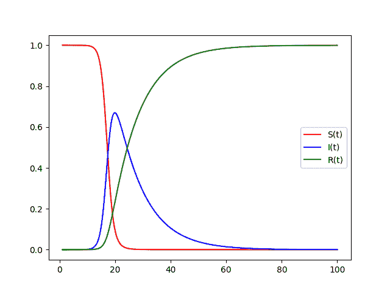

# 用 Python 绘制 SIR 模型

> 原文：<https://pub.towardsai.net/graphing-the-sir-model-with-python-e3cd6edb20de?source=collection_archive---------0----------------------->

## [数据可视化](https://towardsai.net/p/category/data-visualization)，[编程](https://towardsai.net/p/category/programming)

## 绘制和求解联立微分方程以模拟新冠肺炎扩展


如果说新冠肺炎疫情有什么好处的话，那就是我们获得了大量的数据。鉴于技术进步，我们可以获得更多的信息和计算能力，我们可以用这些来预测和遏制病毒的传播。最简单的方法之一是通过 SIR 模型。

SIR 是一个房室模型，它将一个*常数*的人群分为三组，即易感人群、感染人群和康复人群。这些都可以表示为以时间为自变量的函数。

S(t) —易患该疾病的人数

I(t) —感染该疾病的人数

R(t) —不能感染他人的人；要么是康复的，要么是患病的(因此该组的更好名称可能是“移除的”)

值得注意的是，在任一时刻 t，S(t) + I(t) + R(t) = N，其中 N 是总人口。

# 导入所需的 Python 库

```
from scipy.integrate import odeintimport numpy as npimport matplotlib.pyplot as plt
```

我们可以使用几个库来简化计算和绘图过程。SciPy 库包含“用户友好且高效”的计算方法我们将在这个程序中使用他们的数值积分函数。我们还将使用 Numpy 表示浮点步长值，使用 Matplotlib 表示图形。

# 找出每个函数的变化率

我们不能直接为每个函数找到一个方程。但是我们可以推导出每个函数在 t 时刻的变化率，换句话说，这是一个导数。易感人群的数量通常从接近总人口开始。随着易感人群被感染，这个数字会随着时间的推移而减少。新感染人数是易感者和感染者之间可能相互作用的百分比。我们可以把这个感染率称为‘a’，而可能的相互作用是 S(t)和 I(t)的乘积。因此，易感人群的变化

S'(t) = -a*S(t)*I(t)

易感人数的减少和感染人数的增加是一样的。要求出 I(t)的整导数，还必须考虑那些被感染后痊愈或死亡的人。这只是恢复率乘以当前感染人数。回收率为“b ”,则我们有

I'(t) = a*S(t)*I(t) — b*I(t)

计算 R(t)的导数很简单，因为它只是 I'(t)的第二项。在 SIR 模型中，恢复(或者更恰当地说是去除)只会随着时间的推移而增加。R(t)的增加是恢复率和感染人群的乘积:

R'(t) = b*I(t)

我们现在可以通过 SciPy 库使用这些导数来求解常微分方程组。

# 定义必要的常数

从上面的等式中，我们看到有两个常数需要定义:传输速率和恢复速率。现在，我们将传输速率设置为 100%，恢复速率设置为 10%。

```
a = 1 # infection rate
b = 0.1 # recovery rate
```

# 创建函数 f(y，t)来计算导数

```
# FUNCTION TO RETURN DERIVATIVES AT Tdef f(y,t):
    S, I, R = y     d0 = -a*S*I # derivative of S(t) d1 = a*S*I — b*I # derivative of I(t) d2 = b*I # derivative of R(t) return [d0, d1, d2]
```

接下来，我们必须定义一个函数来返回给定时间 t 的 S(t)、I(t)和 R(t)的导数，记住我们实际上已经求解过这些，只是将方程编码到一个函数中。在以下代码行中，d0、d1 和 d2 分别是 S、I 和 R 的导数。

```
d0 = -a*S*I # derivative of S(t)d1 = a*S*I — b*I # derivative of I(t)d2 = b*I # derivative of R(t)
```

注意，这里还没有定义 S、I 和 R 的值(尽管我们不需要 R(t)来求它的导数)。由于这些函数相互依赖，我们将首先获得 S(t)、I(t)和 R(t)的先前值，以计算它们的导数。

```
S, I, R = y# orS = y[0]
I = y[1]
R = y[2]
```

用下划线 _ 代替变量 R 也是可以接受的，但是最好是明确的和描述性的。

# 定义必要的初始值

在计算 t 时刻的函数值之前，我们必须先找到初始值。将菲律宾作为样本人群，2020 年 3 月 1 日 t=0。最初的易感人数是总人口，在 109581078 人左右。根据卫生部的新冠肺炎跟踪系统，2020 年 3 月 1 日的初始病例为 50 人。当然，我们可以将恢复的总次数设为 0。将值保持在 0 和 1 之间会使事情更清楚。这可以通过将所有值除以总体来实现。

```
S_0 = 1
I_0 = 50/109_581_078
R_0 = 0
```

将这些值存储在一个列表中会很有帮助，稍后我们会看到为什么这很重要。

```
y_0 = [S_0,I_0,R_0]
```

我们也不要忘记定义域或时间范围。我们将使用 Numpy 的 linspace 来实现这一点，以便在需要时合并十进制值。

```
t = np.linspace(start=1,stop=100,num=100)
```

# 用 ODEInt 解微分方程

既然我们已经定义了所有需要的变量、常数和函数，现在我们可以求解常微分方程组了。我们将按照时间范围中指定的 100 天的范围求解每个微分方程。通过设置所有参数，这样做实际上很简单；代码只有一行:

```
y = odeint(f,y_0,t)
```

f 是我们前面定义的函数 f(y，t)，y_0 是我们初始值的列表，t 是等距时间值的列表。

变量 y 实际上是一个 Numpy ndarray，或者 N 维数组。

```
>>> print(type(y))
<class ‘numpy.ndarray’>
```

在这种情况下，odeint()函数返回一个二维数组。行是给定时间 t 的值的列表，而列表示 S、I 或 R 的值。S(t)的值在第一列中，I(t)在第二列中，R(t)在第三列中。因此，我们可以按如下方式访问它们:

位于第 n 行第 m 列的这种数组的元素可以被索引为

```
element = y[n,m]
```

我们可以使用列表拼接来查看一列中的所有值。

```
S = y[:,0]
I = y[:,1]
R = y[:,2]
```

# 绘制每个函数的值

```
plt.plot(t,S,’r’,label='S(t)')plt.plot(t,I,’b’,label='I(t)')plt.plot(t,R,’g’,label='R(t)')plt.legend()plt.show()
```

plot()函数中的前两个参数表示 x 和 y 值。然后我们可以指定每一行的颜色和标签。legend()函数在图表上放置一个图例，引用每一行的“label”关键字参数。

最后，我们使用 show()函数来实际生成图形。


# 进一步探索

值得指出的是，我们可以通过减小指定的步长值来提高图形的精度。(在这种情况下，通过增加“num”关键字参数)。

```
t = np.linspace(start=1,stop=100,num=200)
```


```
t = np.linspace(start=1,stop=100,num=500)
```


```
t = np.linspace(start=1,stop=100,num=1000)
```



此外，使传输和恢复率等参数更接近实际数据会使模型更准确。

综上所述，SIR 模型展示了技术和数学在处理现实世界问题中的宝贵作用。

您可以在这里找到本文的代码:

[https://github . com/JoaquindeCastro/SIR-Model/blob/main/SIR-ODE-integrate . py](https://github.com/JoaquindeCastro/SIR-Model/blob/main/SIR-ODE-Integrate.py)

# 参考资料和资源

 [## 疾病传播的 SIR 模型——微分方程模型

### 作为建模过程的第一步，我们确定自变量和因变量。独立报…

www.maa.org](https://www.maa.org/press/periodicals/loci/joma/the-sir-model-for-spread-of-disease-the-differential-equation-model) [](https://matplotlib.org/tutorials/introductory/pyplot.html) [## Pyplot 教程- Matplotlib 3.3.2 文档

### pyplot 接口介绍。是使 matplotlib 像 MATLAB 一样工作的函数的集合。每个…

matplotlib.org](https://matplotlib.org/tutorials/introductory/pyplot.html) [](https://numpy.org/doc/stable/reference/arrays.ndarray.html#:~:text=An%20ndarray%20is%20a%20%28usually,the%20sizes%20of%20each%20dimension.) [## N 维数组(ndarray) - NumPy v1.19 手册

### 是包含相同类型和大小的项的多维容器(通常大小固定)。维度的数量…

numpy.org](https://numpy.org/doc/stable/reference/arrays.ndarray.html#:~:text=An%20ndarray%20is%20a%20%28usually,the%20sizes%20of%20each%20dimension.)  [## 新冠肺炎追踪|卫生署网站

### 编辑描述

www.doh.gov.ph](https://www.doh.gov.ph/covid19tracker) [](https://www.sciencedirect.com/science/article/pii/S0960077920304549) [## 新冠肺炎在不同社区传播的 SIR 模型假设

### 在这篇论文中，我们研究了由于小说《疫情》的传播而导致的建模方法的有效性

www.sciencedirect.com](https://www.sciencedirect.com/science/article/pii/S0960077920304549)