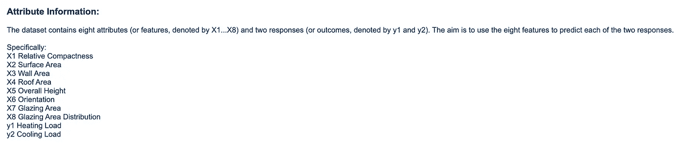
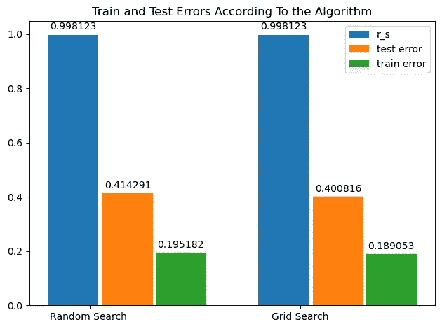

# Python A-Z 中的网格搜索:寻找完美

> 原文：<https://pub.towardsai.net/grid-search-in-python-a-z-searching-for-perfection-4a055fd2577d?source=collection_archive---------2----------------------->

## 如何在机器学习中找到完美的超参数？使用网格搜索和随机搜索，下面是例子，也是在 Python 的深度学习中


在 Canva 设计

# 介绍

由于机器学习中存在许多提高性能的技术，最近我打算向您解释其中的一种，即网格搜索&随机搜索。

这些技术用于寻找机器学习模型中的最佳参数。

## 什么是网格搜索？

网格搜索和随机搜索是超参数优化中常用的两种技术。

它是为机器学习模型选择最佳超参数集的过程。

在网格搜索中，该算法在预定义的超参数值网格上进行搜索。

它会尝试网格中每个值的组合，并评估每个组合的模型性能。

这可能是一个耗时的过程，尤其是对于具有许多超参数的复杂模型，但这是一种简单而可靠的优化超参数的方法。

## 什么是随机搜索？

相反，随机搜索包括从预定义的范围内选择超参数的随机组合，并评估每个组合的模型性能。这种方法可能比网格搜索更快，特别是如果您有许多超参数，但它不太彻底，可能无法找到超参数的最佳集合。

## 网格搜索和随机搜索有什么区别？

网格搜索和随机搜索的主要区别在于它们搜索可能的超参数值空间的方式。网格搜索使用预定义的值网格，而随机搜索从预定义的范围内生成值的随机组合。

[这里](https://medium.com/geekculture/decision-tree-in-energy-efficiency-analysis-9779322db2e8)，我已经给你解释过如何把机器学习模型应用到你的问题上。在那篇文章中，我向您解释了如何预测建筑、数据集和代码的热负荷。

现在，我将应用两种不同的技术来预测热负荷。

让我们从。

**内容表**

[**简介**](#0ef7)[**1 .导入库**](#e3e3)[**2。加载数据集**](#584f)[**3。选择目标值**](#a221)[**4。模型建筑**](#d29a)[**5。网格搜索**](#628d)[**6。网格搜索最佳参数**](#6be9)[**7。评估为网格搜索**](#de40)[**10。随机搜索**](#207c)[**11。最佳参数随机搜索**](#6b20)[**12。模型评价为随机搜索最佳参数**](#728f)[**13。最终评价**](#13bc)[**结论**](#4045)

# 1.导入库

现在，我们需要下面的库。

```
import pandas as pd
import numpy as np
import matplotlib.pyplot as plt
from sklearn.ensemble import RandomForestRegressor
from sklearn.model_selection import GridSearchCV, RandomizedSearchCV, train_test_split
from sklearn.metrics import mean_squared_error
from sklearn.metrics import r2_score2
```

# 2.加载数据集

让我们使用 pandas excel 库加载数据框。

我在这里下载库[。](https://archive.ics.uci.edu/ml/machine-learning-databases/00242/)

下载到你的库中后，定义你的路径。然后从 excel 中读取。

```
path = "/Users/randyasfandy/Downloads/Datasets/energydata.xlsx"
df = pd.read_excel(path) 
```

然后，我会重命名列名，这里也是用 UC Irvine [写的。](https://archive.ics.uci.edu/ml/datasets/Energy+efficiency)



[参考](https://archive.ics.uci.edu/ml/datasets/Energy+efficiency)

这是代码。

```
df = df.rename(columns={
"X1" : "Relative Compactness",
"X2" :"Surface Area",
"X3":  "Wall Area",
"X4" : "Roof Area",
"X5" :"Overall Height",
"X6" :"Orientation",
"X7" :"Glazing Area",
"X8" :"Glazing Area Distribution",
"Y1" :"Heating Load",
"Y2" :"Cooling Load"})
```

# 3.选择目标值

这里，我将预测热负荷，但我们有两种选择:热负荷和冷负荷。

让我们来定义它们。

```
y = df["Heating Load"]
x = df[["Relative Compactness","Surface Area","Wall Area" ,"Roof Area" ,"Overall Height","Orientation","Glazing Area","Glazing Area Distribution"]]
```

# 4.模型结构

现在，是时候建立我们的机器学习模型了。对于这个问题，我选择一个随机森林回归量。

你可以选择你喜欢的任何东西。

这是代码。

```
x_train, x_test, y_train, y_test = train_test_split(
 x, y, 
 test_size=0.2, random_state=44
)
forest_reg = RandomForestRegressor()
```

我们建立了自己的模型，现在是寻求完美的时候了。

# 5.网格搜索

在进行网格搜索之前，首先，您应该定义一个字典，其中包含您希望找到最佳版本的参数。

```
param_grid = [
 {‘n_estimators’ : [3,10,40], ‘max_features’: [2,4,6,8]},
 {‘bootstrap’ : [False], ‘n_estimators’ : [3,10], ‘max_features’: [2,3,4]},
]
```

现在，是时候应用网格搜索了。

```
grid_search = GridSearchCV(forest_reg, param_grid, cv = 5, 
 scoring = ‘neg_mean_squared_error’, return_train_score = True)
grid_search.fit(x_train, y_train)
```

# 6.网格搜索的最佳参数

如果你还有兴趣的话。请发送掌声，并跟我来这里。

好吧，我们继续。

下面是寻找最佳参数的代码。

```
grid_search.best_params_
```

# 7.网格搜索的评估

好吧，既然我们找到了最佳参数。让我们使用它们并评估我们的模型。首先，让我们定义列表和包含列表值的字典。因为我们会在本文最后比较网格搜索值和随机搜索。让我们来定义它们。

```
train_error_random_g = []
test_error_random_g = []
r_sq_g = []
```

```
gri_search = {
 ‘R_s ‘ : r_sq_g,
 ‘Train Error’ : train_error_random_g,
 ‘Test Error’ : test_error_random_g,
}
```

好，让我们定义一个自定义函数。这个自定义函数有不同的特性。

首先，它采用网格搜索找到的最佳参数。

第二，拟合回归模型。

第三，找到测试、训练错误和 R2。

最后，将它们添加到我们已经创建的列表中。

这是代码。

```
def evaluate_grid():
 m = grid_search.best_params_[‘max_features’] 
 n = grid_search.best_params_[‘n_estimators’]
 regressor = RandomForestRegressor(n_estimators = n, max_features = m) 
 regressor.fit(x_train, y_train)
 y_predict=regressor.predict(x_train)
 train_error = mean_squared_error(y_train, y_predict, squared=False)
 y_predict=regressor.predict(x_test)
 test_error = mean_squared_error(y_test, y_predict, squared=False)
 r2 = r2_score(y_test,y_predict)
 print(“Train error = “‘{}’.format(train_error))
 print(“Test error = “‘{}’.format(test_error))
 print(“R2 score is {}”.format(r2))
 train_error_random_g.append(train_error)
 test_error_random_g.append(test_error)
 r_sq_g.append(r2)
```

```
evaluate_grid()
```

好吧，创建一个数据框。

```
grid = pd.DataFrame(gri_search)
grid.index = ['Grid Search']
```

好了，是时候应用随机搜索了。

# 10.随机搜索

我们先定义随机搜索，拟合 x_train 和 y_train。

```
random_search = RandomizedSearchCV(forest_reg
 ,param_grid,cv=5, scoring=’neg_mean_squared_error’,return_train_score = True
 )
random_search.fit(x_train,y_train)
```

# 11.随机搜索的最佳参数

好了，现在是找到随机搜索的最佳参数的时候了。

```
random_search.best_params_
```

# 12.随机搜索最佳参数的模型评价

现在是时候重复我们首先为网格搜索所做的动作了。让我再给你解释一遍。为此，首先，创建一个空列表和一个字典来填充它们。

```
train_error_random = []
test_error_random = []
r_sq = []
```

```
Random_search = {
 ‘R_s ‘ : r_sq,
 ‘Train Error’ : train_error_random,
 ‘Test Error’ : test_error_random,
}
```

首先，它采用随机搜索找到的最佳参数。

第二，拟合回归模型。

第三，找到测试、训练错误和 R2。

最后，将它们添加到我们已经创建的列表中。

这是代码。

```
def evaluate_random():
 a = random_search.best_params_[‘max_features’] 
 b = random_search.best_params_[‘n_estimators’]
 regressor = RandomForestRegressor(n_estimators = b, max_features = a) 
 regressor.fit(x_train, y_train)
 y_predict=regressor.predict(x_train)
 train_error = mean_squared_error(y_train, y_predict, squared=False)
 y_predict=regressor.predict(x_test)
 test_error = mean_squared_error(y_test, y_predict, squared=False)
 r2 = r2_score(y_test,y_predict)
 print(“Train error = “‘{}’.format(train_error))
 print(“Test error = “‘{}’.format(test_error))
 print(“R2 score is {}”.format(r2))
 train_error_random.append(train_error)
 test_error_random.append(test_error)
 r_sq.append(r2)
```

```
evaluate_random()
```

顺便说一下，要填写这些列表，不要忘记运行这段代码。

让我们也创建一个数据框。

```
random = pd.DataFrame(Random_search)
random.index = [‘Random Search’]
```

# 13.最终评估

好了，现在让我们创建一个最终的数据框将它们附加在一起。

```
final_evaluation = random.append(grid)
```

好吧，为了更好地看到结果，让我们画一个图。

代码中已经有了解释。

```
labels = [‘Random Search ‘, ‘Grid Search’]
r_s = list(final_evaluation.iloc[:, 0])
test_error = list(final_evaluation[‘Test Error’])
train_error = list(final_evaluation[‘Train Error’])
x = np.arange(len(labels)) # the label locations
width = 0.24 # the width of the bars
fig, ax = plt.subplots()
rects1 = ax.bar(x - width/3, r2, width, label='r_s')
rects2 = ax.bar(x + 3*width/4, test_error, width, label='test error')
rects3 = ax.bar(x + width*1.8, train_error, width, label='train error')
# Add some text for labels, title and custom x-axis tick labels, etc.
ax.set_title('Train and Test Errors According To the Algorithm')
ax.set_xticks(x, labels)
ax.legend()
ax.bar_label(rects1, padding=3)
ax.bar_label(rects2, padding=3)
ax.bar_label(rects3, padding=3)
fig.tight_layout()
plt.show()
```

让我们看看结果。



作者图片

# 结论

在这里，我解释了 Python 中的随机搜索和网格搜索应用程序。以下是我们遵循的步骤；

*   分割成一个数据框。
*   应用机器学习模型。
*   找到网格搜索和随机搜索的最佳参数。
*   将它们应用到模型中。
*   将结果与图表进行比较。

感谢阅读我的文章。

***这里是我的*** [***Numpy 小抄***](https://gencay.ck.page/) ***。***

***下面是“*** [***如何成为亿万富翁***](https://gencay.ck.page/billionaire) ***”数据项目的源代码。***

***这里是使用 Python 的******[***分类任务 6 种不同算法的源代码数据项目。***](https://gencay.ck.page/bfd9d41fdc)***

***这里是能效分析******[***决策树数据项目的源代码。***](https://gencay.ck.page/2df5d07388)***

***如果你还不是 Medium 的一员，渴望通过阅读来学习，这里是我推荐的*** [***链接。*T50**](https://medium.com/@geencay/membership)

> “机器学习是人类需要做出的最后一项发明。”尼克·博斯特罗姆