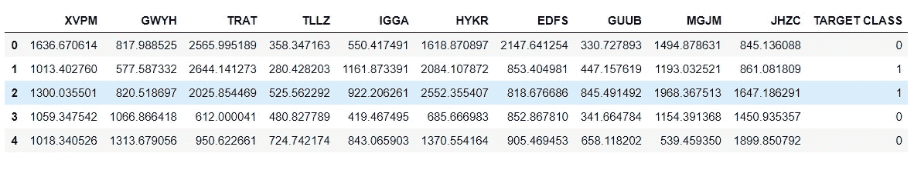
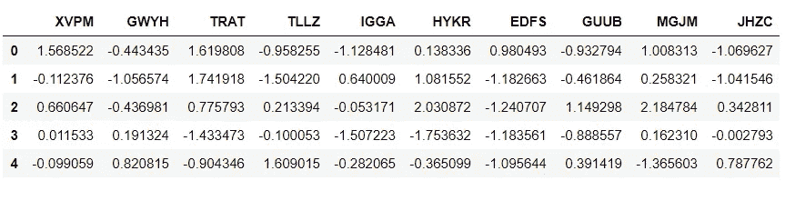
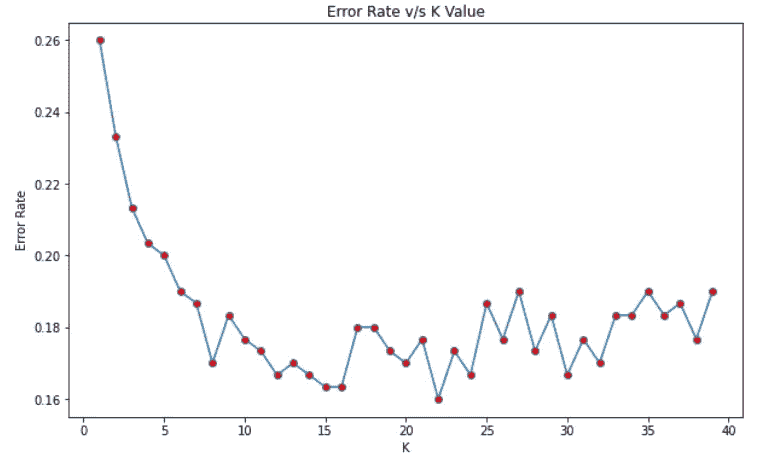

# 使用 K-最近邻算法对类进行分组 Python

> 原文：<https://pub.towardsai.net/grouping-classes-using-k-nearest-neighbors-algorithm-python-81f04f0a1fba?source=collection_archive---------2----------------------->

## [机器学习](https://towardsai.net/p/category/machine-learning)

## KNN 算法的理解和实现指南。


由[安妮·斯普拉特](https://unsplash.com/@anniespratt?utm_source=unsplash&utm_medium=referral&utm_content=creditCopyText)在 [Unsplash](/s/photos/groups?utm_source=unsplash&utm_medium=referral&utm_content=creditCopyText) 上拍摄

# 什么是 KNN 算法？

这是一种用于分类任务的算法，其工作原理非常简单。

# 它是如何工作的？

KNN 算法是非常基本的。训练算法存储所有数据。并且预测算法计算数据点到数据中所有点的距离，按照离数据点距离的递增顺序对点进行排序，然后预测“k”个最近点的多数标签。

# 这种算法的优点是什么？

1.  它非常简单，易于理解和实现。
2.  它只使用了两个参数:k 和距离度量。
3.  它可以对任意数量的类进行分类。
4.  训练步骤非常容易实现，并且可以在任何阶段添加更多数据。

# 这种算法的缺点是什么？

1.  它只适用于数字数据。对于分类数据，它可能表现不好。
2.  预测的成本非常高。
3.  它在处理高维数据时表现不佳。

# 如何用 Python 实现 KNN？

使用人工数据集来执行分类。有两个类 0 和 1。目标是将数据分为两个不同的类别。

**→导入包**

导入了帮助处理数据的库——pandas 和 numpy 以及数据可视化包——matplotlib 和 seaborn。

```
**>>> import** pandas **as** pd
**>>> import** numpy **as** np
**>>> import** matplotlib.pyplot **as** plt
**>>> import** seaborn **as** sns
**>>> %**matplotlib inline
```

**→读取数据**

数据有一个取值为 0 或 1 的目标类。其他列是数字，但是没有意义，因为数据是人工的。

```
>>> df **=** pd.read_csv('datasets/dataset.csv')
>>> df.head()
```



**→标准化数据**

在 KNN，重要的是将变量标准化。原因是 KNN 通过识别最接近的观察值来对测试观察值进行分类，并且如果有任何大范围的变量，那么它将对观察值之间的距离有更大的影响。这是使用 sci-kit 学习包完成的。导入标准标量函数并创建其实例。

```
**>>> from** sklearn.preprocessing **import** StandardScaler
>>> scaler **=** StandardScaler()
```

接下来，将 scaler 对象与要素(没有目标类的数据)相匹配，并使用 transform()方法将要素转换为缩放版本。

```
>>> scaler.fit(df.drop('TARGET CLASS',axis**=**1))
>>> scaled_features **=** scaler.transform(df.drop('TARGET CLASS',axis**=**1))
```

可以以数据框的形式查看缩放后的特征，该数据框将用于模型构建。

```
>>> df_final **=** pd.DataFrame(scaled_features,columns**=**df.columns[:**-**1])
>>> df_final.head()
```



**→将数据分成训练和测试数据**

将从 scikit 学习包中使用训练测试分割功能。

```
**>>> from** sklearn.model_selection **import** train_test_split
>>> X_train, X_test, y_train, y_test **=** train_test_split(scaled_features,df['TARGET CLASS'],test_size**=**0.30)
```

# 选择 K 值

使用肘法，将选择 K 的值。因此 K 值将被循环，并且对于每个值，将计算误差率。

```
**>>> from** sklearn.neighbors **import** KNeighborsClassifier>>> error_rate **=** []**>>> for** i **in** range(1,40):
        knn **=** KNeighborsClassifier(n_neighbors**=**i)
        knn.fit(X_train,y_train)
        pred_i **=** knn.predict(X_test)
        error_rate.append(np.mean(pred_i **!=** y_test))>>> plt.figure(figsize**=**(10,6))
>>> plt.plot(range(1,40),error_rate,marker**=**'o',
    markerfacecolor**=**'red')
>>> plt.title('Error Rate v/s K Value')
>>> plt.xlabel('K')
>>> plt.ylabel('Error Rate')
```



使用上图，K 值可以认为是 30。

**→建模**

该模型是通过使用从 sci-kit learn 导入的 KNeighborsClassifier 方法构建的。将创建 KNN 函数的对象，并且将提到等于上面获得的 K 值的邻居数量。然后根据训练数据拟合对象。

```
>>> knn **=** KNeighborsClassifier(n_neighbors**=**30)
>>> knn.fit(X_train,y_train)KNeighborsClassifier(n_neighbors=30)
```

**→预测**

```
>>> pred **=** knn.predict(X_test)
```

**→评估**

```
**>>> from** sklearn.metrics **import** classification_report,confusion_matrix
>>> print(confusion_matrix(y_test,pred))[[133  34]
 [ 16 117]]>>> print(classification_report(y_test,pred))
precision    recall  f1-score   support 0       0.89      0.80      0.84       167
           1       0.77      0.88      0.82       133 accuracy                           0.83       300
   macro avg       0.83      0.84      0.83       300
weighted avg       0.84      0.83      0.83       300
```

> *这里的* *指数据集和笔记本* [*。*](https://github.com/jayashree8/Machine_learning_supervised_models/tree/master/Classification%20models)

## 初级机器学习书籍可以参考:

[](https://amzn.to/3i3XU1A) [## Python 机器学习:机器学习和深度学习的 Python 编程初学者指南](https://amzn.to/3i3XU1A) [](https://amzn.to/3fQc6IW) [## 一百页的机器学习书](https://amzn.to/3fQc6IW) 

## 可以参考的高级机器学习书籍:

[](https://amzn.to/2SxwQNw) [## 用 Scikit-Learn、Keras 和张量流进行机器学习:概念、工具和技术…](https://amzn.to/2SxwQNw) [](https://amzn.to/3wz62eE) [## 模式识别和机器学习(信息科学和统计学)](https://amzn.to/3wz62eE) 

> *联系我:*[*LinkedIn*](https://www.linkedin.com/in/jayashree-domala8/)
> 
> *查看我的其他作品:* [*GitHub*](https://github.com/jayashree8)