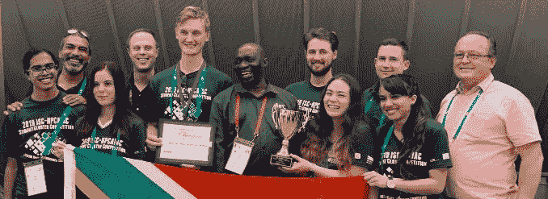

# 南非如何解决 HPC 面临的最大挑战之一

> 原文：<https://pub.towardsai.net/growing-the-next-generation-of-hpc-leaders-2518a7dfba15?source=collection_archive---------1----------------------->

## HPC 领导的未来| [走向人工智能](https://towardsai.net)

## *学生集群竞赛的战略方法赢得了最高奖项，并有助于解决关键的技能短缺问题*

高性能计算(HPC)推动着全球的经济增长和科学进步。但是 HPC 技能短缺，随着 HPC 工作负载越来越多地包含人工智能(AI)和大数据以及建模和模拟，这个问题变得越来越严重。

南非共和国将国际学生群集竞赛作为扩大其 HPC 劳动力的一种方式。*它的努力如此成功，以至于它已经成为一个全球强国，其他团队和国家领导人都在问他们是如何做到的。这也让南非在未来的比赛中更加关注整个非洲。我们采访了南非学生和领导人，以了解更多信息。*

# 全球性的挑战

在过去的七年里，南非派出了一支国家队参加在法兰克福举行的国际超级计算大会(ISC)学生集群竞赛，该竞赛与现在的 ISC 高性能大会同时举行。该国在 2019 年和前三年获得了最高荣誉。当他们没有把最高奖项带回家时，南非队获得了两个第二名和一个第三名，让他们连续七年获得主要硬件。2019 年团队还因其在 LINPACK 基准测试中的表现获得了荣誉奖。

> 南非领导人将竞赛视为让大学生接触 HPC、增加他们的领域知识并最终帮助填补南非 HPC 管道的一种方式。南非高性能计算中心(CHPC)主任 Happy Marumo Sithole 博士表示:“技能匮乏是 HPC 面临的最大挑战，这并不是南非独有的问题。“学生竞赛让更多的学生对 HPC 感到兴奋，并发展了对南非和世界其他地区至关重要的技能。它帮助我们清除了一个主要的障碍。”

# 战略目标

南非是非洲大陆高性能计算的领导者。与澳大利亚一样，它将成为拥有大型射电望远镜和超级计算机的两个国家之一，这些望远镜和超级计算机将构成平方公里阵列(SKA)项目，这是一项国际合作，旨在建立下一代射电天文台。2016 年，CHPC 安装了非洲最快的超级计算机，即由英特尔至强处理器支持的 petaflops 戴尔集群。国家于 2007 年成立了 CHPC，由科学和工业研究理事会(CSIR)管理。自那以后，CHPC 资助了从天体物理学到气候变化到 HIV 建模等领域的重大研究。

“高性能计算支持南非的研究、创新和工业系统，”Sithole 博士说。“这对工业现代化和大型科学项目至关重要，这些项目将改善南非、整个非洲大陆和全世界的社会和经济发展以及科学理解。”

学生群集竞赛强调高性能计算中的实际挑战和应用。每个团队设计并构建一个集群，并使用它来运行一组行业标准的 HPC 基准和广泛使用的应用程序。反映现实世界的限制，判断是基于性能达到不超过 3 千瓦的功率范围。2019 年的团队运行了测试浮点和整数性能、可持续内存带宽和其他关键指标的基准。这些应用涉及天体物理学、量子化学、流体力学和重力、流体动力学、深度学习模型训练、气候建模和其他领域。

“当学生了解 HPC 并看到它的所有功能时，他们会变得感兴趣和兴奋，”Sithole 博士说。

# 国家队，全年流程

为了实现他们的战略目标，南非 HPC 领导人决定通过全国范围的竞争来创建该国的团队，每年选择所有新成员。2019 年的团队由约翰内斯堡金山大学的 Kaamilah Desai 和 Anita de Mello Koch 以及开普敦大学的 Dillon Heald、Stefan Schroeder、Jehan Singh 和 Clara Stassen 组成。他们与来自中国、爱沙尼亚、德国、波兰、苏格兰、西班牙、瑞士和美国的 13 支队伍竞争。

这项比赛在南非是一项全年的活动，法兰克福比赛结束后不久就开始了第一步的选拔。在第一阶段，CSIR 邀请全国各地的大学派遣四人小组到开普敦，学生们在那里学习构建基于 Linux 的集群的基础知识，并在云中创建一个原型集群。2020 年团队的第一轮比赛于 7 月初在开普敦举行，吸引了来自全国各地的 20 支团队。

根据 CHPC 的大卫·麦克劳德(David Macleod)的说法，2019 年团队的性别平衡是“有意无意的”，他与 CHPC 的计算机工程师马修·卡伍德(Matthew Cawood)一起指导该团队。麦克劳德说:“我们一开始就考虑了多样性。“我们向少数族裔伸出援手，鼓励他们参与。2020 年，我们要求每个一级团队至少有一名女性。过了第一关，我们严格按照成绩来。”

在 12 月举行的第二轮比赛中，参赛队用 CHPC 提供的零件构建小型集群。他们安装软件和运行基准测试，并根据集群设计和应用程序性能进行评估。

# 设计强大的集群

一旦团队被选中，学生们将在接下来的六个月里为国际比赛设计集群，并优化他们的软件堆栈。学生进行研究并确定他们认为最有可能赢得比赛的技术。然后，团队顾问与全球技术赞助商合作，确保硬件安全。南非的国际企业部门从最初几年就一直支持这个项目，甚至在团队开始赢得比赛之前。

> 麦克劳德说:“要想有任何获胜的机会，你需要优秀的硬件。”“最终得分通常非常接近，因此获得最佳性能功耗比并充分利用系统的每一点性能会有所不同。如果你没有尽你所能带来最好的硬件，你的日子会很难过。”

2019 团队认为英特尔至强白金 8180 处理器为竞争对手的各种工作负载和基准测试提供了最佳功能，包括性能功耗比。英特尔提供了处理器，戴尔捐赠了一台六节点 PowerEdge，每个节点配有两个 8180 处理器。NVIDIA 和 Mellanox 也是赞助商，该集群使用 V100 GPUs 进行气候建模人工智能解决方案的训练和推理，以及 HPC 挑战基准的 HPL 部分。所有其他代码都在英特尔至强白金处理器上运行。

“我们发现英特尔至强白金处理器具有最佳的性能功耗比和最佳的电源管理解决方案，”希尔德说。“我们使用特定型号的寄存器在需要时控制散热设计功耗。我们还有库和编译器，它们与英特尔处理器配合得非常好。”

处理器的高内核数是另一个优势。Singh 说:“每个处理器有 28 个内核，我们可以灵活地降低内核时钟频率，以便在需要时获得更好的性能和能效。

学生们表示，英特尔 HPC 环境的其他元素提供了更多价值。流体力学和重力代码 Swift 受益于英特尔高级矢量扩展 512。量子化学和固态物理软件包 CP2K 得到了英特尔 OpenMP 和英特尔数学内核库的推动。“我们使用英特尔 Parallel Studio 来编译我们的许多代码，因为英特尔编译器给了我们如此好的性能增益，”Singh 补充道。

# 超越平台

除了捐赠学生所需的硬件元素，团队的赞助商和顾问还慷慨提供建议、鼓励和见解。戴尔带领学生参观了其德克萨斯州总部，在那里，他们与来自戴尔和德克萨斯州高级计算机中心(TACC)的 HPC 专家讨论了设计考虑事项，并审查了他们的最终设计。拥有世界第五强超级计算机的 TACC 与 CHPC 有着长期的合作关系，并将其报废的集群提供给南非。

“当我们了解不同类型的处理器以及实施如何影响集群内的延迟、最大吞吐量和功率限制时，与戴尔和 TACC 的对话非常有帮助，”希尔德说。

培养团队精神也很重要。每个团队成员主要负责一个应用程序或基准，每个成员为另一个团队成员提供支持。大家都强调玩得开心，保持气氛轻松，鼓励提问。学生在可用的硬件上练习，并在出发参加比赛前一两周收到最终的硬件。到达法兰克福后，他们重新组装了集群，安装了软件堆栈，并执行了电源分析。当起跑铃响时，他们准备出发了。

“赢得竞争需要三样东西，”麦克劳德总结说。“你需要有能力完成任务的有才华的学生。你需要合适的设备。你需要做好准备。这个团队花了六个月的时间——从他们被选中的十二月开始，到他们去法兰克福的六月——结果证明了这一点。他们能够平静地进入并保持专注。这真的是一个简单的食谱。”

# 推进 HPC，推进非洲

南非对学生集群竞赛的承诺正在帮助该国培养一批新的 HPC 领导者，扩大其人力资本供应，并加速其科学、技术和经济进步。

## 学生竞争对手已经从不熟悉 HPC 转变为渴望在该领域发展。

比如电气工程专业的科赫说，“竞赛让我接触到了 HPC。如果我没有参加比赛，我就不会想到 HPC，也许永远也不会研究它。现在，我可以看到，随着世界的变化，这个领域将变得更加重要。成为这一领域的一部分将非常重要。”

同样，Schroeder 说，“我们的赞助商和 CHPC 使一个惊人的机会成为可能，它打开了我对超级计算的眼界，改变了我的职业道路。我希望将来在 KSA 项目中与超级计算机一起工作。”

比赛的影响已经超出了南非。“其他非洲国家已经意识到学生挑战的价值，并希望在他们的国家看到它，”Sithole 博士说。“我们对他们如何发展自己的竞争团队或参与我们的项目很感兴趣。我们的意图是走向一个更加大陆化的方法，我们已经从南非政府那里得到了启动这一进程的资金。我们希望明年和未来能在 ISC 看到更多的参与。”

____________________

简·罗威尔是一位获奖作家，他报道了高性能计算、人工智能、医疗保健和其他领域的技术趋势和进展。