# 数据科学中描述性统计的使用指南

> 原文：<https://pub.towardsai.net/guide-to-using-descriptive-statistics-in-data-science-238527b3aaf3?source=collection_archive---------2----------------------->

## 理解总结数据的关键概念

凯瑟琳·拉威利在 [Unsplash](https://unsplash.com?utm_source=medium&utm_medium=referral) 上拍摄的照片

统计学是数据科学和数据分析的核心。理解基本概念并知道何时更喜欢某些方法对于任何对这些领域感兴趣的人来说都是至关重要的，因为它允许我们正确地解释结果并获得更好的见解。

在这篇关于描述性统计的文章中，我们将看看常用于汇总数据的不同工具和概念，以试图更好地理解它们如何工作以及何时使用它们。

# 概观

在本文中我们将看到:
[**数据可视化**](#e013)
∘ [柱状图与柱状图的区别](#fc0b)
∘ [小心用饼状图！](#8dba)
[**集中趋势和偏态**](#6575)
∘ [偏态](#26e5)
[**分散度的度量**](#f3f2)
∘ [总体和样本方差的区别](#5c47)
[**正态分布**](#c7b9)
∘ [标准正态分布](#eb62)

我们走吧！

[Firmbee.com](https://unsplash.com/@firmbee?utm_source=medium&utm_medium=referral)在 [Unsplash](https://unsplash.com?utm_source=medium&utm_medium=referral) 上拍照

# 数据可视化

可视化使我们能够快速浏览数据，以便更好地理解我们将要处理的数据类型。这通常是处理数据的第一步。

有许多方法可以可视化数据:

*   **散点图:**散点图对于确定两个定量变量之间是否存在关系非常有用，如果存在，是什么类型的关系。
*   **条形图:**它们对于表示分类变量和数字变量之间的关系特别有用
*   直方图:它们帮助我们表示数字数据的分布
*   饼图:它们可以用来表示数字比例

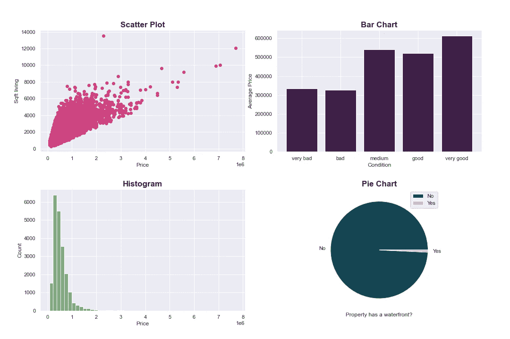

[房屋销售数据](https://www.kaggle.com/datasets/harlfoxem/housesalesprediction)(公共领域[许可](https://creativecommons.org/publicdomain/zero/1.0/)上的示例地块

## 条形图和直方图的区别

两种类型的图表都包含条形，因此一开始可能很难区分，但是您必须记住:

*   在**条形图**中，x 轴代表不同的类别，可以通过每个条形之间的空间看到。它们可以任意排序(按字母顺序，从最大到最小，等等)。)而条形图的形状也会遵循这个顺序。
*   在**直方图**中，x 轴代表一个被分成多个区间的数值变量，其大小必须被定义。我们不能对 x 轴重新排序，直方图的形状遵循数据的分布。

## 小心饼图！

通常情况下，使用条形图比饼图更好。这是因为人眼很难正确评估每个三角形的面积，这会导致模糊的结果。

只有在表示比例(其和等于 1)时，并且只有很少几个明显可区分的类别时，才使用饼图，即使这样，使用条形图可能会更好。

# 集中趋势和偏态

统计学中的三个“M”帮助我们总结数据的主要趋势。这些是:

*   **平均值:**我们数据的 ***平均值*** 。

这是**最常用的**之一，也是最容易计算的统计数据，但是如果存在异常值(不代表大部分数据的误差或极值)，或者如果数据高度倾斜(不对称)，这可能会产生误导。

*   **中值:**排序后数据的 ***中间*** 的值，使一半的值低于中值，一半高于中值。

它比平均值更稳健，因为它在计算中没有使用所有的数据。如果数据有许多异常值或高度倾斜，则应将其视为平均值的替代或补充。

*   **模式:**数据中最频繁出现的*值。*

*这对于 [**多峰分布**](https://en.wikipedia.org/wiki/Multimodal_distribution) 特别有用，在这种情况下，有多个明确的趋势，并且平均值和中值不能很好地描述数据。*

*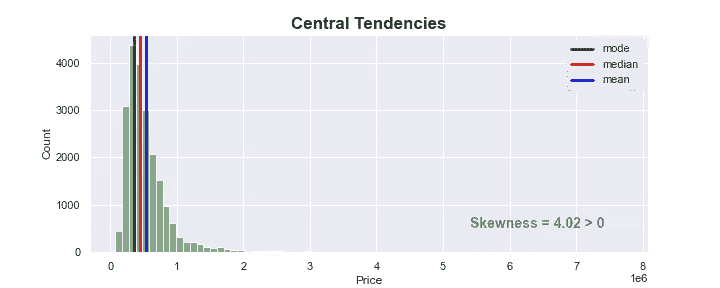*

*房屋销售价格的分布，显示数据的集中趋势和偏斜度*

## *歪斜*

*当大多数值位于分布的左侧时，如上图所示，我们说数据**向右倾斜，**表示右尾较长。对于单峰分布，这通常意味着一个**正偏斜度。***

*此外，大多数时候，在这些情况下我们会发现:*

*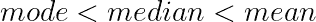*

*事实上，由于大多数值都位于左侧，因此很可能会在数据的前半部分找到该模式。此外，**平均值将高于中位数**，因为它对右边的数据更敏感。*

*类似地，如果数据**向左边**倾斜，意味着左边的尾巴更长，大多数值在右边，我们通常会发现:*

*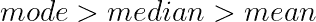*

*和以前一样，如果数据是单峰的，这通常意味着负偏度。*

# *离差的度量*

*为了更好地理解数据，除了均值、中值或众数，我们还需要知道数据是如何分布的。*

*我们有不同的方法来做到这一点，例如:*

*   ***范围:**是 ***最小值*** 和 ***最大值*** 之间的差值(Max-Min)*

*一个非常简单的指标，可以给出数据分散的概念。然而，它对异常值非常敏感，并且很少告诉我们数据的内部分布。*

*   ***四分位数范围(IQR):** 是第三个( ***Q3*** )和第一个[四分位数](https://en.wikipedia.org/wiki/Quartile) ( ***Q1*** )之差*

*与范围相比，它对异常值和偏态分布更加稳健，因为它只使用了中位数附近的百分之五十的数据。它可用于通过 [1.5xIQR 规则](https://www.khanacademy.org/math/statistics-probability/summarizing-quantitative-data/box-whisker-plots/a/identifying-outliers-iqr-rule)识别潜在的异常值。这种方法也用于构建[箱线图](https://en.wikipedia.org/wiki/Box_plot)，让我们看到这些潜在的异常值。*

*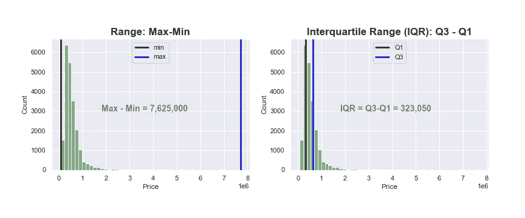*

*房屋销售价格的分布，显示范围和 IQR*

*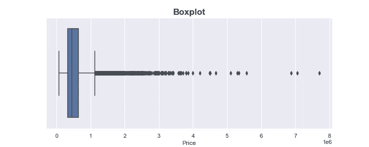*

*房屋销售价格箱线图*

*   ***方差:**是每个数据点与均值的平方差的平均值。*

*它测量数据中每个点(xi)与平均值( )之间的差异。为了避免低于平均水平的数字与高于平均水平的数字相平衡，它会在将所有数字相加之前对每个差异进行平方。最后，它将结果除以数据点的总数(N)。*

*结果是平均值的平方单位，不容易解释。为了解决这个问题，我们使用标准差(σ)。*

*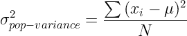*

*   ***标准差:**是方差的平方根。*

*这是最常见的离差度量，与方差不同，它以与数据相同的单位表示。它可以更好地了解每个数据点是如何分布的，尤其是当数据遵循正态分布时。*

## *总体方差和样本方差的区别*

*一般来说，当你想研究某个群体时，你不可能从每个个体那里收集数据。因此，只收集了人口中有代表性的一部分:样本。*

*然而，**样本低估了总体中的变异程度**，因为我们更有可能得到更多的共同值。如果数据遵循正态分布或者样本量很小，这一点尤其正确。*

*在这种情况下，为了更好地估计总体的方差，我们除以 N-1，而不是除以 N(观察总数)，这具有**增加方差**估计的效果。*

*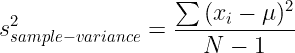*

*我们可以注意到，数据少(小 N)的样本相对来说会比数据多(大 N)的样本受影响更大。*

# *正态分布*

*正态分布或高斯分布是最常见的分布类型。它以对称的钟形曲线而闻名，这表明大多数观测值都在平均值附近。*

*更准确地说，如果数据遵循正态分布，大约 68% 的值将落在平均值以下一个标准偏差和平均值以上一个标准偏差之间， **95%** 将落在平均值的大约两个标准偏差内，并且数据的 **99.7%** 将落在平均值的三个标准偏差内:*

*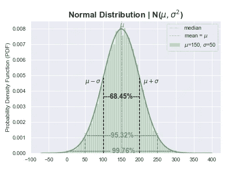*

*均值= 150，标准差= 50 的正态分布*

*此外，钟形曲线的形状取决于标准偏差。*

*   *如果**标准偏差较低**，这意味着数据不是很分散，因此我们将有一条**更窄、更高的曲线***
*   *如果**标准偏差较高**，这意味着平均而言，观察值远离平均值，导致**更宽、更平的曲线***

*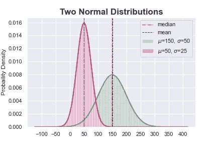*

*两个标准偏差不同的正态分布，显示不同的形状*

*正如所料，我们还可以看到钟形曲线总是以平均值为中心。*

## *标准正态分布*

*最后，我们可以通过减去每个数据点的平均值并将结果除以标准偏差来归一化任何正态分布，以获得“标准正态分布”。这可以帮助我们很容易地比较两个不同的正态分布。*

*通过标准化，我们获得了所谓的“Z 得分”，它告诉我们一个给定点离平均值有多少标准差:*

*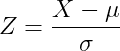*

*结果将是均值等于 0、标准差等于 1 的标准正态分布。*

*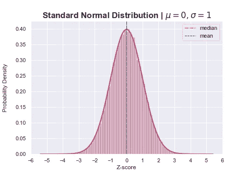*

*先前显示数据的标准化分布*

***为什么均值等于 0？***

*   *如果从数据集中的每个点减去一个常数，每个观察值将变小，因此平均值将减小。*
*   *更准确地说，当我们给每个数据点加上或减去一个常数时，我们就把分布移动了那个量。如果我们减去平均值，那么我们可以预期平均值会减少这个量。在这种情况下，这意味着平均值变得等于零。*

***为什么标准差等于 1？***

*   *当添加一个常数时，方差和标准差不会改变，因为数据的离差不会改变。但是，当一个数据集中的所有值都乘以同一个数时，方差预计会增加该数的平方。*

*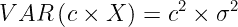*

*   *按照这个公式，当我们除以标准差时，我们得到的方差等于 1。*

*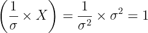*

*   *因为标准差是方差的平方根，而 1 的平方根等于 1，所以我们新的标准差是 1。*

# *结论*

*在本文中，我们深入了解了用于描述数据的常用工具，如数据可视化、集中趋势、分散度量和正态分布属性。*

**如果您对本文使用的 Jupyter 笔记本感兴趣，您可以查看 GitHub 的***资源库。***

***注:除特别注明外，所有图片均为作者所有。***

**[**成为会员**](https://medium.com/@pcmaldonado/membership) **阅读介质上的每一个故事。你的会员费直接支持我和你看的其他作家。你也可以在媒体上看到所有的故事。****

** [## 通过我的推荐链接加入 Medium—Paula mal donado

### 作为一个媒体会员，你的会员费的一部分会给你阅读的作家，你可以完全接触到每一个故事…

medium.com](https://medium.com/@pcmaldonado/membership)**