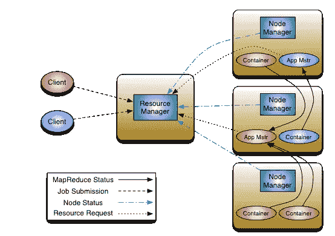
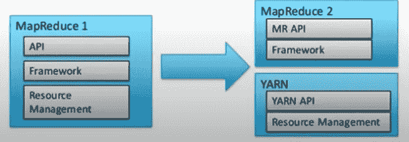
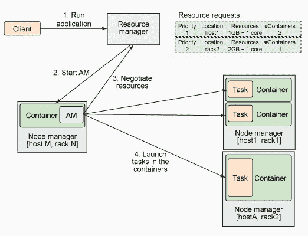

# Hadoop 纱线架构

> 原文：<https://pub.towardsai.net/hadoop-yarn-architecture-56f910b0b75f?source=collection_archive---------3----------------------->

## [编程](https://towardsai.net/p/category/programming)

YARN 代表另一种资源谈判者。随着 Hadoop 2.x 的出现，YARN 成为 Hadoop 生态系统的一部分，随之而来的是 Hadoop 的主要架构变化。

故事

YARN 管理集群环境中的资源。就这样？在 Hadoop 2.x 之前我们没有任何资源管理器吗？当然，在 Hadoop 2.x 之前我们有一个资源管理器，它被称为**作业跟踪器**。

**那么什么是工作追踪系统**？

JobTracker (JT)用于管理集群资源和执行 MapR 或 MapReduce 作业执行，这意味着数据处理。JT 配置和监控每个运行的任务。如果一个任务失败，它会重新分配一个新的插槽，让该任务重新开始。任务完成后，它释放资源并清理内存。

JT 用来执行许多任务，这种方法也有一些缺点。我没有在 Hadoop 1.x 上工作过，但尝试在下面列出其中一些。

上述方法的缺点:

1.  它只有一个组件:JobTracker，用于执行许多活动，如资源管理、作业调度、作业监控、重新调度作业等，这给单个组件带来了很大的压力。
2.  JobTracker 是单点故障，这使得 JT 成为高度可用的资源，因此如果一个 JT 失败，那么所有任务都将重新启动。
3.  静态资源分配，因为 map 和 reduce 槽是预定义和保留的，所以即使槽空闲，它们也不能用于其他应用程序。

以上是 Hadoop 1.x 工作方式的一些主要缺点。

所以下一个出现在脑海中的问题是，纱线是如何解决这个问题的？**纱**分离资源管理层和数据处理组件层。

地图 1 与地图 2

在 MapR1 中，所有的资源管理和处理任务都由 JobTracker 完成，但随着 Hadoop 2.x 的发布，这两个层都被划分了，对于资源管理层，我们有了 **YARN** 。现在 Hadoop 2.x 说，对于数据处理，使用 MapR、Spark、Tez 和其他可用的数据处理框架，而 YARN 负责资源协商。

Hadoop 2.x 将 MapR 组件分离为不同的组件，最终增加了整个生态系统的功能，从而提高了可用性和可扩展性。

**纱线及其成分**

**YARN** 由两部分组成:**资源管理器**和**节点管理器**。

**详细架构:**

**让我们了解一下不同的组件:**

# 资源管理程序

Spark 采用主从架构，资源管理器位于主节点。RM 是主要的权威，帮助管理诸如 RAM、CPU 使用、网络带宽等资源。不同的工作。资源管理器维护运行的应用程序列表和可用资源列表。

**资源管理器**有两个组件:**调度器**和**应用管理器。**

1.  **调度程序:**

调度程序代表资源管理器负责资源分配部分。它根据资源的可用性将资源分配给各种 MapR 或 Spark 应用程序。

调度程序纯粹负责资源分配，不参与任何其他活动，如监视或跟踪作业状态等。

**2。应用经理:**

应用程序管理器在从节点中启动特定于应用程序的**应用程序主机**。

注意:**应用管理器**和**应用主机**是不同的组件

Application Manager 为容器协商启动 Application Master，并在失败时帮助重新启动。

简而言之，当资源管理器接受一个新的 MapR 或 Spark 应用程序提交时，Scheduler 做出的最初决定之一就是选择一个容器来启动该特定应用程序的 Application Master，而应用程序管理器负责启动该应用程序。

# 节点管理器

在 Hadoop 2.x 之前，曾经有固定数量的插槽来执行 Map 和 Reduce 作业，但在 Hadoop 2.x 之后，插槽的概念被动态创建/分配**资源容器所取代。**

**容器**是指 CPU、RAM、磁盘或硬盘、网络 IO 等资源的集合，类似于服务器。

一个**节点管理器**是每台机器的框架代理，负责保存容器，监控它们的资源使用情况(CPU、RAM、磁盘等)。)并将其报告回给**资源管理器中的**调度器**。**节点管理器存在于**从系统**上。

节点管理器定期对资源执行健康检查，如果任何健康检查失败，节点管理器会将该节点标记为不健康，并将其报告回资源管理器。

资源管理器+节点管理器=计算框架

# 应用程序主机

Application master 是特定于应用程序或基于应用程序的，由应用程序管理器启动。

Application Master 从资源管理器协商资源，并与节点管理器一起执行和监控任务。Application Master 负责应用程序的整个生命周期。

Application Master 向资源管理器发送资源请求，并请求容器来运行应用程序任务。在接收到来自应用程序主机的请求后，资源管理器验证资源需求并检查资源的可用性，并授予容器以满足资源请求。

授予容器后，应用程序主机将请求节点管理器利用资源并启动特定于应用程序的任务。

Application Master 监控应用程序及其任务的进度。如果出现故障，它会请求一个新的容器来启动任务并报告故障。

在应用程序的执行完成后，应用程序主机关闭并释放其容器。因此标志着执行完成。

这就是所有的纱线及其各种成分。

# 总结:

什么是纱线

Hadoop 2.x 之前和 2 . x 之后的比较

Yarn 如何修复 2.x 之前的问题

资源管理器、节点管理器、应用程序主机等组件及其功能

Application Master 如何工作