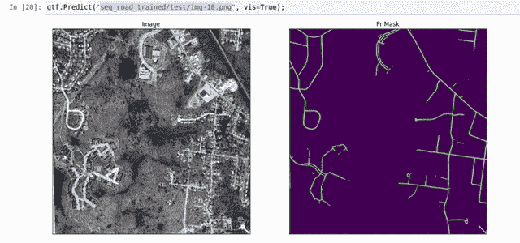
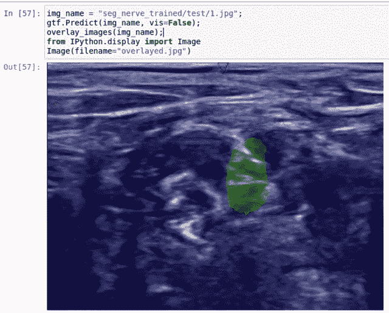
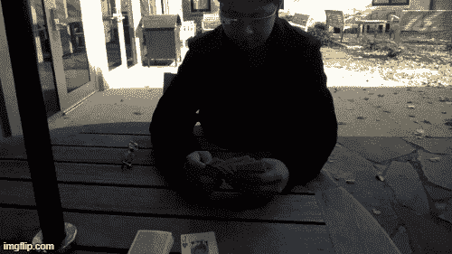
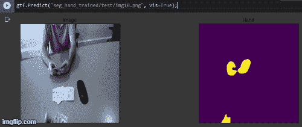
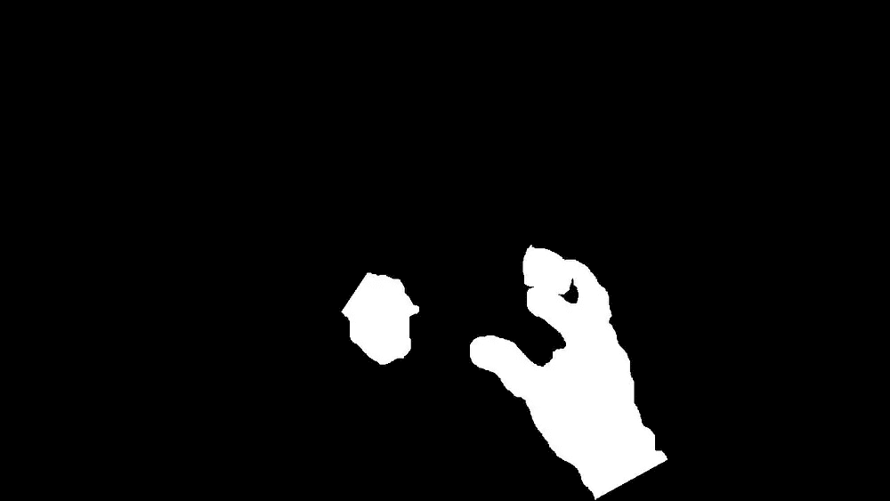
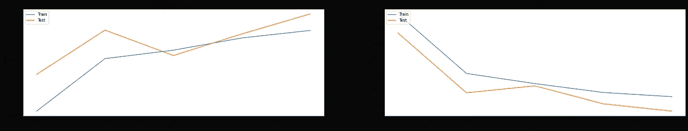
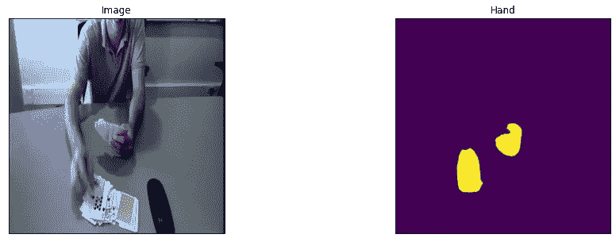

# 使用 Monk AI 的手部分割应用程序(Ego-Hands 数据集)

> 原文：<https://pub.towardsai.net/hand-segmentation-application-ego-hands-dataset-using-monk-ai-d0f67c0b776c?source=collection_archive---------3----------------------->

## [计算机视觉](https://towardsai.net/p/category/computer-vision)

> 使用 Monk，低代码深度学习工具和计算机视觉的统一包装器，使计算机视觉变得简单。

# 介绍

在本教程中，我们将制作一个从 EgoHands 数据集中分割手部图像的应用程序。这种手分割系统可以用于手势识别应用。这些手势识别应用程序帮助残疾人和老年人进行日常活动，如传达简单信息或在简单手势的帮助下控制机器。Monk toolkit 允许我们使用 Monk 的低级代码语法部署模型，从而帮助我们创建真实世界的计算机视觉应用程序。Monk 的不同深度学习管道的单线安装使我们的工作没有错误。

# 使用 Monk 创建真实世界的图像分割应用程序



卫星图像中的道路分割



超声神经分割

# 关于数据集

EgoHands 数据集包含 48 个谷歌眼镜视频，这些视频是两个人之间复杂的第一人称互动。从上面提供的链接下载**标签为 data.zip** 的文件夹。这个 zip 文件夹包含所有标记为 JPEG 文件的框架。48 个视频中的每一个都有 100 个标记帧，总共 4800 个帧。该文件夹包含不同对的四个参与者的图像，这些参与者彼此面对，从事不同的活动。
活动包括:
—打牌
—下棋
—解 24 或 48 块拼图
—玩叠人偶



# 目录

## 1.安装说明

## 2.使用已经训练好的模型

## 3.训练自定义分割器

**—创建数据集的步骤
—将数据集分为训练和验证数据集
—训练**

## 4.推理模型

# 安装说明

在进入细分部分之前，我们将在我们正在工作的平台上设置 Monk AI toolkit 及其依赖项，我使用 Google Colab 作为我的环境。

```
! git clone [https://github.com/Tessellate-Imaging/Monk_Object_Detection.git](https://github.com/Tessellate-Imaging/Monk_Object_Detection.git)# For colab use the command below! cd Monk_Object_Detection/9_segmentation_models/installation && cat requirements_colab.txt | xargs -n 1 -L 1 pip install# For Local systems and cloud select the right CUDA version#! cd Monk_Object_Detection/9_segmentation_models/installation && cat requirements_cuda10.0.txt | xargs -n 1 -L 1 pip install
```

# 使用已经训练好的模型。

Monk 允许我们使用预先训练的模型来演示我们的应用程序。我们可以使用预先训练的模型并推断一些 EgoHands 图像的分割。

```
import osimport syssys.path.append("Monk_Object_Detection/9_segmentation_models/lib/");from infer_segmentation import Infergtf = Infer();
```

在每幅图像中，我们必须区分手和背景的细节。因此，字典 class_dict 将有两个键值对。

```
classes_dict = {'background': 0,'hand': 1};
```

该模型将只针对**手**类进行训练。

```
classes_to_train = ['hand'];
```

下一步将是指定数据参数。

```
gtf.Data_Params(classes_dict, classes_to_train, image_shape=[716,1024])
```

现在我们将下载训练好的模型。

```
! wget --load-cookies /tmp/cookies.txt "https://docs.google.com/uc?export=download&confirm=$(wget --save-cookies /tmp/cookies.txt --keep-session-cookies --no-check-certificate 'https://docs.google.com/uc?export=download&id=1c97ms04BVQKS3KH6TZ87KSEJkXCl-Qma' -O- | sed -rn 's/.*confirm=([0-9A-Za-z_]+).*/\1\n/p')&id=1c97ms04BVQKS3KH6TZ87KSEJkXCl-Qma" -O seg_hand_trained.zip && rm -rf /tmp/cookies.txt
```

seg_hand_trained.zip 文件夹将包含已训练的模型文件和一个包含待测试图像的测试图像文件夹，下一步是解压缩该文件夹。

```
! unzip -qq seg_hand_trained.zip
```

在下一步中，我们指定模型参数。

```
gtf.Model_Params(model="Unet", backbone="efficientnetb3", path_to_model='seg_hand_trained/best_model.h5')
```

现在，我们将建立模型并预测细分。

```
gtf.Setup();
```



预测分割

# 训练自定义分割器

现在，我们将创建一个自定义分段器，为此，第一步也是最重要的一步是数据集创建。从上面给出的链接下载的数据集将有 EgoHands 图像和 MATLAB 代码文件。使用这些文件，我们将为每个 EgoHands 图像生成蒙版图像。

## 创建数据集的步骤

—我们将从上面给出的链接中获取 EgoHand 图像。
—从上面链接下载的文件夹也会有 Matlab 代码文件。
—按照下载文件夹中自述文件的说明运行 Matlab 代码文件，将获得屏蔽图像。
—所有最初保存在不同类别文件夹中的 EgoHand 图像将保存在一个名为 Hand_Img 的单独文件夹中。
—运行 Matlab 代码后获得的屏蔽图像将存储在一个名为 Hand_Annot 的单独文件夹中。
—我们应该确保图像列表和屏蔽标签的顺序相同，否则标签映射将不会正确。
—在获得单独的文件夹 Hand_Img 和 Hand_Annot 后，我们可以将它们上传到我们的笔记本并相应地使用它们。



EgoHands 图像及其对应的遮罩图像

## 将数据集拆分为测试和验证数据

我们现在将把图像数据集分成训练数据和验证数据。第一步是创建原始图像和屏蔽图像的排序列表。

```
#The path given below will be the path of the two folders Hand_Annot and Hand_Img which are obtained after following steps to create the dataset.import osimg_list = sorted(os.listdir("vision.soic.indiana.edu/projects/egohands/Hand_Img"));mask_list = sorted(os.listdir("vision.soic.indiana.edu/projects/egohands/Hand_Annot"));
```

下一步是为训练和验证创建一个单独的文件夹，并在其中创建两个子文件夹，分别用于 EgoHand 图像和相应的遮罩图像。

```
import os
os.mkdir("/content/train");
os.mkdir("/content/train/img31");
os.mkdir("/content/train/mask31");os.mkdir("/content/val");
os.mkdir("/content/img31");
os.mkdir("/content/val/mask31");
```

现在，将 EgoHands 图像数据分成训练和验证数据。

```
import cv2
import numpy as np
from tqdm.notebook import tqdm for i in tqdm(range(len(img_list))):img_path = "vision.soic.indiana.edu/projects/egohands/Hand_Img/"+img_list[i];img = cv2.imread(img_path, 1);cv2.imwrite("/content/train/img31/img"+str(i+1)+".png" ,img);for i in tqdm(range(100)):img_path = "vision.soic.indiana.edu/projects/egohands/Hand_Img/"+img_list[i];img = cv2.imread(img_path, 1);cv2.imwrite("/content/val/img31/img"+str(i+1)+".png", img);
```

现在，我们将把蒙版图像保存在 training and validation 文件夹的蒙版文件夹中。被屏蔽的图像在分成训练和验证之前被修改。在每个屏蔽图像中，大于 0 的像素值被改变为 1，像素值 1 表示手，而 0 表示背景。

```
import cv2
import numpy as np
from tqdm.notebook import tqdmfor i in tqdm(range(len(mask_list))): img_path =   "vision.soic.indiana.edu/projects/egohands/Hand_Annot/"+mask_list[i]; img = cv2.imread(img_path,0) img[img > 0 ] = 1; cv2.imwrite("/content/train/mask31/img" + str(i+1)+".png", img);for i in tqdm(range(100)): img_path = "vision.soic.indiana.edu/projects/egohands/Hand_Annot/" + mask_list[i]; img = cv2.imread(img_path,0) img[img>0] = 1; cv2.imwrite("/content/val/mask31/img" +str(i+1)+".png", img);
```

**最终数据集目录结构**

```
root_dir
      |
      | 
      |         
      |----train
      |       |----img31
      |              |
      |              |---------img1.jpg
      |              |---------img2.jpg
      |                   |---------.........(and so on) 
      |
      |----train
      |       |----mask31
      |              |
      |              |---------img1.jpg
      |              |---------img2.jpg
      |                   |---------..........(and so on)
      |
      |----val (optional)
      |       |----img31
      |              |
      |              |---------img1.jpg
      |              |---------img2.jpg
      |                   |---------..........(and so on)
      |
      |----val
      |       |----mask31
      |              |
      |              |---------img1.jpg
      |              |---------img2.jpg
      |                   |---------..........(and so on)
```

## 培养

这是创建自定义分段器的最后一步。

```
import os
import syssys.path.append("Monk_Object_Detection/9_segmentation_models/lib/");from train_segmentation import Segmentergtf = Segmenter();
```

保存 EgoHands 和 masked 图像目录的路径。

```
img_dir = "/content/train/img31";mask_dir = "/content/train/mask31";
```

两个类别‘手’和‘背景’分别由像素值 1 和 0 表示，并且我们将仅为‘手’类别训练分割模型。

```
classes_dict = {'background': 0,'hand': 1};classes_to_train = [ 'hand'];
```

指定用于训练和验证的数据集参数。

```
gtf.Train_Dataset(img_dir, mask_dir, classes_dict, classes_to_train)img_dir = "/content/drive/My Drive/val/img31";
mask_dir = "/content/drive/My Drive/val/mask31";gtf.Val_Dataset(img_dir, mask_dir)
```

获得可用于分段网络的主干网列表并选择适当的数据参数。

```
gtf.List_Backbones();gtf.Data_Params(batch_size=10, backbone="efficientnetb3",image_shape = [720,1280])
```

获取可用模型列表并选择适当的模型参数。

```
gtf.List_Models();gtf.Model_Params(model="Unet")
```

建立细分模型。

```
gtf.Setup();
```

开始训练。

```
gtf.Train(num_epochs=5);
```

将训练结果可视化。

```
gtf.Visualize_Training_History();
```



已训练模型的 Iou_score 曲线和损耗曲线

# 推理模型

它将类似于预先训练的模型。

```
import os
import sys
sys.path.append("Monk_Object_Detection/9_segmentation_models/lib/");from infer_segmentation import Infer
gtf = Infer();classes_dict = {
'background': 0,
'hand': 1
};
classes_to_train = ['hand'];
```

定义数据和模型参数，并给出通过训练获得的最佳模型的路径

```
gtf.Data_Params(classes_dict, classes_to_train, image_shape=[716,1024])gtf.Model_Params(model="Unet", backbone="efficientnetb3", path_to_model='best_model.h5')
```

现在，建立模型。

```
gtf.Setup();
```

推断图像。

```
from PIL import Image
img = Image.open("/content/train/img31/img100.png")
img = img.resize((1024,1024))
img.save('tmp_img.png')gtf.Predict("/content/tmp_img.png", vis=True);
```



预测分割

# 结论

我们通过使用 Monk 的低代码语法成功创建了手部分割应用程序，该分割系统可用于创建手势识别应用程序，有关更多此类应用程序，请参考[应用程序模型 Zoo](https://github.com/Tessellate-Imaging/Monk_Object_Detection/tree/master/application_model_zoo) 。

在 [GitHub](https://github.com/Tessellate-Imaging/Monk_Object_Detection/blob/master/application_model_zoo/Example%20-%20Hand%20segmentation%20(Ego-Hands%20Dataset).ipynb) 上有教程。