# 处理 Pyspark 中缺失的数据

> 原文：<https://pub.towardsai.net/handle-missing-data-in-pyspark-3b5693fb04a4?source=collection_archive---------0----------------------->

## [编程](https://towardsai.net/p/category/programming)， [Python](https://towardsai.net/p/category/programming/python)

本文的目标是理解处理数据集中缺失值或空值的各种方法。空值意味着未知或缺失或不相关的值，但对于机器学习或数据科学方面，有效地处理空值变得至关重要，原因是 ML 工程师不能缺少数据集。


无效的

让我们看看处理 Spark 数据帧中缺失数据或空值的各种方法。

## **Pyspark 连接和应用创建**

```
import pyspark
from pyspark.sql import SparkSession
spark= SparkSession.builder.appName(‘NULL_Handling’).getOrCreate()
print(‘NULL_Handling’)
```

## **2。导入数据集**

```
null_df=spark.read.csv(r’D:\python_coding\pyspark_tutorial\Nulls.csv’,header=True,inferSchema=True)
null_df.show()
```

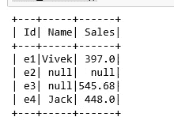

资料组

## **3。删除空值**

```
#na func to drop rows with null values
#rows having atleast a null value is droppednull_df.na.drop().show()
```

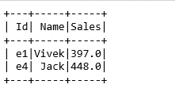

删除空值

```
#rows having nulls greater than 2 are droppednull_df.na.drop(thresh=2).show()
```

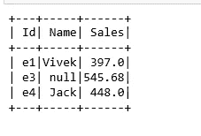

删除空值

## **4。** **使用“如何”参数删除空值**

```
#drop rows having nulls using how parameter
#records having atleast a null wull be droppednull_df.na.drop(how=’any’).show()
```

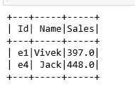

任何的

```
#record having all nulls will be droppednull_df.na.drop(how=’all’).show()
```

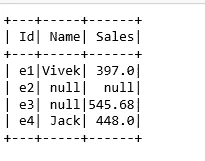

全部

## **5。删除列的空值基础**

```
#dropping null values on basis of a column
null_df.na.drop(subset=[‘Sales’]).show()
```

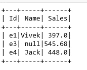

子集

```
#records having both Name and Sales as Nulls are droppednull_df.na.drop(how=’all’,subset=[‘Name’,’Sales’]).show()
```

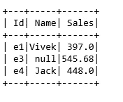

```
#records having both Name and Sales as Nulls are droppednull_df.na.drop(how=’any’,subset=[‘Name’,’Sales’]).show()
```


任何子集

## **6。填充空值**

```
#filling null values into dataset
#spark automatically detects if a column is string or numeric
null_df.na.fill(‘NA’).show()
```

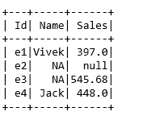

填充 NA

```
#fill integer value column
null_df.na.fill(0).show()
```

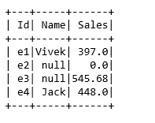

填充 0

## **7。根据列**填充空值

```
#filling on basis of column namenull_df.na.fill(‘Name Missing’,subset=[‘Name’]).show()
```

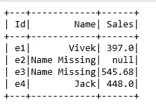

姓名缺失

```
#filling multiple column values basis of datatypesnull_df.na.fill({‘Name’: ‘Missing Name’, ‘Sales’: 0}).show()
```

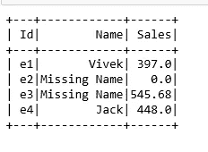

## 8。用另一个列值填充空列

```
#fill null values in Name column with Id valuefrom pyspark.sql.functions import whenname_fill_df=null_df.select('ID','Name',
                            when( null_df.Name.isNull(), null_df.Id).otherwise(null_df.Name).alias('Name_Filled'),'Sales')name_fill_df.show()
```

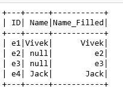

## 9。用平均值填充空值

```
#filling numeric column values with the mean or average value of that particular columnfrom pyspark.sql.functions import mean
mean_val=null_df.select(mean(null_df.Sales)).collect()print(type(mean_val)) #mean_val is a list row objectprint('mean value of Sales', mean_val[0][0])
mean_sales=mean_val[0][0]#now using men_sales value to fill the nulls in sales column
null_df.na.fill(mean_sales,subset=['Sales']).show()
```

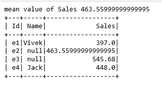

# 总结:

删除空值

使用参数 How 删除空值

用参数子集删除空值

填充空值

用另一列值或平均值填充空列

万岁，这里我们已经讨论了几种处理 Spark 数据框中的空值的方法。