# 为高级机器学习处理缺失数据

> 原文：<https://pub.towardsai.net/handling-missing-data-for-advanced-machine-learning-b6eb89050357?source=collection_archive---------0----------------------->

## 机器学习

## 理解、发现、清理、估算缺失数据的终极实用指南——基于真实世界示例的策略基准。

通过这篇文章，你将变得善于发现、理解和推断丢失的数据。我们使用 Python 演示了现实世界逻辑回归任务中的各种插补技术。正确处理缺失数据有助于提高推断和预测的效果。这是不容忽视的。

威尔黑在 [Pixabay](https://pixabay.com/photos/puzzle-match-missing-hole-blank-693870/) 拍摄的照片

本文的第一部分给出了理解缺失数据的框架。稍后，我们展示了在预测糖尿病发病的分类任务中处理遗漏的最流行的策略。

# 丢失数据是难以避免的

> 数据科学或机器学习工作的相当一部分是数据清洗。通常在收集数据时，数据集中会出现一些缺失值。

为了理解数据丢失的原因，让我们模拟一个包含两个预测值 *x1* 、 *x2* 和一个响应变量 *y* 的数据集。

我们将虚拟地使一些数据缺失，以说明为什么许多真实世界的数据集可能包含缺失值的各种原因。

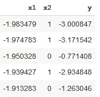

需要关注 3 种主要类型的缺失值。

## 完全随机失踪(MCAR)

当变量中缺失值的概率对于所有样本都相同时，就会出现 MCAR。

例如，当进行一项调查时，在输入计算机时随机遗漏了一些值，或者被调查者选择不回答某个问题。

MCAR 对基于此类数据训练的模型做出的推论没有影响。

为了说明 MCAR，我们随机移除了 *x1* 的一半值，如下所示。

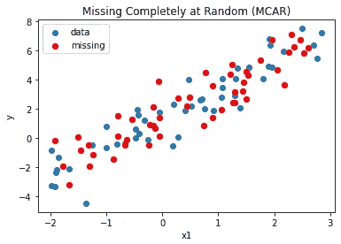

完全随机缺失(MCAR)的 x1 样本(红色标记)既不取决于 x1 值，也不取决于任何其他测量变量的值。

## 随机失踪(三月)

一个变量中随机缺失值的概率只取决于其他预测因子中的可用信息。

例如，当男性和女性回答“你休过育儿假吗？”与女性相比，男性更倾向于忽略这个问题。

通过使用其他预测器中的信息来处理 MARs，以构建模型并为缺失条目估算值。

我们通过根据 *x2* 值移除 *x1* 值来模拟 MAR。当 *x2* 的值为 1 时，则相应的 *x1* 缺失。

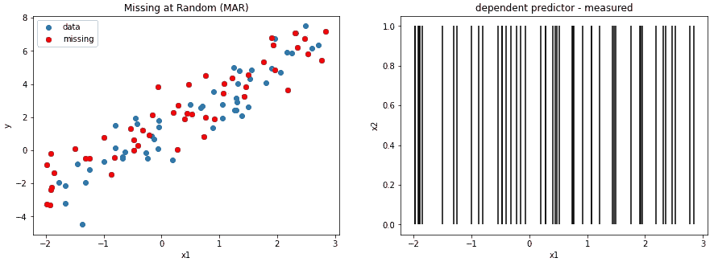

随机缺失(MAR)的 x1 样本(红色标记)与数据集中另一个因变量和测量变量(x2)的值相关。当 x2 具有布尔值 1 时，则 x1 缺失。

## 非随机缺失(MNAR)

缺失值的概率，不是随机的，取决于没有被记录的信息，这些信息也预测了缺失值。

例如，在一项调查中，当被问及是否曾经出轨时，出轨者不太可能回答。

MNARs 几乎是不可能处理的。

幸运的是，MNAR 对基于这种数据训练的模型所做的推断不会有任何影响。

假设有一个假设变量 *x3* 没有被测量，但是确定了哪些 *x1* 值缺失，我们可以如下模拟 MNAR。

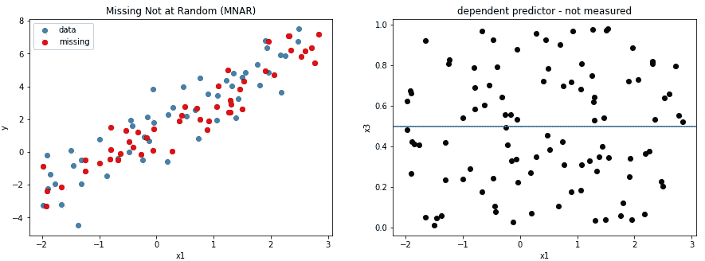

非随机缺失(MNAR)的 x1 样本(红色标记)与数据集外的另一个因变量(x3)的值相关。当 x3 大于 0.5 时，则 x1 值缺失。

# 补偿缺失值的 3 种主要方法

通常无法确定数据是否随机缺失，或者缺失是否取决于未观察到的预测值或缺失数据本身。

> 在实践中，随机缺失假设是合理的。

在文献中可以找到几种不同的输入缺失值的方法:

## 1.使用零、平均值、中间值或最频繁值的插补

这是通过用**零**、数量变量的**均值**或**中值**或分类变量的**最常见值**来输入所有缺失值来实现的。

此外，我们可以创建一个新的变量作为遗漏指标，并将其包含在模型中以预测响应。这是在实际变量中插入零、平均值、中间值或最频繁值之后完成的。

## 2.使用随机选择值的插补

这是通过在变量中随机选择一个观察到的条目并使用它来估算缺失值来实现的。

## 3.模型插补

其工作原理是用基于其他观测预测值的模型预测值替换缺失值。

*k* 最近邻算法通常用于根据缺失值与训练集中的点的相似程度来估算缺失值。

**具有不确定性的基于模型的插补**通过用基于其他观察预测值的模型的预测值加上随机性替换缺失值来工作。

**基于模型的渐进插补**使用之前插补的缺失值来预测其他缺失值。

其他方法包括随机回归插补、[多重插补、](https://www.jstatsoft.org/article/view/v045i03/v45i03.pdf)、[数据加权](https://github.com/awslabs/datawig)、热卡插补、外推、内插法、[列表删除](https://en.wikipedia.org/wiki/Listwise_deletion)。

这里什么都不缺——照片由卡尼·阿金在 [Pixabay](https://pixabay.com/photos/green-veins-leaf-plant-pattern-4719686/) 上拍摄

# 处理缺失值的实用指南

## 描述数据

在接下来的章节中，我们将使用**皮马印第安人糖尿病发病**数据集，在这里找到。

该数据集描述了皮马印第安人的患者医疗记录数据，以及他们在五年内是否患有糖尿病。

这是一个二元分类问题(糖尿病发病为 1 或不为 0)。

描述每个患者的输入变量是数字的，并且具有不同的范围。

下面的列表显示了数据集的八个属性和目标变量:

*   病人怀孕的次数。
*   口服葡萄糖耐量试验中每 2 小时的 2 小时血浆葡萄糖浓度。
*   舒张压(毫米汞柱)。
*   三头肌皮褶厚度(毫米)。
*   2 小时血清胰岛素(μU/ml)。
*   体重指数。
*   糖尿病谱系功能。
*   年龄(岁)。
*   结果(1 表示 5 年内糖尿病早期发作，0 表示没有)。

该数据具有 764 个观察值和 9 个特征。我们立即看到一些预测值的奇怪值**。**

怀孕年龄在 17 岁以下。血压、葡萄糖、皮肤厚度、胰岛素和身体质量指数变量包括零，这在物理上是不可信的。

我们将不得不以某种方式处理这些问题。

## 正确标记缺失值

尽管缺失值通常使用 NaN、Null 或 None 进行编码，但似乎没有一个观察值是以这种方式标记的。

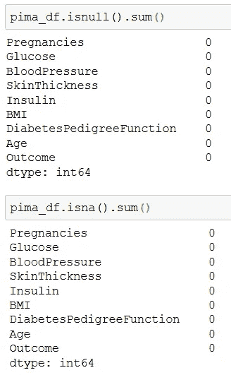

> 作为第一步，我们应该正确地标记丢失的值。

就缺失数据而言，我们最需要密切关注的变量是葡萄糖、血压、皮肤厚度、胰岛素和身体质量指数，所有这些变量在其观测值中都包含 0。

在文献中的快速搜索表明，这些特征不可能具有为零的生理值。最合理的解释是缺失特征的缺失观测值以某种方式被替换为零。

**这种伪装的缺失数据会误导我们以后的分类尝试。**我们将通过将伪装的缺失值明确标记为 NaN 来清理数据。

应该编码为 0 或 1 的响应变量包含在 0 和 1 后面附加了\或}的值。这看起来像是一个错误，类似于在读取或写入 CSV 时引入的错误。我们选择的解决方案是简单地删除字符。

从数据类型来看，预测值存储为浮点型，响应存储为对象型。浮点数据类型对身体质量指数和糖尿病有意义。其余的特征可以存储为整数。

下面的函数清除数据，并用 nan 替换所讨论的五列的零:`Glucose`、`BloodPressure`、`SkinThickness`、`Insulin`和`BMI`。

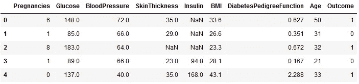

我们已经用 NaN 替换了任何零并指示了缺失的值。

## 探索缺失的值

我们现在可以计算每个特征的缺失值的比例:48.56%的胰岛素、29.58%的皮肤厚度、4.58%的血压、1.43%的身体质量指数和 0.65%的葡萄糖。其余要素没有任何缺失值。

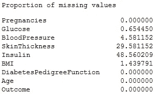

> 第二步，我们可能需要对特征随机缺失(MAR)、完全随机缺失(MCAR)或非随机缺失(MNAR)的假设进行一些统计测试。

通过仔细观察，似乎缺失的皮肤厚度值与缺失的胰岛素值相关。当皮肤厚度缺失时，胰岛素也会缺失。

此外，当血压或身体质量指数缺失时，胰岛素或皮肤厚度值也缺失的概率更高。

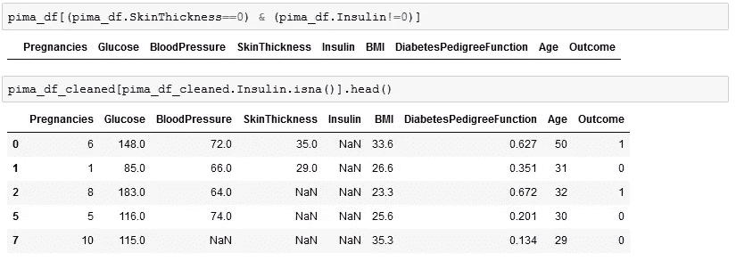

> 第三步，我们探索并选择最合适的技术来处理缺失值。

## 处理缺失数据的策略

我们继续提供一个 Python 函数，其中实现了以下数据插补策略。

**删除策略**删除至少一个特征有缺失值(NaN)的所有观察值。

**平均值策略**用该特性所有可用值的平均值替换任何缺失值(NaN)。

**中值策略**和**最频繁策略**分别用中值或最频繁出现的值替换缺失值。

**基于模型的策略**使用无缺失值的特征来训练 kNN 回归模型。

我们选择 kNN 是为了捕捉可用数据的可变性。如果我们使用线性回归模型来预测沿回归线的缺失值，就不会出现这种情况。

在这个基于模型的策略中，我们区分了两种模式。以下特征在**基本模式**中被用作预测因素:年龄、糖尿病、糖尿病功能、结果、怀孕。拟合模型用于预测剩余特征中的缺失值。

在**渐进模式**中，在我们填充给定特征中的缺失值后，我们将该特征视为估算下一个特征缺失值的预测值。

估算数据可以在 0 和 1 之间任意标准化。这可能会提高使用正则化逻辑回归的分类性能。

因为特征在不同的尺度上(例如，年龄对胰岛素)并且它们的值范围不同(例如，血统对胰岛素)，如果特征没有被缩放，收缩惩罚可能被错误地计算。

糖尿病发作？Myriam 在 [Pixabay](https://pixabay.com/photos/insulin-syringe-insulin-diabetes-1972788/) 拍摄的照片

# 缺失数据的逻辑回归

在本节中，我们在应用特定的插补策略后，对清理后的数据拟合了一个逻辑回归模型:

*   删除缺少值的行，
*   删除缺少值的列，
*   用列平均值输入缺失值，
*   用基于模型的预测来输入缺失值，
*   使用基于渐进模型的预测输入缺失值。

> 值得注意的是，插补对估计参数值及其准确性产生了重大影响。

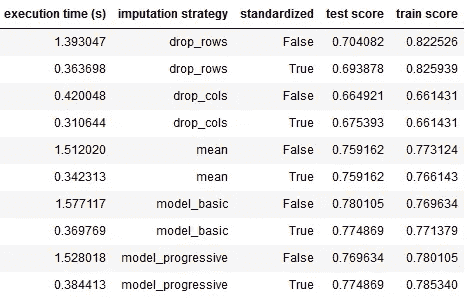

## 丢弃策略对准确性的影响

通过删除缺少值的行或列，我们丢失了可能对响应变量有重大影响的有价值的信息。

结果是在训练数据集中过度拟合，并且在测试数据集中预测性能更差。

## 均值/模型插补对精确度的影响

缺失数据的平均插补减少了过度拟合，并改善了对测试数据集的预测。

在输入缺失数据时使用基于模型的分类是最好的。这是因为当使用 k-最近邻作为缺失数据的替换时，数据的原始方差更接近。

## 插补对训练时间的影响

通过测量插补、逻辑回归模型拟合和预测的累计执行时间来评估计算复杂性。

当预测器未被标准化时，基于模型的方法的执行时间是最高的。计算到最近邻居的欧几里德距离比计算数据的平均值需要更多的执行时间。

当处理非常大量的观察值时，我们可能会以较低的分类精度为代价选择均值插补。

## 插补对推理的影响

我们检索由我们的正则化逻辑回归模型估计的系数如下。

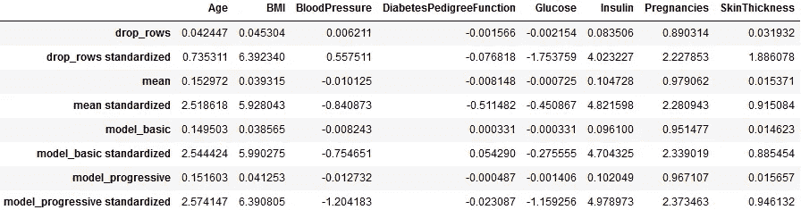

表中的系数显示了每个预测因子如何影响糖尿病发生的可能性。

正值表示有利于糖尿病发病的因素。

接近零的值表明相关的预测因子对糖尿病的发病没有多大作用。

该表显示了对缺失数据应用插补策略后的推断系数。还提供了通过逻辑回归拟合标准化预测值(插补后)获得的系数。

*   总体标准化系数较大。
*   当删除行/列时，与通过平均值或模型估算缺失数据时的值相比，系数估计值会发生显著变化。
*   胰岛素的系数在不同的插补方法之间变化不大。在所有预测因素中，胰岛素的缺失值百分比最高。这表明胰岛素可能完全随机缺失(MCAR)。

下表比较了均值插补和基于模型的插补对删除缺失数据行后获得的系数幅值的影响。

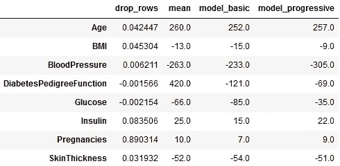

第一列显示了基于数据训练的逻辑模型的系数估计，其中删除了具有缺失值的行。

其他列显示了与丢弃策略相比，输入缺失值后系数值的百分比变化。

年龄、血压和谱系功能在删除行和基于均值/模型的插补之间具有最高的百分比变化。

放弃策略通常不是最佳方式。

苏菲·玛德琳着色

# 结论

在本文中，我们展示了如何清理数据和处理缺失值将意味着机器学习算法的更好性能。

区分 MCAR、MAR 和 MNAR 类型的缺失数据至关重要，因为它们会显著影响推断和预测。

尽管没有处理缺失数据的完美方法，但是您应该知道不同的可用方法。

> 弥补缺失的数据并利用从中获得的见解是数据科学家工作中最耗时的部分之一。

一个从不够多样化的训练集中学习的自动驾驶汽车模型是一个有趣的例子。如果汽车不确定路上哪里有行人，我们会希望它让司机来控制。**我在下面的文章中讨论了由缺失数据引起的深度学习的不确定性。**

 [## 如何度量深度学习中的不确定性

### 认知和任意不确定性的贝叶斯估计实践教程。走向人工智能的社会接受。

towardsdatascience.com](https://towardsdatascience.com/my-deep-learning-model-says-sorry-i-dont-know-the-answer-that-s-absolutely-ok-50ffa562cb0b) 

感谢阅读。注意安全。