# 处理熊猫中缺失的值

> 原文：<https://pub.towardsai.net/handling-missing-values-in-pandas-f87cec928937?source=collection_archive---------0----------------------->

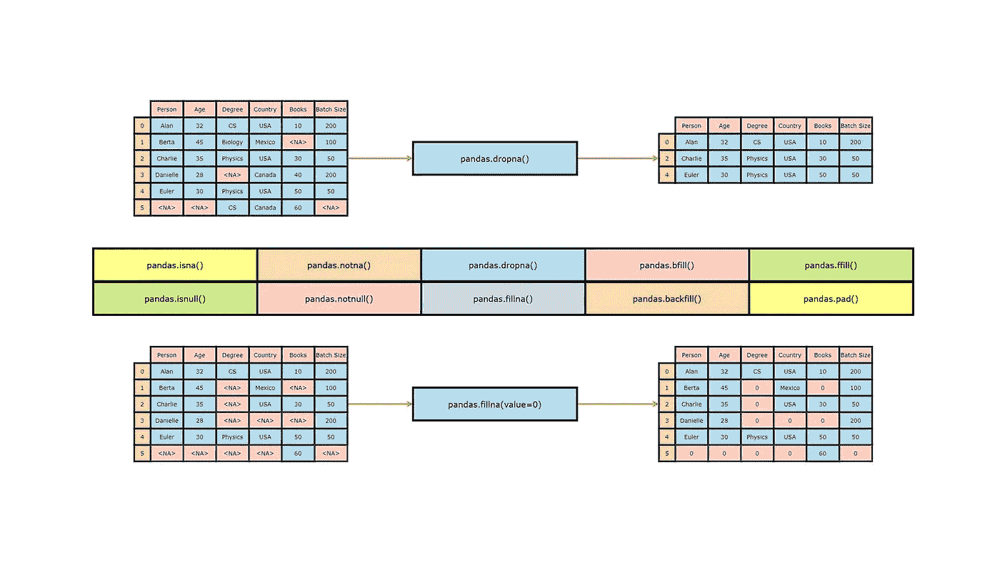

图片由作者| **除非另有说明，所有图片均来自作者。**

## [数据科学](https://towardsai.net/p/category/data-science)，[编辑](https://towardsai.net/p/category/editorial)，[编程](https://towardsai.net/p/category/programming)

## 一个关于如何检测和处理熊猫丢失数据的实践视频教程

**作者:** [普拉蒂克·舒克拉](https://www.linkedin.com/in/pratik-shukla28/)，[罗伯特·伊里翁多](https://mktg.best/vguzs)

 [## 加入我们吧↓ |面向人工智能成员|数据驱动的社区

### 加入人工智能，成为会员，你将不仅支持人工智能，但你将有机会…

members.towardsai.net](https://members.towardsai.net/) 

任何数据科学项目中最关键和最耗时的部分是数据清理和准备。幸运的是，有许多强大的工具可以帮助我们加快这个过程。

pandas 库是 python 中广泛使用的数据分析库之一。在使用我们的模型对我们的数据执行数据分析之前，找到任何可能影响我们输出的缺失值是至关重要的。

**当接受调查的用户不共享他们的数据时，就会出现数据缺失**。本教程将深入探讨一些方法，这些方法将帮助我们在 pandas 的帮助下识别和删除这些丢失的数据。

本教程的配套资料可以在我们的 [**资源部分**](#62a4) 中找到。

## 目录:

1.  [pd.isna()](#bc93)
2.  [pd.notna()](#f659)
3.  [pd.isnull()](#092d)
4.  [pd.notnull()](#092d)
5.  [pd.dropna()](#613c)
6.  [pd.fillna()](#65aa)
7.  [pd.bfill()](#329d)
8.  [pd .回填()](#7cda)
9.  [pd.ffill()](#1352)
10.  [pd.pad()](#4ebe)
11.  [结束语](#b758)
12.  [资源](#62a4)
13.  [参考文献](#62a4)

# pd.isna():

我们使用 pandas 库的`pd.isna()`函数来检测一个类似数组的对象的缺失值。我们先来看看`pd.isna()`的语法，用例子来理解。

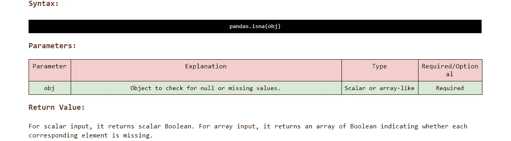

pandas.isna()函数的语法和参数说明

在我们继续理解`pd.isna()`函数如何工作之前，让我们先导入一些必需的库。

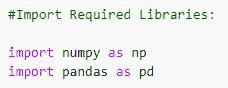

导入所需的库

## A.示例 1:

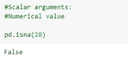

标量参数(数字)

## B.示例 2:

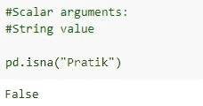

标量参数(字符串)

## C.示例 3:

请注意，空字符串不被视为 NA 值。这就是为什么`pd.isna(“ ”)`的输出会是假的。

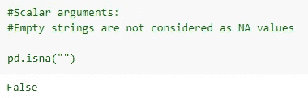

空字符串

## D.示例 4:

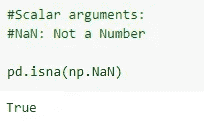

NaN —不是一个数字

## E.示例— 5:

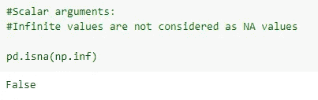

inf —无穷大

## F.示例— 6:

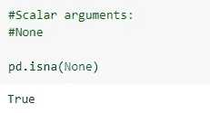

没有人

## G.示例— 7:

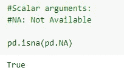

不适用—不可用

## H.示例— 8:

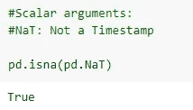

NaT —不是时间戳

## n 维数组:

## 一.示例— 9:

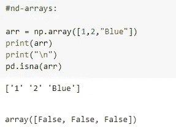

一维数组

## J.示例— 10:

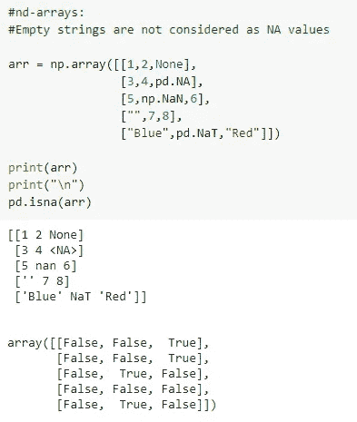

二维数组

## 索引值:

## K.示例— 11:

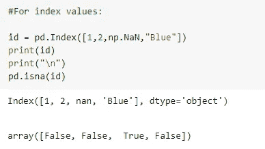

索引值(一维)

## 长度示例— 11:

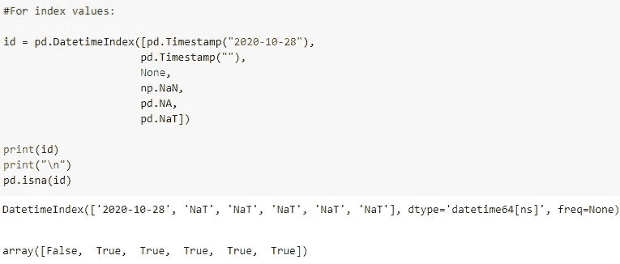

时间戳值(一维)

## 熊猫系列:

## 米（meter 的缩写））示例— 13:

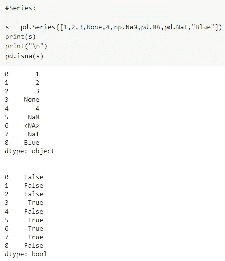

熊猫系列

## 熊猫数据帧:

## 名词（noun 的缩写）示例— 14:

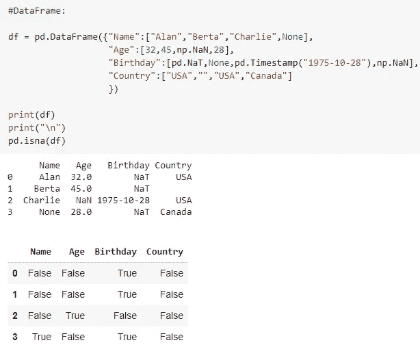

熊猫数据框

# pd.notna():

pandas 库的`pd.notna()`函数用于检测一个类似数组的对象的非缺失值或有效值。请注意`pd.notna()`是熊猫库`pd.isna()`函数的布尔逆。我们先来看看`pd.isna()`的语法，用例子来理解。

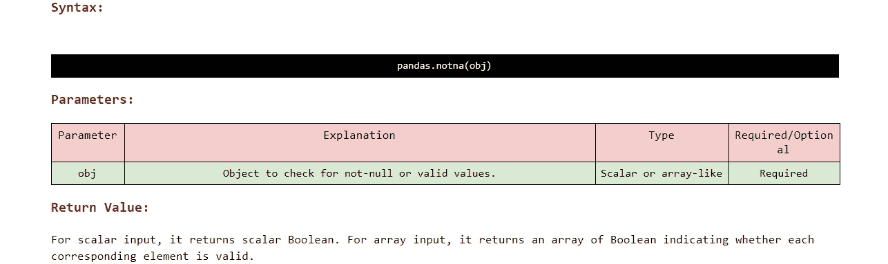

pandas.notna()函数的语法和参数说明

在我们继续理解`pd.isna()`函数如何工作之前，让我们首先导入一些必需的库。

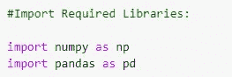

导入所需的库

## A.示例 1:

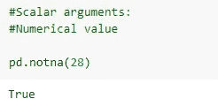

标量参数(数字)

## B.示例 2:

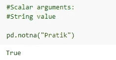

标量参数(字符串)

## C.示例 3:

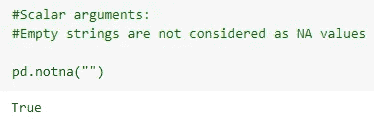

空字符串

## D.示例 4:

inf —无穷大

## E.示例— 5:

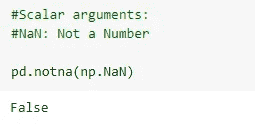

NaN —不是一个数字

## F.示例— 6:

没有人

## G.示例— 7:

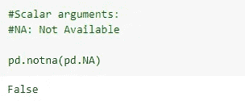

不适用—不可用

## H.示例— 8:

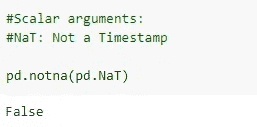

NaT —不是时间戳

## 一.示例— 9:

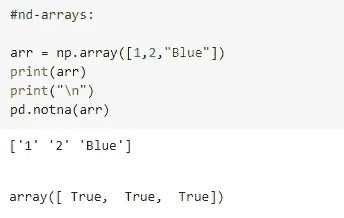

一维数组

## J.示例— 10:

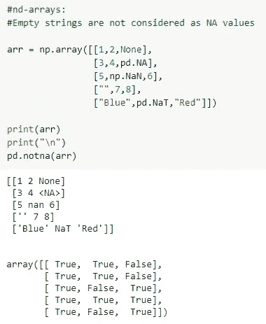

二维数组

## K.示例— 11:

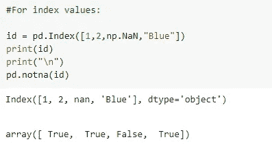

索引值

## 长度示例— 12:

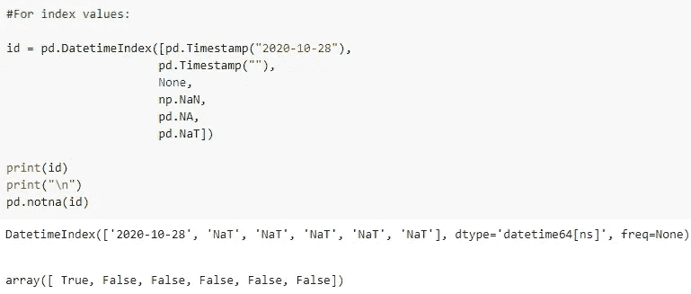

时间戳值

## 米（meter 的缩写））示例— 13:

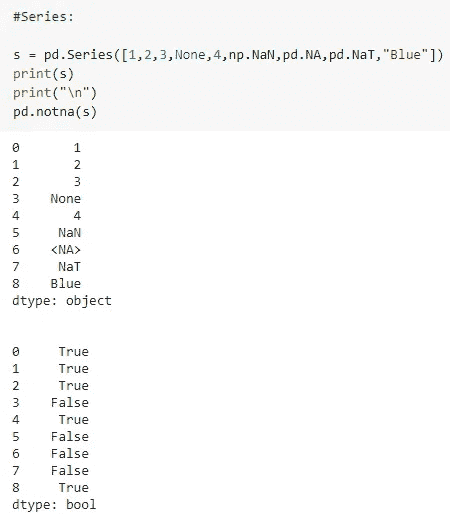

熊猫系列

## 名词（noun 的缩写）示例— 14:

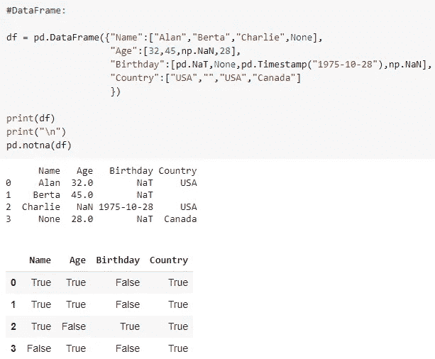

熊猫数据框

# 重要提示:

1.  `pd.isnull()`函数是`pd.isna()`函数的别名。它会给我们完全相同的结果。建议使用`pd.isna()`功能，而不是`pd.isnull()`功能。

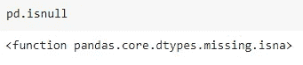

pd.isnull()函数

2.`pd.notnull()`函数是`pdnotna()`函数的别名。它会给我们同样的结果。建议使用`pd.notna()` 功能，而不是`pd.notnull()`功能。

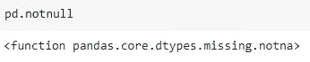

pd.notnull()函数

要复制本教程，请运行 Google Colab 笔记本。

# pd.dropna():

我们使用熊猫图书馆的`pd.dropna()`功能来删除丢失的值。让我们先看看它的语法和参数，以便更好地了解它的功能。

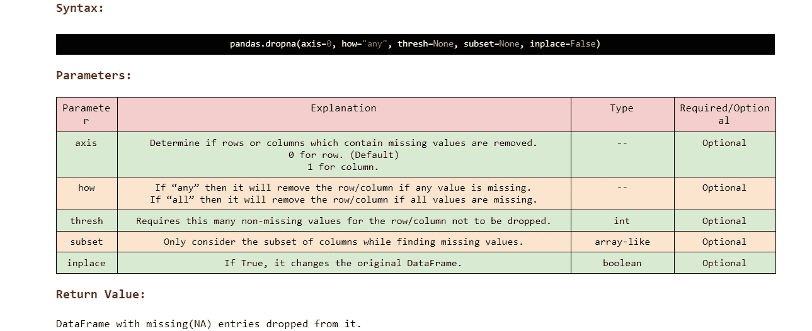

pandas.dropna()函数的语法和参数说明

下面举几个例子来了解一下`pd.dropna()`函数的参数到底是如何影响输出的。

在深入研究`pd.dropna()`函数之前，让我们首先创建一个数据帧。

## A.创建数据框架:

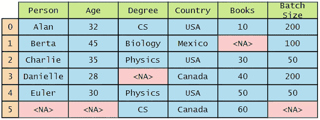

主数据框

## Python 实现:

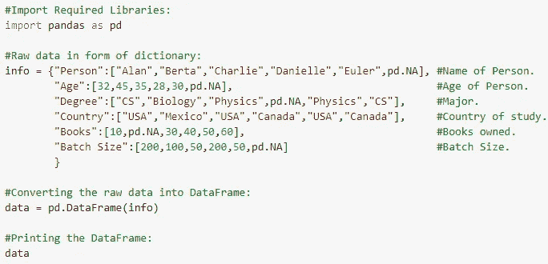

Python 代码

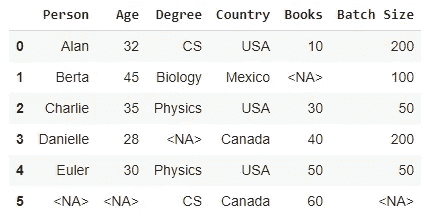

输出

## B.示例 1:

如果我们没有为`pd.dropna()`函数指定任何参数，它将删除所有至少缺少一个元素的行。

## 使用的参数:

> 没有人

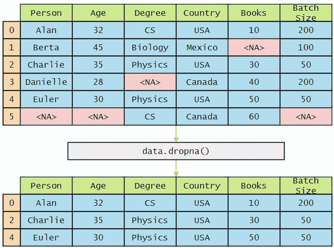

不带任何参数的 pd.dropna()

## Python 实现:

Python 代码

## C.示例 2:

如果我们指定参数`axis=0`，它将删除所有至少缺少一个元素的行。这种删除是默认行为。

## 使用的参数:

> 轴= 0

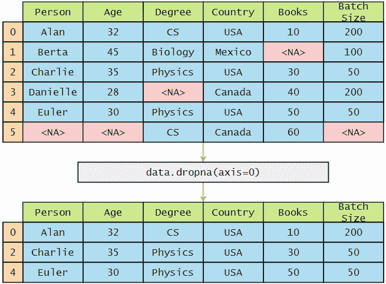

轴=0 的 pd.dropna()

## Python 实现:

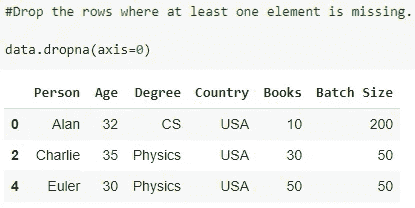

Python 代码

## D.示例 3:

不指定`axis=0`，我们也可以指定`axis="row”`作为参数。它会以同样的方式工作。

## 使用的参数:

> axis = "行"

轴=行的 pd.dropna()

## Python 实现:

Python 代码

## E.示例 4:

如果我们指定参数`axis=1`，它将删除所有至少缺少一个元素的列。

## 使用的参数:

> 轴= 1

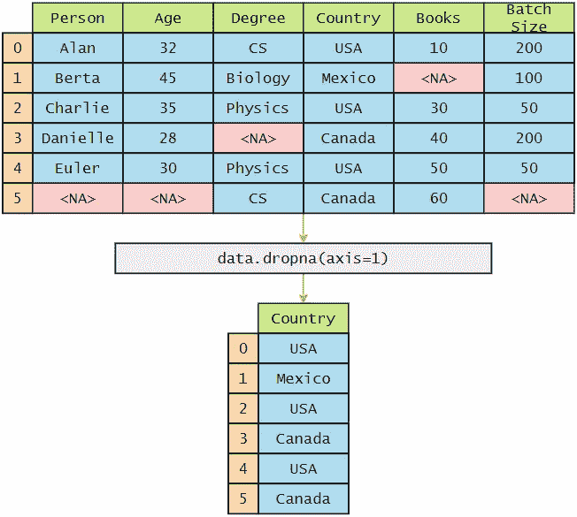

轴=1 的 pd.dropna()

## Python 实现:

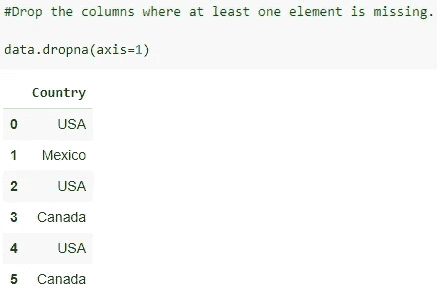

Python 代码

## F.示例— 5:

除了指定`axis=1`，我们还可以指定`axis=“columns”`作为参数。它会以同样的方式工作。

## 使用的参数:

> axis = "列"

带有轴=列的 pd.dropna()

## Python 实现:

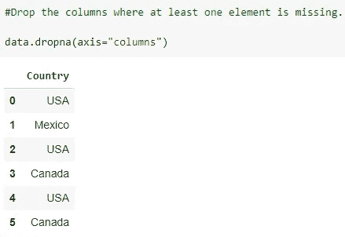

Python 代码

## G.示例— 6:

如果我们将 `how="any”`指定为参数，它将删除至少有一个缺失元素的行。简而言之，如果它有`any`缺失的元素，它将删除这些行。如果我们想在列上执行这个操作，我们必须使用轴参数。

## 使用的参数:

> how = "any "

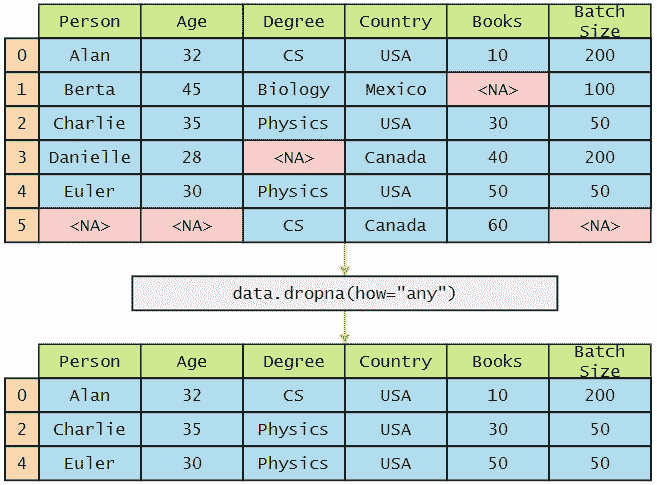

pd.dropna( ) with how="any "

## Python 实现:

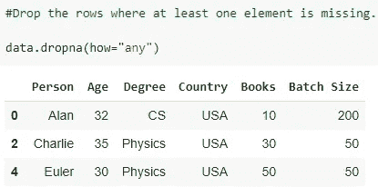

Python 代码

## H.创建数据帧:

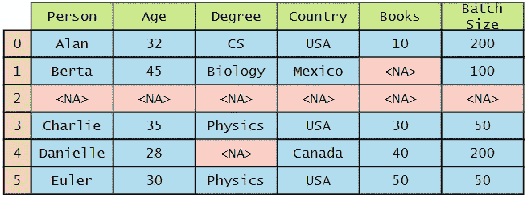

创建新的数据帧

## Python 实现:

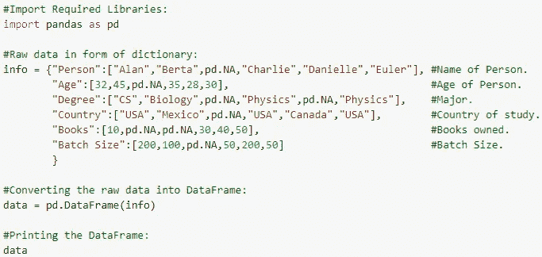

Python 代码

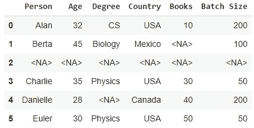

输出

## 一.示例— 7:

如果我们指定 `how="all”`作为参数，它将删除所有元素都丢失的行。简而言之，如果它有`all`个缺失元素，它将删除这些行。如果我们想在列上执行这个操作，我们必须使用轴参数。

## 使用的参数:

> how = "all "

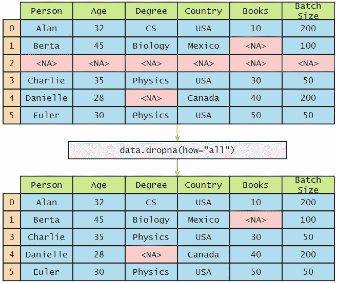

pd.dropna( ) with how="all "

## Python 实现:

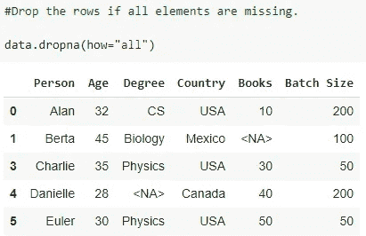

Python 代码

## J.示例— 8:

如果我们指定了`thresh`参数，它将只保留那些至少具有由`thresh`参数指定的数量的非缺失元素的行。在下面的例子中，我们可以看到我们已经指定了`thresh=5`，这意味着它将只保留那些有 5 个非缺失元素的行。

## 使用的参数:

> 阈值= 5

thresh=5 的 pd.dropna()

## Python 实现:

Python 代码

## K.创建数据框架:

创建新的数据帧

## Python 实现:

Python 代码

输出

## 长度示例— 9:

如果我们只想考虑一个列的子集来查找并删除缺失的元素，我们可以使用`subset`参数来指定我们想要在其中查找缺失元素的列名。在下面的例子中，它将只在`“Person”, “Degree”, “Country”`列中查找丢失的值。其他列中缺少的值不会影响最终输出。

## 使用的参数:

> 子集= ["人"，"度"，"国"]

pd.dropna()，子集=["人"，"度"，"国"]

## Python 实现:

Python 代码

## 米（meter 的缩写））创建数据框架:

创建新的数据框架

## Python 实现:

Python 代码

输出

## 名词（noun 的缩写）示例— 10:

如果我们希望改变发生在我们的原始数据帧中，我们必须指定`inplace=True`作为参数。请注意，它不会返回任何内容。执行后，原始数据帧将被`pd.dropna()`函数的结果修改。

## 使用的参数:

> 原地=真

pd.dropna( ) with inplace=True

## Python 实现:

Python 代码

# pd.fillna():

pandas 库的`pd.fillna()`函数用于使用特定的方法填充缺失的值。让我们先看看它的语法和参数，以便更好地理解它。

pandas.fillna()函数的语法和参数说明

让我们举几个例子来理解参数值是如何影响输出的。

在我们深入研究`pd.fillna()`函数之前，让我们首先创建一个数据帧。

## A.创建数据框架:

创建数据框架

## Python 实现:

Python 代码

输出

## B.示例 1:

我们可以使用`value`参数来指定用哪个值来填充缺失的元素。在下面的例子中，我们指定了`value=0`,所以它会用 0 填充所有缺少的元素。

## 使用的参数:

> 值= 0

值=0 的 pd.fillna()

## Python 实现:

Python 代码

输出

## C.示例 2:

我们还可以使用`value`参数指定不同的值来填充不同列中缺少的元素。下面的例子演示了我们如何执行这个操作。

## 使用的参数:

> 值=字典

pd.fillna()和一个值字典

## Python 实现:

Python 代码

输出

## D.示例 3:

为了填充缺失的元素，我们可以使用`method`参数。如果我们指定`method=”ffill”`，它将使用最后一个有效的观察值来填补空白。如果我们不指定轴的值，它将按行执行操作或轴=0。请注意，没有限制传播最后一个有效的观察值来填充间隙。如果有多个连续的缺失元素，它们将由最后一个有效的观察来填充。

## 重要提示:

如果我们指定了`method=”ffill”`和`axis=0`，并且如果第一行中的元素丢失了，它们将永远不会被填充。

## 使用的参数:

> method = "ffill "

data.fillna( ) with method="ffill "

## Python 实现:

Python 代码

输出

## E.示例 4:

如果我们指定`method=”pad”`，它的工作方式与`method=”ffill”`相同。

## 使用的参数:

> method = "pad "

pd.fillna( ) with method="pad "

## Python 实现:

Python 代码

输出

## F.示例— 5:

默认情况下，缺少的元素将按行填充，或者用 axis=0 填充。

## 重要提示:

如果我们指定了`method=”ffill”`和`axis=0`，那么如果第一行中的元素丢失，它们将永远不会被填充。

## 使用的参数:

> method = "ffill "
> 
> 轴= 0

pd.fillna()，method="ffill "且 axis=0

## Python 实现:

Python 代码

输出

## G.示例— 6:

在某些情况下，如果我们想要按列填充缺失的元素，我们可以指定`axis`参数并设置`axis=1`。

## 重要提示:

如果我们指定了`method=”ffill”`和`axis=1`，那么如果第一列中的元素丢失，它们将永远不会被填充。

## 使用的参数:

> method = "ffill "
> 
> 轴= 1

pd.fillna()，method="ffill "且 axis=1

## Python 实现:

Python 代码

输出

## H.示例— 7:

为了填充缺失的元素，我们可以使用`method`参数。如果我们指定`method=”bfill”`，它将使用下一个有效的观察值来填补空白。如果我们不指定轴的值，它将按行执行操作或轴=0。请注意，没有限制传播下一个有效的观察来填充间隙。如果有多个连续的缺失元素，它们将被下一个有效的观察填充。

## 重要提示:

如果我们指定了`method=”bfill”`和`axis=0`，那么如果最后一行中的元素丢失了，它们将永远不会被填充。

## 使用的参数:

> method = "bfill "
> 
> 轴= 0

pd.fillna( ) with method="bfill "

## Python 实现:

Python 代码

输出

## 一.示例— 8:

如果我们指定`method=”backfill”`，它的工作方式与`method=”bfill”`相同。

## 使用的参数:

> method = "回填"

pd.fillna( ) with method= "回填"

## Python 实现:

Python 代码

输出

## J.示例— 9:

默认情况下，缺少的元素将按行填充，或者用 axis=0 填充。

## 重要提示:

如果我们指定了`method=”bfill”`和`axis=0`，那么如果最后一行中的元素丢失了，它们将永远不会被填充。

## 使用的参数:

> method = "bfill "
> 
> 轴= 0

pd.fillna()，method="bfill "且 axis=0

## Python 实现:

Python 代码

输出

## K.示例— 10:

在某些情况下，如果我们想要按列填充缺失的元素，我们可以指定`axis`参数并设置`axis=1`。

## 重要提示:

如果我们指定了`method=”bfill”`和`axis=1`，那么如果最后一列中的元素丢失，它们将永远不会被填充。

## 使用的参数:

> method = "ffill "
> 
> 轴= 1

pd.fillna()，method="bfill "且 axis=1

## Python 实现:

Python 代码

输出

## 长度示例— 11:

如果我们指定`limit`参数，它将限制向前或向后填充方法中要填充的连续缺失值的最大数量。我们可以说，如果连续缺失元素的间隙大于`limit`参数指定的数量，它将仅被部分填充。这里我们使用向前填充方法，轴=0，限制为 1 个元素。

## 使用的参数:

> method = "ffill "
> 
> 轴= 0
> 
> 极限= 1

pd.fillna()，method="ffill "且 axis=0，limit=1

## Python 实现:

Python 代码

输出

## 米（meter 的缩写））示例— 12:

在本例中，我们将使用向前填充方法，轴=1，限制为 1 个元素。

## 使用的参数:

> method = "ffill "
> 
> 轴= 1
> 
> 极限= 1

pd.fillna()，method="ffill "且 axis=1，limit=1

## Python 实现:

Python 代码

输出

## 名词（noun 的缩写）示例— 13:

在本例中，我们将使用反向填充方法，轴=0，限制为 1 个元素。

## 使用的参数:

> method = "bfill "
> 
> 轴= 0
> 
> 极限= 1

pd.fillna()，method="bfill "且 axis=0，limit=1

## Python 实现:

Python 代码

输出

## O.示例— 12:

在本例中，我们将使用反向填充方法，轴=1，限制为 1 个元素。

## 使用的参数:

> method = "bfill "
> 
> 轴= 1
> 
> 极限= 1

pd.fillna()，method="bfill "且 axis=1，limit=1

## Python 实现:

Python 代码

输出

## 页（page 的缩写）创建数据帧:

创建新的数据帧

## Python 实现:

Python 代码

输出

数据类型

## 问题示例— 13:

如果可能的话，我们可以使用`downcast`参数来向下转换数据类型。字符串值 `“infer”`将尝试向下转换为适当的相等类型。比如 float64 到 int64。

## 使用的参数:

> 向下转换=推断

pd.fillna()，值=0，downcast="infer "

## Python 实现:

Python 代码

## R.示例— 14:

如果我们希望改变发生在我们的原始数据帧中，那么我们必须指定`inplace=True`作为参数。请注意，它不会返回任何内容。执行后，原始数据帧将被`pd.dropna()`函数的结果修改。

## 使用的参数:

> 原地=真

pd.fillna()，值=0 且 inplace=True

## Python 实现:

Python 代码

输出

# 警察。DataFrame.bfill():

`pd.DataFrame.bfill()`函数的工作方式与`pd.fillna()`函数使用参数`method=”bfill”.`完全相同

让我们举个例子来理解一下。

## A.创建数据框架:

创建数据框架

## Python 实现:

Python 代码

输出

## B.示例 1:

## 使用的参数:

> 没有人

pd.bfill()

## Python 实现:

Python 代码

输出

# 警察。DataFrame .回填( ):

`pd.DataFrame.backfill()`功能的工作方式与`pd.fillna()`功能使用参数`method=”backfill”.`的工作方式相同

pd 的语法和参数说明。DataFrame .回填( )函数

让我们举个例子来理解它是如何工作的。

## A.创建数据框架:

创建数据框架

## Python 实现:

Python 代码

输出

## B.示例 1:

## 使用的参数:

> 没有人

pd .回填( )

## Python 实现:

Python 代码

输出

# 警察。DataFrame.ffill():

`pd.DataFrame.ffill()`函数的工作方式与`pd.fillna()`函数使用参数`method=”ffill”.`完全相同

pd 的语法和参数说明。DataFrame.ffill()函数

让我们举个例子来更好地理解它。

## A.创建数据框架:

创建数据框架

## Python 实现:

Python 代码

输出

## B.示例 1:

## 使用的参数:

> 没有人

pd.ffill()函数

## Python 实现:

Python 代码

输出

# 警察。DataFrame.pad():

`pd.DataFrame.pad()`函数的工作方式与`pd.fillna()`函数使用参数`method=”pad”.`的工作方式相同

pd 的语法和参数说明。DataFrame.pad()函数

让我们举个例子来更好地理解它。

## A.创建数据框架:

创建数据框架

## Python 实现:

Python 代码

输出

## B.示例 1:

## 使用的参数:

> 没有人

pd.pad()函数

## Python 实现:

Python 代码

输出

## 结束语:

我们希望您喜欢阅读这篇文章，并学到一些关于处理丢失数据的新知识。

给普拉蒂克买杯咖啡！

**免责声明:**本文中表达的观点仅代表作者个人观点，不代表与作者(直接或间接)相关的任何公司的观点。这项工作并不打算成为最终产品，而是当前思想的反映，同时也是讨论和改进的催化剂。

**除非另有说明，所有图片均来自作者。**

经由[发布**走向 AI** 发布](https://towardsai.net/)

## 资源

 [## 熊猫——走向世界/教程

### AI 相关教程。免费访问其中任何一个→https://towardsai.net/editorial-toward sai/教程

github.com](https://github.com/towardsai/tutorials/tree/master/pandas)  [## Google 联合实验室

### 编辑描述

colab.research.google.com](https://colab.research.google.com/drive/13oVoXxD1rGtcy6tuHp4fuwIb4GgtQol-)  [## pd.notna() | Google 联合实验室

### 编辑描述

colab.research.google.com](https://colab.research.google.com/drive/1SNoC76YZRFl56v4eZfetJoztpo4MUP7C?usp=sharing)  [## pd.isnull() | Google 联合实验室

### 编辑描述

colab.research.google.com](https://colab.research.google.com/drive/1DrXxT69xNJKGHpLEeZCdTrX93s8wtvhC?usp=sharing)  [## pd.notnull() | Google 联合实验室

### 编辑描述

colab.research.google.com](https://colab.research.google.com/drive/1INZxS5zMMW6o_yXIDFzxQQzECjY8r2pw?usp=sharing)  [## pd.dropna() | Google 联合实验室

### 编辑描述

colab.research.google.com](https://colab.research.google.com/drive/1XMpkcE2jYYSPp5Nt47_meRiJzCF9houl?usp=sharing)  [## pd.fillna() | Google 联合实验室

### 编辑描述

colab.research.google.com](https://colab.research.google.com/drive/175N50wGQc5tJwY09s1HdjAQdsOteXpcN?usp=sharing)  [## 店铺↓ |走向 AI

### 发布最好的技术、科学和工程|社论→https://towardsai.net/p/editorial |订阅→…

ws.towardsai.net](https://ws.towardsai.net/shop)  [## 加入我们吧↓ |面向人工智能成员|数据驱动的社区

### 加入人工智能，成为会员，你将不仅支持人工智能，但你将有机会…

members.towardsai.net](https://members.towardsai.net/)  [## 赞助商|了解如何成为《走向人工智能》的赞助商

### 无论你是想以一种吸引读者的方式突出你的产品，吸引高度相关的利基受众，还是…

sponsors.towardsai.net](https://sponsors.towardsai.net/) 

## 参考

1.  “熊猫。数据框架.回填-Pandas 1 . 2 . 4 文件”。2021.Pandas.Pydata.Org。[https://pandas.pydata.org/docs/reference/api/pandas.DataFrame.backfill.html](https://pandas.pydata.org/docs/reference/api/pandas.DataFrame.backfill.html)。
2.  “熊猫。data frame . drop na-Pandas 1 . 2 . 4 文档”。2021.Pandas.Pydata.Org。[https://pandas.pydata.org/docs/reference/api/pandas.DataFrame.dropna.html](https://pandas.pydata.org/docs/reference/api/pandas.DataFrame.dropna.html)。
3.  “熊猫。data frame . Pad-Pandas 1 . 2 . 4 文档”。2021.Pandas.Pydata.Org。【https://pandas.pydata.org/docs/reference/api/pandas. DataFrame.pad.html。
4.  “熊猫。Dataframe.Notnull — Pandas 1.2.4 文档”。2021.Pandas.Pydata.Org。【https://pandas.pydata.org/docs/reference/api/pandas. DataFrame.notnull.html。
5.  “熊猫。Dataframe.Notna — Pandas 1.2.4 文档”。2021.Pandas.Pydata.Org。[https://pandas.pydata.org/docs/reference/api/pandas.DataFrame.notna.html](https://pandas.pydata.org/docs/reference/api/pandas.DataFrame.notna.html)。
6.  “熊猫。Dataframe.Isnull — Pandas 1.2.4 文档”。2021.Pandas.Pydata.Org。[https://pandas.pydata.org/docs/reference/api/pandas.DataFrame.isnull.html](https://pandas.pydata.org/docs/reference/api/pandas.DataFrame.isnull.html)。
7.  “熊猫。data frame . Isna-Pandas 1 . 2 . 4 文档”。2021.Pandas.Pydata.Org。[https://pandas.pydata.org/docs/reference/api/pandas.DataFrame.isna.html](https://pandas.pydata.org/docs/reference/api/pandas.DataFrame.isna.html)。
8.  “熊猫。data frame . fill na-Pandas 1 . 2 . 4 文档”。2021.Pandas.Pydata.Org。[https://pandas.pydata.org/docs/reference/api/pandas.DataFrame.fillna.html](https://pandas.pydata.org/docs/reference/api/pandas.DataFrame.fillna.html)。
9.  “熊猫。Dataframe.Ffill — Pandas 1.2.4 文档”。2021.Pandas.Pydata.Org。[https://pandas.pydata.org/docs/reference/api/pandas.DataFrame.ffill.html](https://pandas.pydata.org/docs/reference/api/pandas.DataFrame.ffill.html)。
10.  “熊猫。data frame . drop na-Pandas 1 . 2 . 4 文档”。2021.Pandas.Pydata.Org。[https://pandas.pydata.org/docs/reference/api/pandas.DataFrame.dropna.html](https://pandas.pydata.org/docs/reference/api/pandas.DataFrame.dropna.html)。