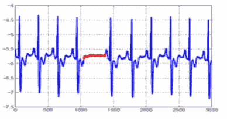
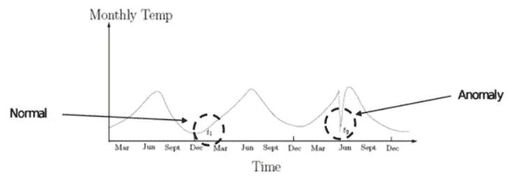
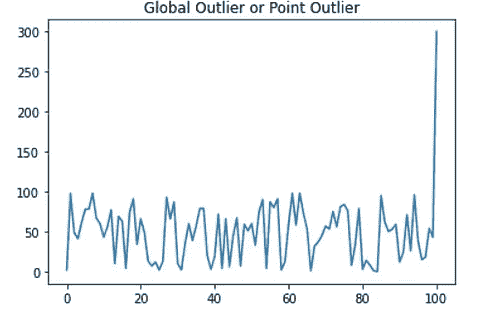
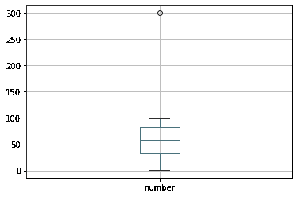
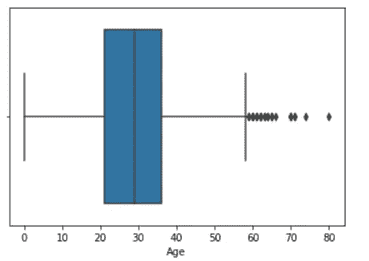
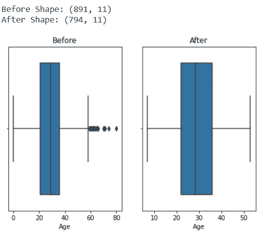
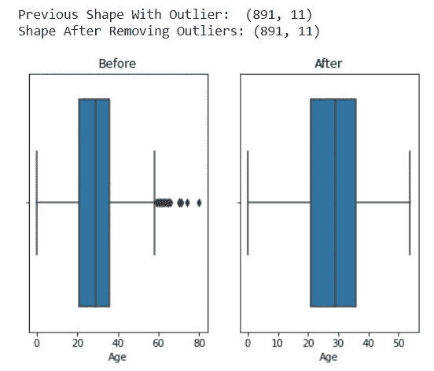
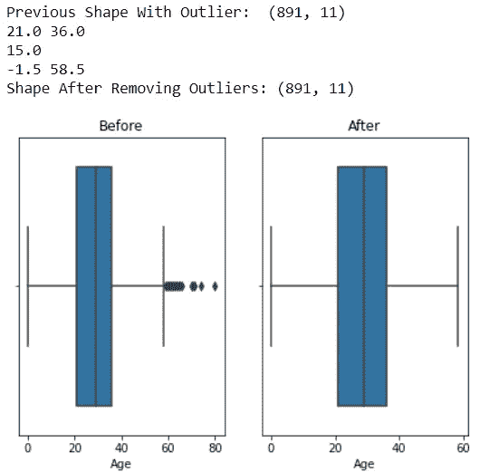

# 机器学习中异常值的处理

> 原文：<https://pub.towardsai.net/handling-outliers-in-machine-learning-f842d8f4c1dc?source=collection_archive---------1----------------------->

## [机器学习](https://towardsai.net/p/category/machine-learning)

## 简单且易于实施的方法


[乔·凯恩](https://unsplash.com/@joeyc?utm_source=medium&utm_medium=referral)在 [Unsplash](https://unsplash.com?utm_source=medium&utm_medium=referral) 上的照片

任何机器学习模型的性能都取决于它被训练的数据，并且它很容易受到改变分布或在输入数据中添加一些离群值的影响。离群值会导致机器学习模型的准确性降低，训练时间增加。在为训练提供数据之前，处理所有异常值变得很重要。

在这篇博客中，我将尝试回答关于离群值的两个最常见的问题。

1.  如何找到他们
2.  如何处理它们

## 什么是离群值？

异常值是与样本的其余部分显著不同的异常数据点。这些点离其他类似的点很远。例如，如果我们正在分析一所学校学生的年龄数据。在数据中，年龄范围在 5-25 岁是常见的，但 50 岁或 100 岁是不常见的，这是一个异常值。它们可能是由于数据收集中的一些错误或输入数据性质的变化而发生的。

## 离群值的类型

有三种异常值。

1.**点或全局异常值:**如果数据点的值远在整个数据集之外，则该数据点被视为全局异常值。

2.**上下文(条件)异常值:**如果一个单独的数据实例在特定的上下文或条件下是异常的，那么它被称为上下文异常值。

3.**集体异常值:**当数据点的集合对于整个数据集来说是异常的时，值本身不是异常的。



集体-上下文-全局离群值

# 发现异常值的方法

现在我们已经了解了什么是异常值以及异常值的不同类型，现在让我们来看看发现异常值的不同方法。

有两种基本方法:

1.  百分位
2.  箱形图

## 百分位

在这种方法中，我们选择一个最小百分位数和最大百分位数。通常，最小百分位数是 5%，最大百分位数是 95%。然后，我们取出百分点范围之外的所有数据点，这意味着那些大于 95%值或小于 5%值的值，并将它们视为异常值。

例如:在一个数据集中，如果 5%是 45，95%是 1000，那么所有低于 45 或大于 1000 的值都被视为异常值。

实际例子:

```
**## Let's First Create a Dummy DataFrame With Outliers**
lst = [random.randint(0,100) for i in range(0,100)]
**## Adding a manual outlier**
global_outlier = [300]
df = pd.DataFrame(lst+global_outlier,columns=['number'])**## Minimum Percentile Value** min_val = df.quantile(0.05)**## Maximum Percentile Value** max_val = df.quantile(0.95)**## Finding All the Outliers** df[(df['number']<min_val[0])| (df['number']>max_val[0])]##############OUTPUT################
    number
23    2
64    1
66    99
84    2
89    99
100   300           

######YOUR OUTPUT MAY BE DIFFERENT BECAUSE WE ARE USING RANDOM MODULE TO GENERATE SAMPLE DATAFRAME####
```

## 箱形图

箱线图是描述数据分布的图形显示。箱线图使用中间值和上下四分位数。

熊猫数据框具有内置的箱线图功能。让我们使用上述方法创建一个数据框，并尝试找出异常值。

```
df.boxplot(column=['number'])
```



300 值作为异常值

让我们使用这两种技术，并尝试在像泰坦尼克号这样的真实数据集中发现异常值。访问我的 Github repo，从[**这里**](https://raw.githubusercontent.com/Abhayparashar31/feature-engineering/main/data/titanic_with_no_nan.csv) 下载没有 nan 值的数据集的清理版本。

**百分位数**

```
**########## DETECTING OUTLIERS USING PERCENTILE ###############**
df = pd.read_csv('data/titanic_with_no_nan.csv')
max_val = df.Age.quantile(0.95)
min_val = df.Age.quantile(0.05)
df2 = df[(df['Age']<min_val) | (df['Age']>max_val)]
print("Number of Outliers Detected in Age:",df2.shape[0])#########OUTPUT#########
Number of Outliers Detected in Age: **86**
```

**方框图**

```
**########## DETECTING OUTLIERS USING BOX PLOT ###############**
df = pd.read_csv('data/titanic_with_no_nan.csv')*### LET'S USE SEABORN BOX PLOTS* import seaborn as sns
sns.boxplot(df['Age'])
```



Titanic 数据集中“**年龄**”列中的异常值

# 处理异常值的不同方法

有两种方法可以处理异常值。

1.  移除所有异常值。
2.  用合适的值替换异常值

## 移除所有异常值

在这种方法中，我们首先找到最小值和最大值分位数，然后通过在进一步处理中不选取它们来简单地删除所有值。

```
import matplotlib.pyplot as plt
import seaborn as sns
import warnings
import pandas as pd
warnings.filterwarnings("ignore")
fig, axes = plt.subplots(1,2)
plt.tight_layout(0.2)**## DataFrame**
df = pd.read_csv('data/titanic_with_no_nan.csv')
print("Before Shape:",df.shape)**## Max and Min Quantile**
max_val = df.Age.quantile(0.95)
min_val = df.Age.quantile(0.05)**## Removing all the outliers**
df2 = df[(df['Age']>min_val) & (df['Age']<max_val)]**## Visulization**
print("After Shape:",df2.shape)
sns.boxplot(df['Age'],orient='v',ax=axes[0])
axes[0].title.set_text("Before")
sns.boxplot(df2['Age'],orient='v',ax=axes[1])
axes[1].title.set_text("After")
plt.show()
```



## 用合适的值替换异常值

**使用分位数法**

在这个方法中，我们首先找到最小和最大分位数。之后，我们找到分位数范围之外的所有值，并相应地用最小或最大分位数值替换它们。

```
import numpy as np
import matplotlib.pyplot as plt
import warnings
warnings.filterwarnings("ignore")
fig, axes = plt.subplots(1,2)
plt.tight_layout(0.2)
df = pd.read_csv('data/titanic_with_no_nan.csv')
print("Previous Shape With Outlier: ",df.shape)
sns.boxplot(df['Age'],orient='v',ax=axes[0])
axes[0].title.set_text("Before")**########### HANDLING OUTLIER ######**
max_val = df.Age.quantile(0.95)
min_val = df.Age.quantile(0.05)df2 = df**####### REPLACING ALL THE Large values with MAX QUANTILE VALUE ####** df2['Age'] = np.where(df2['Age']>max_val,max_val,df2['Age'])print("Shape After Removing Outliers:", df2.shape)sns.boxplot(df2['Age'],orient='v',ax=axes[1])
axes[1].title.set_text("After")
plt.show()
```



## 使用 IQR

IQR 或**四分位数范围**是基于将数据集划分为不同分位数的可变性度量。

分位数分为 Q1、Q2 和 Q3，其中 Q1 是数据集前半部分的中间值。Q2 是中间值，Q3 是数据集后半部分的中间值。

IQR 等于 Q3 减去 Q1。

Q1 = df . column . quantile(0.25)
Q3 = df . column . quantile(0.75)

IQR = Q3-Q1

计算 IQR 后，我们计算下限和上限，然后简单地丢弃所有小于或大于限制的值，并相应地用下限和上限替换它们。

**注意**:它也适用于左偏或右偏的数据

```
df = pd.read_csv('data/titanic_with_no_nan.csv')
import numpy as np
import matplotlib.pyplot as plt
import warnings
warnings.filterwarnings("ignore")
fig, axes = plt.subplots(1,2)
plt.tight_layout(0.2)
print("Previous Shape With Outlier: ",df.shape)
sns.boxplot(df['Age'],orient='v',ax=axes[0])
axes[0].title.set_text("Before")########### HANDLING OUTLIER ######
Q1 = df.Age.quantile(0.25)
Q3 = df.Age.quantile(0.75)
print(Q1,Q3)IQR = Q3-Q1
print(IQR)lower_limit = Q1 - 1.5*IQR
upper_limit = Q3 + 1.5*IQR
print(lower_limit,upper_limit)df2 = df
df2['Age'] = np.where(df2['Age']>upper_limit,upper_limit,df2['Age'])
df2['Age'] = np.where(df2['Age']<lower_limit,lower_limit,df2['Age'])print("Shape After Removing Outliers:", df2.shape)sns.boxplot(df2['Age'],orient='v',ax=axes[1])
axes[1].title.set_text("After")
plt.show()
```



## **奖励提示**

发现异常值并处理它们并不总是那么容易。在这种情况下，我们可以使用对异常值不敏感的不同的机器学习模型。

```
1\. Naivye Bayes Classifier--- Not Sensitive To Outliers
2\. SVM-------- Not Sensitive To Outliers
3\. Decision Tree Regressor or Classifier---- Not Sensitive
4\. Ensemble(RF,XGboost,GB)------------Not Sensitive
5\. KNN--------------------------- Not Sensitive6\. Linear Regression------------- Sensitive
7\. Logistic Regression----------- Sensitive 
8\. Kmeans------------------------ Sensitive
9\. Hierarichal------------------- Sensitive
10\. PCA-------------------------- Sensitive
11\. Neural Networks-------------- Sensitive
```

[***Github &笔记本链接***](https://github.com/Abhayparashar31/feature-engineering/blob/main/Handling%20Outliers.ipynb)

> ***感谢阅读😃，关注我更多相关文章***

[](https://medium.com/towards-artificial-intelligence/9-ways-to-handle-missing-values-in-machine-learning-1bbda345699a) [## 机器学习中处理缺失值的 9 种方法

### 简单但有效

medium.com](https://medium.com/towards-artificial-intelligence/9-ways-to-handle-missing-values-in-machine-learning-1bbda345699a) [](https://medium.com/towards-artificial-intelligence/feature-transformation-and-scaling-techniques-f9645cb538e) [## 特征变换和缩放技术

### 提高机器学习模型性能的 9 种方法

medium.com](https://medium.com/towards-artificial-intelligence/feature-transformation-and-scaling-techniques-f9645cb538e)