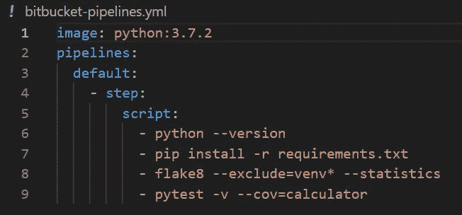
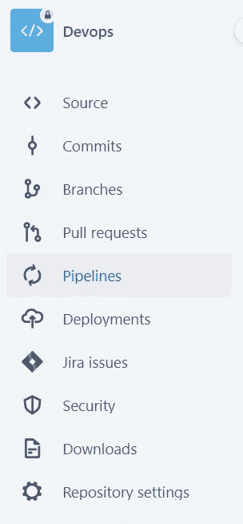
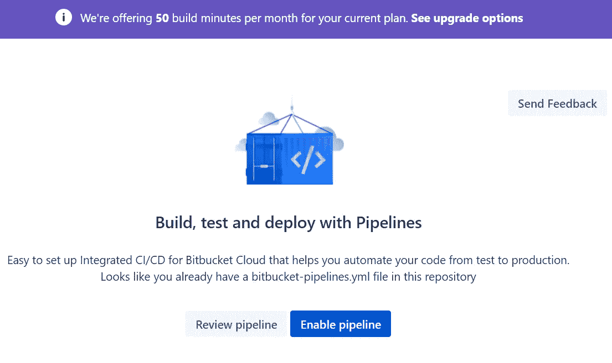
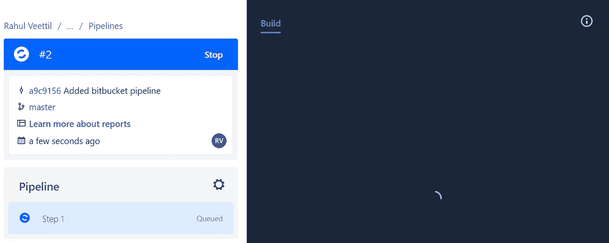
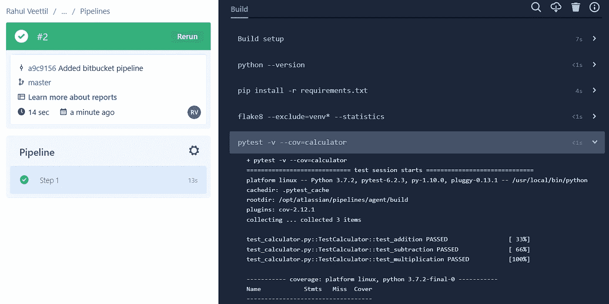
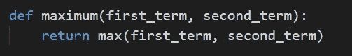
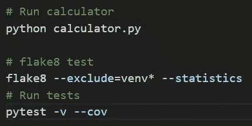
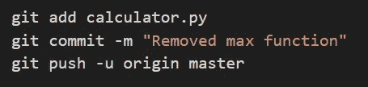
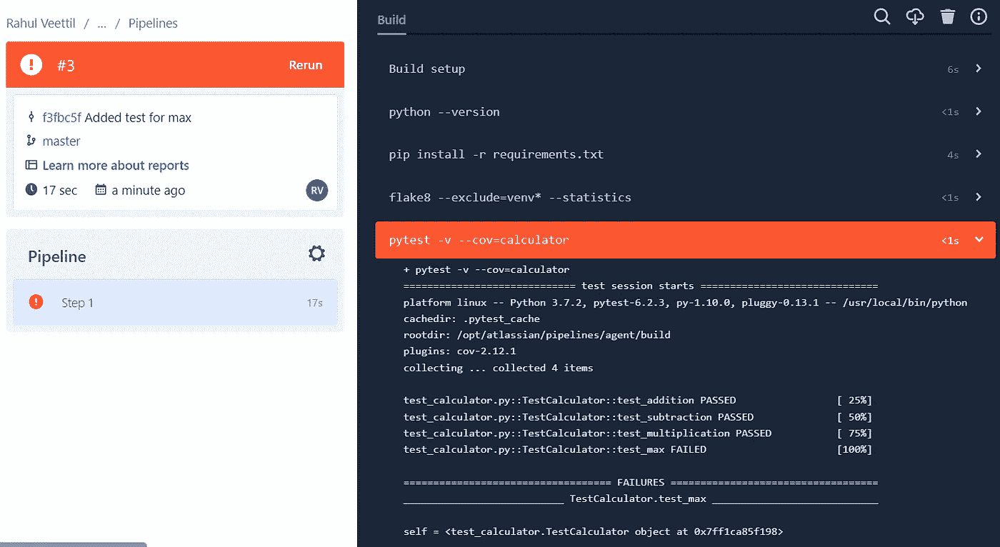
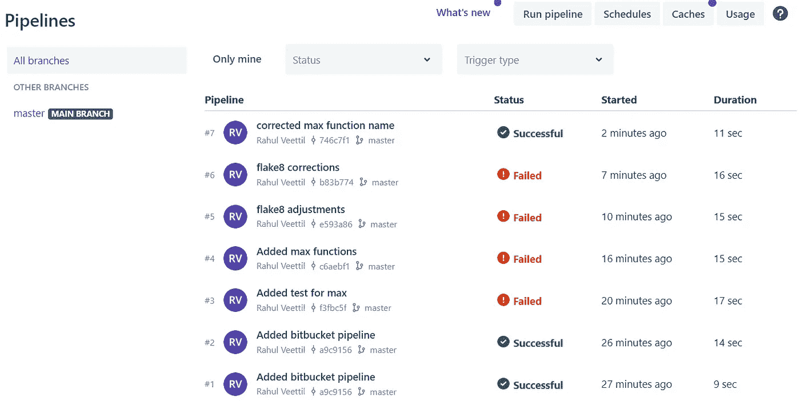

# 面向数据科学家的实用 CI/CD 位桶管道

> 原文：<https://pub.towardsai.net/hands-on-ci-cd-bitbucket-pipeline-for-data-scientists-edda130a0949?source=collection_archive---------0----------------------->

迈出进入 MLOps 的第一步

[昆腾德格拉夫](https://unsplash.com/@quinten149)https://unsplash.com/photos/L4gN0aeaPY4 T2

# 介绍

人工智能技术的快速研究和发展增加了对数据科学家熟悉持续集成(CI)、持续测试和持续交付(CD)的需求。

在本文中，我将使用 bitbucket 管道特性，通过一个玩具示例向您展示如何轻松实现所有这些功能。

CI/CD 是一种 DevOps 软件开发方法，使公司能够执行更快的软件开发周期。这也包括执行单元测试和快速部署他们的服务或产品。

对于数据科学家来说，CI/CD 有助于快速制作模型的原型，测试代码，并提交小的拉请求，这些请求可以很容易地合并到主分支。

当数据科学家将 DevOps 软件开发方法应用于机器学习系统时，我们会得到 **MLOps** 或**机器学习操作**。

然而，数据科学家或机器学习工程师不是像 DevOps 那样将软件投入生产，而是将机器学习模型投入生产。基本思想是通过持续集成和测试代码来自动化机器学习模型的端到端生命周期。

如果你想详细了解 MLOps，Google 有一篇写得很好的[文章](https://cloud.google.com/architecture/mlops-continuous-delivery-and-automation-pipelines-in-machine-learning)详细总结了方法论。

现在，让我们采取一些行动。

## **代码**

整个代码可以从我的 [**Bitbucket**](https://bitbucket.org/valiya/devops/src/master/) 或者 [**Github 库**](https://github.com/vvrahul11/blog_posts_code/tree/main/Devops) 中访问。

# 比特桶流水线

在本文的第 1 部分中，我将使用由 [Real Python](https://realpython.com/python-continuous-integration/#next-steps) 开发的计算器代码，并向您展示如何建立一个 bitbucket 管道并执行持续集成和测试。相反，如果你想学习如何在 **Github + CircleCI** 中使用 CI/CD，你可以阅读[真正的 Python](https://realpython.com/python-continuous-integration/#next-steps) 文章。

## 代码和 Docker 图像

最初的计算器代码具有加法、减法和乘法的功能。

除此之外，我添加了一个“最大值函数”来测试两个数字之间的连续积分(我将在下面详细解释)。

我还添加了一个 YML 配置文件来使 bitbucket 管道工作。下面是 YML 配置文件的截图。

作者形象

YML 文件指示 bitbucket 使用您在配置文件开头指定的映像运行 docker 容器中的所有代码。我们使用的默认 python 图像是 Python 3.7.2。

## 构建管道的步骤

1.  要成功完成本教程，您需要有一个 **bitbucket 帐户**，您可以在[这里](https://bitbucket.org/)创建该帐户。一旦你准备好了库，你就可以从我的 [**Bitbucket**](https://bitbucket.org/valiya/devops/src/master/) 或 [**Github 库**](https://github.com/vvrahul11/blog_posts_code/tree/main/Devops) 中派生/克隆整个代码。
2.  如果您克隆了我的 Bitbucket 存储库，您可以继续执行步骤 4 中描述的步骤。
3.  如果你克隆了我的 **Github 库**，你需要创建一个 **bitbucket 库**并将我克隆的库推到你的库中。如果您是 bitbucket 新手，请不要担心！步骤与 GitHub 非常相似，并且利用了 git。
4.  准备好存储库后，单击存储库页面左侧的 pipelines，如下所示。

作者形象

5.下一步，您需要在分叉的 bitbucket 存储库中启用 pipeline，如下图所示。

作者形象

6.一旦准备好管道，您将看到“添加位桶管道”的状态为成功。

作者形象

7.下一步是开始构建，如下所示。

作者形象

8.一旦构建就绪，您将会看到包含测试覆盖率信息的输出(测试覆盖率用于描述在设置了测试的代码上执行的测试数量)。在我们的例子中，calculator.py 文件中有 4 个函数，即加、减、乘和最大值。我们也为他们写了测试。

作者形象

9.下一步，为了让自己更容易地学习 CI/CD，从 calculaor.py 文件中删除“maximum”函数，并运行下面的命令以确保代码没有任何错误。

作者形象

作者形象

如果出现任何错误，很可能是因为 flake8，它用于 python 样式指南。为了消除任何错误，确保在每个函数前有两行，在每个函数后有一行。

10.接下来，从终端提交并推送代码，将本地机器上的更新同步到 bitbucket 存储库。

作者形象

11.当您在终端中更新和推送您的代码时，您将看到**位桶管道自动触发**导致失败。这是因为，我们为函数 maximum 编写了一个测试，但是我们已经在步骤 8 中删除了函数本身。

作者形象

12.下一步，将函数 maximum 放回原位，您将再次成功运行管道，如下图所示。不要忘记再次提交和推送您的代码。

如您所见，我必须严格遵循 flake8 风格指南，以使管道成功运行。

作者形象

瞧啊。仅此而已。现在您知道了如何建立一个 bitbucket 管道，并执行持续的集成和测试。

在下一篇文章中，我们将通过另一个例子来看看如何进行连续部署。

# 为你运动

创建另一个存储库并在 iris 数据集上构建逻辑回归模型，学习如何编写测试，并在每次将代码推送到存储库时自动触发管道。如果你正在挣扎，开始阅读 bitbucket 管道[原始文档](https://support.atlassian.com/bitbucket-cloud/docs/build-test-and-deploy-with-pipelines/)。

**注意:**为了让教程更容易，我将代码推送到主存储库。然而，最佳实践是创建一个分支并将您的代码推送到该分支，然后与您的主代码合并。试着用你的逻辑回归模型来做这件事。

如果你喜欢我的文章，请继续关注，我计划写一些关于数据科学、问题解决和成功心理学的主题。

如果你想联系，请在 Linkedin 上加我。

# 参考

 [## MLOps:机器学习中的连续交付和自动化管道

### 本文档讨论了实现和自动化持续集成(CI)，持续交付…

cloud.google.com](https://cloud.google.com/architecture/mlops-continuous-delivery-and-automation-pipelines-in-machine-learning)  [## 与 Python 的持续集成:介绍-真正的 Python

### 在本 Python 教程中，您将了解持续集成(CI)背后的核心概念，以及它们为何如此重要…

realpython.com](https://realpython.com/python-continuous-integration/#reader-comments)  [## 使用管道构建、测试和部署|位桶云| Atlassian 支持

### 使用 Bitbucket 管道，基于存储库中的配置文件自动构建、测试或部署代码。

support.atlassian.com](https://support.atlassian.com/bitbucket-cloud/docs/build-test-and-deploy-with-pipelines/)