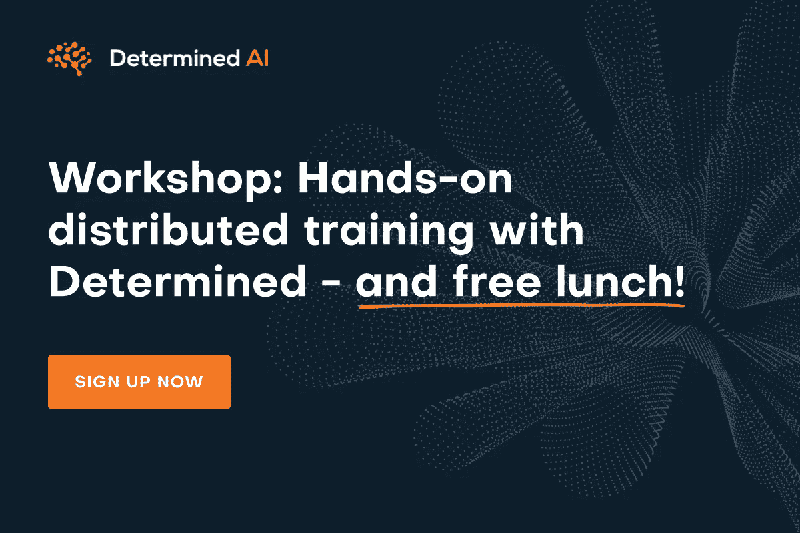
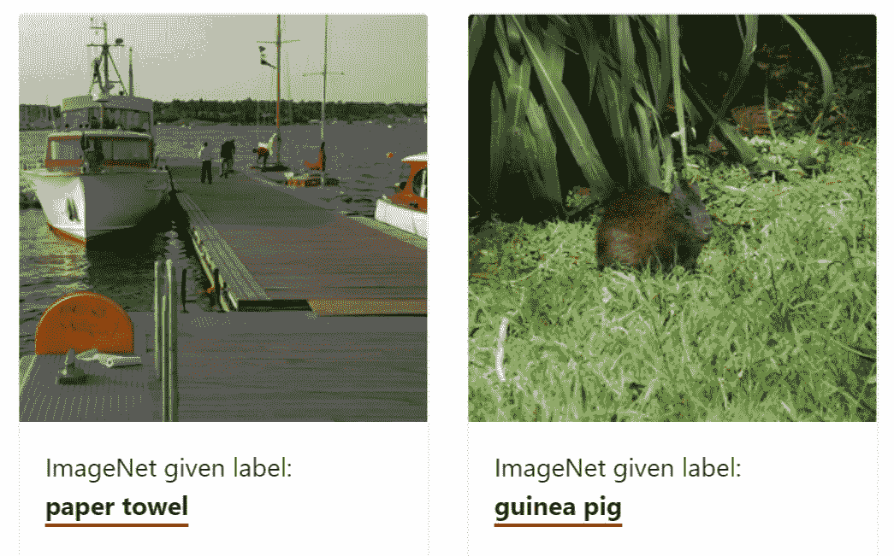
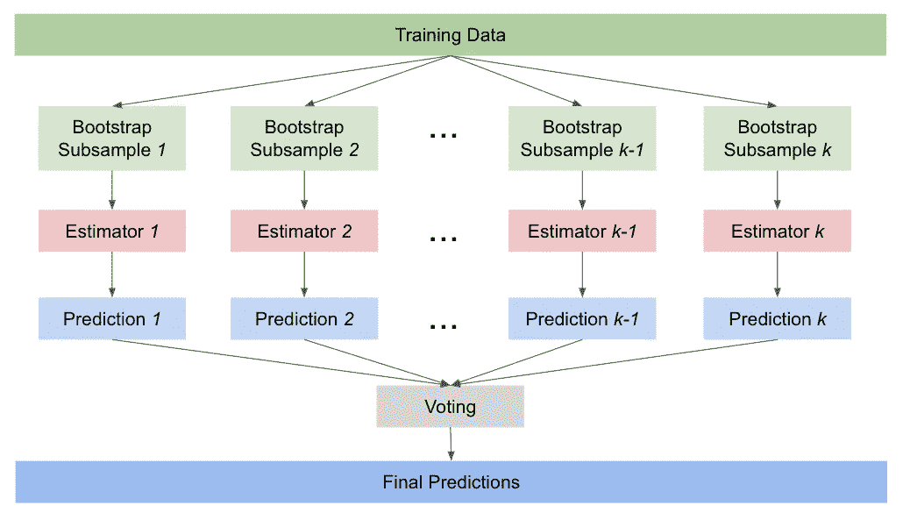
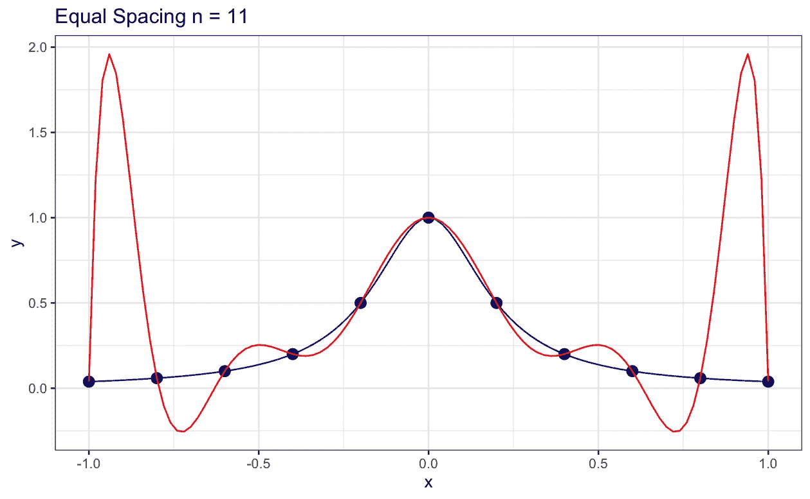
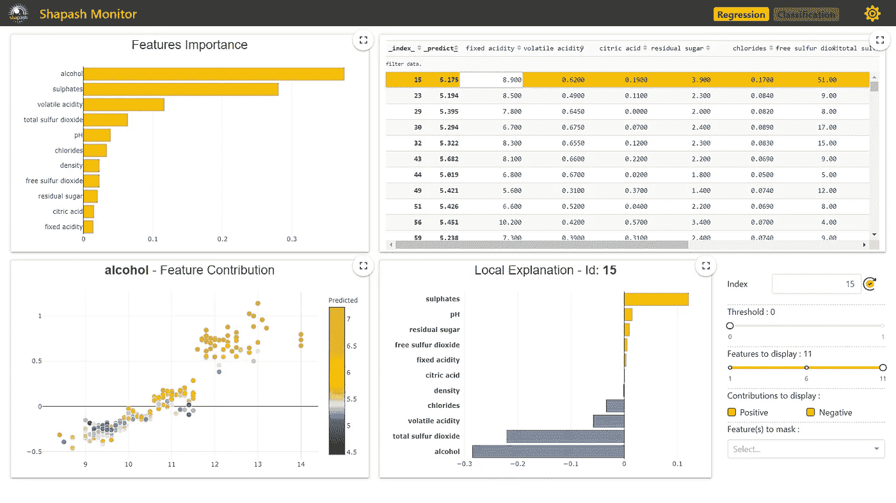
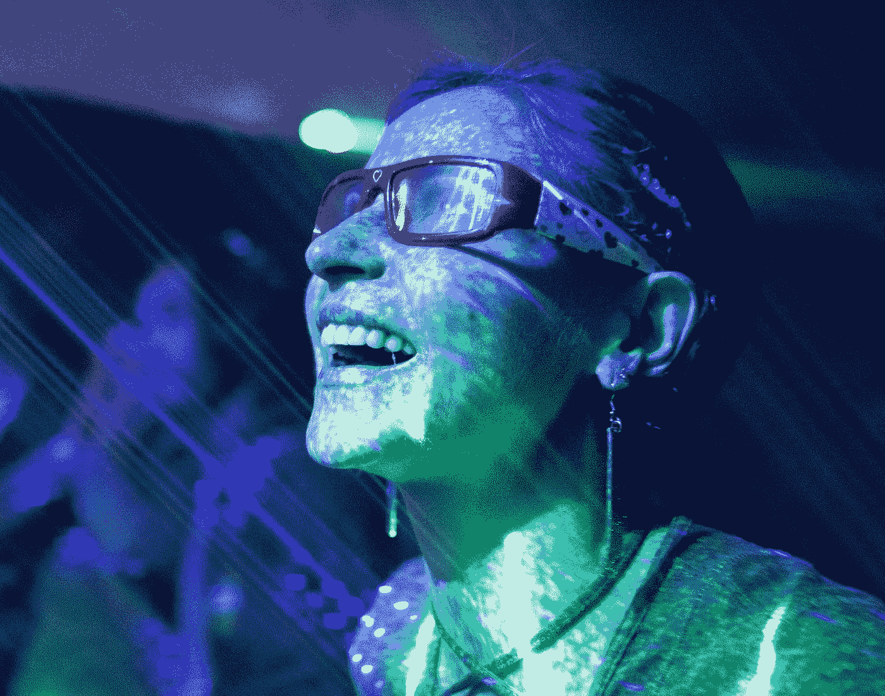

# 实际操作的分布式培训，包含确定的人工智能、突破性算法、编码偏差…等等！

> 原文：<https://pub.towardsai.net/hands-on-distributed-training-with-determined-ai-a-breakthrough-algorithm-coded-bias-and-more-f6a00b92b868?source=collection_archive---------3----------------------->

## [新闻](https://towardsai.net/p/category/news)，[快讯](https://towardsai.net/p/category/newsletter)

## 人工智能新闻、研究和更新，关于[实践分布式培训](https://ws.towardsai.net/mag)的激动人心的聚会，以及我们每月的编辑精选！

***如果你阅读这封邮件有困难，请在*** [***网络浏览器***](https://ws.towardsai.net/a21) ***上查看。***

W 欢迎回来，向着艾家人！距离我们上次发送简讯已经有一段时间了。在本期节目中，我们将为您带来一些我们认为您会喜欢的令人兴奋的美食。首先，请查看由我们在 Determined AI 的朋友组织的关于实践分布式培训的免费会议(包括**免费午餐**😊):

[**坚决 AI**](https://ws.towardsai.net/mag) 正在主持一个午餐学习会，讨论如何在这个过程中加快模型训练并节省 GPU 资源。[**4 月 13 日加入我们的**](https://ws.towardsai.net/mag) 活动，参加关于实用分布式培训的互动实践教程，并享用我们的午餐！

卡耐基梅隆大学的德尔福研究小组与脸书合作，发布了最新的新冠肺炎调查结果。 [**调查分析**](https://mktg.best/qwlkf) 显示疫苗犹豫是持续的，数据科学和统计学教授亚历克斯·莱因哈特讨论了解决它的潜在策略。

计算机视觉有几个潜在的应用。然而，**面部识别是否符合伦理，是否准确？麻省理工学院的研究人员 Joy Buolamwini 解决了这个问题，因为她在刚刚在网飞推出的纪录片**中发现了面部识别如何不能准确地看到深色皮肤的面孔。****

**你期待向 NeurIPS 2021 提交你的论文吗？看看 NeurIPS 项目主席的这个简洁的指南 ，它强调了一个清单，以确保你的论文符合其标准，从透明度，增加整合，潜在的社会影响，伦理审查，等等。**

**如果你对强化学习感兴趣，请查看谷歌人工智能的 [**这个项目**](https://mktg.best/fcpnq) ，它展示了一种新颖的算法如何通过提供成功的例子来教会代理解决任务。它的新颖性在于它不需要像通常的强化学习算法那样手工制作奖励函数，优于以前的学习方法。**

**公平、问责和透明会议(ACM FAccT 2021)正变得非常受欢迎，因为它努力增加多学科研究的多样性、公平性和包容性，特别是在计算机科学、社会科学和人文科学领域。来自 CMU**机器学习的 Nil-Jana Akpinar 的这篇文章展示了 FAccT 2021 接受的一些相关研究论文和教程，让你了解会议在寻找什么。****

********

****[**机器学习**](https://mld.ai/mldcmu) 数据集充满标注错误。麻省理工学院和亚马逊的研究人员在他们的 [**研究论文**](https://arxiv.org/pdf/2103.14749.pdf) 中深入研究了这个问题，强调了 10 个被广泛引用的数据集，包括 ImageNet，包含 3.4%的错误率。如果您想阅读更友好的版本，请查看 ML 测试集 中的 [**标签错误。**](https://mktg.best/a9l9r)****

****如果你还没有查看，我们最近用 Python 在 [**上推出了我们的**](https://gumroad.com/l/descriptive-statistics) **[**书**](https://news.towardsai.net/descriptive-statistics) 。这篇 [**文章**](https://news.towardsai.net/descriptive-statistics-book-sample) 或者这篇 [**PDF**](https://github.com/towardsai/tutorials/blob/master/descriptive-statistics/descriptive-statistics-pdf-book-sample.pdf) 提供了本书前 36 页的样本。请不要忘记，成为**会员，你就可以接触到这部作品、更多的书籍和其他好东西。********

****现在进入月度精选！我们根据读者、粉丝和某篇文章的浏览量来挑选这些文章。我们希望你和我们一样喜欢阅读它们。此外，我们开始做一些新的东西！我们将选出我们表现最好的文章，我们的编辑将选择几篇表现不突出的文章，但由于它们的质量，它们进入了本月的名单。****

****分享是关怀。请随时与您的朋友、同事和熟人分享我们的 [**简讯**](https://ws.towardsai.net/a21) 或 [**订阅链接**](https://ws.towardsai.net/subscribe) 。每月一封电子邮件；随时退订！**如果您对我们如何改进有任何反馈，请随时通过** [**告诉我们**](https://app.joinpalette.com/t/amas/n1PYGbcbPthObD71gGCq) **。******

# ****📚编辑选择每月精选文章↓📚****

********

## ****我们再也不需要担心过度拟合了****

****在深度学习中，我们使用 SGD/Adam 等优化算法来实现我们模型的收敛，这导致找到全局最小值，即训练数据集损失较低的点。但是几种研究，如 [***张***](https://arxiv.org/abs/1611.03530)***等，*** 都表明，许多网络可以很容易地记忆训练数据，并具有过拟合的能力。为了防止这个问题并增加更多的普遍性，谷歌的研究人员发表了一篇名为“清晰度意识最小化”的新论文，该论文提供了 CIFAR10 和其他数据集的最新结果。****

******[**阅读更多**](https://mktg.best/7pj1e)******

************

## ******[由](https://mktg.best/kcib0)[走向人工智能团队](https://medium.com/u/aea8a19ea239?source=post_page-----f6a00b92b868--------------------------------)开发的具有真正人工智能驱动的数据管理平台的最先进数据标签******

******数据标注是机器学习工作流的重要组成部分，尤其是数据预处理，其中输入和输出数据都被标注用于分类，以便为计划的数据处理提供学习基础。我们使用数据标签来识别原始数据，例如图像、视频、文本等中的对象。它的工作原理是贴上一个或多个有意义的、信息丰富的标签来产生上下文，以便模型可以从中学习。******

********[**阅读更多**](https://mktg.best/kcib0)********

************

## ******[用通俗英语解释的合奏方法:Bagging](https://mktg.best/tqbze) 作者 [Claudia Ng](https://medium.com/u/ba2da7b3b9c8?source=post_page-----f6a00b92b868--------------------------------)******

******在本文中，我将介绍一种流行的同质模型集成方法——bagging。同质集成结合了大量的基础估计器或相同算法的弱学习器。同质集合背后的原则是“群体智慧”的想法——许多不同模型的集体预测比单个模型做出的任何一组预测都好。要实现这一点，有三个要求…******

********[**阅读更多**](https://mktg.best/tqbze)********

************

## ******[GAMs 和光滑样条(第一部分)](https://mktg.best/2hewp)由[赛·帕拉德普·佩里](https://medium.com/u/440ad54cbee5?source=post_page-----f6a00b92b868--------------------------------)******

******在当今世界，深度学习用于大多数机器学习应用，可解释性在现实世界的应用中变得至关重要。模型的可解释性对于理解不同变量如何相互作用以生成模型决策至关重要。在这种情况下，我想总结一个强大的可解释模型家族——广义可加模型(GAM)及其构建模块——平滑样条。******

********[**阅读更多**](https://mktg.best/2hewp)********

************

## ******[Amit Chauhan](https://mktg.best/eaaew)[用 Python 编写的 Keras 逐步基本理解神经网络](https://medium.com/u/502d63083812?source=post_page-----f6a00b92b868--------------------------------)******

******神经网络正在全球各行业蓬勃发展。是关于回归、分类、聚类等传统的机器学习算法。当我们得到大量复杂的数据时，准确性、过度拟合以及更多的测试和训练时间等问题就会出现。在本文中，我们将讨论简单的神经网络及其定义与 Keras 的例子。在传统机器学习的基础上使用神经网络，以获得更高的准确性和更大的复杂数据。******

********[**阅读更多**](https://mktg.best/eaaew)********

************

## ******[用 Python 分析诗歌](https://mktg.best/7skna)用[柯蒂斯·汤普森](https://medium.com/u/90e88283b6ce?source=post_page-----f6a00b92b868--------------------------------)******

******写一首诗有多容易？在一页纸上写下几个词，让它们押韵，你就有了你的诗。一些诗人可能刚刚读完这句话就退缩了。也许你已经决定遵循一种众所周知的诗歌形式，如俳句、打油诗和十四行诗——这肯定会让你的文字看起来像一首诗。有时很难知道你的诗是否符合形式。这就是你的编码技能发挥作用的地方！******

********[**阅读更多**](https://mktg.best/7skna)********

************

## ******[为什么 Python 是机器学习项目的完美语言](https://mktg.best/6tysv)作者[Bipin biddapap K](https://medium.com/u/e38767fdb157?source=post_page-----f6a00b92b868--------------------------------)******

******Python 一直做得很好，因为它的稳定性和易于维护的特性，就像一个受欢迎的青少年走过高中走廊一样，python 近年来吸引了许多眼球。自诞生以来，TIOBE Index 已经四次将其命名为年度语言。******

********[**阅读更多**](https://mktg.best/6tysv)********

************

## ******[300 台 NLP 笔记本和自由](https://mktg.best/qcqaw)由 [Quantum Stat](https://medium.com/u/7a94371c6509?source=post_page-----f6a00b92b868--------------------------------)******

******如果这是您第一次听说 SDNR，它是一个方便的存储库，包含 300 多个专注于自然语言处理(NLP)的 Colab 笔记本(还在增加)。Colab 本质上是一个 Jupyter 笔记本，人们可以通过基于网络的内核来使用和共享。这些笔记本最好的部分是，你可以使用免费的 GPU，通常是 K80 或 T4，甚至是 TPU(如果你感到危险)，来微调你的 NLP 模型。如果你在寻找 Colab 的介绍，你可以在这里看这个视频…******

********[**阅读更多**](https://mktg.best/qcqaw)********

************

## ******[用 Shapash](https://mktg.best/8w75o) 建立一个网络应用程序来解释你的 ML 预测******

********Shapash** 让你创建一个漂亮的 web 应用程序，在你准备好模型后几秒钟内解释你的机器学习模型。你不必花时间创建自己的 web 应用程序。这为您和您的团队节省了大量时间。这难道不令人兴奋吗？如果你读到这里，我相信你会对此感兴趣。******

******[**阅读更多**](https://mktg.best/8w75o)******

************

## ******[数据科学家置信区间、t-检验和 z-检验的完整指南](https://mktg.best/uxdfy)作者 [Rashida Nasrin Sucky](https://medium.com/u/8a36b941a136?source=post_page-----f6a00b92b868--------------------------------)******

******置信区间、t-检验和 z-检验是推断统计学中流行和广泛使用的方法。它们之所以如此重要，是因为在任何研究或数据分析中，我们只能用一个样本来推断一个大群体。在这种情况下，这些推断统计方法帮助我们考虑误差，并使用较小的样本为较大的总体推断出更好的估计。******

********[**阅读更多**](https://mktg.best/uxdfy)********

************

## ******[数据科学家必须拥抱数学](https://mktg.best/gu5r4)作者 [Benjamin Obi Tayo 博士](https://medium.com/u/3a025d440e6b?source=post_page-----f6a00b92b868--------------------------------)******

******数据科学是一个跨学科领域，使用科学方法、流程和算法从数据中提取知识和见解。数据科学领域有几个细分领域，如数据挖掘、数据转换、数据可视化、机器学习、深度学习等。作为一门科学学科，数据科学任务可以分为 3 个主要阶段…******

********[**阅读更多**](https://mktg.best/gu5r4)********

************

## ******[微软破冰者如何应对机器学习模型中的冷启动挑战](https://mktg.best/9i0cn)作者[耶稣·罗德里格斯](https://medium.com/u/46674a2c9422?source=post_page-----f6a00b92b868--------------------------------)******

******训练数据的获取和标记仍然是主流采用机器学习解决方案的主要挑战之一。在机器学习研究社区内，已经创建了诸如弱监督学习或一次性学习等几种努力来解决这个问题。微软研究院最近孵化了一个名为 Minimum Data AI 的团队，致力于为机器学习模型提供不同的解决方案，这些模型无需大型训练数据集即可运行。******

********[**阅读更多**](https://mktg.best/9i0cn)********

************

## ******[为什么商业智能对数据科学家有用？](https://mktg.best/gpwc6)作者[尤金妮亚·阿内洛](https://medium.com/u/86fdc517c278?source=post_page-----f6a00b92b868--------------------------------)******

******实际上，我在数据科学实习期间遇到了商业智能。但也不是第一次了。这种情况在之前的 ICT 公司另一类职位的实习中再次发生。大学期间，我从来没有做过关于这个话题的课程，在网上新概念很多，资源不多的情况下，也不太好理解。那么，什么是商业智能呢？为什么我们通常在上班的时候遇到它，而不是在学习的时候？******

********[**阅读更多**](https://mktg.best/gpwc6)********

************

## ******[Fastai 课程第一章 Linux](https://mktg.best/fq3w8) 作者 [David Littlefield](https://medium.com/u/b07fc33d437e?source=post_page-----f6a00b92b868--------------------------------)******

******他的文章是一个扩展的指南，旨在帮助你了解整个章节发生了什么。它提供了本文中使用的术语、命令和代码的定义。它还提供了一个带下划线的文本，该文本链接到文章词汇表中的其他定义。教材的第一章展示了如何用大约 5 行代码构建 5 个不同的模型。它为图像分类、图像分割、文本分类等建立了模型******

********[**阅读更多**](https://mktg.best/fq3w8)********

************

## ******[Magdalena Konkiewicz](https://mktg.best/ds17r)[用 AWS](https://medium.com/u/6ba7ed0ad871?source=post_page-----f6a00b92b868--------------------------------) 构建数据湖******

******每天，大大小小的公司都在收集越来越多的数据。企业通常收集有关公司运营、客户、竞争、产品等的数据。他们需要存储、处理和高效地分析所有这些信息。建立仓库和数据库的传统解决方案根本无法满足公司处理大量数据的需求。******

********[**阅读更多**](https://mktg.best/ds17r)********

****** [## 赞助商|了解如何成为面向人工智能的赞助商

### 无论你是想以一种吸引读者的方式突出你的产品，吸引高度相关的小众受众，还是…

sponsors.towardsai.net](https://sponsors.towardsai.net/)  [## 店铺↓ |走向 AI

### 发布最好的技术、科学和工程|社论→https://towardsai.net/p/editorial |订阅→…

ws.towardsai.net](https://ws.towardsai.net/shop)  [## 加入我们吧↓ |面向人工智能成员|数据驱动的社区

### 向着 AI 加入。通过成为会员，你不仅将支持人工智能，但你将有机会…

members.towardsai.net](https://members.towardsai.net/) 

**🙏感谢您成为** [**订阅者**](https://ws.towardsai.net/subscribe) **与** [**同向艾**](https://towardsai.net/) **！🙏**

*关注我们↓*

*****】|***[***推特***](https://twitter.com/towards_ai?lang=en)***|***[***insta gram***](https://www.instagram.com/towards_ai/)***|***********