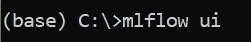
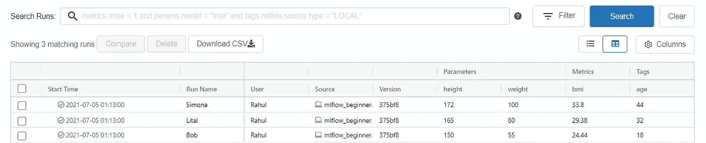
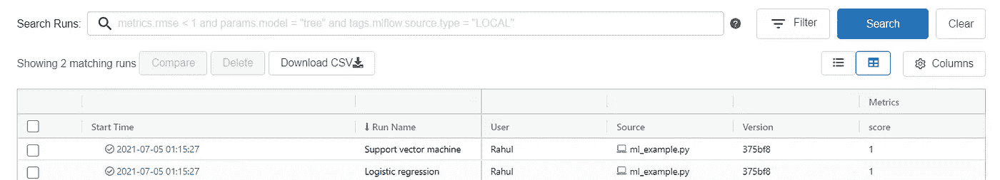

# 以玩具身体质量指数为例实际介绍 MLflow

> 原文：<https://pub.towardsai.net/hands-on-introduction-to-mlflow-with-a-toy-bmi-example-9c6ff11a6f3f?source=collection_archive---------3----------------------->

## 以前所未有的方式跟踪您的 ML 模型


在 [Unsplash](https://unsplash.com/s/photos/trekking?utm_source=unsplash&utm_medium=referral&utm_content=creditCopyText) 上由[香椿果](https://unsplash.com/@toomastartes?utm_source=unsplash&utm_medium=referral&utm_content=creditCopyText)拍摄的照片

# 直觉

想象一下，你是一个陆地导航小组的组长，徒步沿着一条不熟悉的路线行进。

你会做什么来追踪你正在走的路？你可以用石头和棍子来标记某些地标。这可以帮助你的团队记住你到达目的地的路线。这也可以帮助其他陆地导航队找到他们的路。

所有这些与 mlflow 有什么关系，ml flow 实际上是一个机器学习生命周期管理的框架？

# 什么是 MLflow？

我就开门见山吧！就像你在不知道路线和跟踪你遵循的路径的情况下进行陆地导航一样，mlflow 允许你跟踪你在机器学习或深度学习项目的生命周期中执行的所有“盲目”实验。

听起来有趣吗？

让我们进一步了解 Mlflow 提供的不同组件和功能。

MLflow 框架有 3 个组件:

1.  MLflow 跟踪:这允许您跟踪和查询实验中的参数、度量、模型和分数。
2.  MLflow 项目:这个特性允许您通过将实验打包成一个配置文件来定义如何运行实验。
3.  MLflow 模型:这是一种打包模型的格式。

在本文中，我将向您展示两个玩具示例，使用它们您可以立即开始跟踪您的实验，而无需经历任何进一步的学习曲线。

# 密码

所有相关的代码都可以从我的 [Github 库](https://github.com/vvrahul11/blog_posts_code/tree/main/mlflow_beginner)中获得。

# 装置

克隆存储库并转到根目录以安装所需的软件包。

```
pip install requirements.txt
```

## 跟踪身体质量指数计算实验

在第一个玩具示例(非机器学习)中，让我们看看如何跟踪一个实验，以计算给定身高和体重的人的身体质量指数。我们还将提供这些人的姓名和年龄作为输入，我们有兴趣计算他们的身体质量指数。

在下面的代码中，我们有三个人，鲍勃、利塔尔和新美乐股份公司，年龄分别为 18 岁、32 岁和 44 岁。

他们的身高和体重如下:鲍勃(150cm，55kg)，利塔尔(165cm，80kg)，新美乐股份公司(172cm，100kg)。

我们希望计算每个人的身体质量指数，并跟踪与这 3 个人相关的所有信息。

我们将利用 MLflow 提供的 3 个特性来实现这一点。

1.  set_tag:这允许你设置一个标签。
2.  log_param:这允许您跟踪参数。
3.  log_metric:这允许您跟踪指标。

现在我们已经准备好了数据和工具，让我们直接进入下面的代码。

```
import mlflow

def calculate_bmi(height, weight):
    """ Function to calculate the BMI

    Args:
        height ([float]): [height of a person]
        weight ([folat]): [weight of a person]
    """
    return weight / (height/100)**2

if __name__ == "__main__":

    names = ['Bob', 'Lital', 'Simona']
    ages = [18, 32, 44]
    heights = [150, 165, 172]
    weights = [55, 80, 100]

    for i, (height, weight) in enumerate(zip(heights, weights)):   

        with mlflow.start_run(run_name = names[i]):
            print(names[i], ages[i], height, weight,   calculate_bmi(height, weight))

            mlflow.set_tag('age', ages[i])   
            mlflow.log_param('height', height)
            mlflow.log_param('weight', weight)
            mlflow.log_metric("bmi", calculate_bmi(height, weight))
```

在上面的代码中，我们遍历每个人的身高和体重，并使用“set_tag”和“log_param”跟踪相应的信息。

此外，我们使用“calculate_bmi”函数调用计算人的身体质量指数，并使用 log_metric 跟踪身体质量指数输出。

运行 get 完成后，进入包含上述代码示例的存储库，在终端窗口中键入“mlflow ui”。



作者形象

上述命令将产生以下输出:

```
INFO:waitress:Serving on http://localhost:5000
```

如果你点击 ml flow[http://localhost:500](http://localhost:500)0 的服务地址，你将能够看到你为每个人的身体质量指数所做的实验。



作者形象

如您所见，我们跟踪了“跑步名称”、“身高”、“体重”、“bmi”和“标签”。您可以进一步点击每一次运行，了解 MLflow 提供的所有功能。

听起来很酷吗？如果是的话，让我们跳到我们的第二个玩具例子，这是一个真实的机器学习例子。

## 跟踪分类模型实验

在这里，我在玩具数据集上使用逻辑回归和支持向量机建立了两个分类模型。我还将跟踪 run_name、metric 和 model。

我将跳过对下面代码的解释，假设你已经熟悉机器学习，并能理解下面的代码。总之，我们正在构建两个分类模型，并跟踪指标和模型。

```
import numpy as np
from sklearn.linear_model import LogisticRegression
from sklearn import svm

import mlflow
import mlflow.sklearn

def logistic_regression(X, y):
    """ 
    Build a logistic regression model
    """
    lr = LogisticRegression()
    lr.fit(X, y)
    score = lr.score(X, y)
    print("Score: %s" % score)
    return lr, score

def support_vector_machine(X, y):
    """ 
    Build a support vector classification model
    """
    svc = svm.SVC()
    svc.fit(X, y)
    score = svc.score(X, y)
    print("Score: %s" % score)
    return svc, score

if __name__ == "__main__":

    X = np.array([10, 20, 200, 250, 300, 30]).reshape(-1, 1)
    y = np.array([0, 0, 1, 1, 1, 0])

    lr_model, lr_score = logistic_regression(X, y)    
    svc_model, svc_score = support_vector_machine(X, y)

    models = [lr_model, svc_model]
    scores = [lr_score, svc_score]
    model_names = ["Logistic regression", "Support vector machine"]

    for i, (model, score) in enumerate(zip(models, scores)):   
        with mlflow.start_run(run_name = model_names[i]):
            mlflow.log_metric("score", score)
            mlflow.sklearn.log_model(model, "model")
            print("Model saved in run %s" % mlflow.active_run().info.run_uuid)
```

上述跟踪的结果可以通过访问 [http://localhost:5000](http://localhost:5000) 获得。



作者形象

你可以通过浏览他们的文档[这里](https://mlflow.org/docs/latest/index.html)来探索 MLflow 所有可用的特性。

如果你喜欢我的文章，请继续关注，我计划写一些关于数据科学、问题解决和成功心理学的主题。

如果你想联系，请在 Linkedin 上加我。

# 参考

[https://mlflow.org/](https://mlflow.org/)