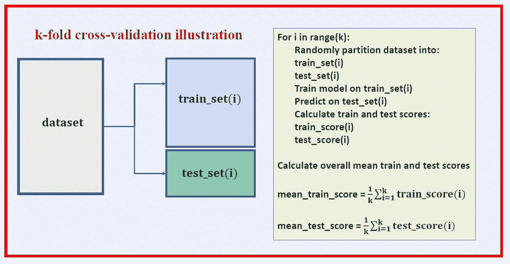
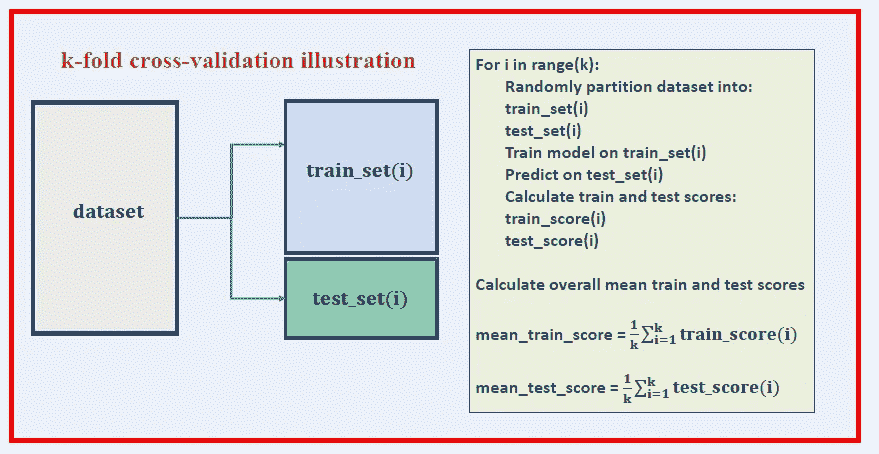
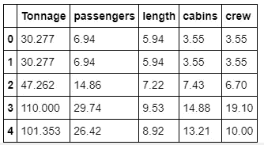

# 用于机器学习模型评估的实践 k-fold 交叉验证—游轮数据集

> 原文：<https://pub.towardsai.net/hands-on-k-fold-cross-validation-for-machine-learning-model-evaluation-cruise-ship-dataset-27390d58776d?source=collection_archive---------0----------------------->

## 使用对 AI 的交叉验证来评估 ML 模型的性能|



在上一篇文章中( [**使用协方差矩阵图进行特征选择和降维**](https://medium.com/towards-artificial-intelligence/feature-selection-and-dimensionality-reduction-using-covariance-matrix-plot-b4c7498abd07) )，我们已经展示了协方差矩阵图可以用于特征选择和降维。

使用游轮数据集[**cruise _ ship _ info . CSV**](https://github.com/bot13956/ML_Model_for_Predicting_Ships_Crew_Size)**，**我们发现，在 6 个预测特征[' **年龄**'、**吨位**'、**乘客**'、**长度**'、**舱室**、**乘客密度** ]中，如果我们假设重要特征具有相关系数 那么目标变量“**乘员**”与 4 个预测变量:“**吨位**”、“**乘客**”、“**长度**、“**车厢**”强相关。 因此，我们能够将特征空间的维数从 6 降低到 4。

现在，假设我们想在新的特征空间上建立一个模型来预测船员变量。我们的模型可以用以下形式表示:


在本文中，我们展示了如何使用一种叫做 k-fold 交叉验证的方法来训练、测试和评估我们的模型。

# 什么是 k 倍交叉验证？

交叉验证是一种跨数据集的随机样本评估机器学习模型性能的方法。这确保了数据集中的任何偏差都被捕获。交叉验证可以帮助我们获得模型泛化误差的可靠估计值，即模型对未知数据的表现。

在 k-fold 交叉验证中，数据集被随机划分为训练集和测试集。该模型在训练集上被训练，并在测试集上被评估。该过程重复 k 次。然后，通过对 k 倍进行平均来计算平均训练和测试分数。

以下是 k 倍交叉验证伪代码:



**k 倍交叉验证伪代码。**

# 实现 k 重交叉验证

## 1.导入必要的库

```
import numpy as np
import pandas as pd
import matplotlib.pyplot as plt
import seaborn as sns
```

## 2.读取数据集并选择重要特征

```
df=pd.read_csv("cruise_ship_info.csv")

cols_selected = ['Tonnage', 'passengers', 'length', 'cabins','crew']

df[cols_selected].head()
```



## **3。使用 k-fold 交叉验证进行模型构建和评估**

```
X = df[cols_selected].iloc[:,0:4].values     
y = df[cols_selected]['crew']**from** **sklearn.preprocessing** **import** StandardScaler
**from** **sklearn.decomposition** **import** PCA
**from** **sklearn.linear_model** **import** LinearRegression
**from** **sklearn.pipeline** **import** Pipeline**from** **sklearn.model_selection** **import** train_test_split
**from** **sklearn.metrics** **import** r2_score sc_y = StandardScaler()
sc_x = StandardScaler()
y_std = sc_y.fit_transform(y_train[:, np.newaxis]).flatten()train_score = [] 
test_score  = []**for** i **in** range(10):
    X_train, X_test, y_train, y_test = train_test_split( X, y, test_size=0.4, random_state=i)
    y_train_std = sc_y.fit_transform(y_train[:, np.newaxis]).flatten()

    pipe_lr = Pipeline([('scl', StandardScaler()),
                        ('pca', PCA(n_components=4)),
                        ('slr', LinearRegression())]) pipe_lr.fit(X_train, y_train_std) y_train_pred_std = pipe_lr.predict(X_train)
    y_test_pred_std = pipe_lr.predict(X_test) y_train_pred = sc_y.inverse_transform(y_train_pred_std)
    y_test_pred = sc_y.inverse_transform(y_test_pred_std) train_score = np.append(train_score, r2_score(y_train, y_train_pred))
    test_score = np.append(test_score, r2_score(y_test, y_test_pred))
```

## 4.模型训练、测试和评估的输出


总之，我们已经展示了如何使用交叉评估来评估机器学习模型的性能。交叉验证计算的结果可以很好地估计模型在部署到生产中并根据真实的未知数据进行测试时的准确性。因此，交叉验证是一种非常强大的技术，可以帮助我们获得模型泛化误差的可靠估计，即模型对未知数据的表现如何。

# 参考

1.  [在具有高度相关特征的数据集上训练机器学习模型](https://medium.com/towards-artificial-intelligence/training-a-machine-learning-model-on-a-dataset-with-highly-correlated-features-debddf5b2e34)。
2.  [使用协方差矩阵图进行特征选择和降维](https://medium.com/towards-artificial-intelligence/feature-selection-and-dimensionality-reduction-using-covariance-matrix-plot-b4c7498abd07)。
3.  拉什卡、塞巴斯蒂安和瓦伊德·米尔贾利利**。** *Python 机器学习，第二版*。Packt 出版公司，2017 年。
4.  Benjamin O. Tayo，*预测船只船员规模的机器学习模型*，[https://github . com/bot 13956/ML _ Model _ for _ Predicting _ Ships _ Crew _ Size](https://github.com/bot13956/ML_Model_for_Predicting_Ships_Crew_Size)。