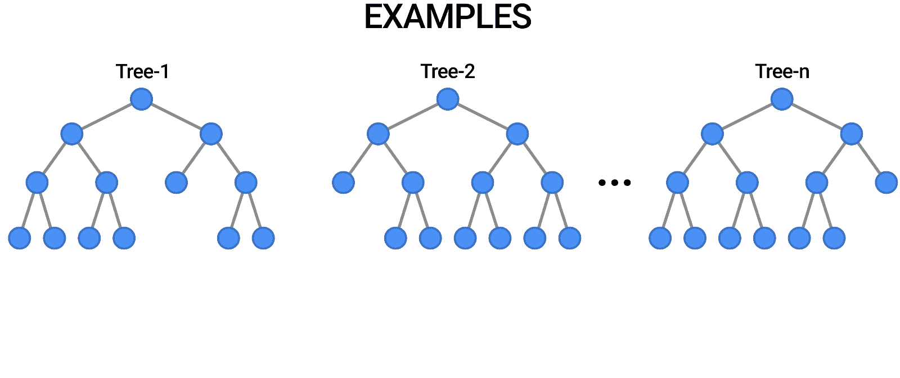
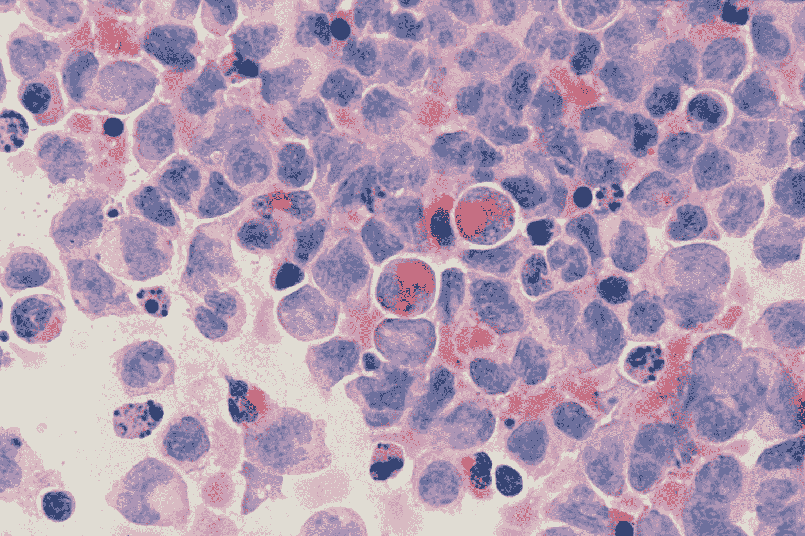
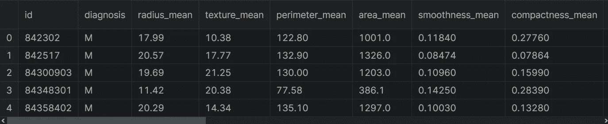

# 使用 Python 实践随机森林

> 原文：<https://pub.towardsai.net/hands-on-random-forest-with-python-58a67cfb8448?source=collection_archive---------0----------------------->

## 如何使用 scikit-learn 通过网格搜索技术实现随机森林的实用指南。


[刘思成](https://unsplash.com/@lsc122746?utm_source=medium&utm_medium=referral)在 [Unsplash](https://unsplash.com?utm_source=medium&utm_medium=referral) 上拍照

一个模型可能会做出错误的预测。但如果把几个模型的预测合二为一，就能做出更好的预测。这个概念叫做集成学习。集成是组合多个模型来构建更强大的模型的方法。集合方法在过去的十年中获得了巨大的普及。基于决策树的集成模型有两种:随机森林和梯度增强。在这篇文章中，我将谈论以下话题:

*   什么是随机森林？
*   随机森林的一些优点和缺点
*   如何用真实数据集实现随机森林？

让我们开始吧！

[](https://www.youtube.com/c/TirendazAcademy/videos) [## 蒂伦达兹学院

### Tirendaz Academy 是一个在线教育平台，在数据科学、人工智能、机器…

www.youtube.com](https://www.youtube.com/c/TirendazAcademy/videos) 

# 什么是随机森林？

随机森林是一种监督机器学习算法，广泛用于分类和回归问题。你可以把一个随机的森林想象成一群决策树。决策树模型倾向于过度拟合训练数据。你可以使用随机森林来克服过度适应的问题。

要实现随机森林，您需要构建许多决策树。随机森林由一组决策树组成。随机森林中的每棵树都与其他树略有不同。这些树被选择为不同的特征子集。请注意，这些功能是随机选择的。当进行最终预测时，所有树的预测被组合，并且这些预测被平均。由于您使用了许多树，因此可以减少过度拟合的数量。



[随机森林投票的结果。](https://1.bp.blogspot.com/-Ax59WK4DE8w/YK6o9bt_9jI/AAAAAAAAEQA/9KbBf9cdL6kOFkJnU39aUn4m8ydThPenwCLcBGAsYHQ/s0/Random%2BForest%2B03.gif)

# 随机森林的一些优点

我们来看看随机森林的一些优点。

*   您可以将随机森林用于分类和回归任务。
*   随机森林通常工作得很好，不需要对超参数进行大量调整。
*   你不需要缩放数据。
*   随机森林可以提供比决策树更好的准确性，因为它克服了过拟合问题。

# 随机森林的一些缺点

随机森林有一些缺点。让我们来看看这些缺点。

*   随机森林不能很好地处理非常高维的稀疏数据，如文本数据。
*   随机森林不容易解释，因为它使用比决策树更深的树。

所以你看到了随机森林的一些优点和缺点。现在让我们来看看如何用 scikit learn 实现随机森林。

# 如何用 Scikit-Learn 实现随机森林？

为了展示如何实现随机森林，我将使用威斯康星乳腺癌数据集。在加载数据集之前，让我导入熊猫。

```
import pandas as pd
```

让我们加载数据集。

```
df = pd.read_csv( “breast_cancer_wisconsin.csv”)
```



照片由[国家癌症研究所](https://unsplash.com/es/@nci?utm_source=medium&utm_medium=referral)在 [Unsplash](https://unsplash.com?utm_source=medium&utm_medium=referral) 上拍摄

你可以在这里找到笔记本和数据集[。让我们看一下数据集的前五行。](https://www.kaggle.com/datasets/uciml/breast-cancer-wisconsin-data)

```
df.head()
```



乳腺癌数据集的前五行

该数据集由恶性和良性肿瘤细胞的样本组成。数据集中的第一列显示唯一的 ID 号，第二列显示诊断，假设 M 表示恶性，B 表示良性。其余栏目是我们的特色。让我们来看看数据集的形状。

```
df.shape#Output:
(569, 33)
```

# 数据预处理

数据预处理是数据分析最重要的阶段之一。现在，让我们创建输入和输出变量。为此，我将使用`loc`方法。首先，让我创建我们的目标变量。

```
y = df.loc[:,"diagnosis"].values
```

让我们创建我们的特征变量并删除不必要的列。为此，我将使用`drop`方法。

```
X = df.drop(["diagnosis","id","Unnamed: 32"],axis=1).values
```

注意，我们的目标变量有两个类别，M 和 b。让我们用标签编码器对目标变量进行编码。首先，我要导入这个类。

```
from sklearn.preprocessing import LabelEncoder
```

现在，我要从这个类创建一个对象。

```
le = LabelEncoder()
```

让我们拟合并转换我们的目标变量。

```
y = le.fit_transform(y)
```

在构建模型之前，让我们将数据集分为训练集和测试集。为此，我将使用`train_test_split`功能。首先，让我导入这个函数。

```
from sklearn.model_selection import train_test_split
```

让我们使用这个函数分割数据集。

```
X_train,X_test,y_train,y_test=train_test_split(X, y, 
                                               stratify=y, 
                                               random_state=0)
```

酷毙了。我们的数据集已经可以分析了。

# 构建随机森林模型

为了在 Scikit-Learn 中使用随机森林，我们需要从 ensemble 模块中导入`RandomForestClassifier`类。首先，让我们导入这个类。

```
from sklearn.ensemble import RandomForestClassifier
```

现在，我要从这个类创建一个对象。在这里，我将只使用默认值

```
rf = RandomForestClassifier(random_state = 0)
```

接下来，让我们建立我们的模型。为此，我将对训练集使用`fit`方法。

```
rf.fit(X_train, y_train)
```

太棒了。我们的模型可以预测。让我们使用训练和测试集来评估我们的模型。

```
y_train_pred = rf.predict(X_train)
y_test_pred = rf.predict(X_test)
```

现在，让我们看看我们的模型在数据集上的性能。为此，我将使用`accuracy_score`功能。首先，让我导入这个函数。

```
from sklearn.metrics import accuracy_score
```

之后，让我们看看训练集和测试集的准确性分数。

```
rf_train = accuracy_score(y_train, y_train_pred)
rf_test = accuracy_score(y_test, y_test_pred)
```

现在，让我们打印这些分数。

```
print(f’Random forest train/test accuracies: {rf_train: .3f}/{rf_test:.3f}’)#Output:
Random forest train/test accuracies:1.000/0.958
```

太棒了，分数打印出来了。如您所见，训练集上的分数是 100%，测试集上的分数是 95%。这意味着模型存在过拟合问题。注意，这个随机森林模型很好地学习了训练集。所以，它只是记住了结果。但是，模型不能一概而论。为了克服过拟合问题，我们控制模型的复杂性。

# 网格搜索超参数调谐

由于模型的复杂性，我们需要使用不同的参数来调整模型。为此，我将使用网格搜索技术。网格搜索是一种模型超参数优化技术。在 scikit-learn 中，`GridSearchCV`类提供了这种技术。让我们导入这个类。

```
from sklearn.model_selection import GridSearchCV
```

现在，我将从`RandomForestClassifier`类中创建一个用于网格搜索的对象。

```
rf = RandomForestClassifier(random_state = 42)
```

当构造`GridSearchCV`类时，您需要提供一个超参数字典来评估`param_grid`参数。这是一个模型参数名称和一组要尝试的值的映射。现在，让我创建一个包含参数值的参数变量。

```
parameters = {'max_depth':[5,10,20],                           (1)
              'n_estimators':[i for i in range(10, 100, 10)],  (2)
              'min_samples_leaf:[i for i in range(1, 10)],     (3)
              'criterion' :['gini', 'entropy'],                (4)
              'max_features': ['auto', 'sqrt', 'log2']}        (5)
```

(1)树的最大深度。如果没有，那么节点被扩展，直到所有叶子都是纯的，或者直到所有叶子包含少于`min_samples_split`的样本。

(2)要建立随机森林模型，需要决定树的数量。这里，我将为`n_estimators`参数创建值。此参数指定林中的树的数量。在这个参数中，我使用了一个 for 循环来确定森林中的树的数量。

(3)`min_leaf_size`参数用于指定叶节点中样本的最小数量。我还为这个参数再次使用了循环的 *a。*

(4)我使用两个参数作为标准参数。

(5)最后，我设置如何选择特征。注意，随机森林技术中的一个关键参数是`max_features`。我们在寻找最佳分割时使用该参数。

因此，我们指定了参数的值。为了找到最佳参数，我将从`GridSearchCV`类创建一个对象。

```
clf = GridSearchCV(rf, parameters, n_jobs= -1)
```

接下来，我要用训练集来拟合我们的模型。

```
clf.fit(X_train, y_train)
```

最后，为了查看最佳参数，我将使用`best_params_`属性。

```
print(clf.best_params_)#Output: 
{'criterion': 'entropy', 'max_depth': 5, 'max_features': 'log2', 'min_samples_leaf': 3, 'n_estimators': 10}
```

当我们执行这个单元时，你可以看到最好的参数。

# 评估随机森林模型

现在，我将预测训练集和测试集的值。注意，我们不需要再次训练我们的模型。因为找到最佳参数后，就用这些参数来训练模型。所以可以直接用 clf 模型进行预测。让我们用这个模型来预测值。

```
y_train_pred=clf.predict(X_train)
y_test_pred=clf.predict(X_test)
rf_train = accuracy_score(y_train, y_train_pred)
rf_test = accuracy_score(y_test, y_test_pred)
print(f’Random forest train/test accuracies: {rf_train: .3f}/{rf_test:.3f}’)#Output:
Random forest train/test accuracies:0.993/0.965
```

根据最佳参数打印准确度分数。该模型在训练集和测试集上的性能都较好。请注意，我们的模型在训练集上的得分接近测试集上的得分。此外，两者的准确度分数都接近 1。因此，我们找到了最佳参数，并预测了训练集和测试集的值。

# 结论

在这篇文章中，我谈到了随机森林以及如何用 scikit learn 实现这项技术。随机森林由多个决策树组成。此方法对所有树的结果进行平均，以输出模型。所以你可以用这种方法克服过度拟合的问题。您可以使用此方法执行分类和回归任务。就是这样。感谢阅读。我希望你喜欢它。

请不要忘记在 YouTube 上关注我们。

[](https://medium.com/geekculture/top-8-machine-learning-algorithms-df30277b2056) [## 8 种最佳机器学习算法

### 数据科学家和机器学习工程师应该知道的最好的机器学习算法。

medium.com](https://medium.com/geekculture/top-8-machine-learning-algorithms-df30277b2056) [](https://levelup.gitconnected.com/7-differences-between-deep-learning-and-machine-learning-b5f2ff0ae00a) [## 深度学习和机器学习的 7 个区别

### 深度学习与机器学习——有什么区别？

levelup.gitconnected.com](https://levelup.gitconnected.com/7-differences-between-deep-learning-and-machine-learning-b5f2ff0ae00a) 

如果这篇文章有帮助，请点击拍手👏按钮几下，以示支持👇