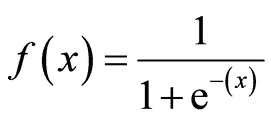
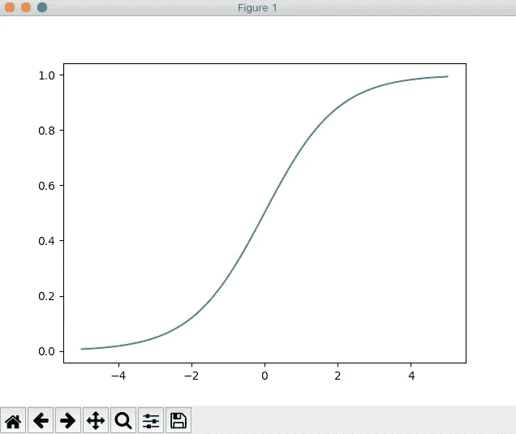
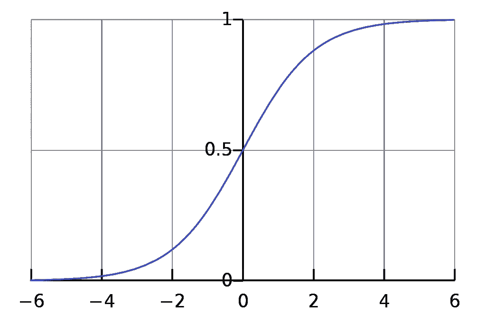

# hands-On the ano:Python 最强大的科学工具之一

> 原文：<https://pub.towardsai.net/hands-on-theano-one-of-the-most-powerful-scientific-tools-for-python-f023a1929f57?source=collection_archive---------1----------------------->


在 [Unsplash](https://unsplash.com?utm_source=medium&utm_medium=referral) 上由 [Franck V.](https://unsplash.com/@franckinjapan?utm_source=medium&utm_medium=referral) 拍摄的照片

## 使用 no 开始或改进您的机器学习/数据科学项目

在我的上一篇文章中，我提到了 13 个用于 Python 的数据科学库，我还谈到了 Theano。但这只是一个简单的介绍，今天我们将更具体地讨论一下 ano，它的优点和特性。然后我们将通过一些实际例子来看看如何使用它。

# 什么是 Theano？

也许你已经在某个地方听说过这个词，但它到底是什么呢？:一种编程语言？编译器？Python 库？嗯，实际上，就是所有这些东西:Theano 被开发来以一种非常有效的方式编译、实现和评估数学表达式。实际上，它允许开发者同时使用 CPU 和 GPU 来执行代码。现在你可能想知道用 GPU 而不是 CPU 运行代码有什么好处。

当我们执行从计算角度来看非常昂贵的代码时，我们的计算机经常会受到影响，甚至被损坏。此外，有必要考虑在高分辨率的大型图像数据集上训练模型所需的时间。对于普通的计算机来说，它的计算量太大了。但是不要担心，通过使用你的 GPU，你将能够在没有高计算成本的情况下建立处理大型数据集的模型。显卡就像个人电脑中的小型计算机。GPU 的另一个优势是比 CPU 便宜。为了证明在 GPU 上执行的 Theano 可能是机器学习和数据科学的未来，我们可以考虑由 Theano 开发人员完成的一项研究，他们检测到当 Theano 在 CPU 上运行时，速度比 NumPy 快 1.8 倍。而在 GPU 上运行时，Theano 比 NumPy 快 11 倍。从那以后，Theano 激发了数据科学家的很多兴趣，事实上，许多流行的机器学习和数据科学包如 Tensorflow 和 Keras 都是基于 Theano 的。

此外，Theano 是基于 NumPy 的，这使得它适合那些已经知道 NumPy 的人。如果你想了解更多，你可以访问[的网站](http://deeplearning.net/software/theano/index.html)。不幸的是，Theano 现在已经不再维护了，但它仍然是 ML 和数据科学中的一个很好的资源。

# 与 Theano 的第一步


在 [Unsplash](https://unsplash.com?utm_source=medium&utm_medium=referral) 上由 [Toa Heftiba](https://unsplash.com/@heftiba?utm_source=medium&utm_medium=referral) 拍摄的照片

在所有这些理论之后，让我们编写一个使用 Theano 的简单脚本。但在此之前，我们需要通过 **Conda** 安装 Theano(注意，我们在本教程中要做的事情只有在你使用 [Anaconda](https://www.anaconda.com/distribution/) 的情况下才有效，如果你还没有，请在这里[下载](https://www.anaconda.com/distribution/) ) **:**

```
conda install theano
```

在 theano 代码中，我们可以区分三个主要步骤:

*   初始化变量
*   编译代码
*   执行代码

简单 _theano_code.py

但这仍然不是很清楚，让我们深入研究一下我们编写的代码:

*   **第 1/2 行:**导入了*theno*和 [*张量*](http://deeplearning.net/software/theano/tutorial/index.html) 子包为 **T.**
*   **第 6/8 行**:定义了 *v0，v1，v2*[tensor variables](http://deeplearning.net/software/theano/library/tensor/basic.html)实例，将用于计算*输出。*
*   **第 9 行:**定义了表达式的输出必须如何，在本例中，表达式的输出是: *v1 v0 + v2。*
*   **第 12 行:**编译*theano _ f*TheanoFunction 计算上一步定义的*输出*(**第 9 行**)。
*   **第 15 行:**这里是我们调用上一步编译的 TheanoFunction(**第 12 行**)的地方。

简而言之，这个脚本把 *2.0* 整数作为 *v1，1.0* 作为 *v0* 和 *0.50* 作为 *v2。T* 当它计算我们在**第 9 行**中定义的输出时:

> v1 v0 + v2

直觉上，我们的[函数](http://deeplearning.net/software/theano/library/compile/function.html)将做的计算是:

> 2.0 · 1.0 + 0.5 = 2.5

通过执行这段代码，您将看到预期的输出 *2.5、*。

# 在 GPU 上执行 ano 代码


照片由[克里斯蒂安·威迪格](https://unsplash.com/@christianw?utm_source=medium&utm_medium=referral)在 [Unsplash](https://unsplash.com?utm_source=medium&utm_medium=referral) 上拍摄

在介绍 Theano 的同时，我们说了它的一个优点是可以使用电脑的 GPU。在我们开始之前，我想提一下，使用 GPU 是可选的，你也可以在 CPU 上运行你的代码。总之，学习如何使用你的 GPU 总是有用的，所以让我们开始吧！

首先，我们需要建立英特尔和英伟达显卡的一些区别。有时候不需要这种比较，但大多数情况下是需要的。如果你有 NVIDIA 显卡，你将不得不使用 Cuda，而如果你有 Intel 显卡，你将不得不使用 Open-CL。别担心，除了一个 Python 包: [*pygpu*](http://deeplearning.net/software/libgpuarray/pyapi/pygpu.html) 之外，你不需要安装任何东西。要安装它，我们在终端上键入:

```
conda install pygpu
```

记住你必须使用[蟒蛇](https://www.anaconda.com/distribution/)，用 [pip](https://pip.pypa.io/en/stable/) 是不行的。我们现在必须修改 Theano 配置，以便让代码在 GPU 上运行。
打开您的终端并键入:

```
export THEANO_FLAGS=device=opencl0:1,floatX=float32
```

如果你有英特尔显卡。或者:

```
export THEANO_FLAGS=device=cuda,floatX=float32
```

如果你有 NVIDIA 显卡。

这个命令将允许您在运行使用。因为我不使用 Windows，所以我不能确定如何在 Windows 中使用 GPU 执行代码。但是，不要担心微软用户，官方的 Theano 文档会解释如何做。

说到这里，我们可以检查在执行命令后，代码是否在我们的 GPU 上执行:

check.py

通过使用:`python check.py`从终端运行这个脚本，我们将看到已经使用的设备的输出。作为输出，您应该看不到`cpu`，尽管您应该看到类似于`cuda`或`opencl0:1`的东西。

恭喜你，你第一次在 GPU 上运行了你的代码！

现在你已经掌握了一些基本的技巧，你可以开始做一些更困难的事情了。

# ano 中的 Sigmoid 函数

> 一个**S 形函数**是一个[数学函数](https://en.wikipedia.org/wiki/Function_(mathematics))，具有一个特征性的“S”形曲线或**S 形曲线**。 *sigmoid 函数*的一个常见示例是第一幅图中所示的[逻辑函数](https://en.wikipedia.org/wiki/Logistic_function)，它由公式( [Wikipedia](https://en.wikipedia.org/wiki/Sigmoid_function) )定义:



这个函数经常在机器学习中用于 [*逻辑回归*](https://en.wikipedia.org/wiki/Logistic_regression) *，*，现在我们将使用 no:

theano_sigmoid.py

**1/4 线**:导入所需模块。我们将使用 Theano 来创建和计算我们的 sigmoid 函数。Matplotlib 来绘制我们函数的输出。最后，我们将使用 NumPy 来创建输入。

**第 6 行**:使用 NumPy 及其子模块 [Linspace](https://docs.scipy.org/doc/numpy/reference/generated/numpy.linspace.html) ，构建 100 个整数作为我们的输入。为了做到这一点，我们选取了 100 个介于-5 和 5 之间的数字。

**第 7 行**:定义了[张量变量](http://deeplearning.net/software/theano/library/tensor/basic.html)，在函数的公式中将是***x***(***f(x)***):


**第 8 行**:定义了表达式的输出必须如何，本例中，表达式的输出为: ***1/(1+(e**-x))。***

**第 9 行**:编译*th _ sigmoid*[the no function](http://deeplearning.net/software/theano/library/compile/function.html)计算上一步定义的输出(**第 8 行**)。

第 10 行:定义了一个包含函数所有输出的列表。

**第 11/12 行**:对于我们在**第 6 行**定义的 **x** 数组中的每个数字，我们计算输出并将其添加到我们在**第 10 行定义的列表中。**

**第 13/14 行**:通过使用 Matplotlib，python 将显示我们的 sigmoid 函数计算的所有输出。

同样在这里，我们遵循了我们在本文开始时谈到的三个主要步骤:

*   初始化变量→ **第 6/8 行**
*   编译代码→ **第 9 行**
*   执行代码→ **第 11/12 行**

通过运行这段代码，您应该看到该脚本在您的计算机中打开了一个 Python3 窗口，显示如下内容:



干得好！这正是 sigmoid 函数应该给出的输出！事实上，这是我们在 sigmoid 函数中发现的“s”形曲线:



来自[维基百科](https://en.wikipedia.org/wiki/Sigmoid_function#/media/File:Logistic-curve.svg)的 Sigmoid 函数曲线

# 结论

在本教程中，您看到了如何安装 Theano 以及如何构建一个使用它的简单代码。然后，您看到了如何执行一个 python 脚本，该脚本使用了在您计算机的 GPU 上执行的 ano，这可以极大地提高项目的性能。最后，你学会了用最著名的机器学习函数之一复制:Sigmoid 函数，也叫逻辑函数。

我鼓励你继续学习 ano，因为我们在这篇文章中看到的只是它所能做的一小部分。继续学习 ano 的最好方法之一是查阅它的官方文档，你可以在这里找到。