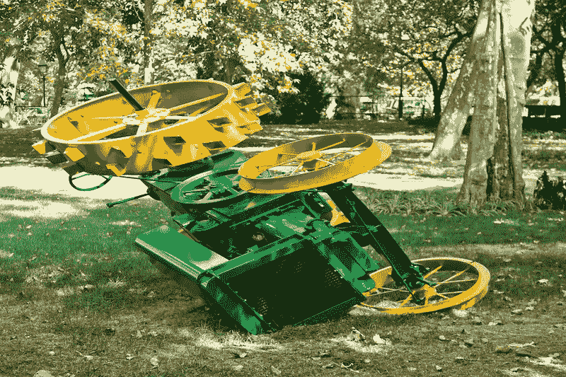
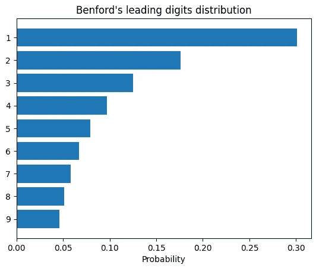
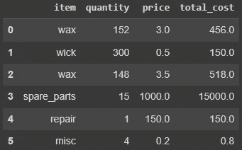
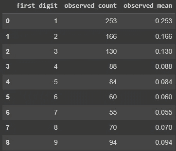

# 本福特的+卡方检测异常

> 原文：<https://pub.towardsai.net/has-transaction-table-anomalies-inside-benfords-law-and-chi-square-test-to-dispel-doubts-3a6f2ca3939e?source=collection_archive---------3----------------------->

## 让我们计算一些统计数据，以获得对数据中是否有可疑之处的信心

在 [Flickr](https://flickr.com/) 上由[麦克 G](https://flickr.com/photos/mishagl/) 创作的《空间异常》

我设想一种情况，你有一个从大型数据集中提取的交易列表。你怀疑里面的数据有问题。在数据收集中可能存在错误、故意操纵、人为错误，或者甚至在人们在数据库中登记的地面处理结果中存在违规。另一方面，这个特定的数据集可能没什么特别的。换句话说，如何识别具有统计意义的异常？

## 设置场景

第一个问题是从哪里开始研究。让我们通过安排一个模仿真实案例的情景来方便我们的探索。

我们是公司内部财务分析师。我们从许多来源得到信号，表明采购订单分类账数据有问题。关于错误的原因有几种观点，但都没有阐明，而且是相互矛盾的。我们的目标是找出数据是否有问题，如果有，就缩小搜索范围。

我准备了一个玩具示例数据集来展示一个总体概念。我们将通过应用探索性数据分析来处理这种情况，演示获取可疑交易是否在原始数据集中的证据的步骤，并讨论进一步的可能操作。在我们的工作中，我们将遵循以下原则:

## **假设**

*   我们从适当的来源获得了具有完整性和完整性属性的数据集。
*   该框架没有任何缺失值。
*   我们在预定义的时间段(例如，一个月或一个季度)内对数据进行采样，没有例外和遗漏。
*   我们按原样使用数据集—我们不丢弃条目、添加新条目、更改原始数据等。

## 让我们开发一种方法

使用“蛮力”并测试所有交易的支持文档来找到真相将是非常棒的。然而，这种方法需要大量的努力和时间以及瓶颈资源。我们将采取另一种方式使用统计数据。我们将使用本福特定律，如标题中所说。这是什么？—嗯，它说明了**一个物体数值评估的前导数字**服从**已知概率分布**。需要补充的一点是，这个对象的值应该接近**正态分布**。根据本福特定律，每个数字在图上出现的概率:

按作者分类的图表

有很多聪明的词，不是吗？让我们想象一下每天去一家杂货店。通常，你没有塑料袋，所以你可以在付款时订购。大多数时候，你需要一个麻袋；两个或三个袋子都是罕见的情况，4+意味着你要为一周或计划的活动一次性购买食物。看起来日常生活遵循本福特定律。

好吧，可能还算公平。我们的采购订单分类账(对象)是否接近正态分布？让我们假设我们的登记簿来自一家生产蜡烛的企业。该工厂有一个已知的稳定的运行周期，导致一个标准的采购清单。它们主要是蜡、蜡膏、机械零件和许多其他较小的资产和服务。这些购买的数量和价格可能会因产量变化、通货膨胀和不可预测的情况而波动。尽管如此，它们有一个长期的平均值和方差，这是相对稳定的，因为使用的是物理对象，我们可以用正态分布来描述它们。

现在是时候规划我们探索性数据分析的步骤了:

1.  我们应该通过导出前导数字来转换我们的数据集(它必须大于零，所以我们应该应用舍入)。
2.  根据导出的数字对行进行分组计数。
3.  制定一个基础假设(H0)和替代假设(H1)。
4.  检查我们是否符合卡方检验假设。
5.  计算卡方检验统计量，并将其与具有预定义显著性水平的基准进行比较(如果我们确定步骤 4 中的答案是肯定的。如果不是，我们应该改变一个统计测试或升级一个样本)。
6.  断定我们的数据集是否遵循本福特定律，或者它在统计上是不同的。

## 一番练习(终于！)

我将使用 python 执行数据操作，但这不是必然的选择；您可以在 SQL、Excel 或其他表格数据操作平台中执行相同的步骤。我把示例代码放在我的 [**GitHub 页面**](https://github.com/kpluzhnikov/benfords_chi_squared/tree/main) 上。

首先，我们应该导出新列中的前导数字；如果第一个数字是零，在我们通过这个新列按行分组后，我们向上舍入到 1。代码可能看起来像这样:

这段代码应该将数据从这个视图转换到另一个视图:

(**左**)列出采购订单的基本表| ( **右**)按前导数字分组的盘点表(PD . series)|作者图片

好的。假设我们有下面的计数表，其中 n = 1000 个样本(例如，所选月份的采购订单数量)。

作者图片

下一步是制定假设。第一个是 **H0:“我们数据集的第一个数字的分布遵循本福特定律”。**另一个选择是 **H1:“我们数据集前几位的分布明显不同于本福特定律”。**

我将进行卡方检验，以确定 H0 或 H1 是否有效。两个假设保证了检验的正确性:1)样本数等于或大于 30，2)来自数据集的随机变量的每个观测值应该大于 5。

第一个假设很简单，我们取 1000 个样本，所以我们覆盖它。但是什么是随机变量的观测值呢？—在我们的示例中，它是从 1 到 9 的每个前导数字的样本数，不多也不少。是的，我们同意第二个假设，因为列`observed_count`中的每个数字都大于 5。我们满足了两个要求，太好了！
如果我们不能满足这些假设，我们应该选择另一种测试，例如学生 t 检验。

在实施卡方检验之前，我们应该用 Benford 的预期计数和概率来充实我们的表。

更新的表格:

作者图片

让我们用 python 编写卡方测试代码。

`chi2_test`的参数有哪些:

*   `alpha`是显著性水平(默认值= 0.05)。显著性水平显示卡方分布右上角的边界。这有助于找到一个临界值，一个经验法则，来决定是否拒绝 H0。典型的显著性水平为 0.05、0.01，小于该值—更难拒绝 H0(更保守的测试)。
*   `dof`是自由度。它表示随机变量的计数，我们不知道这些变量出现的实际概率。在我们的例子中，`dof` = 9，因为我们有九个第一位数字，是的，当我们看到这些数字时，我们不知道确切的概率。
*   `ddof`是自由度的减少。如果我们的测试中有相关的随机变量，我们应该减少`dof`。我们有这样的变量吗？—是的，当我们对数据进行采样时，八位数字有一个独立的估计概率，但最后一位数字收到的概率是 100%减去前几位数字的概率之和。所以，有一个约束，我们应该减少一个自由度。

我们的测试结果如下:(67.63，15.51，“H0 拒绝”)。第一个值是我们基于观察的统计；第二个是临界值，第三个是我们应该接受还是拒绝 H0 假说。

根据测试，我们应该拒绝 H0。一般来说，卡方检验表明，从服从本福特分布的数据集中抽取的 95%的样本不会产生与我们表中相同的结果。因此，根据本福特定律，从 9 开始的订单数量几乎翻倍是一种异常现象。

## **结论**

这种测试相对快速和简单，合理地保证了异常的存在。该不该把推论给老板看？—嗯，这只是探索性的数据分析，它显示了深入挖掘的地方，但它没有提供异常背后原因的证据。

我们的下一步是找到与期望值最显著不同的前导数字。是九从一和二那里借用了概率。了解这一点后，我们可以对金额从 9 开始的采购订单的详细文档进行抽样，以确定导致异常的原因。如果我们成功了，我们将向管理层报告调查结果和相应的建议。

我们异常现象背后的可能原因是 1000 美元的门槛。如果采购量低于这个数字:供应部门可以使用简单快捷的程序。如果超过这个基准:对他们来说是坏消息，像市场分析，招标安排，严格的采购程序，brrr。但是，如果我们把花了 1**1**920 美元购买的东西分成两部分，每部分花 960 美元，会怎么样呢？更快、更易获得且不兼容的方式。

如果我们没有发现异常呢？意思是一切正常？不一定。我们只应用探索性数据分析，它给出了一个大图，但有约束条件。一个好的选择是采访那些声称存在错误的同事，那些对程序负责的人。这是一个更昂贵的程序，但更准确。

我感谢你的考虑。如果你喜欢这篇文章，我有一个有趣的事实告诉你:

> 你最多可以为一首曲子鼓掌 50 次。

你可能对我的其他文章感兴趣:关于在机器学习模型[**【1 }**](https://medium.com/towards-artificial-intelligence/deal-with-an-imbalanced-dataset-with-tensorflow-lightgbm-and-catboost-b2476996d145)和[**【2 }**](https://medium.com/towards-artificial-intelligence/outline-a-smaller-class-with-the-custom-loss-function-94ff00359698)中微调损失函数或者我是如何从俄罗斯到哈萨克斯坦[**【3 }**](https://medium.com/@kplz/thank-you-for-all-kazakhstan-f9d473729868)。

观看，阅读，鼓掌，关注，写评论，分享，甚至小费——都温暖着我的心。请随意采取行动。

全部代码在我的 GitHub 页面->[https://github.com/kpluzhnikov/benfords_chi_squared](https://github.com/kpluzhnikov/benfords_chi_squared)。

保持安全，不允许战争。

如果你喜欢这篇文章，请毫不犹豫地喜欢、评论并分享它。或者甚至:

 [## 通过我的推荐链接-康斯坦丁·普鲁申尼科夫加入媒体

### 阅读康斯坦丁·普鲁申尼科夫的每一个故事(以及媒体上成千上万的其他作家)。您的会员费直接…

medium.co](https://medium.com/@kplz/membership)