# 我们从意大利和韩国吸取教训了吗？

> 原文：<https://pub.towardsai.net/have-we-learnt-our-lessons-from-italy-and-south-korea-1c0ae80c6491?source=collection_archive---------1----------------------->

## 学分:

 [## 追踪印度冠状病毒的传播

### 使用 Kaggle 笔记本探索和运行机器学习代码|使用来自多个数据源的数据

www.kaggle.com](https://www.kaggle.com/parulpandey/tracking-india-s-coronavirus-spread-wip) 

## Python 代码和数据源位置:

 [## BindhuVinodh/新冠肺炎-印度

### 在 GitHub 上创建一个帐户，为 BindhuVinodh/新冠肺炎-印度的发展做出贡献。

github.com](https://github.com/BindhuVinodh/Covid-19-India) 

3 月 16 日，印度确认了 116 例 COVID 19 病例，其中马哈拉施特拉邦的病例数最多。随着冠状病毒疫情继续在该国蔓延，我们作为印度人试图回答的问题是:印度是否能够应对其威胁，或者我们将目睹另一个意大利或韩国？

#第一部分:分析印度的现状

1 月 30 日报告了首例**新冠肺炎**病例，患者是一名从武汉抵达* *喀拉拉邦* *的学生。接下来的两天，喀拉拉邦又报告了两起病例。在将近一个月的时间里，印度没有报告新的病例，然而，在 3 月 8 日，喀拉拉邦仍然报告了五例新的冠状病毒病例，从那时起，事实一直在上升，影响到**14 个**邦，直到现在。这是印度证据的简要时间表

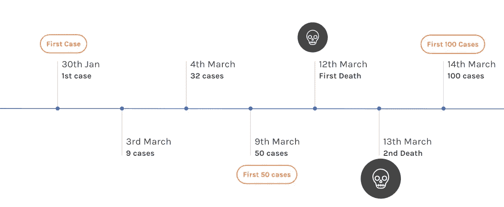

# 1.1 印度的病例分布:

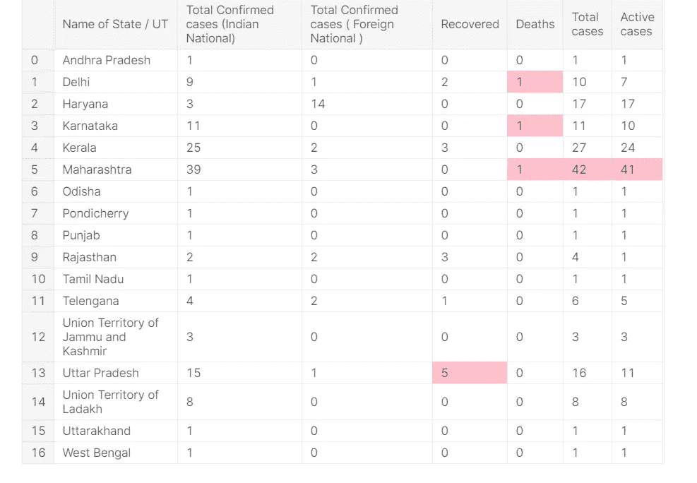

# 1.2 新冠肺炎各邦/中央直辖区的明智数量

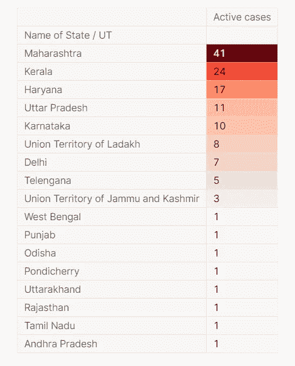

活动案例总数

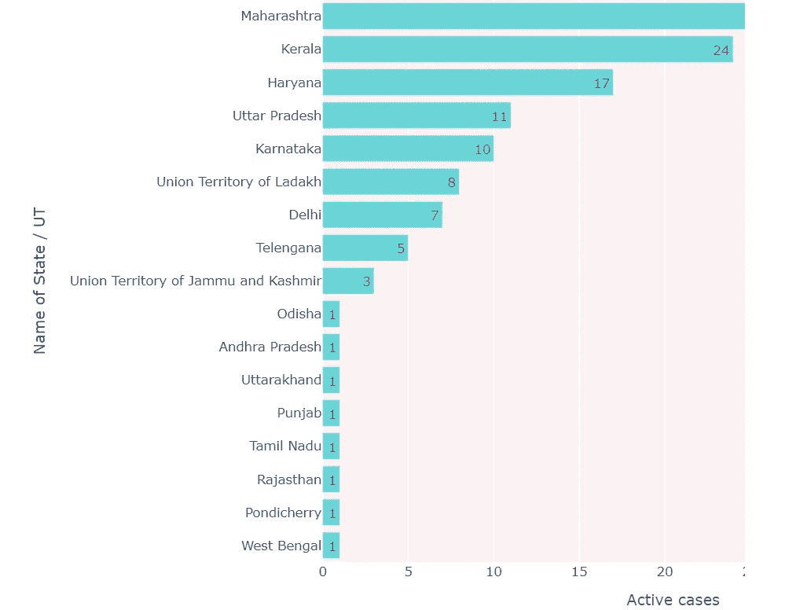

# 1.3 国内与国外案例

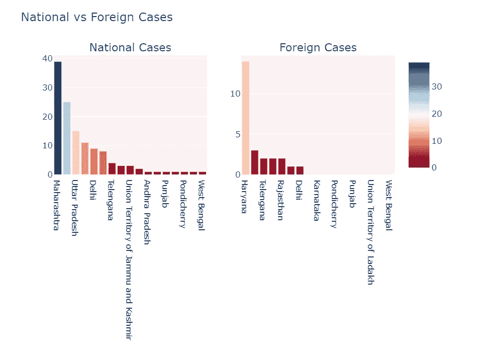

# 1.4 可视化地理分布:

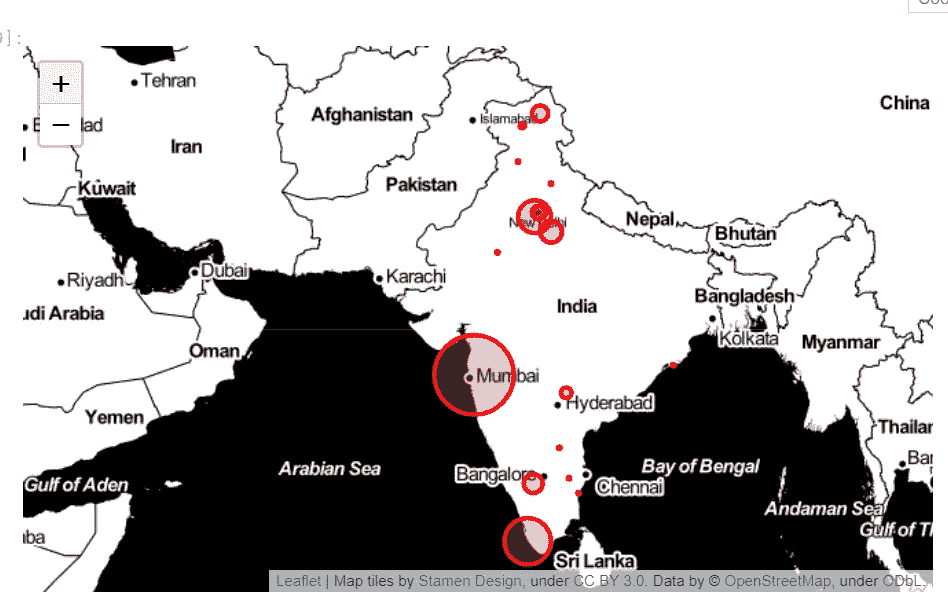

# 1.5 确认与恢复数字

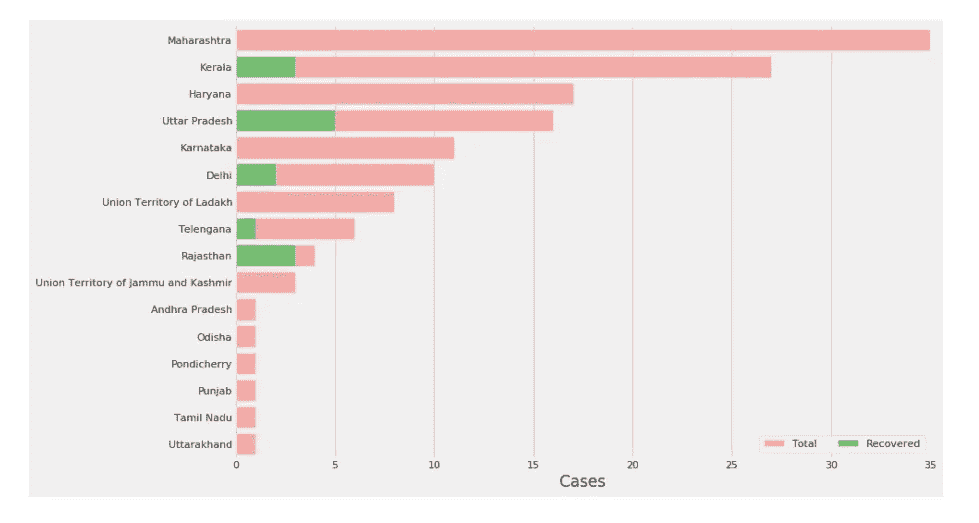

# 1.6 冠状病毒病例是如何上升的？

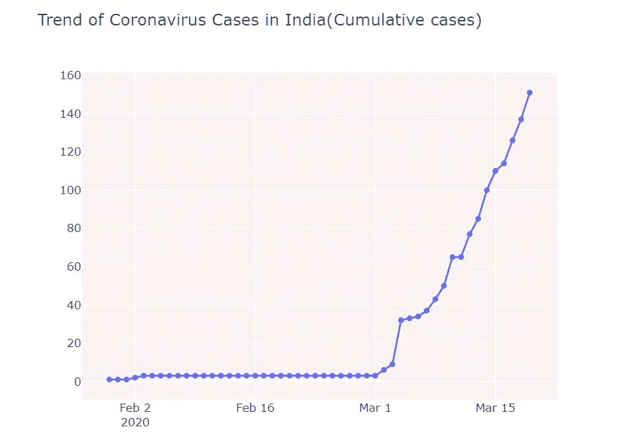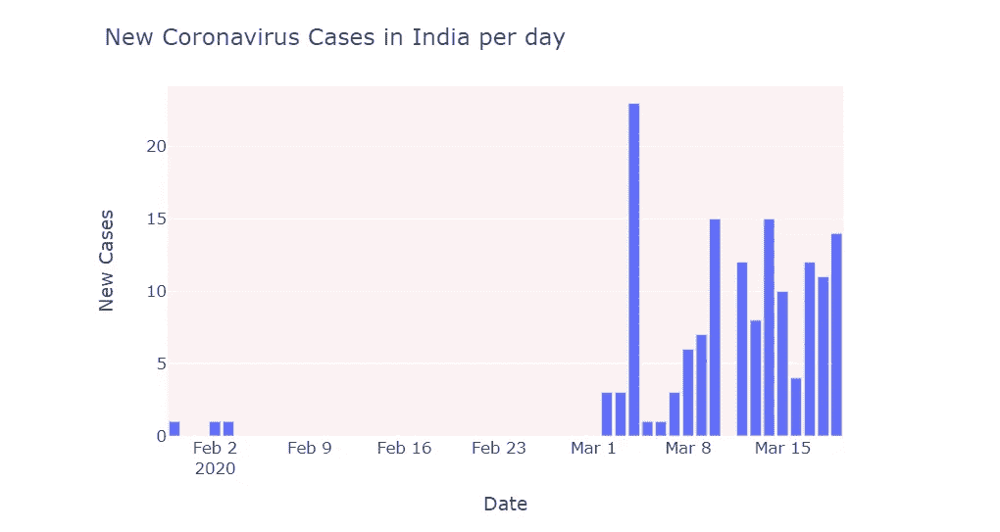

# 这种趋势和意大利和韩国相似吗？

印度已经跨越了 100 例。在接下来的一周里控制局势是至关重要的。在这些国家达到 100 大关后，冠状病毒患者的数量开始翻倍，并且几乎开始呈指数增长。如果你想了解什么是指数增长，以及案例如何出现突然增长，这里有一个由 [**3Blue1Brown**](https://www.youtube.com/watch?v=Kas0tIxDvrg) 制作的精彩视频:

# 2.1 印度、意大利和韩国的累计病例

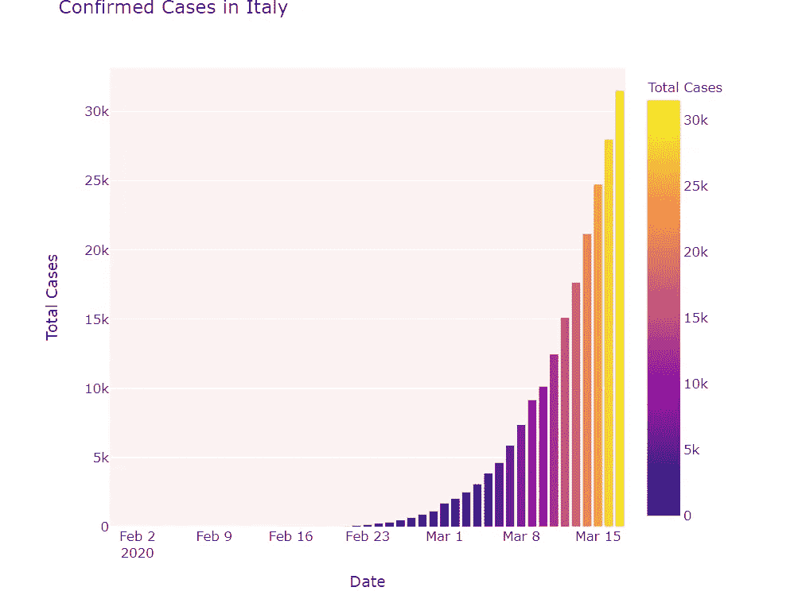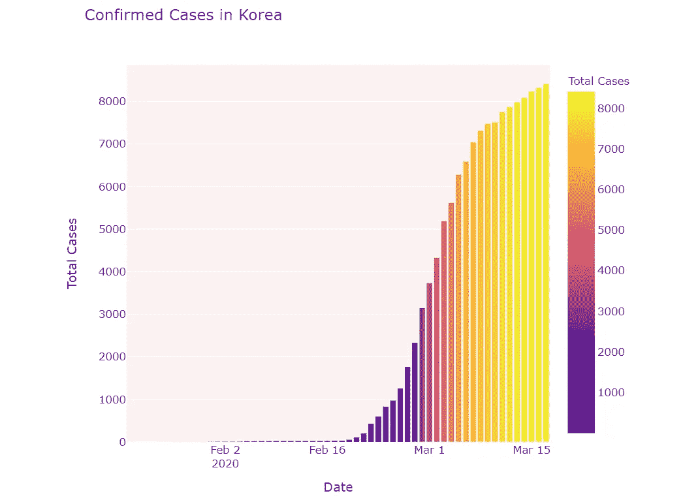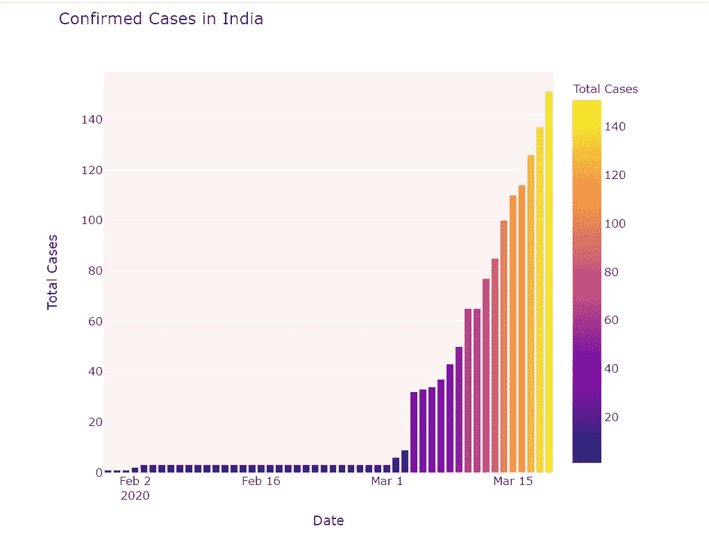

# 2.2 韩国、意大利和印度病例上升的比较

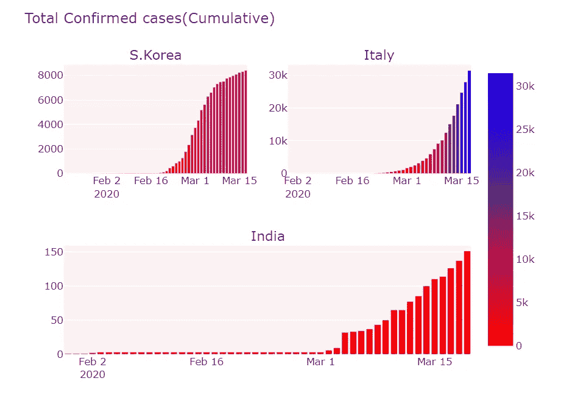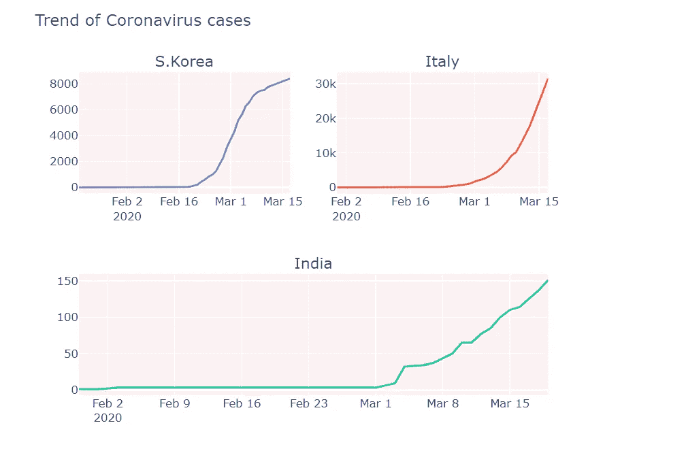

# 2.3 突破 100 例后的趋势

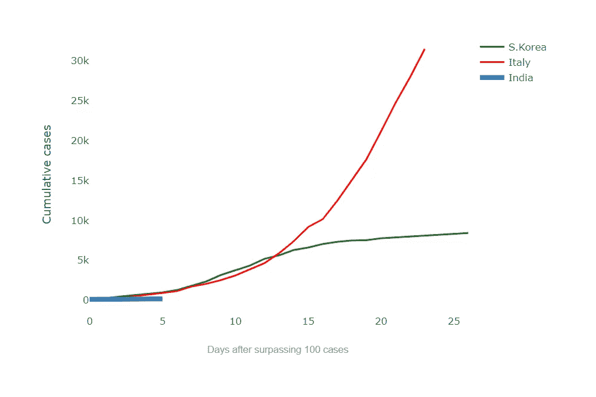