# 很难建立一个完美的模型？

> 原文：<https://pub.towardsai.net/having-a-hard-time-building-the-perfect-model-bc94ec380ac0?source=collection_archive---------0----------------------->

## 机器学习

演职员表: [Unsplash](https://unsplash.com/) 中的 [Aron 视觉效果](https://unsplash.com/@aronvisuals)

[最近对 23，000 多名数据专业人员的研究结果](https://businessoverbroadway.com/2019/02/19/how-do-data-professionals-spend-their-time-on-data-science-projects/)发现，数据科学家花费约 40%的时间收集和清理数据，20%的时间构建和选择模型，11%的时间寻找见解并与利益相关者交流。作为初学者，你可能很难找到你的问题陈述的完美模型。

因此，我在这里向您展示一个用 Python 编写的开源低代码机器学习工具，它允许您在几秒钟内从准备数据到在您选择的笔记本环境中部署模型。

版权: [PyCaret](https://pycaret.org/)

PyCaret 库拥有数据科学家需要的一切。

快速让我们进入安装，并建立一个完美的模型。

来源: [GIPHY](https://giphy.com/)

## 步骤 1:创建虚拟环境

建议使用类似 python3 虚拟环境或 Conda 环境的虚拟环境。这样就不会与安装的其他软件包冲突。使用虚拟环境的好处是我们可以下载任何想要使用的库的特定版本。

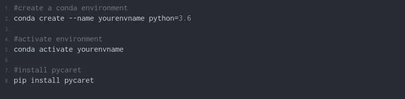

使用 Anaconda 提示符安装

安装大约需要 5 到 10 分钟，这取决于你的网速。如果你发现安装库有任何问题，请查阅官方文档([点击这里](https://pycaret.org/install/))。

## 第二步:检查它是否安装正确

1.  **命令终端**

在终端中激活 conda 或 python 环境，然后键入以下代码。

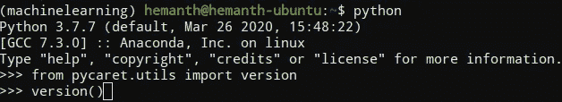

您应该得到以下输出。

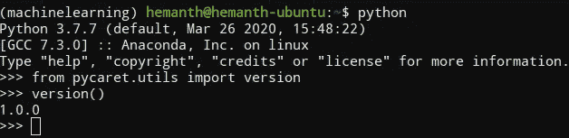

我用 Ubuntu 作为我的操作系统，所以你的可能看起来不一样。

2.**朱庇特笔记本**

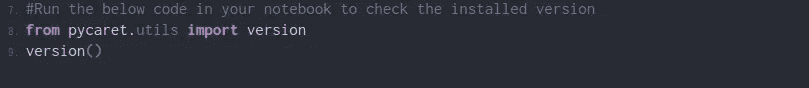

键入上面的代码并运行 jupyter 单元。您将获得版本号作为输出。现在你已经成功地在你的机器上安装了 PyCaret 库。让我通过解决一个回归问题来告诉你如何使用它。

# 实际用法

**问题陈述:**

使用身高和体重作为输入特征，建立一个可以预测人的身体质量指数的模型。

***常识***

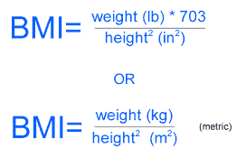

你可以从下面的 Github 链接获得数据集。

 [## HemanthDavuluri/MediumBlog

### 此时您不能执行该操作。您已使用另一个标签页或窗口登录。您已在另一个选项卡中注销，或者…

github.com](https://github.com/HemanthDavuluri/MediumBlog/tree/master/BMI) 

## 步骤 1:加载数据

注:我用的是 Kaggle 笔记本环境

## 步骤 2:分割训练和测试集

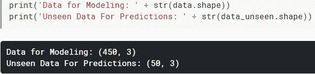

注意:用于建模的数据中的列数等于用于预测的看不见的数据，这对于那些熟悉使用 Sklearn 的人来说可能看起来很奇怪。PyCaret 就是这样工作的，没什么好担心的。当我们用训练好的模型预测看不见的数据时，你会清楚地理解它。

## 步骤 3:设置 Pycaret 环境

set-up 函数初始化 Pycaret 创建用于数据建模的转换管道并部署它所需的环境。记住应该在使用任何 Pycaret 函数之前调用 setup 函数。该函数有两个主要参数 data 和 target。数据是我们正在使用的数据集，目标是相关的列名。运行该函数时，会创建一个表，如下图所示。如果数据集中的所有数据类型都正确显示，请按 enter 键继续实验。该函数执行任何机器学习实验所需的预处理任务。

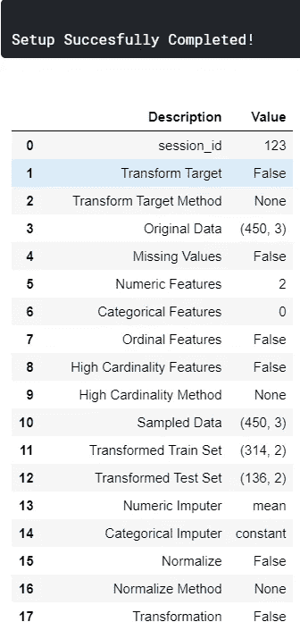

您将得到 41 行的输出

## 你必须知道的主要关键词定义

*   **session_id:** 创建一个随机数，用于以后的再现性。如果不初始化变量，函数会自动将 123 指定为会话 id。
*   **原始数据:**显示数据集的形状。
*   **缺失值:**如果数据集中的数据缺失，则显示一个布尔值。如果有缺失数据，则显示 True 如果没有缺失值，则显示 False。
*   **数字特征:**推断为数字的特征数量。
*   **分类特征:**显示分类特征计数的数量。
*   **变换后的训练集:**显示预处理后变换后的数据帧形状。
*   **转换后的测试集:**显示转换后的训练和测试集的形状。训练集的默认值为 70%，训练集的默认值为 30%。

## 步骤 4:比较所有模型

这个函数调用开始根据性能比较所有的模型。建议在设置完成后对数据进行建模。所有模型都经过训练，并使用 k 倍评分验证对它们进行评分以进行评估。该函数的输出创建了一个表，以型号名称、MAE、MSE、RMSE、R2、RMSLE 和 MAPE 为列。这个函数调用完成了繁重的工作，节省了大量时间。根据数据集的大小，此步骤可能需要一段时间才能完成。

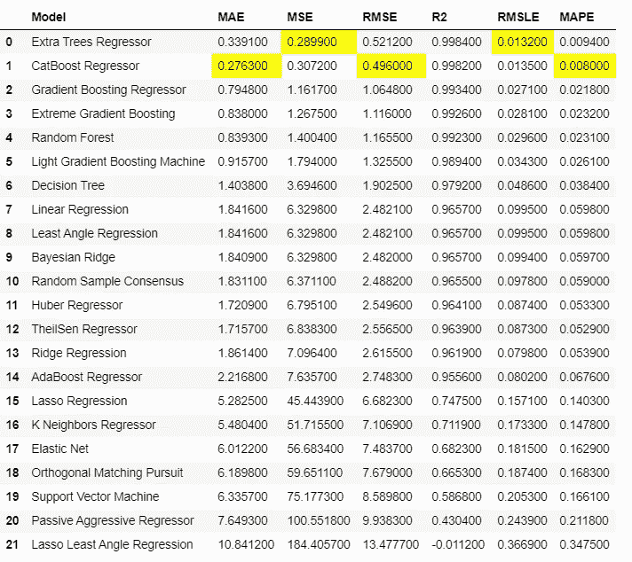

它训练了 21 个模型，并按照从最好到最差的顺序排列。现在，您可以选择最适合自己的型号。最适合我的问题陈述的算法是额外树的回归器。

## 步骤 5:创建模型

比较模型后，该函数不会返回已训练的模型。我们必须使用 create model 函数创建模型，该函数返回一个网格，其中所有得分都与上述步骤中的相同

你可以在这里找到[描述的所有车型。](https://pycaret.org/create-model/)

输出:

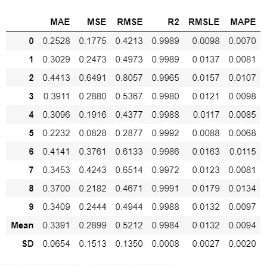

要查看模型中使用的所有超参数，请使用这行代码打印模型。

输出:

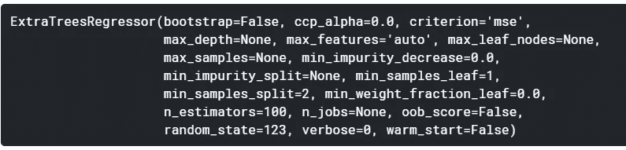

## 步骤 6:调整模型

在上述步骤中创建的模型使用默认的超参数，并且该模型可能不是非常有效。因此，调整模型需要使用调整模型功能。该函数自动调整超参数，并使用 k-fold 交叉验证对其进行评分。输出打印出一个网格，其中包含了调优模型的所有分数。

**注意:** tune_model()不接受一个训练好的模型对象作为输入(在创建模型函数中模型的缩写名称)

输出:

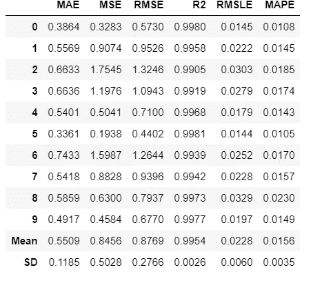

您可以打印模型并查看调整后的超参数。

## 步骤 7:绘制模型

在最终确定之前，我们可以使用绘图模型功能绘制模型，以分析不同方面的性能。此函数以训练好的模型作为参数，并基于测试集返回一个图。通过[文档](https://pycaret.org/plot-model/)，有 10 种类型的图可供进一步了解。

输出:

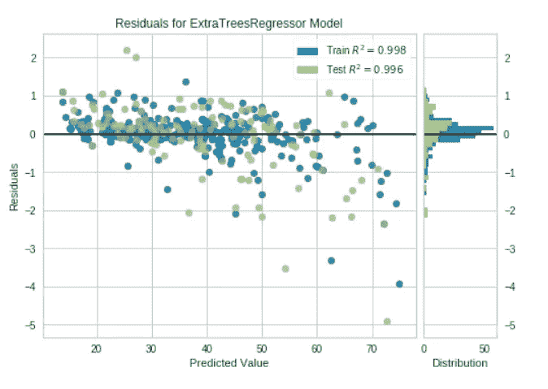

完美的残差图

还有很多其他的情节可以尝试。浏览[文档](https://pycaret.org/plot-model/)。

## 第八步:交互模式分析模型性能

我发现 Pycaret 中最有用的功能之一是评估模型。该功能显示给定模型的所有可用图的用户界面。绘图模型功能用于在该功能内部创建所有绘图。

输出:

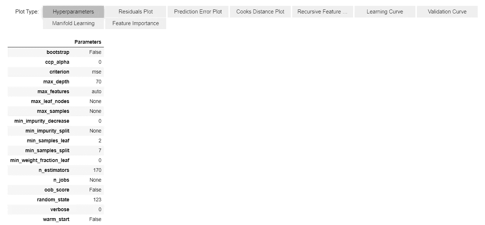

您可以选择绘图类型，因为这都是交互式的。

## 步骤 9:在最终确定之前检查模型

整个过程的主要重要步骤是在最终确定之前检查模型。通过预测测试集和评估分数来执行最终检查是一个很好的做法。

输出:

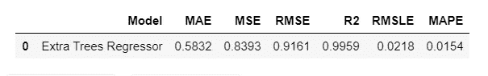

## 步骤 10:最终确定部署模型

## 步骤 11:预测看不见的数据

打印新的预测数据帧。

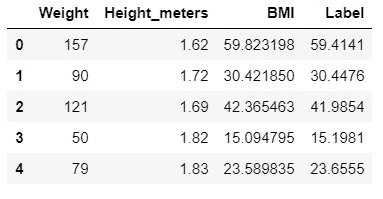

如果您仔细观察数据框，会发现一个名为“标签”的新列，它只是预测值列。

我想现在它有意义了，为什么在看不见的数据集中有 3 列作为训练(数据)集。

## 步骤 12:保存模型

通过这样做，您可以随时在新数据上使用您的模型。如果保存模型，您需要再次经历整个过程。

保存模型函数有两个参数，一个是模型名，另一个是保存模型的名称。

要再次重用该模型，请尝试以下代码。

输出:

一旦模型加载到环境中，您就可以使用相同的`predict_model()`函数简单地使用它来预测任何新数据。

# 结论

你只花了 7 分钟就装好了库，找到了一个完美的模型。

那么你对 PyCaret 相当满意吗？
你还在等什么？
开始实施你的项目，节省你的宝贵时间，就像我为你节省我的时间和写文章一样。
如能跟随并鼓掌，我们将不胜感激。谢谢你一直读到最后。
下次见。