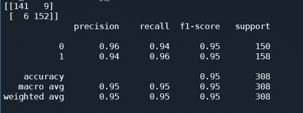
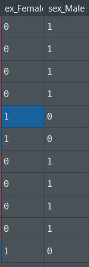
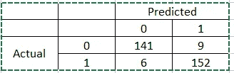

# 基于机器学习的心脏病预测

> 原文：<https://pub.towardsai.net/heart-disease-prediction-with-machine-learning-52eaf239cf05?source=collection_archive---------0----------------------->

## [机器学习](https://towardsai.net/p/category/machine-learning)



## I .下载数据集

## 二。Python 处理

## 三。Python 应用 ML 算法

## 四。分析

## I .下载数据集

去这里下载资料:[心脏病 UCI | Kaggle](https://www.kaggle.com/ronitf/heart-disease-uci)

## 二。Python 处理

一旦你下载了。csv，打开你的 python 编辑器。使用这段代码导入 pandas 并引入 CSV 文件作为数据帧:

```
import pandas as pd
dfstack=pd.read_csv(r'C:\Users\...\HeartDiseaseTrain-Test.csv')
```

让我们来看看这些列:

```
print(dfstack.columns)
```

当您运行该行时，将得到以下内容:

> 索引(['年龄'，'性别'，'胸痛 _ 类型'，'静息 _ 血压'，[T4 '，'胆固醇'，'空腹 _ 血糖'，'静息 _ 心电图'，'最大心率'，[T5 '，'运动 _ 诱发 _ 心绞痛'，'老年峰值'，'斜率'，[T6 '，'血管 _ 着色 _ 荧光检查'，'地中海贫血'，'目标']，
> dtype = '对象')

如果查看数据框，您会注意到许多列都有 ***分类数据。*** 例如，“性别”列有两个值:男性/女性等。

此时，我们希望将这些分类列转换成数字数据。最快的方法如下:

```
df_stack = pd.get_dummies(dfstack, prefix_sep=’_’)
```

get_dummies 函数将识别分类列并将它们转换为数字数据。为了说明这一点，下面是我们在使用 get_dummies 后刚刚创建的 df_stack 的数据框中的列名:

> 指数(['年龄'，'静息血压'，'胆汁淤积'，'最大心率'，
> '老年峰值'，'目标'，'性别 _ 女性'，'性别 _ 男性'，
> '胸痛 _ 类型 _ 无症状'，'胸痛 _ 类型 _ 非典型心绞痛'，
> '胸痛 _ 类型 _ 非心绞痛'，
> '空腹血糖 _ 大于 120 mg/ml '，
> '空腹血糖 _ 非典型心绞痛')

您将会注意到，分类列被拆分成若干个唯一的选项。例如，性别列现在是 sex_Male，另一列称为 sex_Female。新闻不会像最初的专栏中那样说“男性”或“女性”，而是看起来像这样:



正如您所看到的，当性别是男性时，在 sex_Male 列中的那一行有一个 1，在 sex_Female 列中有一个 0。当性别是女性时，这种情况就会发生变化。

接下来，为了应用该算法，我们必须拆分我们正在预测的类列(在本例中称为“target”)和数据集的其余部分，这些部分是该算法将用来预测该列的特征。

我们可以用下面的代码做到这一点:

```
X = df_stack.drop('target', axis=1)
y = df_stack['target']
```

如我们所见，我们删除了“目标”列，并将数据帧的其余部分分配给 x。然后，我们只将“目标”列分配给 y。

接下来，让我们导入必要的包来创建测试序列分割:

```
from sklearn.model_selection import train_test_split
```

以下是创建拆分的标准代码:

```
X_train, X_test, y_train, y_test = train_test_split(X, y, test_size = 0.30)
```

接下来，我们将使用 sklearn 的 standardScaler 进行一些特征缩放。这是标准代码:

```
from sklearn.preprocessing import StandardScaler
sc = StandardScaler()
X_train = sc.fit_transform(X_train)
X_test = sc.transform(X_test)
```

## 三。Python 应用 ML 算法

现在是使用预测算法的时候了。在这种情况下，我们将使用支持向量机:

```
from sklearn.svm import SVC
svclassifier = SVC()
svclassifier.fit(X_train, y_train)
```

如您所见，我们正在将 svc 分类器算法应用于训练集。

现在，我们可以像这样将测试集传递给预测函数:

```
y_pred = svclassifier.predict(X_test)
```

这预测了 X_test 的标签。

## 四。分析

为了理解我们的算法是如何工作的，我们需要打印出混淆矩阵和其他指标:

```
from sklearn.metrics import classification_report, confusion_matrix
print(confusion_matrix(y_test,y_pred))
print(classification_report(y_test,y_pred))
```

当您运行整个程序时，您将得到以下输出:


在 sklearn 中，预测标签在顶部，实际标签在左侧:



让我们计算一些指标来分析这个混淆矩阵显示了什么。

首先，让我们计算准确度:

```
Accuracy → Correctly predicted / overall 
Correctly predicted is this --> 141 + 152 = 293
Overall is this --> 141+152+9+6 = 308Therefore, the overall accuracy will be: 
**293/308 = 95.13%**
```

虽然准确性很高，但我们要记住，这是一个生物疾病数据集。这一点之所以重要，是因为疾病诊断有一些与准确性同样重要的指标。第一个这样的指标是灵敏度，另一个是特异性。让我们先了解这些是什么，然后计算它们。

> **第一个这样的指标是敏感性，另一个是特异性。**

灵敏度的公式如下:

**灵敏度=真阳性数/(真阳性数+假阴性数)**

让我们分解一下，来理解**敏感度告诉我们什么。**

公式的分母是真阳性和假阴性的总和。让我们逐一检查这些术语。

**真阳性**是指该人在患病时被诊断为患病(即阳性诊断)，即做出正确的阳性诊断。

**假阴性**表示该人被诊断为未患病(即阴性诊断)，但他们已患病。

> 所以，如果加上**真阳性和假阴性，得到的就是混淆矩阵中的患病总人数。**

```
Sensitivity = number of true positives / (number of true positives + number of false negatives)
Sensitivity = 152/(6+152) --> 96.2% 
```

因此，我们现在知道，在 96.2%的情况下，该算法能够正确预测一个人实际上患有疾病。

现在让我们看看特异性:

**特异性=真阴性数/(真阴性数+假阳性数)**

真阴性意味着测试预测这个人没有疾病，而实际上他们并没有。

假阳性意味着测试预测该人确实患有该疾病，但这是假的，即该人实际上并未患有该疾病。

```
Specificity =  number of true negatives / (number of true negatives + number of false positives)
Specificity = 141/(141+9) --> 94%
```

因此，我们现在知道，在 94%的情况下，该算法能够正确预测一个人没有患病，而他们实际上并没有患病。

感谢阅读。

其他一些作品的链接:

[](/machine-learning-cdbf0047af06) [## 机器学习

### 基于细胞图像的机器学习/生物统计学诊断急性淋巴细胞白血病

pub.towardsai.net](/machine-learning-cdbf0047af06) [](/how-to-create-a-proximity-positioning-system-for-a-city-451ad19784d3) [## 如何为城市创建一个邻近定位系统

### 这里使用的距离算法来自以下链接中的代码:

pub.towardsai.net](/how-to-create-a-proximity-positioning-system-for-a-city-451ad19784d3)