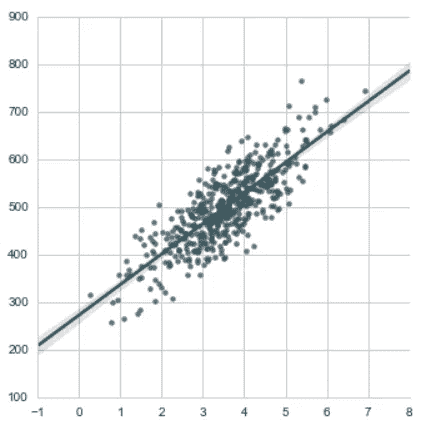
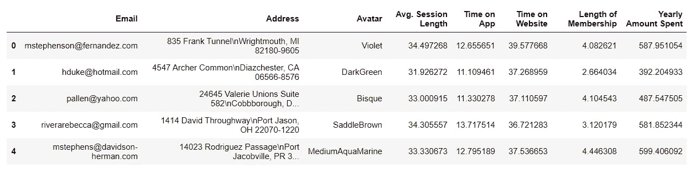
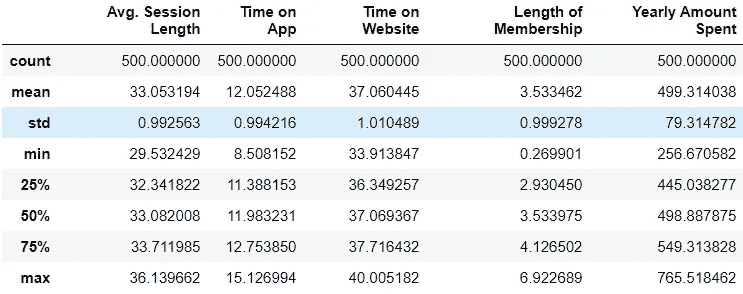
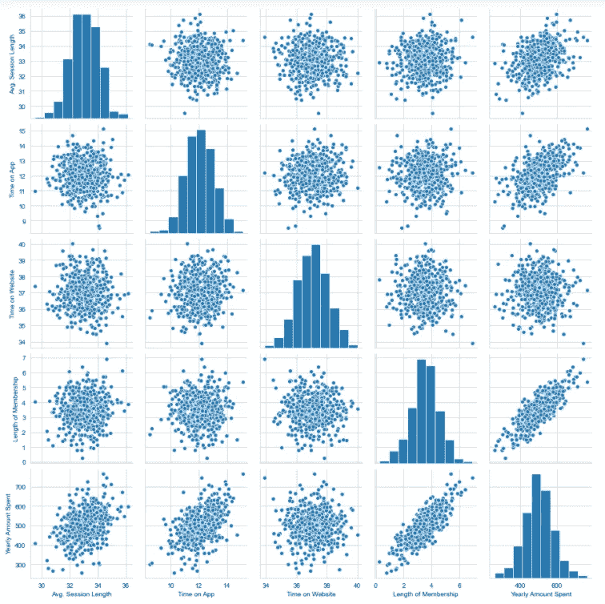
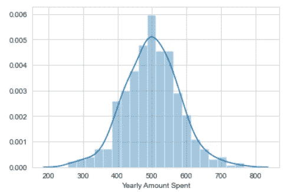
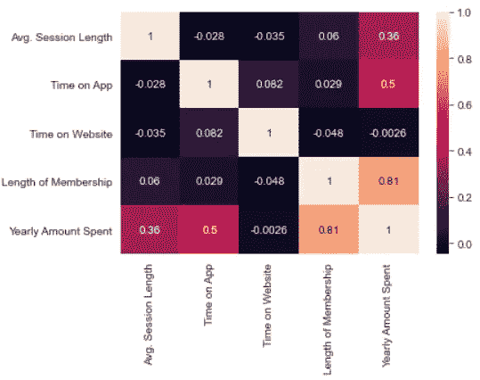
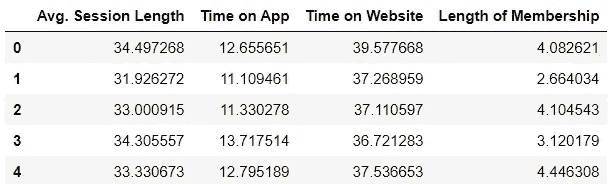
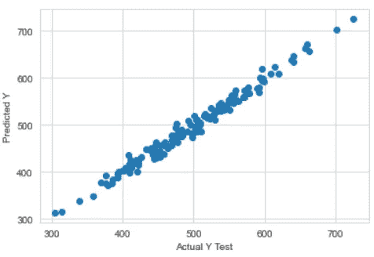
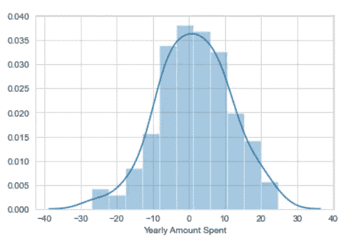
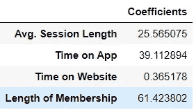

# 使用线性回归帮助发展电子商务——Python

> 原文：<https://pub.towardsai.net/helping-bloom-e-commerce-business-using-linear-regression-python-7de8f2334fb5?source=collection_archive---------2----------------------->

## [数据科学](https://towardsai.net/p/category/data-science)

## 理解和实施线性回归指南。



来源:作者

# 线性回归的历史是怎样的？

在 19 世纪，一个叫弗朗西斯·高尔顿的人通过研究父亲和儿子身高的相关性来研究父母和孩子之间的关系。他发现父亲的儿子很可能和父亲一样高。但主要的发现是，儿子的身高可能接近所有人的总体平均身高。

举个例子，如果有一个身高 7 英尺的父亲，那么他的儿子也有可能会很矮。但是因为 7 英尺高是非常罕见的，而且是一种异常现象，所以儿子有可能没有 7 英尺高。这被称为回归，其中儿子的身高趋向于(回归)平均身高。

# 线性回归的目标是什么？

目标是确定使所有数据点和直线之间的垂直距离最小的最佳直线。

# 如何用 Python 实现线性回归？

用于执行线性回归的数据集是一家服装店公司的电子商务数据集。目标是帮助该公司根据客户每年为发展业务所花费的金额来决定他们是否应该专注于他们的移动应用服务或网站。

**→进口包装**

像 NumPy 和 pandas 这样的基本包被导入来处理数据。对于数据可视化，导入了 matplotlib 和 seaborn。

```
**>>> import** pandas **as** pd
**>>> import** numpy **as** np
**>>> import** matplotlib.pyplot **as** plt
**>>> import** seaborn **as** sns
**>>> %**matplotlib inline
```

**→数据**

该数据包含以下各列:

1)客户信息—电子邮件

2)客户信息—地址

3)客户信息—彩色头像

4)平均值。会话长度:店内风格建议会话的平均会话时间

5)在应用上的时间:在应用上花费的平均时间(分钟)

6)在网站上的时间:在网站上花费的平均时间(分钟)

7)会员年限:客户成为会员的年限。

```
>>> df **=** pd.read_csv('dataset.csv')
>>> df.head()
```



来源:作者

通过使用“info()”函数，可以知道列和条目的信息。由此也可以知道列的数据类型。

```
>>> df.info()
<class 'pandas.core.frame.DataFrame'>
RangeIndex: 500 entries, 0 to 499
Data columns (total 8 columns):
 #   Column                Non-Null Count  Dtype  
---  ------                --------------  -----  
 0   Email                 500 non-null    object 
 1   Address               500 non-null    object 
 2   Avatar                500 non-null    object 
 3   Avg. Session Length   500 non-null    float64
 4   Time on App           500 non-null    float64
 5   Time on Website       500 non-null    float64
 6   Length of Membership  500 non-null    float64
 7   Yearly Amount Spent   500 non-null    float64
dtypes: float64(5), object(3)
memory usage: 31.4+ KB
```

通过使用 describe()函数，我们可以获得数值列的统计信息。

```
>>> df.describe()
```



来源:作者

**→数据可视化**

使用 seaborn 软件包，可以为整个数据框架绘制一个 pairplot，它只考虑数字列。它创建所有列的直方图以及相关散点图。

```
>>> sns.set_style('whitegrid')
>>> sns.pairplot(df)
```



来源:作者

> 根据上面的图表，可以说“会员时间”和“年消费金额”之间存在线性关系。

使用 seaborn 软件包，还可以为我们预测的目标列创建分布图，在本例中是“每年花费的金额”。使用该图可以看到 vlues 的分布。

```
>>> sns.distplot(df['Yearly Amount Spent'])
```



来源:作者

> 根据该图，可以确定平均值在 500 左右。

接下来，可以生成显示列之间相关性的相关图。1 表示非常高的相关性，0 表示没有相关性。

```
>>> sns.heatmap(df.corr(),annot**=True**)
```



来源:作者

**→分离预测值和目标变量**

这里的目标变量是“每年花费的金额”。预测变量是数字列的其余部分，因为线性回归模型不适用于分类列。

```
>>> x **=** df[['Avg. Session Length', 'Time on App','Time on Website', 'Length of Membership']]
>>> x.head()
```



来源:作者

```
>>> y **=** df['Yearly Amount Spent']
>>> y.head()
0    587.951054
1    392.204933
2    487.547505
3    581.852344
4    599.406092
Name: Yearly Amount Spent, dtype: float64
```

**→拆分成训练和测试数据**

scikit 学习包有助于将数据分为训练和测试数据。它是 Python 中机器学习最有用的库。sklearn 库包含了很多机器学习和统计建模的高效工具。拆分功能是从 sklearn 导入的。“x”和“y”数据被传递给生成分割训练和测试数据的函数。测试规模决定了测试中数据的比例。该值介于 0 到 1 之间。

```
**>>> from** sklearn.model_selection **import** train_test_split
>>> x_train, x_test, y_train, y_test **=** train_test_split(x, y, test_size**=**0.3)
```

**→训练模型**

线性回归模型是从 sklearn 包导入的。该型号在 sklearn 的线性型号系列中提供。导入模型后，将创建模型的一个实例。然后，该模型适合于训练数据集。

```
**>>> from** sklearn.linear_model **import** LinearRegression>>> lr **=** LinearRegression()>>> lr.fit(x_train,y_train)
LinearRegression()
```

**→预测**

可以使用“预测”方法对预测变量的测试数据进行预测。然后将这些预测与实际测试数据预测进行比较，以确定模型的准确性。

```
>>> pred **=** lr.predict(x_test)
>>> pred
array([577.87553409, 435.27155928, 546.5858502 , 391.51629942,
       607.95417641, 509.87240751, 619.18792019, 449.34481128,
       499.72263686, 456.3743405 ,...........................,
       591.25542691, 486.27032699, 474.25589187, 451.54855685,
       494.85641921, 554.82684019])
```

通过创建散点图，我们可以直观地看到预测值与实际值之间的差距。

```
>>> plt.scatter(y_test,pred)
>>> plt.xlabel('Actual Y Test')
>>> plt.ylabel('Predicted Y')
```



来源:作者

通过创建残差，可以清楚地了解数据。残差是实际值和预测值之间的差值。如果残差图呈正态分布，则意味着模型的选择是正确的。

```
>>> sns.distplot((y_test**-**pred))
```



来源:作者

**→评估指标**

对于回归，有 3 个最重要的评估指标。

1)平均绝对误差(MAE):它是误差绝对值的平均值。最容易理解的就是平均误差。

2)均方误差(MSE):它是平方误差的平均值。它惩罚在现实世界中更有用的更大的错误。

3)均方根误差(RMSE):它是平方误差平均值的平方根。它可以用“y”单位直接解释。

所有这些都被认为是损失函数，因为目标是最小化它们。

```
**>>> from** sklearn **import** metrics>>> print('MAE:', metrics.mean_absolute_error(y_test, pred))
>>> print('MSE:', metrics.mean_squared_error(y_test, pred))
>>> print('RMSE:', np.sqrt(metrics.mean_squared_error(y_test, pred)))
MAE: 8.078480566145505
MSE: 102.44872696972094
RMSE: 10.121695854436693
```

截距和系数可以找到。系数与相应的列相关。

```
>>> lr.intercept_
-1048.1193023639814>>> lr.coef_
array([25.56507478, 39.11289398,  0.36517849, 61.42380206])>>> coef_col **=** pd.DataFrame(lr.coef_,x.columns,columns**=**['Coefficients'])
>>> coef_col
```



来源:作者

这些系数的含义如下:

1)如果所有栏目保持不变，并且“app 上的时间”有单位增加，那么价格将增加 38 美元(每年花费的金额)。

2)如果所有栏目保持不变，并且“在网站上的时间”增加一个单位，那么价格将增加 0.7 美元(每年花费的金额)。

# 结论

从系数解释中可以得出结论，在应用程序上而不是在网站上继续电子商务业务将是富有成效的。

> *指数据集和笔记本* [*这里*](https://github.com/jayashree8/Machine_learning_supervised_models/tree/master/Regression%20models) *。*

## 初级机器学习书籍可以参考:

[](https://amzn.to/3i3XU1A) [## Python 机器学习:机器学习和深度学习的 Python 编程初学者指南](https://amzn.to/3i3XU1A) [](https://amzn.to/3fQc6IW) [## 一百页的机器学习书](https://amzn.to/3fQc6IW) 

## 可以参考的高级机器学习书籍:

[](https://amzn.to/2SxwQNw) [## 用 Scikit-Learn、Keras 和张量流进行机器学习:概念、工具和技术…](https://amzn.to/2SxwQNw) [](https://amzn.to/3wz62eE) [## 模式识别和机器学习(信息科学和统计学)](https://amzn.to/3wz62eE) 

> *联系我:* [*LinkedIn*](https://www.linkedin.com/in/jayashree-domala8/)
> 
> *查看我的其他作品:* [*GitHub*](https://github.com/jayashree8)