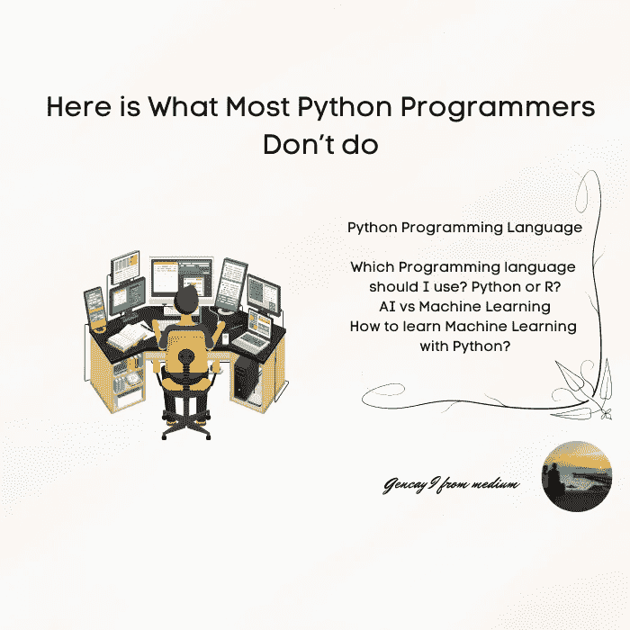
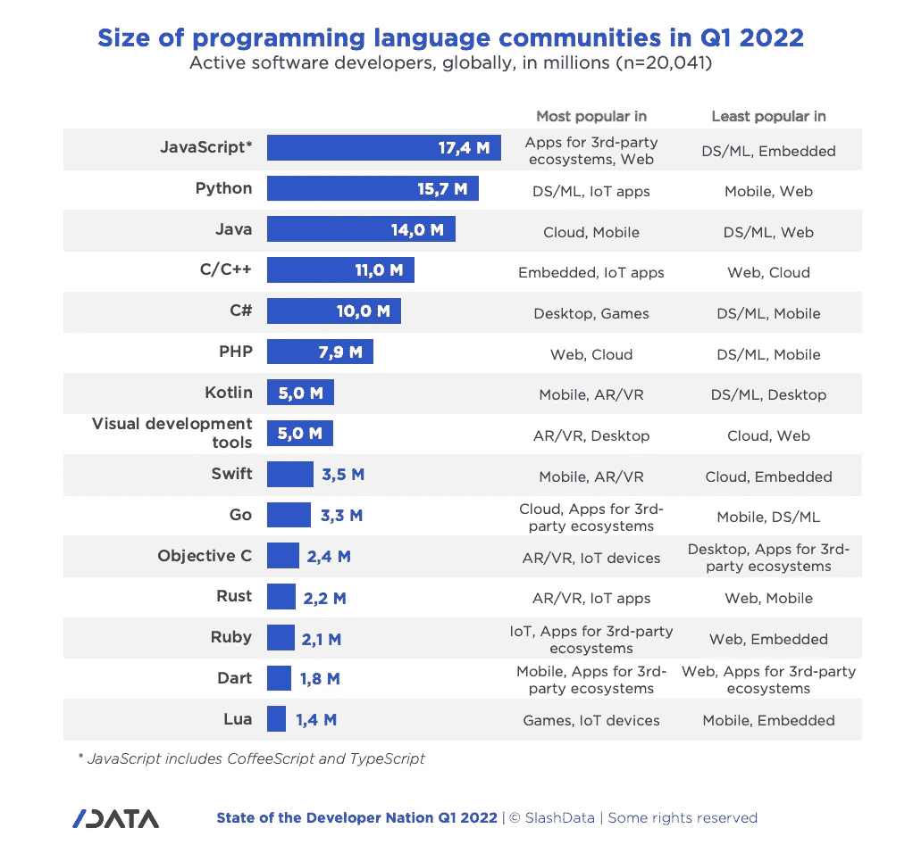
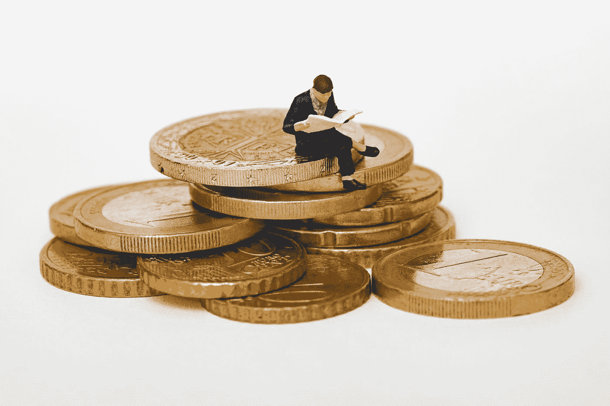
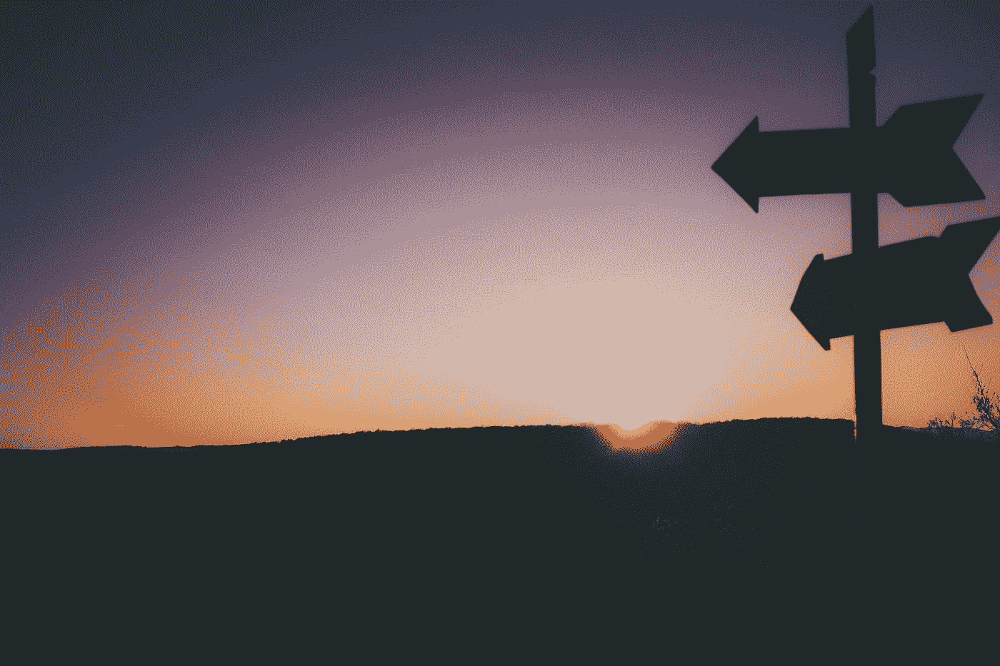
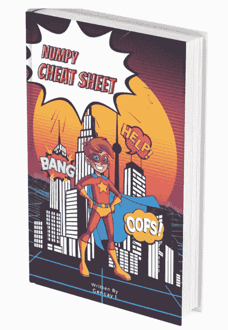

# 这是大多数 Python 程序员不做的事情

> 原文：<https://pub.towardsai.net/here-is-what-most-python-programmers-dont-do-f14ae321f5dc?source=collection_archive---------1----------------------->

## 学习机器学习的时候



作者图片

# 介绍

研究，研究，研究，然后计划。

> 研究就是看别人看过的东西，思考别人没想过的东西。
> 
> 艾伯特·森特·杰尔吉

研究的过程会拓宽你的视野，给你成长的机会。

在发展你所研究主题的知识的同时，你也会在你的头脑中找到隐藏问题的答案。

在清理你的头脑和清空你头脑中的所有想法后，你会更有动力去完成你的事业。

除非你从旅程开始就不这样做，否则你将像一艘没有航线的帆船，随风摇摆，随着风向的改变而改变航线。

> 我会花 55 分钟定义问题，然后用 5 分钟解决它。
> 
> [人名]阿尔伯特·爱因斯坦(犹太裔理论物理学家)

由于机器学习和编程的不断变化的本质，我试着给你一个例子，后者的研究是由伟大的研究所和我的研究所完成的。

现在，我们开始吧。

```
**Content Table****·** [**Introduction**](#ec55) **·** [**Python Programming Language**](#f62c)
  ∘ [How many users does the Python Programming language have?](#42af)
  ∘ [How to make money by programming?](#a0b0)
  ∘ [How to sharpen your skills in Python?](#11dd)
  ∘ [How to choose the best compiler while learning?](#4363)
**·** [**Which Programming Language should I use? Python or R?**](#2e1a) **·** [**AI vs Machine Learning**](#4b41) **·** [**How to learn Machine Learning with Python?**](#7fcd) **·** [**Final Thoughts**](#6547)
```

# Python 编程语言


在 [Unsplash](https://unsplash.com?utm_source=medium&utm_medium=referral) 上由 [Max Duzij](https://unsplash.com/@max_duz?utm_source=medium&utm_medium=referral) 拍照

Python 是 1991 年首次出现的计算机编程语言。
由于其易于使用的语法和内置解决方案的广泛应用，python 编程语言的用户大幅增加。python 编程语言越来越出名的原因之一是开发者可以使用数百种不同的库和框架。让我举一些例子；

*   ***Scikit learn*** —机器学习库
*   ***Numpy*** —科学计算库
*   ***烧瓶*** —微网框架。
*   ***Tensorflow*** —机器学习和人工智能开源软件库。

## Python 编程语言有多少用户？


约翰·施诺布里奇在 [Unsplash](https://unsplash.com?utm_source=medium&utm_medium=referral) 上拍摄的照片

在 2022 年的这项研究中，JavaScript 仍然是最受欢迎的编程语言，拥有 1750 万用户。

Python 是第二大最受欢迎的编程语言，拥有 1570 万用户，其中 330 万用户是在过去 6 个月中加入的。

虽然 JavaScript 在第三方生态系统和网络应用中最受欢迎，但 Python 在数据科学、机器学习和物联网应用中最受欢迎。

JavaScript 在 ***数据科学和机器 L*** 中最不受欢迎



## 编程怎么赚钱？



照片由[马修·斯特恩](https://unsplash.com/@mathieustern?utm_source=medium&utm_medium=referral)在 [Unsplash](https://unsplash.com?utm_source=medium&utm_medium=referral) 拍摄

媒体上有许多关于这个特定主题的文章。

它们中的大部分都是非常直观的，现在，在研究中也有了答案。

为了指出这一点，这里有一个有趣的图表，它让你对通过编码赚钱有了一点直觉。


## 如何在 Python 中磨砺自己的技能？


照片由 [C D-X](https://unsplash.com/@cdx2?utm_source=medium&utm_medium=referral) 在 [Unsplash](https://unsplash.com?utm_source=medium&utm_medium=referral) 上拍摄

在选择了编程语言之后，如果你选择的是 Python，有很多方法可以从 A-Z 开始提高你的技能。

学习一门新的编程语言类似于学习一门新的语言。一路上有些该做的事，有些不该做的事。

这里的[是](https://medium.com/codex/4-websites-that-will-take-your-python-skills-to-the-next-level-390f8a7f3c75) 4 个网站，它们会让你的 python 技能更上一层楼

## 如何在学习的同时选择最好的编译器？

如果您正在学习 python 编程语言，最好在学习过程中使用相同的 Python 编译器。

你可以选择不同的方式。

*   **py charm**
*   ***斯派德***
*   ***Jupyter 笔记本***
*   ***谷歌 Colab***

为了在这方面更快地发展自己，一路上在相同的环境中工作会给你一个好的开始。这就是为什么你在开始之前要做研究。

这里[是](https://medium.com/codex/how-to-choose-your-python-compiler-and-why-cdb914fe6f87)如何选择最好的 python 编译器进行编程。

# 我应该使用哪种编程语言？Python 还是 R？



Raul Petri 在 [Unsplash](https://unsplash.com?utm_source=medium&utm_medium=referral) 上拍摄的照片

我开始学习 R 编程，然后我决定从 R 转到 Python。如果我从 Python 开始，由于我花费的时间，这将给我一个学习更好的 Python 编码的机会。

这就是为什么你要在正式开始前做研究。

根据 Slash 数据报告，大约 70%的机器学习开发人员和数据科学家报告使用 Python。

只有 17 %的人选择 R 作为编程语言。

# 人工智能与机器学习


[附身摄影](https://unsplash.com/@possessedphotography?utm_source=medium&utm_medium=referral)在 [Unsplash](https://unsplash.com?utm_source=medium&utm_medium=referral) 上拍照

人工智能(AI)和机器学习都可以用于自动化概念。然而，机器学习是人工智能的一个子集。

我们举一个有和没有机器学习的 AI 的例子

*   机器学习
*   深度学习
*   自然语言处理
*   计算机视觉

机器学习是人工智能的一个子集，它让你有机会做出精确的预测，随着它的结果，许多行业改变了他们的商业决策。现在我们举一个机器学习应用的例子。

*   人脸识别
*   语音识别
*   无人驾驶汽车——比如特斯拉
*   推荐系统——针对不同用户的网飞电影推荐

# 如何用 Python 学习机器学习？

机器学习是不同原理的结合；

*   统计数字
*   编程；编排
*   结石


作者图片

如果你想成为机器学习的大师，你应该相应地选择你的道路。

没有必要把钱浪费在昂贵的课程上，[这里](https://medium.datadriveninvestor.com/machine-learning-road-map-in-2022-1a856fb71bf9)是给你的机器学习路线图 2022。

# 最后的想法


弗洛里安·范·杜恩在 [Unsplash](https://unsplash.com?utm_source=medium&utm_medium=referral) 上拍摄的照片

在收集了关于你未来路线图的信息后，坚持让你有机会将精力集中在同一点上，不断发展自己。

坚持和专注给你力量去克服你可能遇到的许多障碍。

不要忘记；

> 如果你不知道你要去哪里，任何一条路都会把你带到那里。
> 
> 刘易斯·卡罗尔

如果你想从事机器学习或 ai 方面的职业，请继续关注我，不要忘记在此订阅 [***。***](https://gencay.ck.page/)

感谢阅读我的文章。



作者图片

[***这里的***](https://gencay.ck.page/) ***是免费送给你的 Numpy 小抄。在这里订阅我的时事通讯，我会把小抄寄给你。***

> “机器学习是人类需要创造的最后一项发明。”尼克·博斯特罗姆

***如果你还不是 Medium 的一员，渴望通过阅读来学习，这里是我推荐的*** [***链接。***](https://medium.com/@geencay/membership)