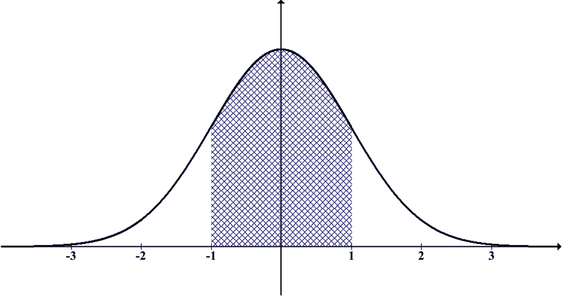
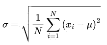
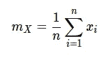
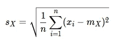
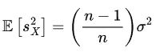
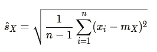

# 以下是您可能不正确使用 numpy.std 的原因

> 原文：<https://pub.towardsai.net/here-is-why-you-probably-use-numpy-std-incorrectly-276c40aaf82e?source=collection_archive---------1----------------------->

## Python 中如何正确估计标准差



钟形正态分布。图片由[openclipbart-Vectors](https://pixabay.com/users/openclipart-vectors-30363/)在 [Pixabay](https://pixabay.com/) 上生成

大小为 *N* 的正态分布总体可以用其均值μ和标准差σ来描述。这种分布也被称为钟形曲线。

标准偏差(std)可以使用等式计算。1.

方差(var)就是标准差σ的平方。



情商。1:大小为 N 且均值为μ的总体的标准差σ

**然而，如果我们用 NumPy 和 pandas 在 Python 中计算标准差，我们会得到不同的结果。**

在这篇文章中，你会了解到为什么会这样。

# np.std vs 熊猫 std

下面是 NumPy 的 std 和 pandas std 对于一些随机数据点的输出 *X.*

```
import numpy as np
import pandas as pd

X = [1, 2, 3, 4, 5, 6, 7, 8, 9, 10]

df = pd.DataFrame({'X': X})

print(f"numpy std(X): {np.std(X)}")
>> numpy std(X): 2.8722813232690143

print(f"pandas std(df): {df.std()}")
>> pandas std(df): X    3.02765
```

**如你所见，NumPy 给我们的标准差是 2.87，pandas 给我们的标准差是 3.02。那么，哪个是真的呢？**

# 贝塞尔校正

为了理解这个问题，我们必须更深入地研究标准差这个话题。

作为工程师或科学家，我们通常不知道真实的总体均值μ。然而，我们可以使用众所周知的等式从我们的数据点 *x* 计算样本均值。2.



情商。2:数据点 x 的样本平均值

通过用样本均值 *m* 代替总体均值μ，用样本大小 *n* 代替总体大小 *N* ，在等式。1、我们根据等式得到**样本标准差** *s* 。3.



情商。3:样本标准偏差

给定足够的数据点，我们希望样本标准差 *s* 尽可能接近总体的真实标准差σ。数学上，这可以用期望值来表示。

事实证明，对于样本标准差来说，这是不成立的。情商。4 表示样本标准差因附加项 *(n — 1)/n.* 有偏**，完整证明见参考文献[1]。**

****

**情商。4:样本标准差/方差有偏差[1]**

**通过替换等式中的 *n* 。3 用*(n-1)*，我们得到方差的无偏估计和标准差的更好估计。**

****这叫贝塞尔修正。****

****

**情商。5:对总体标准差的更好估计(贝塞尔校正)**

# **解释 np.std vs 熊猫 std**

**有了这些知识，我们现在可以解释 np.std 和 pandas std 函数之间的区别。**

**默认情况下，NumPy 使用`1/n`(等式。3)，而 pandas 使用贝塞尔的校正与`1/(n-1)`(等式。5).**

**我们可以通过指定参数`ddof`来改变 NumPy 的计算。**

> ****ddof:** int，可选**
> 
> **意味着自由度增量。计算中使用的除数是`N - ddof`，其中`N`代表元素的个数。默认情况下*的 ddof* 为零。**

**回到我们最初的 Python 例子，我们现在可以使用 np.std 中的参数`ddof`来获得标准差的无偏估计。**

```
import numpy as np
import pandas as pd

X = [1, 2, 3, 4, 5, 6, 7, 8, 9, 10]

df = pd.DataFrame({'X': X})

print(f"pandas std(df): {df.std()}")
>> pandas std(df): X    3.02765

print(f"numpy std (X, ddof=1): {np.std(X, ddof=1)}")
>> numpy std (X, ddof=1): 3.0276503540974917
```

**在`np.std`中设置参数`ddof = 1`现在给出了 3.02 的标准偏差。我们在熊猫身上得到了同样的结果。**

# **结论**

**贝塞尔校正通过将`n`替换为`n — 1`来减少来自样本标准偏差 *s* 的偏差。**

**NumPy 的 std 函数使用公式`n — ddof`。默认情况下，NumPy 使用`ddof = 0`，pandas 使用`ddof = 1`。**

**综上所述，如果你有一些来自总体的数据点，想用 NumPy 估计标准差，就用`np.std(X, ddof = 1)`。**

## **参考**

**[1]埃默里大学牛津学院——数学和计算机科学系，[贝塞尔的修正](http://mathcenter.oxford.emory.edu/site/math117/besselCorrection/)(访问日期:2022 年 12 月 14 日)**

**米（meter 的缩写））霍利克，[工程师概率统计导论](https://doi.org/10.1007/978-3-642-38300-7_3) (2013)，施普林格，柏林，海德堡。**

**熊猫。data frame . STD:[https://pandas . pydata . org/pandas-docs/stable/reference/API/pandas。DataFrame.std.html](https://pandas.pydata.org/pandas-docs/stable/reference/api/pandas.DataFrame.std.html)(访问日期:2022 年 12 月 14 日)**

**numpy . STD:[https://numpy . org/doc/stable/reference/generated/numpy . STD . html](https://numpy.org/doc/stable/reference/generated/numpy.std.html)(访问时间:2022 年 12 月 14 日)**