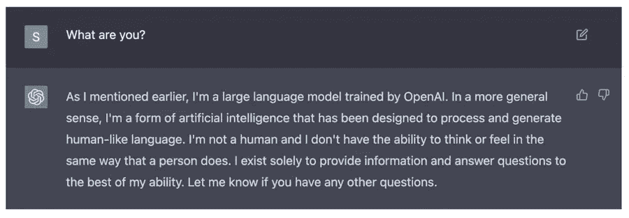
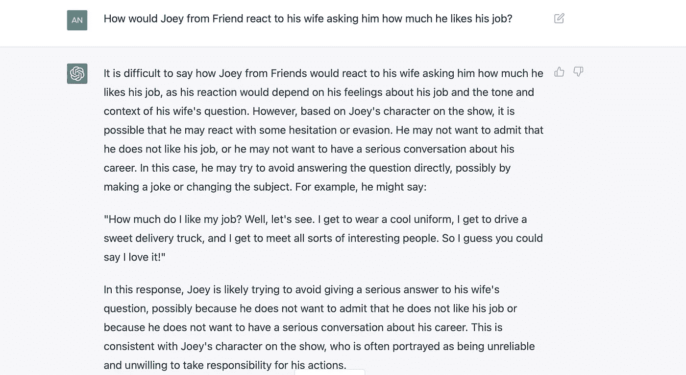
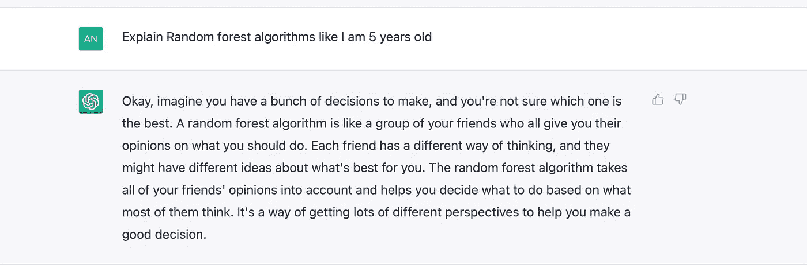

# 嘿 ChatGPT，你能为人类做些什么？

> 原文：<https://pub.towardsai.net/hey-chatgpt-what-can-you-do-for-humans-58e2dcf0c09f?source=collection_archive---------2----------------------->

## 乔伊·崔比昂尼会如何回应他的妻子问他是否喜欢他的工作

Pic 鸣谢:Unsplash

一个让世界大吃一惊的人工智能听起来像是一部奇幻电影，或者至少是不会很快发生的事情。

但是人工智能研究实验室 OpenAI 创造了一个非常强大的人工智能助手 ChatGPT，扭转了局面。他们正在图像和语言理解领域取得一些重大进展，看到他们在 2023 年的下一步会是什么将是令人兴奋的！

ChatGPT 在公开后的几天内就成了网络红人。它在 5 天内达到了 100 万用户，与其他互联网巨头所用的时间相比，这是非常不可思议的:

*   网飞用了 3.5 年
*   Twitter 花了两年时间
*   脸书花了 10 个月
*   Spotify 花了 5 个月
*   Instagram 花了 3 个月
*   ***ChatGPT 用了 5 天！***

**太神奇了！不是吗？**

就连埃隆·马斯克(Elon Musk)也无法阻止自己在推特上谈论 ChatGPT 的热潮。

在这篇博客中，我们将着眼于您需要了解的关于 ChatGPT 的每个重要方面，以便您也可以在日常工作中利用这项令人惊叹的技术。

# 什么是 ChatGPT？

让我们直接听听人工智能的说法:

什么是 ChatGPT(图片由作者提供)

所以，它是一个人工智能助手，尽最大能力向*提供信息和回答问题。*

*是的，尽其所能——有时它也可能是错误的。*

# *ChatGPT 能为我们做什么？*

*ChatGPT 可以编写和调试代码，进行有意义的对话，创建内容(诗歌、博客)，解释概念，并且可以替代你的谷歌搜索的某些 。*

*让我们看几个例子:*

## *1.写代码*

*ChatGPT 是一个非常神奇的编码助手——我们只需要输入我们想要实现的功能和期望的编码环境，ChatGPT 就会输出代码。*

## *2.调试代码*

*ChatGPT 不仅可以编写代码，还可以像专家一样调试代码！*

## *3.理解推理*

*对语言的深度理解和巧妙答题的能力才是最不可思议的。*

## *4.了解个性特征*

*我问了 ChatGPT 几个问题，以了解它对电视人物性格特征的理解程度，得到的回答非常准确😳！*

*它知道哈维·斯佩克特(来自 Suits)可能会使用什么搭讪语:)*

**

*《西装革履》中的哈维·斯佩克特*

*它了解乔伊的个性，乔伊是我最喜欢的情景喜剧《老友记》中的角色之一。*

**

*《老友记》中的乔伊(图片由作者提供)*

## *5.可以当家教*

*看到 ChatGPT 能够很好地解释复杂的概念、代码等是很有趣的。*

*下面是 ChatGPT 解释随机森林算法的一个快照。*

**

*作者图片*

## *6.操纵数据*

*ChatGPT 操纵数据的能力非常可观！它可以生成表格中的数据，添加索引，理解 JSON 等等。*

*下面的线程展示了一些惊人的例子，说明 ChatGPT 如何在不编写任何代码的情况下操作数据。*

## *ChatGPT 比 Google 好吗？*

*在某些情况下，与谷歌相比，它能给出更好、更直接的结果。*

*但是我们不能相信 ChatGPT 的所有结果，因为有时它可能是错误的和有偏见的。*

## *ChatGPT 出问题了！*

# *结论*

*ChatGPT 具有一些令人惊叹的能力，可以成为人类非常强大的人工智能助手。我们可以开始在日常工作中测试它，以了解它在哪里工作得好，以及它无法处理哪些任务，很快我们就会知道如何有效地使用这种强大的人工智能来提高我们的生产力。*

*谁知道呢，ChatGPT 可能会让所有人都有可能每周工作 4 天。*

## *感谢您的阅读！希望你喜欢！*

*你可以在收件箱里看到我所有的帖子。 [***做到这里*** *！*](https://anmol3015.medium.com/subscribe)*

**如果你自己喜欢体验媒介，可以考虑通过* [***注册会员***](https://anmol3015.medium.com/membership) *来支持我和其他几千位作家。它每个月只需要 5 美元，它极大地支持了我们，作家，你可以在媒体上看到所有精彩的故事。**

****关注我*** *查看我在你的订阅中的数据科学帖子。**