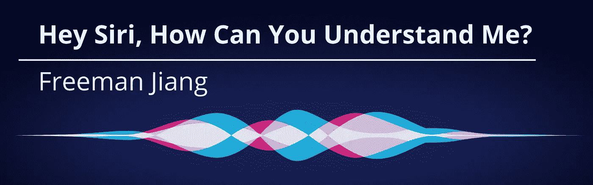
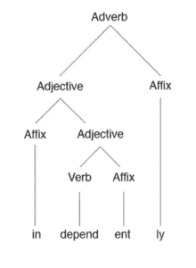
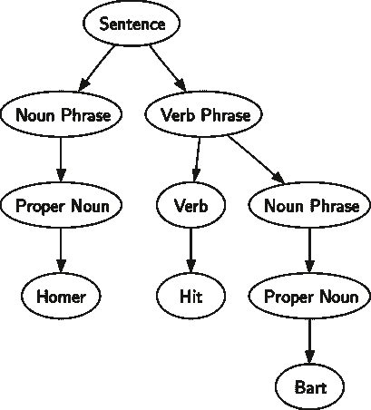
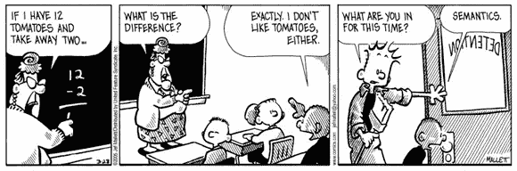
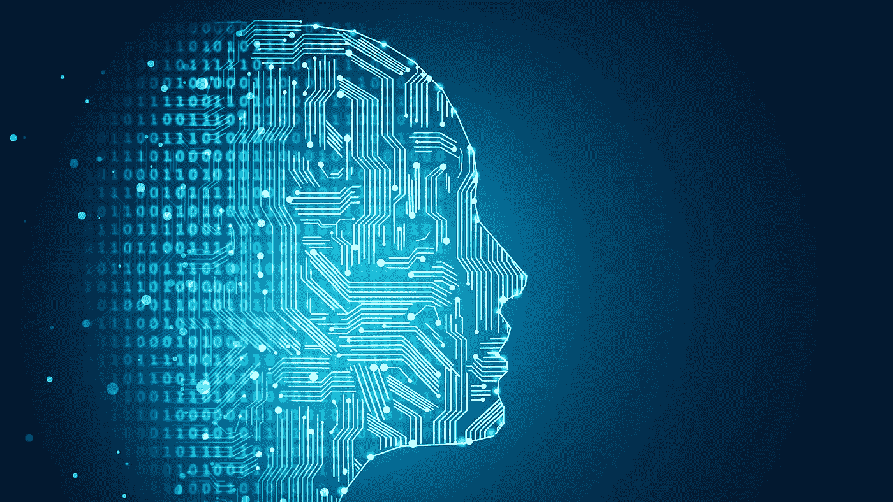

# 嘿 Siri，你怎么能理解我？

> 原文：<https://pub.towardsai.net/hey-siri-how-can-you-understand-me-5c00da8d9ead?source=collection_archive---------0----------------------->

## 探索人工智能中的自然语言处理算法

如今，任何人都可以拿起手机，问它一个问题，并获得相关的(通常是准确的)回应——这一切都在几秒钟内完成。我们通常不会质疑这是如何做到的，或者这是如何可能的。

事实是，直到最近，计算机能够直接理解人类语言更不用说给出回应的想法还是闻所未闻的。人类语言极其复杂，有无数的细微差别、例外和规则。我们通常认为构建我们每天使用的数字助理的工作量是理所当然的。

本文将解释计算机算法如何在更高层次上理解人类语言。大家系好安全带，因为我们要回英语课了。

# 但是首先——自然语言处理:它是什么？

自然语言处理或 NLP 是人工智能的一个子领域，结合了计算机科学、语言学和信息工程。它允许计算机像真人一样阅读、破译、理解人类语言。

然而，不要以为这很容易。理解人类语言最困难的一点是，它与计算机习惯阅读的清晰、直接的代码非常不同。人类语言极其复杂，许多都是基于上下文的。这意味着在一个语境中表示一种意思的单词在另一个语境中有完全不同的意思。只要看看“set”这个词有多少种不同的意思——有几百种。那么它是怎么做到的呢？计算机如何理解一个抽象的概念，而这个概念是人类经过几百万年的进化才实现的？让我们找出答案。

# 第一部分:形态学

在最基本的层面上，计算机必须理解它试图交流的语言的形态，也就是说，单个单词的结构和功能。

形态树

左边的图像显示了一个**形态树，**每个单词被分成越来越多的特定部分的可视化表示。

由于许多人类分类员的辛勤工作，现在已经有了分类库，包含了英语中大多数单词的拆分部分。

训练 NLP 算法的传统方式是让它们通过这些手动排序的库— **文本语料库—** 像这样的[这里的](https://www.sketchengine.eu/brown-corpus/)。这被称为**监督学习**，其中数据已经被标记**。**然而，由于语言总是在发展和变化(只要想想古代英语与现代英语有多么不同)，这些文本语料库中的预设规则并不总是训练 NLP 算法的最佳方式。

现代 NLP 算法是自我学习的，它们在阅读时为文本语料库定义规则，提出自己的规则。这种训练方法使用**半监督学习，**其中一些数据已经分类，但由计算机决定它将使用哪些规则来分类其余的数据。

# 第 2 部分:语法

如果形态学是关于理解单词的结构和组成，那么理解**句法**就需要理解**整个句子的结构**。当大多数人看到一个句子时，他们只能直观地理解它。另一方面，计算机需要把那句话分解成短语。在这样做的时候，他们创建了名为**解析树的树形图。**

一个简单的解析树

这里需要注意的是，每种语言都有自己的语法规则，每种语言中短语的组合方式也不同。

像词法树一样，特定语言的句子结构规则可以手工编程到计算机程序中，或者通过使用文本语料库来学习。解析树可以非常简单，如左图所示，也可以非常复杂，具体取决于长度。

# 第 3 部分:语义

开发自然语言处理算法的下一步是让它识别单词的语义或 T21。这样做的问题是，同一个词(因此具有相同的形态)可能有不同的意思，即使它们的句法功能是相同的。

> "在**板上**切苹果. "
> 
> “董事长刚刚走进来”

以这两个例句为例——单词“board”的意思完全不同，尽管它们都是拼写相同的名词。对我们来说，差异是显而易见的，但对计算机来说，这可能很难。

可以训练计算机识别差异的一种方法是查看使用该单词的**上下文**——或者简单地说，该单词前后的单词。如果“苹果”在单词“板”之前，很可能这个板是一个砧板。相反，如果“董事长”在“董事会”之前，我们最有可能谈论的是董事会。

同样，需要注意的是，没有大量的数据，这一切都是不可能的。这就是我们求助于我们永远有用的朋友——文本语料库的地方。通过分析同一个单词在大量的例子和上下文中是如何使用的，计算机最终可以学习该单词的不同含义。这意味着即使你给它一个**完全新的句子**，它仍然能理解那个句子中单词的意思。

# 第四部分:语用学

到目前为止，我们的算法可以理解单个单词的含义，甚至这些单词在不同句子中的功能。通常，这足以理解基本水平的语言，这也是当今大多数 NLP 算法的水平。然而，为了将它带到下一个水平的*，计算机必须理解**语用学、**围绕整个句子的上下文。在这一点上，我们的 NLP 算法将知道每个句子作为一个整体的确切含义(想想宏观语义)。*

这是一个连人类都在奋斗的领域。对于母语不是英语的人来说，这一点变得很明显。像**讽刺**、**讽刺**和**幽默**(像双关语)这样的语言手段经常被忽视，除非听者或读者能流利地使用这种语言。

如果你想了解更多关于计算机如何理解语用学的内容，我绝对推荐[这项来自西班牙巴伦西亚大学的研究](https://riunet.upv.es/bitstream/handle/10251/35314/From%20Humor%20Recognition%20to%20Irony%20Detection.pdf?sequence=8&isAllowed=y)。

# 回到 Siri

好了，现在我们对我们的计算机如何理解语言有了一个基本的了解——太好了！一旦 NLP 算法经过足够的训练，它们就可以像任何有经验的说话者一样理解语言。当你问 Siri 明天天气如何时，你的音频被转换成文本(这是一个超级酷的过程，将在未来的文章中解释！).然后，一旦它成为计算机习惯看到的形式(文本)，所有的 NLP 训练就开始了。

所有那些小时(或天…或周👀)的训练会有回报，因为一旦它理解了你想问它的意思，它就会给出一个预编程的响应——对你的问题或陈述的相关回答。目前，数字助理给出的大多数回答已经被编码到系统中。这意味着，如果你让它设定明天早上 7 点的闹钟，它会这样做，但如果你问它生命的意义，它很可能只是在网上搜索另一个答案。

未来，随着人工智能聊天机器人进化出**新的** *和* **相关的**答案，我们很快将不再能够区分人类和机器。当我们浏览互联网时，谁知道我们是在和一个人还是一台电脑交谈呢？这绝对是值得考虑的事情。

# 关键要点

*   自然语言处理(NLP)是一个现在无处不在、很大程度上不受重视的人工智能子领域，它已经允许计算机理解人类语言，就像真人一样
*   人类语言极其复杂，理解它们需要计算机能够访问大量的数据
*   为了完全理解一种语言，计算机必须理解其独特的**词法、句法、语义、**和**语用**
*   像 Siri、Alexa 和 Google Home 这样的现代数字助理都依赖于 NLP 来理解并给出用户问题的相关答案
*   在未来，人工智能有可能产生与人类无法区分的新的相关反应。在这一点上，我们将不再能够仅仅通过交谈来知道谁是人，谁不是人。