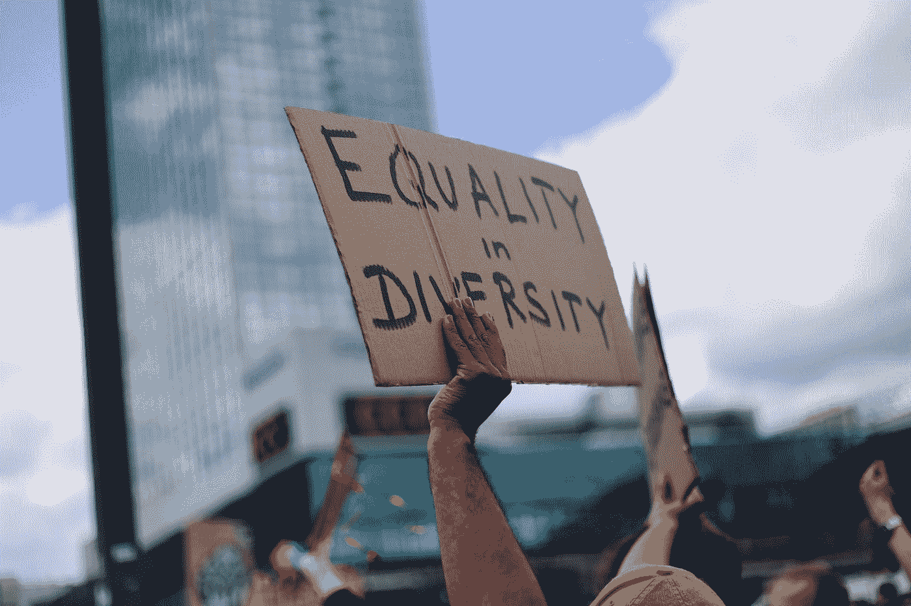
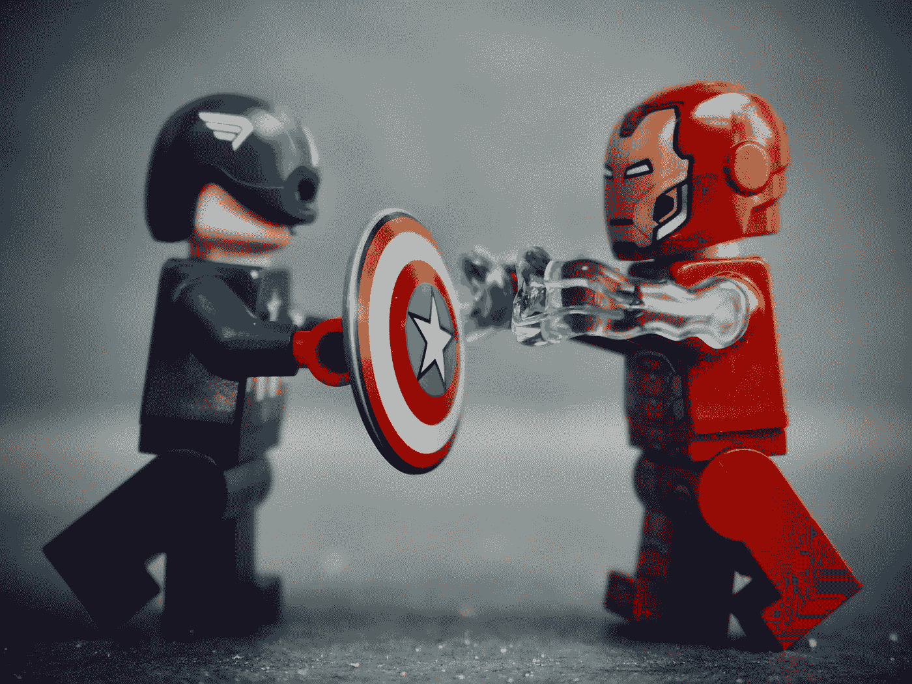
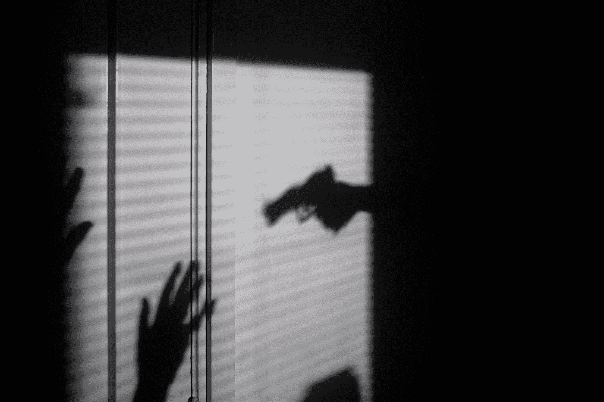

# 嘿…你的人工智能弄疼我了！！

> 原文：<https://pub.towardsai.net/hey-your-ai-is-hurting-me-ae12c2ab688a?source=collection_archive---------1----------------------->

> 不成熟的人工智能不是允许系统性偏差的理由。

随着人工智能(AI)的使用不断增长和扩展，对 AI 系统中偏见的担忧日益突出。人工智能中的偏见可能会产生严重的后果，包括歧视某些人群，使现有的社会不平等永久化，以及做出不公平甚至有害的决定。

让我们来看看一些急于实现人工智能却不尽如人意的突出例子

艾米·埃尔廷在 [Unsplash](https://unsplash.com?utm_source=medium&utm_medium=referral) 上拍摄的照片

## 肾病预测 AI 吸女人: [DeepMind health](https://www.fiercebiotech.com/medtech/troubling-study-finds-googles-kidney-disease-predicting-ai-performs-worse-women-and-may-not)

*   退伍军人管理局的研究人员 DeepMind 的研究人员承认，训练数据包括 6.38%的女性和所有 93.62%的男性。据退伍军人事务部的研究人员称，“这一人群的模型性能较低”，他们当时写道，尽管他们的发现仅限于急性肾衰竭早期患者。该模型在男性中的 AUC(准确性的度量)为 83%,而在女性中为 71%。这种类型的偏见可能导致获得医疗保健的不平等，并可能导致个人获得不充分或不适当的护理。现在想象一下，如果这种疾病在不同种族间有不同的生物学特征。这些有代表性吗？

## AI 误打误撞残疾人:[微软研究院](https://www.microsoft.com/en-us/research/uploads/prod/2019/07/Research_Roadmap_ASSETS_2019_Workshop_final.pdf)

*   此外，这篇[文章](https://makeitfable.com/article/ai-and-analytics-people-with-disabilities/)表明，像搜索结果、广告或地图这样的人工智能系统经常显示不相关或对某些人群有偏见的结果，例如残疾人或生活在某些地理区域的人。这个问题的一个延伸是，残疾人不能有效地使用语音识别系统。这种偏见会导致人们在真正需要帮助的时候得不到帮助。即使是像这样的消极偏见也可能导致获取信息和机会方面的现有不平等。

## 同学们！我们错误地判断了你的潜力:[科内尔研究](https://arxiv.org/abs/2208.10625)

*   这种人工智能算法可以预测学生在某个学术项目或领域取得成功的可能性。它从未被评估过在得不到充分服务的人群中的公平性。本文评估了不同的群体公平措施的学生成绩预测问题的各种教育数据集和公平意识的学习模型。研究发现，选择公平的措施是重要的，同样的选择等级门槛。这种系统中使用的人工智能歧视某些种族或社会经济背景的学生。这种偏见可能导致学生被置于不适当或不平等的学习环境中，并可能加剧现有的教育不平等。

照片由[马特乌斯·瓦卡韦克](https://unsplash.com/@wacalke?utm_source=medium&utm_medium=referral)在 [Unsplash](https://unsplash.com?utm_source=medium&utm_medium=referral) 拍摄

## 脸书说打木偶:[华盛顿邮报报道](https://www.washingtonpost.com/technology/2021/11/21/facebook-algorithm-biased-race/)

*   用于对用户新闻内容进行优先排序的人工智能算法可以放大有争议或耸人听闻的内容，使用户更有可能遇到和接触这种类型的材料。此外，人工智能聊天机器人和社交媒体账户可用于自动生成和传播分裂或煽动性内容，可能会引发用户的强烈反应。此外，旨在生成个性化内容或推荐的人工智能算法有时可能会将用户带入“回音室”，在那里他们只会遇到与自己的信念相符的信息和观点，这可能会进一步加剧分裂或煽动性的互动。所有这些都是保持“用户参与”的机制，因此数据可以以牺牲用户的精神健康、整个种族或整个少数群体为代价进行出售。

## 黑人..你们都一样吧？(2019): [哈佛研究](https://www.washingtonpost.com/technology/2019/12/19/federal-study-confirms-racial-bias-many-facial-recognition-systems-casts-doubt-their-expanding-use/)

*   这项研究发现，亚裔和非裔美国人被误判的可能性是白人的 100 倍。美洲原住民的假阳性率最高。在警方调查人员使用的各种搜索中，非裔美国女性更容易被错误地识别出来。这些是联邦调查局使用的相同系统(2011 年至 2019 年的 390，000 次搜索)。根据哈佛大学的一项研究，商业面部识别系统更有可能错误识别肤色较深的人[。这种类型的偏见可能导致错误的逮捕，并对被系统错误识别的个人造成其他负面后果。](https://sitn.hms.harvard.edu/flash/2020/racial-discrimination-in-face-recognition-technology/)

## 微软人工智能聊天机器人(2016): [微软](https://spectrum.ieee.org/in-2016-microsofts-racist-chatbot-revealed-the-dangers-of-online-conversation) - [Tay](https://spectrum.ieee.org/in-2016-microsofts-racist-chatbot-revealed-the-dangers-of-online-conversation)

*   微软-Tay 的聊天机器人从 Twitter 对话中学习被发现表现出种族主义或性别歧视行为，使用歧视性或攻击性的语言。这种类型的偏见可以为聊天机器人所针对的个人创造一个充满敌意的环境，也可以对创建聊天机器人的组织或个人产生不良影响。OpenAI 对它免疫吗？不尽然，像这样的故事[tweet](https://twitter.com/spiantado/status/1599462375887114240?ref_src=twsrc%5Etfw%7Ctwcamp%5Etweetembed%7Ctwterm%5E1599462375887114240%7Ctwgr%5Ed871e910844ccf6f332a70d7688f4ffb9ec378c5%7Ctwcon%5Es1_&ref_url=https%3A%2F%2Fwww.thedailybeast.com%2Fopenais-impressive-chatgpt-chatbot-is-not-immune-to-racism)chatGPT 写了一个等式，要成为一个好的科学家，你必须是白人和男性

## 用于筛选工作候选人的 AI 歧视(2022): [链接](https://www.npr.org/2022/05/12/1098601458/artificial-intelligence-job-discrimination-disabilities)

*   用于招聘或工作表现评估的人工智能系统已被发现对某些人群存在偏见，如女性或具有特定文化背景的个人。与工作相关的流行人工智能工具的例子包括简历扫描仪、根据按键对员工进行排名的员工监控软件、评估工作技能的类似游戏的在线测试，以及测量一个人的说话模式或面部表情的视频面试软件。这种类型的偏见会妨碍合格的个人被雇用或晋升，并会加剧工作场所现有的不平等。

## 针对弱势借款人的信用评分算法:[斯坦福研究](https://hai.stanford.edu/news/how-flawed-data-aggravates-inequality-credit)

*   用于信用评分和贷款审批的人工智能系统已被发现对某些人群存在偏见，如低收入或居住在特定社区的个人。现在[一项预印本研究](https://arxiv.org/abs/2105.07554)中，研究人员使用人工智能测试替代信用评分模型，发现低收入家庭和少数族裔借款人确实存在一个问题:预测工具对这些群体的准确性比高收入和非少数族裔群体低 5%至 10%。这种偏见会阻碍个人获得信贷或贷款，并会加剧金融系统中现有的不平等。

## “黑人作为一个群体风险分值更高”: [COMPAS AI](https://massivesci.com/articles/machine-learning-compas-racism-policing-fairness/)

*   2016 年，ProPublica [报道](https://www.propublica.org/article/machine-bias-risk-assessments-in-criminal-sentencing)美国各地法庭使用的一种预测未来犯罪的人工智能工具，替代制裁的矫正罪犯管理概况(COMPAS)，对黑人被告有偏见。这种偏见会导致刑事司法系统对个人的不公平待遇。更糟糕的是，COMPAS 的母公司 Northpointe 反驳了 ProPublica 的说法，称该算法是按照预期的运行的[。Northpointe 认为黑人在被捕后有更高的犯罪风险。根据诺索恩特的说法，这导致黑人作为一个群体的风险得分更高。Northpointe 现在更名为 Equivant，它还没有公开改变计算风险评估的方式。](https://www.equivant.com/response-to-propublica-demonstrating-accuracy-equity-and-predictive-parity/)

照片由[马克西姆·霍普曼](https://unsplash.com/@nampoh?utm_source=medium&utm_medium=referral)在 [Unsplash](https://unsplash.com?utm_source=medium&utm_medium=referral) 上拍摄

# 改变需要是普遍的:政策

为了解决这些问题，政策在减少人工智能在我们生活中的实施偏差方面的作用至关重要。决策者有能力建立指导方针和法规，确保人工智能系统以公平和公正的方式设计、开发和使用。

## **透明度&问责制**

政策有助于减少人工智能偏见的一种方式是要求人工智能系统的开发和使用具有透明度和问责制。这可以包括一些措施，例如发布有关用于训练和评估人工智能系统的数据的信息，并使个人有可能挑战人工智能系统做出的决定。通过明确人工智能系统是如何开发和使用的，决策者可以帮助确保人工智能系统不会对某些人群产生偏见。

## 为质量和准确性设定标准

政策可以帮助减少人工智能偏见的另一种方式是为用于训练和评估人工智能系统的数据的质量和准确性设定标准。人工智能系统只和它们被训练的数据一样好，如果数据有偏差或有缺陷，人工智能系统也会有偏差或有缺陷。通过建立人工智能系统中使用的数据的质量和准确性标准，决策者可以帮助确保人工智能系统基于高质量的数据，这些数据代表了它们打算服务的人群。

## 建立减轻偏见的机制

最后，当检测到偏见时，该政策可以通过建立解决和减轻偏见的机制来减少人工智能中的偏见。这可以包括为研究人员和开发人员提供资源和支持等措施，这些人员和开发人员致力于检测和减轻人工智能系统中的偏见，并建立在发现偏见时解决偏见的流程。通过创建这些机制，决策者可以帮助确保人工智能系统以公平的方式使用，并使整个社会受益。

## 结论

人工智能的偏见是新时代的祸根。在我们的生活中，政策在减少人工智能实施偏差方面的作用至关重要。通过建立确保以公平和无偏见的方式设计、开发和使用人工智能系统的指导方针和法规，决策者可以帮助减轻人工智能偏见的潜在负面后果，并确保人工智能的使用方式有利于所有肤色的社会。

克里斯·劳顿在 [Unsplash](https://unsplash.com?utm_source=medium&utm_medium=referral) 上的照片

支持我🔔 ***拍手***|**|*跟随|*** [***订阅***](https://ithinkbot.com/subscribe)***|***[***成为会员***](https://ithinkbot.com/membership) **🔔**

检查我的其他作品—

 [## GitHub CoPilot 遭遇第二起诉讼

### 第二次集体诉讼已于 11 月 10 日提交

ithinkbot.com](https://ithinkbot.com/github-copilot-hit-with-2nd-lawsuit-ed537c0b2c9a)  [## 谈判的艺术:西塞罗·艾

### 西塞罗·艾在外交的游戏中比人类更能谈判。就像深蓝代表国际象棋，五号代表…

pub.towardsai.net](/the-art-of-negotiation-cicero-ai-6e04354fe990)  [## OpenAI 正在给 GPT 加水印:不再抄袭

### 知识产权保护通常被称为人工智能模型的“水印”，对人工智能的未来用例至关重要。这是被…

ithinkbot.com](https://ithinkbot.com/human-vs-gpt-methods-to-watermark-gpt-models-e23aefc63db8)  [## OpenAI 刚刚发布了 GPT-3 文本-达芬奇-003，我把它和 002 进行了对比。结果令人印象深刻！

### OpenAI GPT-3 文本-达芬奇-003 产生更好的质量结果(写作质量，格式，语法，和被…

ithinkbot.com](https://ithinkbot.com/openai-just-released-gpt-3-text-davinci-003-i-compared-it-with-002-the-results-are-impressive-dced9aed0cba)