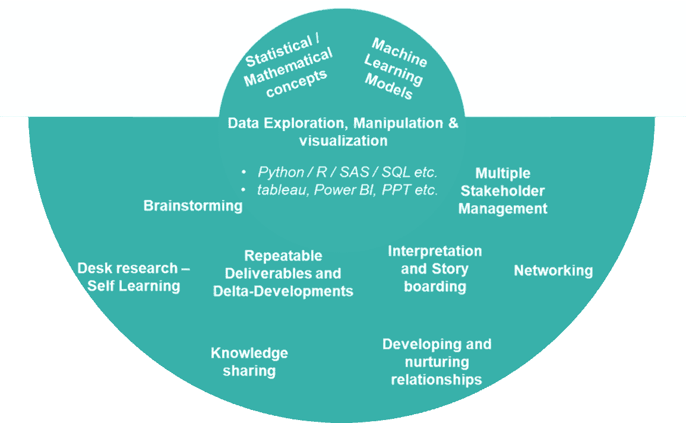

# 作为数据科学家隐藏的一面

> 原文：<https://pub.towardsai.net/hidden-aspect-about-being-a-data-scientist-aa4da669fbf6?source=collection_archive---------2----------------------->

## [数据科学](https://towardsai.net/p/category/data-science)

## 当代“最性感”工作中众所周知和不太为人知的方面。

照片由[在](https://unsplash.com/@thisisengineering?utm_source=medium&utm_medium=referral) [Unsplash](https://unsplash.com?utm_source=medium&utm_medium=referral) 上拍摄

**数据科学是一个新兴领域**，它在几十年前就已经开始发展，而**在过去的十年里势头越来越猛**。随着越来越多的企业意识到自己的潜力，信息技术也在不断发展，改变着它们的形态和形式。随着数据科学被认为是游戏规则的改变者，越来越多的参与者试图利用并证明其在推动业务方面的价值，难怪**“数据科学家”被认为是当今“最酷”的工作之一**。《哈佛商业评论》在 2012 年发表了一篇[文章](https://hbr.org/2012/10/data-scientist-the-sexiest-job-of-the-21st-century)“**数据科学家:21 世纪最性感的工作**”(见下文)。

 [## 数据科学家:21 世纪最性感的工作

### 2006 年 6 月，当乔纳森·戈德曼(Jonathan Goldman)来到商务社交网站 LinkedIn 工作时，这个地方仍然让人感觉…

hbr.org](https://hbr.org/2012/10/data-scientist-the-sexiest-job-of-the-21st-century) 

有了这样的关注，这份档案自然会吸引很多人才，站在职业十字路口的人开始阐述他们对成为数据科学家意味着什么的想法。所谓的“性感”方面被大肆宣传和频繁谈论；然而，还有一些其他方面对于这份工作来说是不可或缺的，但却不为人所知。我将根据我迄今为止的旅程，思考作为一名数据科学家的众所周知和不太为人知(或隐藏)的方面。

让我们从理解成为一名数据科学家意味着什么开始。

# 数据科学家

数据科学家，简单来说就是**研究数据**(即数据科学)的人。应用逻辑(或科学)算法/框架来理解数据的人。某人**处理、分析、建模和解释任何类型的数据**以获得**有意义的见解**并帮助**解决业务问题** *(并且在大多数情况下识别更多的问题！)*。

> 数据科学家是真正玩弄数据并让它说话的人。

成为一名优秀的数据科学家所需的技能因组织而异，但这些技能绝对不仅限于我们经常听到或读到的方面。这个角色的某些部分**比广为人知的要深入得多。**

根据我的思考，我将把这些方面(以及所需的技能)分成三个部分，这绝不是全面的:
(1)核心方面——我们都听说过/读过这些。
(2)下层——嵌入角色日常的必备隐性部分。
(3)隐藏的方面——做好这些事情会让你走向成功。

# 1.核心方面

这些可以被认为是“热巧克力”杯顶部的**奶油，我们可以在前面看到。成为一名数据科学家最吸引人、被谈论最多、被广泛宣传的部分。我们不都喜欢一个人坐在 3-4 个屏幕前，看着各种图表、表格、数字和代码行的视觉效果吗？个人按下键盘上的几个键，所有屏幕上的东西都会更新——我们在电影中见过，它吸引了我们所有人。这些可以被认为是**处理数据**的必备技能。**

## 建筑模型

作为一名数据科学家，最受欢迎的方面可能是你可以**建立模型**，这些模型拥有**预测未来结果的能力**。数据科学家尝试了**过多的监督或无监督的机器学习模型**，这些模型需要优化才能达到设计的结果。这意味着拥有健全的“酷”**数学/统计/机器学习概念** — *的**概念和实践知识**，这是任何“无名氏”都无法拥有的*，这使得“数据科学家”成为当今时代令人羡慕的工作。

## 探索性数据分析

作为一名数据科学家，一个非常令人兴奋的方面是**探索潜在的数据**。理解输入和输出的数据，从所有可能的角度看待它，**探索变量之间的所有关系和非关系**—**所有这些都有助于数据科学家成为理解其领域周围人类行为的专家**。

## 数据可视化

**数据可视化**是指以**图表、表格或曲线图**的形式绘制数据摘要的技能；目的是让**更容易理解、解读和发现趋势。**在现实中，它还帮助我们发现边缘案例，寻找数据中的细微差别，发现趋势；在与利益相关者讨论我们的分析时，这些非常有用。可视化使你能够理解并最终**讲述一个故事**。

## 数据操作

***数据操纵*** *是指* ***读取、处理和修改*** *的信息(即数据)使之更易于阅读、解释和理解。*这可能意味着**读取**格式化好的、半格式化的、甚至是未格式化的文件，**左右居中地清理**它们，**质量检查**它们，**水平或垂直地组合**多个数据源——所有这些都是为了确保底层数据有意义，**适合分析，**并在模型中使用。

> 数据科学模型和底层数据一样好。

> **需要的关键技能:**
> SQL、**SAS、Pyspark、Python、R** 等工具。用于数据操作、探索性分析和数据科学建模，而像 **tableau、MS Excel、Power BI、Powerpoint** 等工具。用于数据可视化目的。

# 2.下面的一层

当我们看得更深一点时，我们会明白，成为一名优秀的数据科学家有一些关键方面没有明确提出来，而是每个数据科学家为了取得成功而持续做的一些事情。

## 头脑风暴

作为数据科学家，我们**积极参与我们的项目**，但也**间接参与我们团队的项目**，通过充当 QA /审查支持或高级顾问来增加价值。头脑风暴可以在不同层次进行。无论是我们自己的项目、我们同事的项目，甚至是其他团队的项目——我们都通过**谈论项目、讨论/辩论方法、撰写分析性建议、深入手头业务问题的细节**以及从所有可能的角度思考等方式相互学习。最好以传统方式通过**笔和白板**来完成，随着虚拟互动的出现，也可以通过虚拟白板来完成。
→这些是我们作为数据科学家最重要的互动。

> 对数据科学家来说，头脑风暴就像汽车的**燃料**，让他们保持运转。

## 可重复的任务和增量开发

*数据科学家通常会开发对业务利益相关者有用的解决方案，并且通常需要反复查看***才能做出决策。*也就是说，经常需要**复制这些(有或没有小的调整)**来帮助业务。随着这些解决方案的“成熟”,它们将进入产品化或由维护/报告团队挑选的阶段。然而，在这个“成熟”阶段到来之前，数据科学家需要在过渡期间**“维护”这些解决方案**。这个过渡期因组织而异，但公平地说，有时每个数据科学家都必须维护一些对业务至关重要的“可重复”任务。重要的是不断寻找小的增量机会来自动化这些解决方案，并使它们无需人工干预。这可能不是超级令人兴奋的，但对保持业务运营至关重要。*

## *解释和故事板*

*对于数据科学家来说，这可能是最重要的任务，也可能是最容易被忽视的任务。**但绝不能忽视**。数据科学算法再好；它需要数据科学家进行正确的**解释、语境化，并最终解释**，以获得利益相关者的认可。只有在利益相关方认可后，分析才能付诸实施，即可以开始产生预期的影响。
→关键的想法是**以故事的形式传达你的分析**并说服你的利益相关者接受。*

## *多利益相关者管理*

*数据科学项目通常涉及许多利益相关者；有些可能是负责根据您的项目做出决策的业务涉众，有些可能是团队或特定任务的技术涉众。关键是许多人以某种形式参与了你令人兴奋的项目。*

> *作为一个团体，你有赢也有输。*

*管理这些利益相关者，让他们了解项目的最新进展，了解所有的里程碑和障碍，这是必不可少的，持续的沟通在这里起着关键的作用。*

# *3.隐藏的方面*

*就像深度学习模型一样，成为一名优秀的数据科学家也有“隐藏”的方面。*

## *案头研究——自学*

*自学是数据科学家一天中非常重要的组成部分。自学的形式有**面对面培训、在线课程、阅读白皮书、参与论坛或参加相关主题的研讨会/讨论会**,所有这些都有助于数据科学家增长技能，了解数据科学技术的细微差别，并最终提高他们的工作能力。
*这使得数据科学家能够尝试不同的方法来解决业务问题，然后选出最佳方法。**

## *知识共享*

*作为数据科学家，重要的是**持续不断地学习和发展**。与企业内的其他数据科学团队互动是一个很好的机会，可以了解**其他人都在做什么**、**他们正在采用什么新方式/方法**来解决旧问题，或者**他们正在解决什么新问题**。*

> *在你的组织中，你周围是知识的海洋，问题是你能吸收多少。*

*这是掌握数据科学不断发展的实际应用的有效方法。此外，**知识共享是双向的**，通过分享你通过项目/培训/自学等获得的知识来促进社区的发展是非常必要的。这对你在组织内的公关有一些好处，因为它有助于你提升自己的形象**，有些人可能会争论这是没有必要的，但在我看来，它确实对你的职业发展、专家形象和知识基础有很大帮助。***

## ***发展和培养关系***

***作为一名数据科学家，除了与你的直接团队成员互动，你还需要与其他几个团队互动。您将接触到职能部门内外的其他数据科学团队、产品团队、数据工程团队、客户管理团队等。
数据科学解决方案需要与所有这些部门合作，为他们的客户服务。**发展与业务中其他部门的关系**非常重要，因为了解他们的工作有助于我们从整体上更好地了解业务，并将每个人正在处理的所有不同部分联系起来，以实现更广泛的业务目标。这也为寻找和**引进其他团队的最佳实践**提供了机会。这是一个很好的方法，可以避免在各自为政的环境中工作，并且考虑更大的前景。***

## ***网络——我们一起成长***

***数据科学家工作日的另一个重要方面是建立关系网。***

> ***我们都和我们的网络一起学习和成长。***

***一个**良好的网络意味着你开始了解业务的其他领域**，更多地接触不同的团队、方法/数据科学技术，了解数据科学算法的实用性和适用性，并对你所在领域(也可能是其他领域)使用的整体解决方案有一个**全面的了解。
当你在关键会议上与其他数据科学家同事或企业内的另一个部门互动时，一部分社交活动就有机地发生了*(如上所述)*，但随后**在吃午餐时，在会议室外面等待时，在所有公司/部门范围的社交活动中，围绕咖啡机进行非正式聊天**——它们都有助于你拓宽你的社交网络。*****

# ***摘要***

***而**统计/数学/机器学习** **概念**的知识以及通过 **R/Python/SAS/SQL** 等实现它们的能力。构成了数据科学家的基础；**求知欲、沟通能力、商业头脑、团队合作和人际关系网**也是你成功的五大要素。***

******

***成为数据科学家的不同方面——当今时代“最酷”的工作简介|(图片由作者提供)***

***→必须同时关注角色的技术方面和软性方面***

## ***保持联系..***

***如果你喜欢这篇文章并且对类似的文章感兴趣的话 [***在 Medium 上关注我***](https://medium.com/@deepakchopra2911)[***加入我的邮件列表***](https://medium.com/subscribe/@deepakchopra2911) 和*(..如果你已经不是了..)*跳上成为 [***中的一员***](https://medium.com/@deepakchopra2911/membership)*获取数以千计的有用文章。*(如果你使用上面的链接，我将获得你 50%的会员费)*****

******..不断学习，不断成长！******