# 人工智能和人工智能在 AWS re: Invent 2021 主题演讲中的发布亮点

> 原文：<https://pub.towardsai.net/highlights-of-ai-ml-launches-at-aws-re-invent-2021-keynotes-38f07b306b7b?source=collection_archive---------2----------------------->

## [云计算](https://towardsai.net/p/category/cloud-computing)

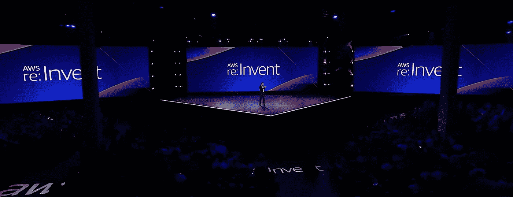

AWS re:Invent 2021—Amazon Web Services 首席执行官 Adam Selipsky 的开幕主题演讲

# **前言**

2021 年标志着亚马逊网络服务(AWS)一个值得纪念的里程碑，因为它庆祝 re: Invent 的 10 周年和 15 周年。这篇文章整合并总结了 AWS re: Invent 2021 上各种主题演讲中所有与 AI 和 ML 相关的发布公告。其中一些发布会在多个主题演讲中相同或相似，这标志着它们的重要性。

AWS re: Invent 主题演讲的完整内容现在可以在 [re:Invent 网站](https://reinvent.awsevents.com/keynotes/)以及 [AWS 官方 YouTube 频道](https://www.youtube.com/playlist?list=PL2yQDdvlhXf9jfiZENJYPXX8GYUOzQCuT)上点播观看。

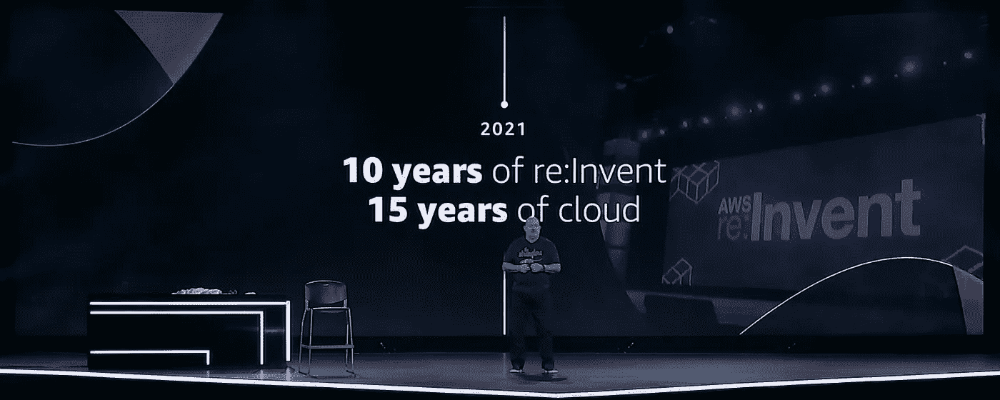

十年的重新发明

# **AWS graviton 3:ML 工作负载速度提高 3 倍**

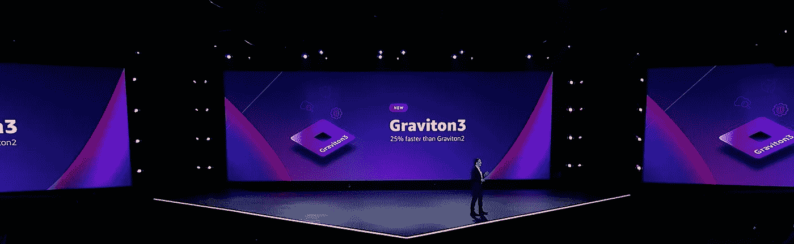

在 Adam Selipsky 的主题演讲中发布 AWS Graviton3

[**AWS graviton 3**](https://aws.amazon.com/ec2/graviton/)**是在 Adam Selipsky 的 keynote 上首次推出的。Graviton3 是最新的基于 AWS 设计的 [Arm](https://www.arm.com/) 的处理器，与 Graviton2 相比，一般计算工作负载的平均速度快 25%,某些特定工作负载的性能甚至更好，例如 ML 工作负载的速度快 3 倍，能耗低 60%。**

**在下面的 Peter DeSantis 主题演讲中，还重点介绍了 Graviton3 在一些常规计算工作负载、内存带宽以及 ML 推理工作负载方面的性能提升或带宽增量。**

**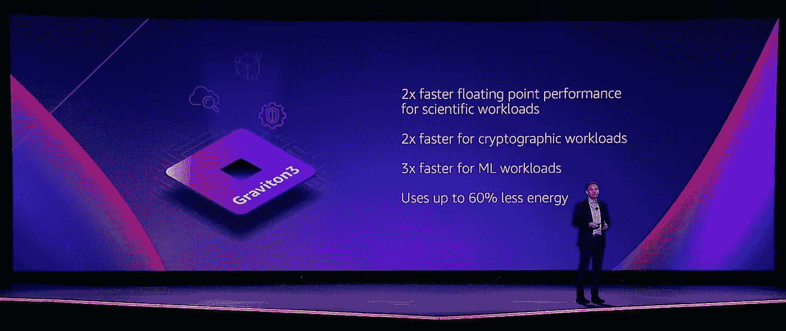**

**Adam Selipsky 主题演讲中的 Graviton 3 专业工作负载性能**

**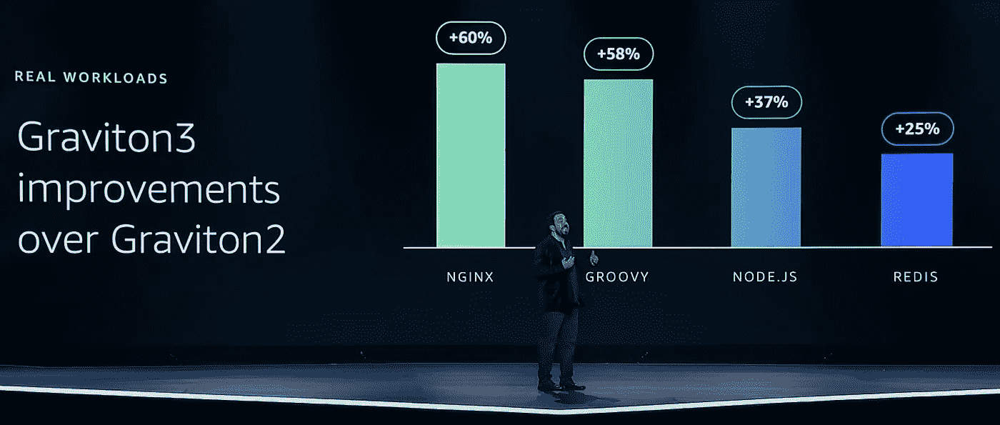**

**在 Peter DeSantis 的主题演讲中，Graviton3 在实际工作负载方面比 Graviton2 有所改进**

**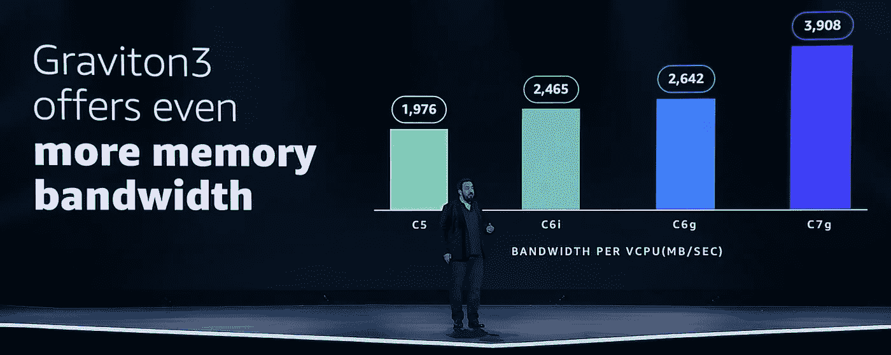**

**在 Peter DeSantis 的主题演讲中，Graviton3 在内存带宽方面比 Graviton2 有所改进**

**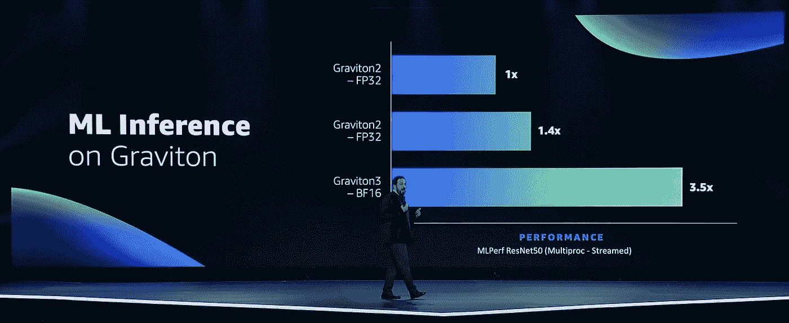**

**在 Peter DeSantis 的主题演讲中，Graviton3 ML 推理性能优于 Graviton2**

# ****EC2 的 C7g 实例:由 AWS Graviton3(预览版)支持的第一个 EC2 实例类型****

**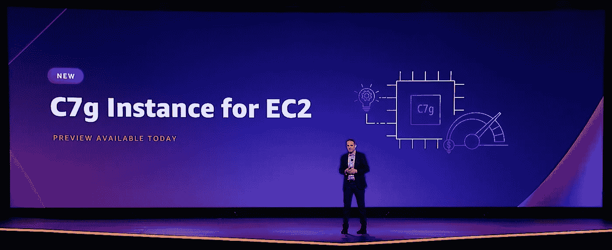**

**在 Adam Selipsky 的主题演讲上发布 EC2 的 C7g 实例**

**[**亚马逊 EC2 C7g**](https://aws.amazon.com/ec2/instance-types/c7g/) 是第一个基于 **Graviton3-** 的 EC2 实例类型。它利用了 Graviton3 处理器提供的最新改进和优势。现在可以预览了。[报名预览](https://pages.awscloud.com/C7g-Preview.html)。**

**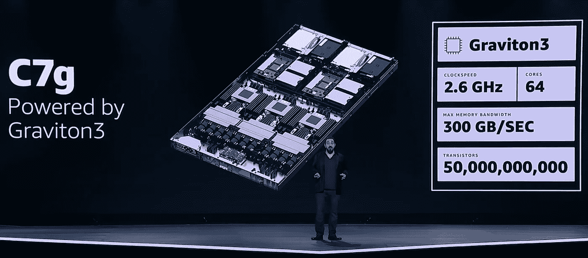**

**Peter DeSantis 主题演讲中的亚马逊 EC2 C7g — Graviton3 规格**

# ****EC2 的 Trn1 实例:由** AWS Trainium **(预览)**驱动的第一个 EC2 实例类型**

**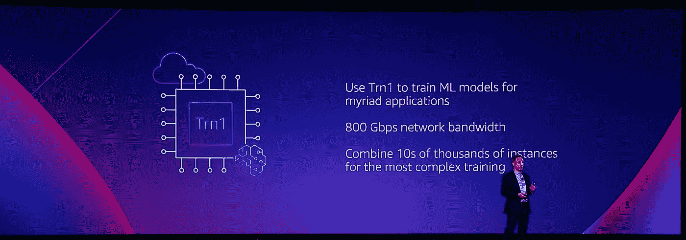**

**在 Adam Selipsky 的主题演讲中，针对 EC2 特性的 Trn1 实例**

**[**亚马逊 EC2 Trn1**](https://aws.amazon.com/ec2/instance-types/trn1/) 是第一个基于**[**train ium**](https://aws.amazon.com/machine-learning/trainium/)**-**的 EC2 实例类型。AWS Trainium 是由 AWS 设计的定制高性能机器学习(ML)芯片，旨在为云中训练深度学习模型提供最佳性价比。****

****Trn1 也是第一个具有高达 800 Gbps 网络带宽的 EC2 实例类型，非常适合大规模、多节点分布式培训用例。现在可以预览了。[报名预览](https://pages.awscloud.com/EC2-Trn1-Preview.html)。****

****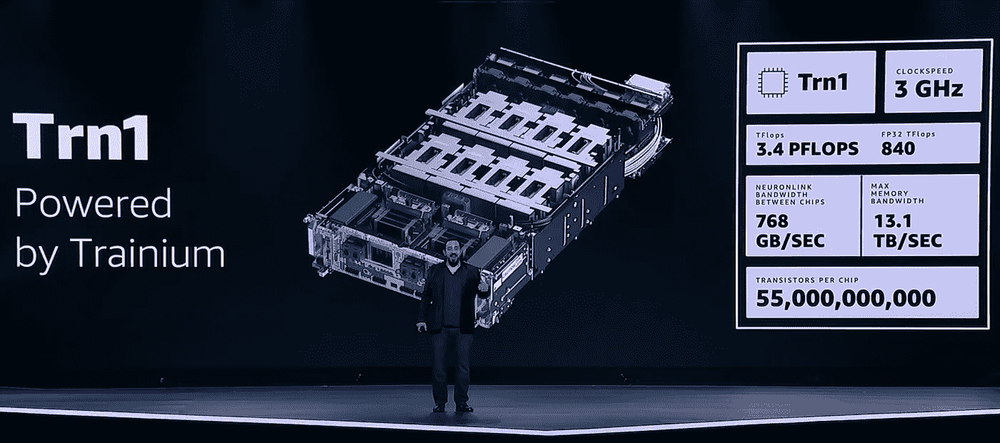****

****Peter DeSantis 主题演讲中的亚马逊 EC2 Trn1 规格****

****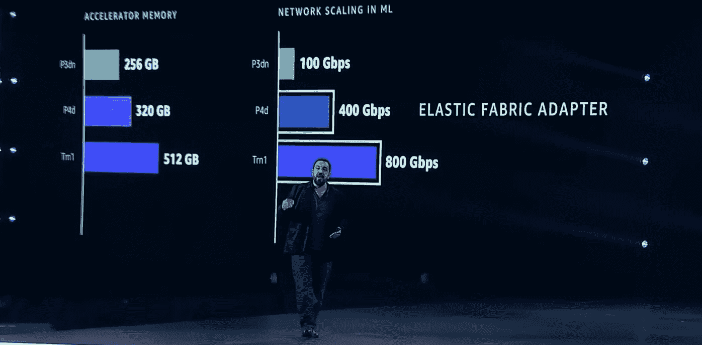****

****Peter DeSantis 主题演讲中的亚马逊 EC2 Trn1 网络带宽比较****

# ****Amazon SageMaker Canvas:一个可视化的无代码界面，可以在没有 ML 专业知识的情况下构建 ML 模型****

****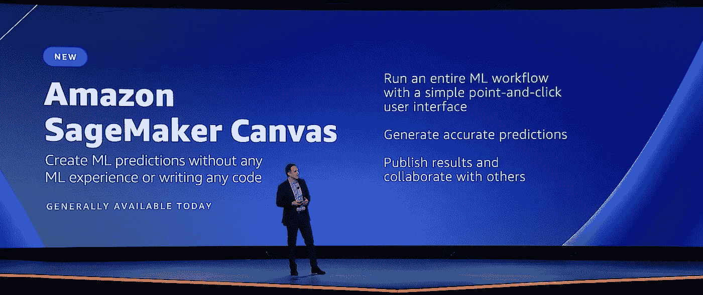****

****在亚当·塞利普斯基的主题演讲上，亚马逊 SageMaker Canvas 发布****

****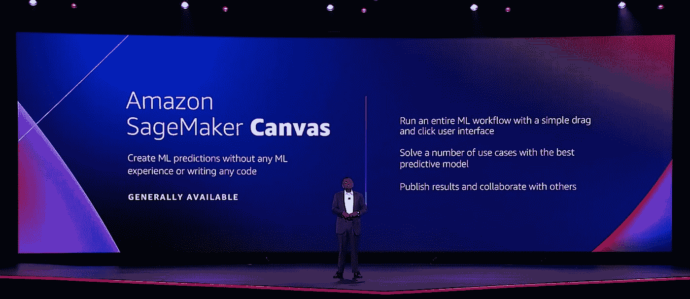****

****在 Swami Sivasubramanian 的主题演讲上发布亚马逊 SageMaker Canvas****

****[**Amazon SageMaker Canvas**](https://aws.amazon.com/sagemaker/canvas/)**是 Amazon sage maker 的一项新功能，使没有任何机器学习、数据科学或编码经验的用户(如业务分析师)能够通过简单、可视化的点击式用户界面生成高度准确的 ML 模型。它通常在发布时提供。******

******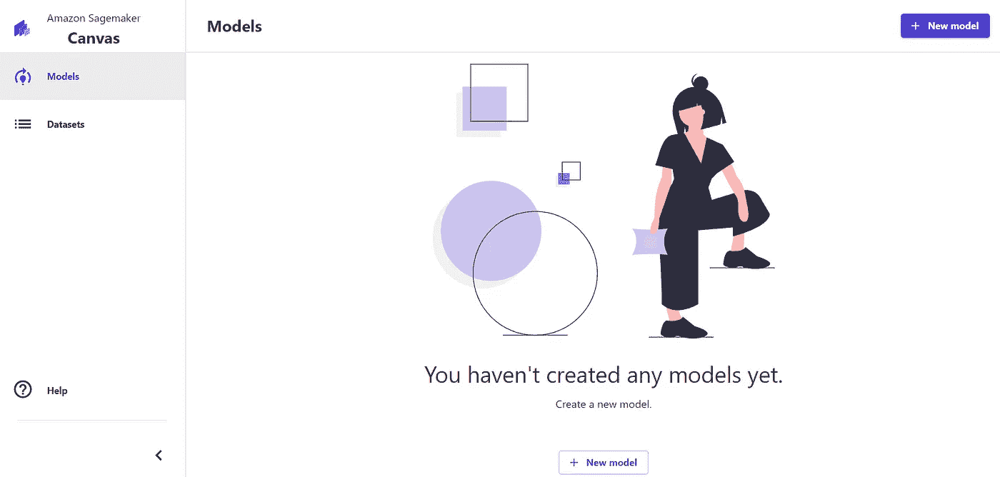******

******亚马逊 SageMaker 画布控制台用户界面******

# ******亚马逊 SageMaker Ground Truth Plus:增强的数据标签******

******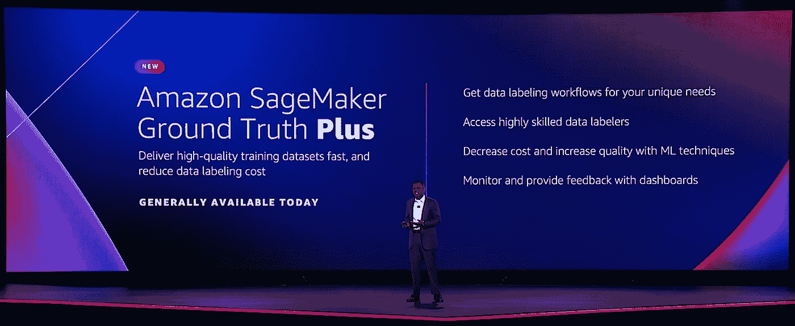******

******亚马逊 SageMaker Ground Truth Plus 在 Swami Sivasubramanian 的主题演讲中发布******

******[**亚马逊 sage maker Ground Truth Plus**](https://aws.amazon.com/sagemaker/data-labeling/)**是一项交钥匙数据标注服务，使用户能够构建高质量的训练数据集，而无需构建标注应用程序和管理自己的标注员工。Ground Truth Plus 提供基于 ML 的标记技术，包括主动学习、预标记和机器验证。它通常在发布时提供。********

******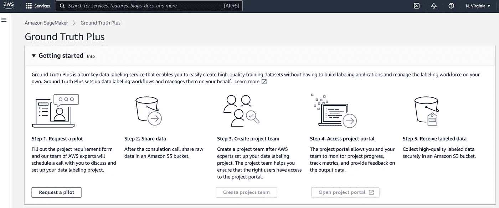******

******亚马逊 SageMaker 地面真相加控制台用户界面******

# ********亚马逊 SageMaker Studio 笔记本:大数据源原生集成********

******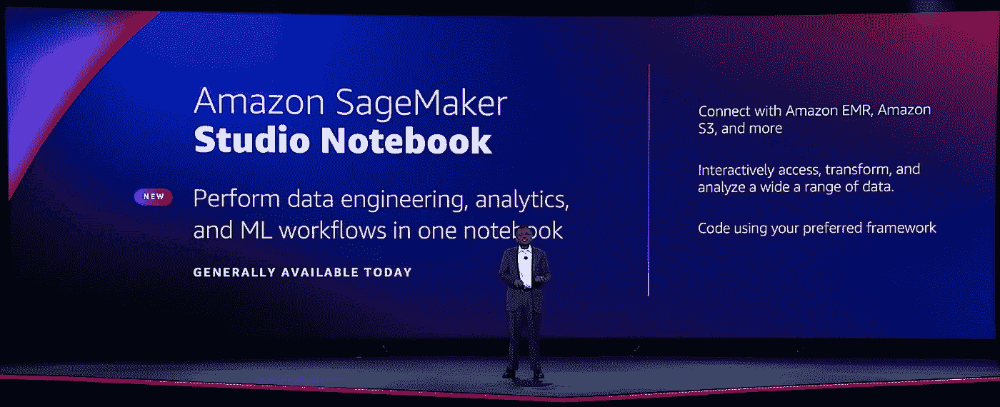******

******在 Swami Sivasubramanian 的主题演讲上发布亚马逊 SageMaker Studio 笔记本新功能******

******[**亚马逊 SageMaker Studio 笔记本**](https://aws.amazon.com/sagemaker/studio/) 现在内置了与运行在[亚马逊 EMR](https://aws.amazon.com/emr/) 集群上的 [Apache Spark](https://spark.apache.org/) 、 [Apache Hive](https://hive.apache.org/) 和 [Presto](https://prestodb.io/) 以及亚马逊 S3 上的[数据湖的集成，并在 2022 年初支持额外的数据源。用户现在可以从 SageMaker Studio 笔记本连接到这些数据源，在同一个笔记本中执行数据工程、分析和 ML 工作流。它通常在发布时提供。](https://aws.amazon.com/products/storage/data-lake-storage/)******

****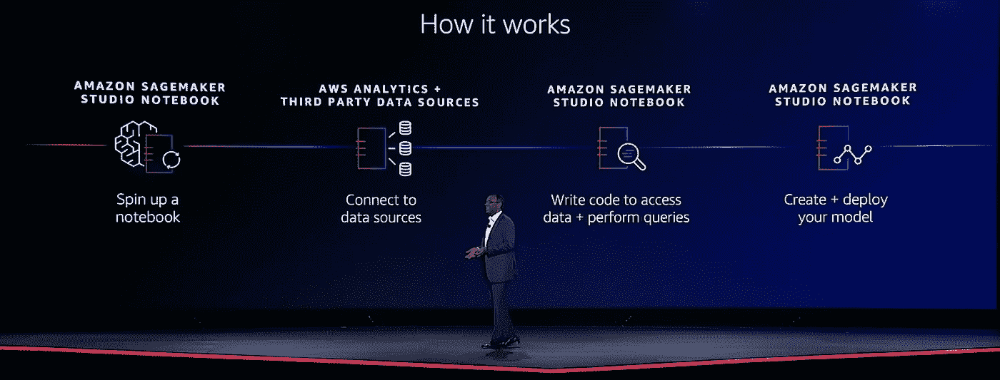****

****亚马逊 SageMaker 工作室笔记本数据集成:它如何在 Swami Sivasubramanian 的主题演讲中工作****

****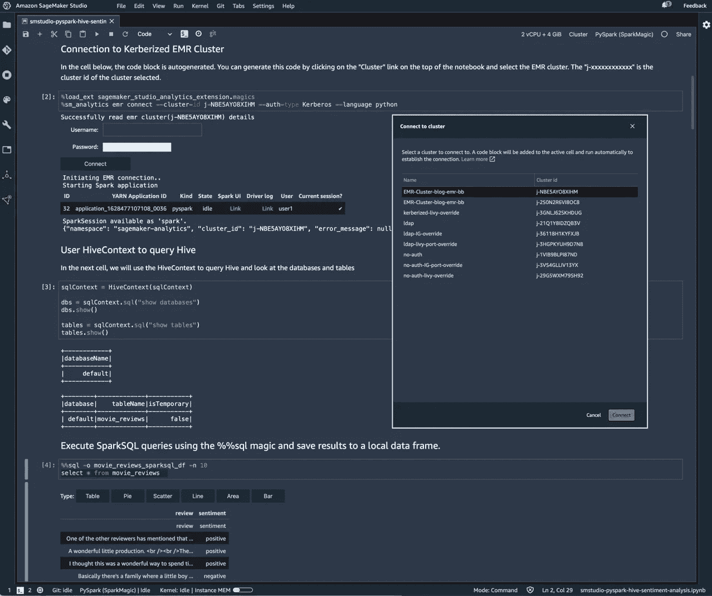****

****示例 Studio 笔记本集群连接下拉列表****

# ******亚马逊 SageMaker 基础设施创新:训练编译器、推理推荐器&无服务器推理******

****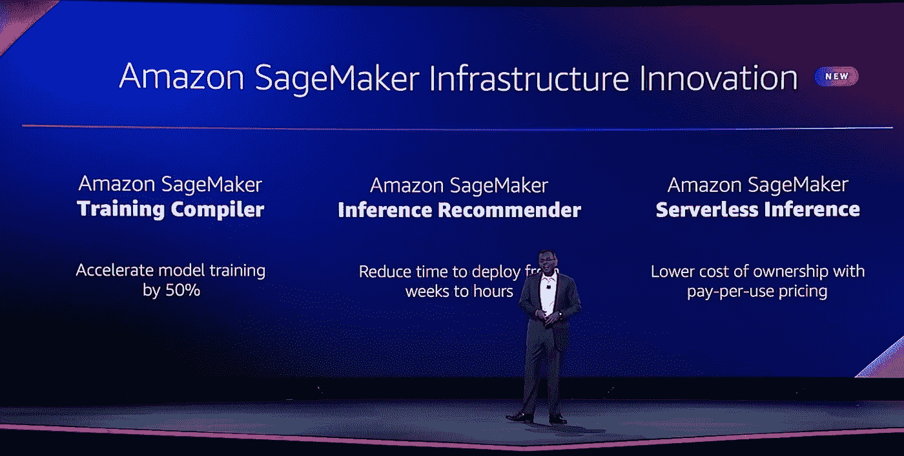****

****亚马逊 SageMaker 基础设施创新在 Swami Sivasubramanian 的主题演讲中发布****

****[**亚马逊 SageMaker 训练编译器**](https://docs.aws.amazon.com/sagemaker/latest/dg/training-compiler.html) 是 SageMaker 的一项新功能，它可以进行图形和内核级优化，从而更有效地使用 GPU，将 GPU 实例上的训练时间减少多达 50%。SageMaker 培训编译器集成到 AWS 深度学习容器(DLC)中。****

****使用 SageMaker Training 编译器支持的 AWS DLCs，您可以编译和优化 GPU 实例上的训练作业，只需对代码进行最少的更改。****

****SageMaker Training Compiler 在 SageMaker 内免费提供，由于它加速了培训，可以帮助减少总的计费时间。它通常在发布时提供。****

****[**亚马逊 SageMaker 推理推荐器**](https://docs.aws.amazon.com/sagemaker/latest/dg/inference-recommender.html) 是亚马逊 SageMaker 的一项新功能，通过跨 SageMaker ML 实例自动进行负载测试和模型调优，减少了将 ML 模型部署到生产中所需的时间。****

****推理推荐器帮助用户选择最佳的可用实例类型和配置(例如，实例计数、容器参数和模型优化等)。)来部署 ML 模型以获得最佳的推理性能和成本。它通常在发布时提供。****

****[**Amazon SageMaker 无服务器推理**](https://docs.aws.amazon.com/sagemaker/latest/dg/serverless-endpoints.html) 是 Amazon SageMaker 的一项新功能，也是一个新的推理选项，使用户可以轻松部署 ML 模型进行推理，而无需配置或管理底层基础设施。****

****无服务器推理非常适用于在流量高峰之间有空闲期并能忍受冷启动的工作负载。它在发布时预览。****

# ******亚马逊 Kendra 体验构建器:构建&无需编写代码即可部署搜索应用******

****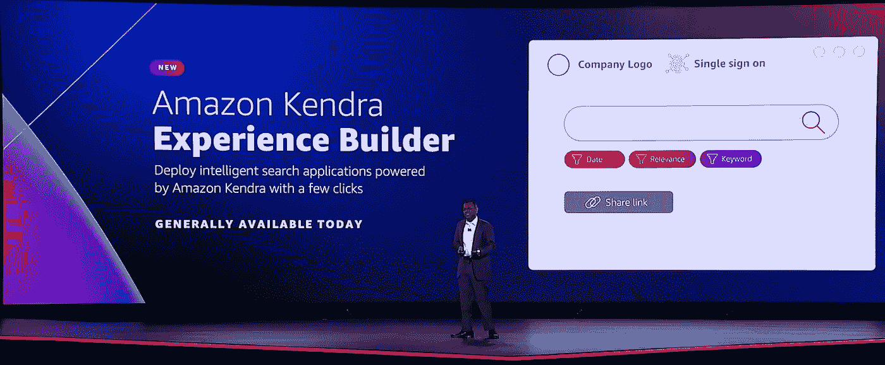****

****在 Swami Sivasubramanian 的主题演讲上发布亚马逊 Kendra 体验构建器****

****[亚马逊 Kendra](https://aws.amazon.com/kendra/) 是一个由机器学习支持的智能搜索服务。 [**亚马逊 Kendra Experience Builder**](https://docs.aws.amazon.com/kendra/latest/dg/deploying-search-experience-no-code.html)**是亚马逊 Kendra 的一项新功能，用户只需点击几下鼠标，无需任何编码，即可快速部署功能全面、可定制的智能搜索应用。它通常在发布时提供。******

******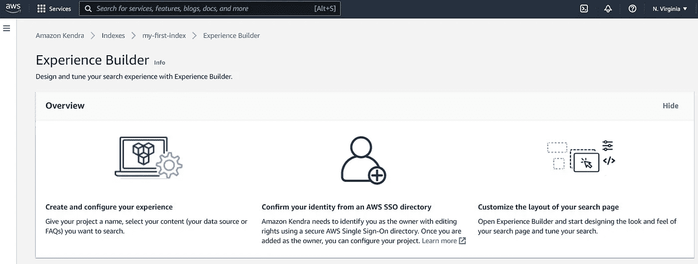******

******亚马逊 Kendra 体验生成器控制台用户界面******

# ********亚马逊 Lex 自动聊天机器人设计器:自动对话设计(预览)********

******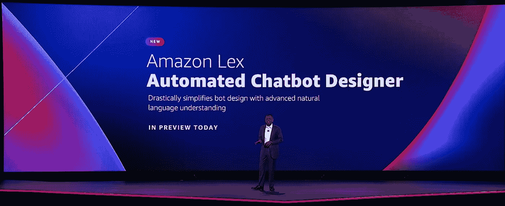******

******亚马逊 Lex 自动聊天机器人设计师在 Swami Sivasubramanian 的主题演讲中发布******

> ******有效的对话设计可以区分好的聊天机器人和坏的聊天机器人******

******[**亚马逊 Lex 自动化聊天机器人设计器**](https://aws.amazon.com/lex/chatbot-designer/) 是亚马逊 Lex 中的一项新功能，它使聊天机器人开发人员能够在几个小时内而不是几周内轻松地根据对话记录设计聊天机器人。******

****新的自动化聊天机器人设计器可以通过使用 ML 来分析对话文本，并围绕最常见的意图和相关信息对它们进行语义聚类，从而使开发人员的工作最少化，并减少设计聊天机器人所需的时间。它在发布时预览。****

****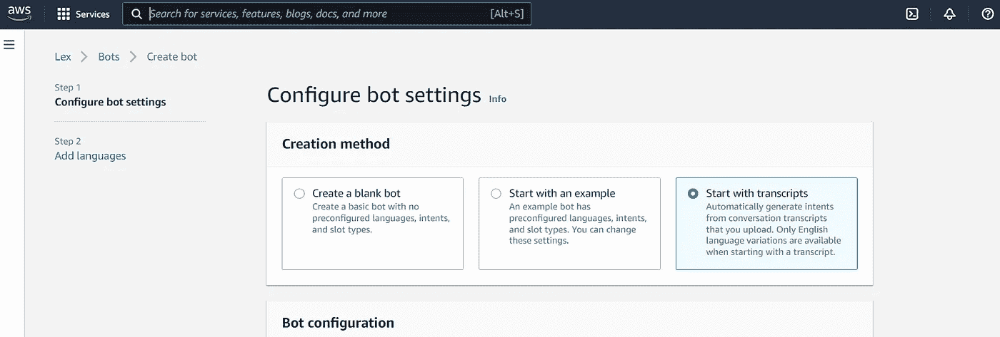****

****亚马逊 Lex 自动聊天机器人设计器控制台用户界面****

# ****亚马逊 SageMaker 工作室实验室:免费的基于网络的 ML 开发环境(预览)****

****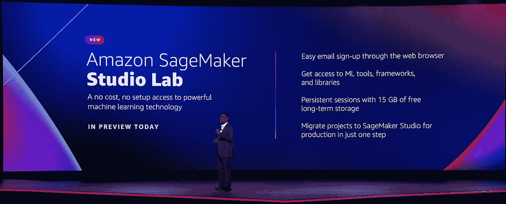****

****亚马逊 SageMaker 工作室实验室在 Swami Sivasubramanian 的主题演讲中发布****

****[**亚马逊 SageMaker Studio Lab**](https://aws.amazon.com/sagemaker/studio-lab/)**是一个免费的基于 web 的 ML 开发环境，为任何人学习和试验 ML 提供计算、存储(高达 15GB)和安全性。任何拥有有效电子邮件地址的人，即使没有 AWS 账户，也可以免费注册使用这项服务。******

******[注册新账号](https://studiolab.sagemaker.aws/)。它在发布时预览。******

******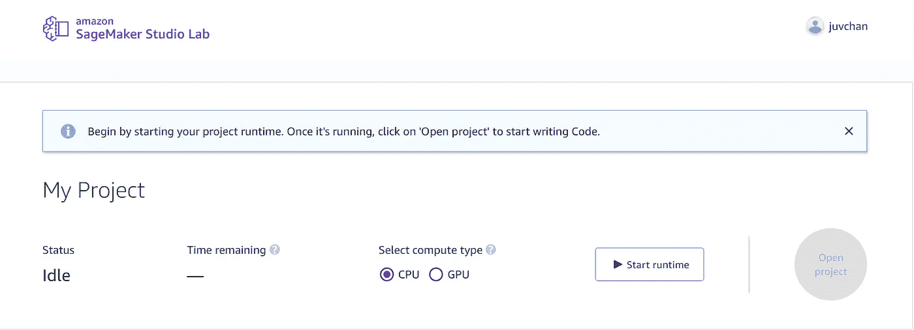******

******亚马逊 SageMaker Studio 实验室控制台用户界面******

# ********AWS AI & ML 奖学金项目&** AWS DeepRacer 学生:ML 教育&竞赛******

******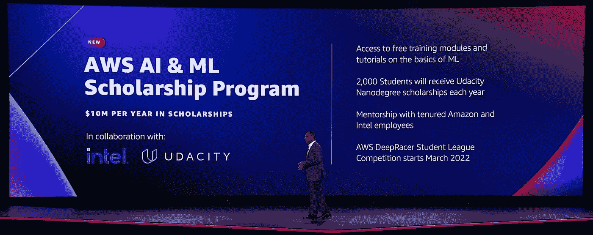******

******AWS AI & ML 奖学金项目在 Swami Sivasubramanian 的主题演讲中启动******

******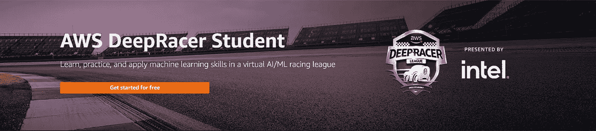******

******AWS DeepRacer 学生******

******[**AWS AI & ML 奖学金项目**](https://aws.amazon.com/machine-learning/scholarship/) 与[英特尔](https://www.intel.com/)和 [Udacity](https://www.udacity.com/) 合作，旨在帮助代表性不足和服务不足的全球高中和大学学生学习基本的 ML 概念，为他们在 AI 和 ML 领域的职业生涯做准备。它是作为全新的 [**AWS DeepRacer 学生**](http://aws.amazon.com/deepracer/student) 服务和 [**AWS DeepRacer 学生联盟**](https://student.deepracer.com/) 的一部分推出的。******

****AWS AI & ML 奖学金计划每年为 2000 名学生提供奖学金，用于参加 [**Udacity AI 编程与 Python 纳米学位**](https://www.udacity.com/course/ai-programming-python-nanodegree--nd089) 计划(价值 4000 美元)。要参加 AWS AI & ML 奖学金项目，首先[用有效的电子邮件地址在 AWS DeepRacer 学生服务处](http://student.deepracer.com/)注册。请注意，这个学生玩家帐户独立于 AWS 帐户，不需要任何帐单或信用卡信息。****

****[点击此处](https://www.udacity.com/scholarships/aws-ai-ml-scholarship-program)了解更多关于该计划的详情，包括其运作方式、旅程和时间表。****

****非常感谢您阅读这篇文章。欢迎并感谢您的反馈，以提高本文的内容质量。****