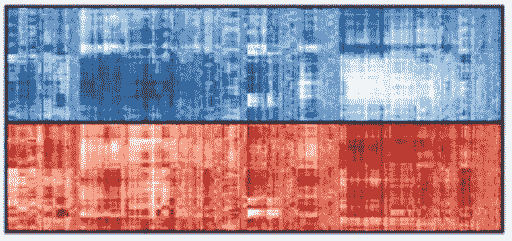
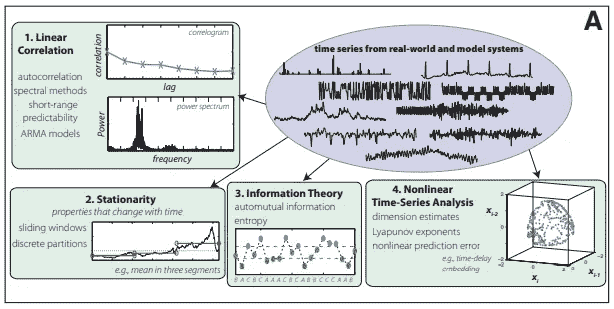
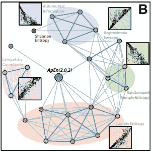
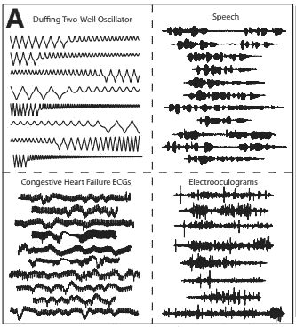
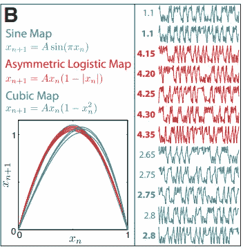
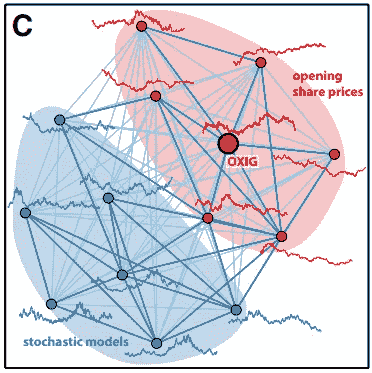
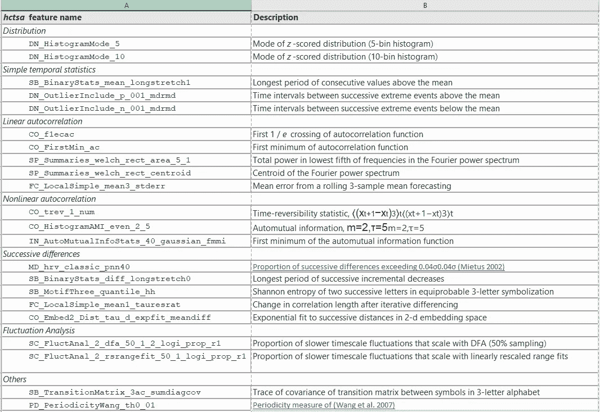
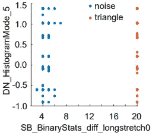

# 高度比较的时间序列分析——一篇论文综述

> 原文：<https://pub.towardsai.net/highly-comparative-time-series-analysis-a-paper-review-5b51d14a291c?source=collection_archive---------0----------------------->

## [数据科学](https://towardsai.net/p/category/data-science)，[机器学习](https://towardsai.net/p/category/machine-learning)

## 用于比较、聚类、分类和注释的时间序列特征提取分析

在时间序列的机器学习中，使用从序列中提取的特征比简单地以表格形式处理时间序列(每个日期/时间戳在单独的列中)更有效。这些特征可以捕捉序列的特征，如趋势和自相关。

但是……你能提取什么样的特征，如何从中选择呢？

照片由[晨酿](https://unsplash.com/@morningbrew?utm_source=medium&utm_medium=referral)在[破浪](https://unsplash.com?utm_source=medium&utm_medium=referral)

在这篇文章中，我讨论了两篇分析基于特征的时间序列表示的论文的发现。论文进行了广泛的工作来收集数以千计的时间序列特征提取器，并评估哪些特征从一个序列中捕捉到了最有用的信息。

*   [高度比较时间序列分析:时间序列的经验结构及其方法](https://www.ncbi.nlm.nih.gov/pmc/articles/PMC3645413/)。(富尔彻等人，2013 年)
*   [*catch22* :规范的时间序列特征](https://arxiv.org/abs/1901.10200) (Lubba 等 2019)

这些论文展示了如何通过提取描述序列行为的特征来比较时间序列，并建议了一种用于识别时间序列特征的“最佳”子集的管道。

# 为什么这很重要？

比较时间序列有两种基本方法:

1.  一个**相似性度量**，量化两个时间序列在时间上是否接近(平均而言)，例如[动态时间扭曲](https://databricks.com/blog/2019/04/30/understanding-dynamic-time-warping.html)。这些度量通常最适合于长度相等的短对齐系列。它们往往具有较差的可扩展性，在时间序列的数量和序列长度上都具有二次计算，因为必须计算所有对之间的距离。
2.  使用时间序列分析算法，根据从时间序列中提取的**特征，定义序列之间的相似性。特征提取器不要求系列长度相等。结果是每个系列的动态特征的可解释的总结。这些特征可以用于机器学习。**

可解释性是另一个关键:时间序列特征可以捕捉一组可解释特征中复杂的时变模式。

问题是，有大量的方法可以从时间序列中提取可解释的特征。此外，特征选择通常是手动的和主观的。

什么样的特征可以从序列中提取出来，你如何从中选择？

来源: [hctsa:使用大规模特征提取的自动时序表型分析的计算框架](https://www.cell.com/cell-systems/fulltext/S2405-4712(17)30438-6)

# 高度比较时间序列分析:时间序列的经验结构及其方法

论文动机:虽然时间序列是跨科学学科研究的(例如金融中的股票价格，医学中的人类心跳)，**不同的时间序列分析方法已经在不同的学科中分别开发出来**。

给定大量的方法，很难确定不同学科开发的方法是如何相关的。因此，从业者如何为他们的数据选择最佳的方法呢？

为了应对这一挑战，HCTSA 文件…

*   收集大量的时间序列数据和时间序列分析方法的注释库。
*   根据时间序列方法在数据上的行为对其进行建模，并根据时间序列的测量属性对其进行分组。
*   介绍一系列系列的比较分析技术及其方法。首先，将给定的时间序列与相似的现实世界和模型生成的序列相联系的能力。第二，能够将具体的时间序列分析方法与文献中的一系列替代方法联系起来。

## HCTSA 框架和范围

这篇论文范围广泛:作者注释了 38，190 个单变量时间序列和 9，613 个时间序列分析算法的库。

时间序列分析方法的形式各不相同，从汇总统计到统计模型拟合。每个转换用一个实数汇总一个输入序列。

时序转换库涵盖了广泛的时序属性:

*   分布的基本统计数据(例如位置、分布、异常属性)
*   线性相关性(如自相关、功率谱特征)
*   平稳性(如滑动窗口测量、单位根检验)
*   信息论和熵度量(例如自动互信息、近似熵)
*   方法来自物理非线性时间序列分析文献(如关联维数)
*   线性和非线性模型拟合(例如拟合优度和自回归模型的参数)
*   其他(例如小波方法)

对于需要参数值的转换，将对多个参数重复转换。单个“操作”被认为是一个转换加上一个参数值。在本文评估的 9k 操作中，单个转换可能会被计算多次，每个参数值一次。该论文评估了大约 1k 个唯一变换。

## HCTSA:时间序列分析方法的经验结构

图 3 A .时间序列操作的四个主要类别的摘要。

作者使用 k-medoids 聚类来确定四大类时间序列分析操作:

1.  线性相关
2.  平稳性(随时间变化的特性)
3.  信息论
4.  非线性时间序列分析

聚类分析显示，200 个时间序列操作的子集，或者一个序列行为的**经验指纹，可以近似为所考虑的 8，651 个操作。这 200 种运算总结了时间序列分析方法的不同行为。这些操作包括在各种学科中开发的技术。**

此外，分析揭示了每个目标操作周围的局部结构。对于给定的操作，他们能够识别出具有相似行为的替代操作。

图 3 B .“我们库中与近似熵算法最相似的操作的网络表示，”ApEn( 2，0.2)”…，这些操作是从我们的库中自动检索的。网络中的每个节点代表一个操作，链接对它们之间的距离进行编码。带注释的散点图显示了每个阴影社区的代表成员的近似熵输出(用粗框节点表示)。”

> “通过比较它们的经验行为，上述技术可用于将新方法与其他领域开发的替代方法联系起来，从而鼓励跨学科合作，开发时间序列分析的新方法，而不是简单地复制现有方法的行为”[1]

## HCTSA:时间序列的经验结构

时间序列可以由捕捉序列的重要动态行为的属性来表示。作者使用了 200 个代表性的操作来比较来自不同系统和不同长度的 24577 个时间序列。

> **这种由 200 种不同时间序列分析操作组成的经验指纹有助于对科学时间序列进行有意义的比较。**

为了对他们的 24k 时间序列库进行分组，作者使用完全连锁聚类来形成 2000 个聚类。由于所使用的时间序列属性范围很广，即使时间长度不同，聚类也会根据动态对序列进行分组。

大多数聚类对来自同一系统的时间序列进行分组:

图 4A:“以这种方式形成的大多数集群是给定现实世界或模型系统的同质时间序列组”

一些集群包含由不同系统生成的序列:

图 4B:“绘制了一个时序群集，其中包含由三个不同迭代图生成的时序，这些迭代图具有指定常见递归关系的参数。对 150 个样本的时间序列片段进行绘图，并用生成它们的地图的参数 A 进行标记。”

> 时间序列的简化表示允许您检索具有相似属性的序列的局部邻域。这允许您自动将真实世界的时间序列与相似的、模型生成的时间序列相关联。

因此，这些转换可用于建议在现实世界系统中使用的合适的模型族。

图 4C。牛津仪器(OXIG)在大红点的开盘股价系列；最相似的真实世界时间序列是其他股票的开盘价(红色节点)。大多数相似的模型生成的 TS 来自随机微分方程(蓝色节点。网络中的链接根据归一化特征向量之间的欧几里德距离来表示系列之间的相似性。

## HCTSA 代码

高度比较时间序列分析的代码可以在 [GitHub](https://github.com/benfulcher/hctsa) 上找到；但是，是用 Matlab 写的。(可以通过使用`[pyopy](https://github.com/strawlab/pyopy)`包使用 python 中的 hctsa 包)。hctsa 包允许从时间序列中提取数千个特征。该软件还有一张[附随纸](https://www.cell.com/cell-systems/fulltext/S2405-4712(17)30438-6)。

***重要提示，运行缓慢。将全套 HCTSA 操作减少到数千个候选特征中的 200 个在计算上是昂贵的。这种方法对于某些应用程序是不可行的，尤其是那些具有大量训练数据的应用程序。***

HCTSA 还有一个 web 平台， [*CompEngine*](http://www.comp-engine.org/) 。“CompEngine”是一个自组织的时序数据数据库，允许用户上传、探索和比较数千种不同类型的时序数据[4]

照片由[伊万·芒罗](https://www.flickr.com/photos/55935853@N00/)在 [flickr](https://www.flickr.com/photos/55935853@N00/2508946705) 上拍摄

# 第 22 条军规，典型的时间序列特征

随后的 [catch22:规范时间序列特征](https://link.springer.com/article/10.1007/s10618-019-00647-x)论文(2019)基于 HCTSA，通过**将代表性特征集减少到 22 个时间序列特征**，这些特征:

1.  在一组给定的时间序列问题上表现出很强的分类性能，并且
2.  是最低限度的冗余，并且
3.  捕捉 HCTSA 中包含的分析多样性。

本文创建了一个数据驱动的子集，从时间序列中提取最有用的特征。作者从 HCTSA 工具箱中的功能开始，比较了一组不同的时间序列分析算法。

> “第二十二条军规”时序特征根据其属性捕捉了多样且可解释的时序“签名”。

该特征包括线性和非线性时间自相关、连续差、值分布和异常值以及波动标度属性。

## catch22 功能的优势

*   快速计算(比 Matlab 中的完整 HCTSA 特性集快约 1000 倍)
*   提供时间序列的低维摘要
*   有助于分类和聚类的可解释特征。

此外，如果 catch22 功能不适合您的问题，则功能选择管道是通用的。该管道可用于选择新的或更复杂的问题的特征的信息子集。

## 第 22 条军规特征评分

作者通过评估来自[时间序列分类库](https://www.cs.ucr.edu/~eamonn/time_series_data_2018/)的一组 93 个分类问题的决策树分类准确性来对特征进行评分。具有来自 HCTSA 的 4791 个特征的性能在所有任务中具有 77.2%的平均类别平衡准确度。具有 22 个特征的较小集合的性能是 71.7%的平均类平衡准确度。

## Catch22 特征选择管线

对于所有数据集，每个时间序列特征都被线性重定标到单位 0–1 区间。*这种缩放可能不适合某些现实应用。*

首先，作者排除了对值分布的均值和方差敏感的特征，因为大多数系列都是归一化的。

*对于某些应用，这种预选是不可取的。如果使用非标准化系列，您应该考虑包括分布特征，如平均值和标准差。这些可以带来显著的性能提升。*

接下来，作者排除了经常输出特殊值的转换。特殊值表示算法不适合输入数据，或者它没有成功评估。

最后，作者创建了一个管道来过滤可以单独区分一系列现实世界数据的特征。管道然后过滤那些具有互补行为的。

特征选择管道有三轮:

1.  统计预过滤:过滤掉在给定的学习任务中表现在统计上不显著的特征。
2.  性能过滤:选择在所有测试中表现最好的特性。“性能”是用决策树分类器在 93 个分类任务中区分标记类的能力。
3.  冗余最小化。根据跨任务的性能分数，将顶级特征聚类(具有完全链接的分层聚类)成组。从每个聚类中，为特征集选择单个代表性特征。代表要素被选为跨任务得分最高的要素，除非它是计算密集型的，在这种情况下，将手动选择另一个具有更好的可解释性和效率的高精度要素。

第二十二条军规的特点。“hctsa 特性名称”指的是 HCTSA Matlab 包中的特性。(来源:[施普林格](https://link.springer.com/article/10.1007/s10618-019-00647-x/tables/1))

## 准确性/可解释性权衡

作者比较了使用 catch22 功能与各种时间序列分类算法(如在`[sktime](https://github.com/alan-turing-institute/sktime/tree/master/examples)`中实现的算法)的分类性能。

尽管维数减少了很多，但用 catch22 特征对时间序列进行分类的结果与其他方法“相似”。作者承认**大多数数据集使用现有算法表现出比 *catch 更好的性能 22。***

这篇论文经常声称 catch22 在准确性上只有“小”的降低。(作者没有公布具有 catch22 特征的分类器的性能)。在一个例子中，他们称从 99.2%到 89.5%的下降为“小”，但在我看来，这对许多应用程序来说并不小。

虽然作者未能证明，在我看来，用 catch22 特性构建的分类模型可以优于本地时间序列分类器， **catch22 确实为模型解释**提供了可解释的特性。

特别是，作者强调了一个分类器，其中单个特征能够完美地区分两个类别(系列=三角形或噪声)。该功能“量化数据中最长连续递减增量的长度”。显然，这很容易解释。

图 8A。根据单个特征，两个类别(三角形与噪声系列)是完全可分的。

## **替代时间序列**特征集

作者指出，“没有一种单一的表示法最适合所有的时间序列数据集。”相反，“最佳表示取决于数据集的结构和向其提出的问题。”[3]

因此，第 22 条军规功能可能不是所有时间序列数据集和任务的最佳功能。

相对于基于时域距离度量的分类器，catch22 特征表示通常优于不具有“可靠的类间形状差异”的数据集。

作者比较了 catch22 功能与`[tsfeatures](https://github.com/robjhyndman/tsfeatures)` R 包中可用的时间序列功能的性能。在同一组分类任务中，`tsfeatures`特征的平均准确率为 69.4%，而 catch22 的平均准确率为 71.7%。

## 履行

catch22 特征的提取已经用 C 实现，包装器用 Python，R，Matlab。catch22 的开源实现可以在 GitHub 的[上找到。](https://github.com/chlubba/catch22)

C 版本的 *catch22* 展现了时间序列长度的近似线性计算复杂度 O(N1.16)。对于具有 10，000 个观测值的时间序列，可以在 0.5 秒内计算出 catch22。

产生 22 个特性的特性选择管道的代码可以在 GitHub 的[https://github.com/chlubba/op_importance](https://github.com/chlubba/op_importance)获得。

图片由[安 H](https://www.pexels.com/@ann-h-45017) 在[像素](https://www.pexels.com/photo/conclusion-word-formed-from-lettered-yellow-tiles-1888005/)上拍摄

# 对实际问题的应用

从时间序列中可以提取出大量的特征来描述一个序列的许多属性和动态。

HCTSA 论文中分析的特性以及 GitHub 上提供的特性是全面的、信息丰富的。关键的挑战是大多数应用程序都有“太多”的功能。

catch22 特征被定制为捕获 UCR/UEA 数据集的关键属性，这些数据集是短的且相位对齐的。可以重新运行特征选择方法，以生成为其他应用定制的精简特征集。

事实上，在许多应用中，新的特征选择可能是必要的，在这些应用中，序列具有不同的属性，例如那些数据分布的位置和方差高度相关的应用。分布特征被排除在 catch22 分析之外，因为考虑的数据是标准化的。(归一化会移除位置和偏移)。

# 最后一句话

如果你喜欢这篇文章，请关注我，了解更多关于时间序列机器学习的内容。关于时间序列分类和时间序列特征分类的文章正在编写中。

# 参考

[1] Fulcher BD，Little MA，Jones NS (2013)高度比较时间序列分析:时间序列的经验结构及其方法。J R Soc 接口 10(83):20130048。ISSN 1742–5662。[https://doi.org/10.1098/rsif.2013.0048](https://doi.org/10.1098/rsif.2013.0048)

[2] B.D .富尔彻和 N.S .琼斯。 [*hctsa* :利用海量特征提取进行自动化时序表型分析的计算框架](http://www.cell.com/cell-systems/fulltext/S2405-4712(17)30438-6)。*细胞系统*5527(2017)。

[3]卢巴、塞西、克纳特、舒尔茨、富尔彻、琼斯。 [*catch22* :规范的时间序列特征](https://doi.org/10.1007/s10618-019-00647-x)。*数据挖掘与知识发现* 33，1821 (2019)。

[4]福尔彻、卢巴、塞西、琼斯 [CompEngine:一个自组织的、动态的时序数据库](https://arxiv.org/pdf/1905.01042.pdf)。(2019).