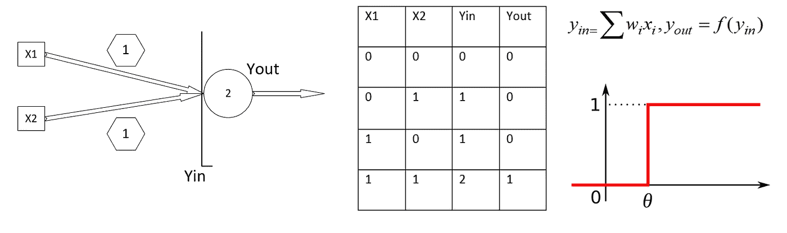
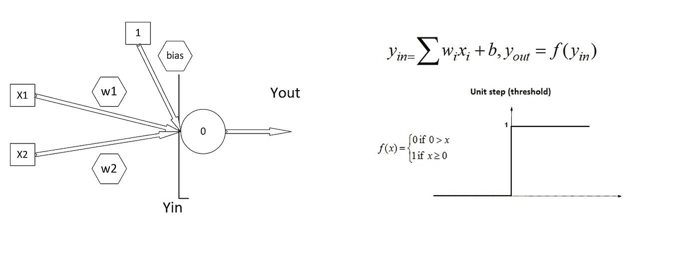
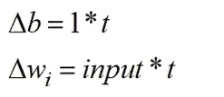
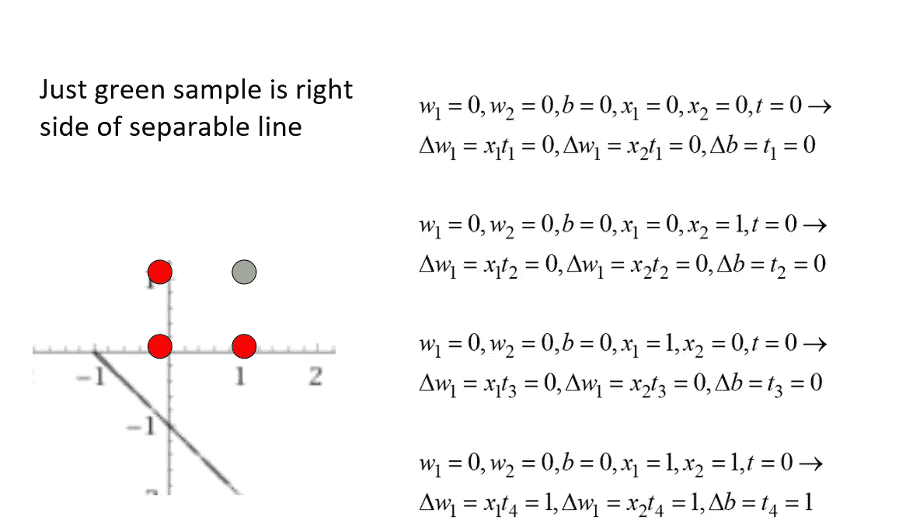
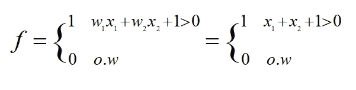
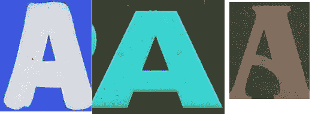
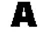
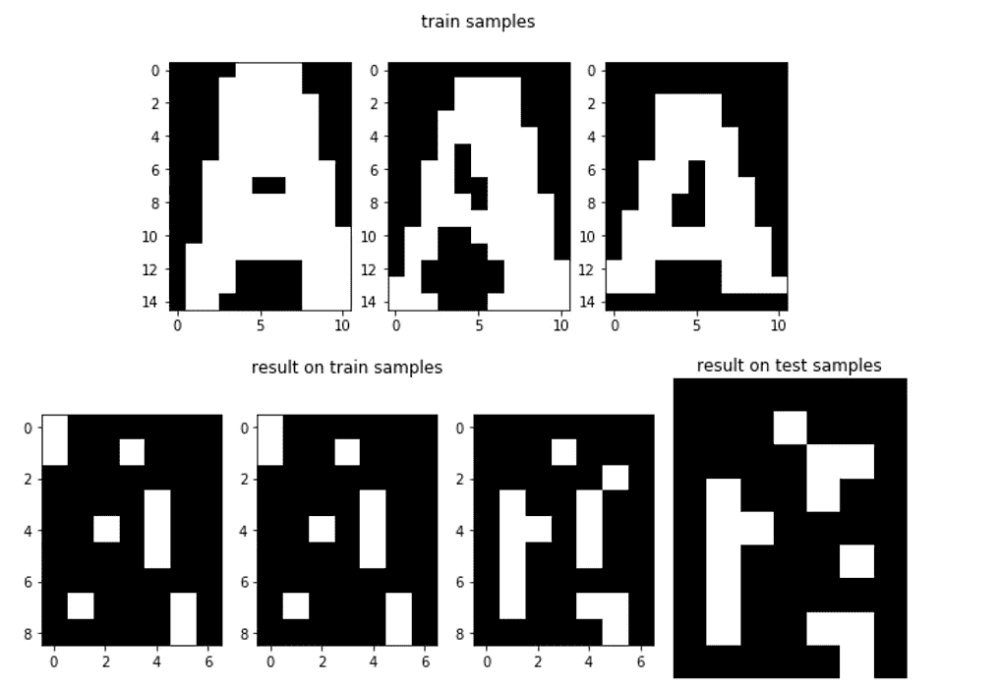
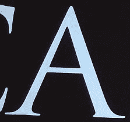

# 神经网络的历史！从神经生物学家到数学家

> 原文：<https://pub.towardsai.net/history-of-neural-network-from-neurobiologists-to-mathematicians-98683458efd9?source=collection_archive---------3----------------------->

## [深度学习](https://towardsai.net/p/category/machine-learning/deep-learning)

如果你熟悉神经网络和深度学习，你可能会想知道神经元和大脑以及这些网络之间的关系是什么。它们似乎是基于一些数学公式，与我们大脑的功能相去甚远。你是对的。是数学。早在 1930 年，一些科学家开始思考大脑的功能，并试图尽可能模拟神经元的功能。他们想要一个遵守所有神经学规则并拥有大脑能力的模型。

1943 年，麦卡洛克和皮茨通过模仿生物神经元的功能制造了一个计算单元。他们的单位很简单。它服从一个阈值函数。当神经元的输入信号超过一个阈值时，神经元就会发出一个尖峰信号。麦卡洛克和皮茨累积加权输入，并将其提供给这个阈值函数。结果很神奇！他们建立了第一个大脑模拟，它不能学习，但当你设置模型权重时，它可以进行一些布尔代数计算，如**和**函数。

预定义权重的麦卡洛克和皮茨

1949 年，心理学家赫布试图用麦卡洛克和皮茨的神经元来证明他的学习理论。他说，如果一个事件在产生输出的同时发生，学习就发生了。在布尔代数中，这意味着权重的学习发生在输入和输出都为真(或 1)的情况下。True 表示有事发生。赫布法则只是一个简单的公式:

Hebb 神经元定义

根据这些等式，只有当输入和输出都为 1 时，w 才会发生变化。他在麦卡洛克和皮茨的模型中所做的一个根本区别是将阈值变成了一个偏差权重。所以他可以简单地用规则学习这种偏差，让阈值像 1 一样固定。在**和函数的情况下，**规则找到正确的权重，并划出一条线来分隔样本。问题是 Hebb 只是在输入和输出都为真的情况下学习，所以它不能识别根本没有学习它们的样本。以下是 Hebb 学习 AND 函数的示例:

因此，w1=1，w2=1，bias=1 构成一条 2-d 线，该线在 2d 维度上将特征空间 x1-x2 分开。如你所见，当 x1=1，x2=1，target(t)=1 时，学习就发生了。这是绿点。就在 out **f** 函数的右边，因为 f 定义为:

Hebb 学习结果

从 sum 的可交换性可以理解，引入模式的顺序并不重要。

但是等等！我们看到，当输入或输出中至少有一个为零时，Hebb 模型不学习。那么我们为什么要坚持二进制的价值观呢？我们可以使用 bipolar(-1，1)来代替，现在 Hebb 也通过-1 值生效。因此在 20 世纪 50 年代后期，科学家们将 Hebb 规则扩展到双极系统。于是 Hebb 成为了第一个被认可的可以部分学习一些布尔函数的模型。

如果你把一些 Hebb 神经元放在一起，它们可以独立学习(这是一种弱点)，你就会有一个 Hebb 网络。你可以使用 Hebb 网络进行模式识别。如果你的模式是线性可分的，每个神经元做一个超平面来分离特征空间，你就可以学习你的模式。比如第一个神经元可以把字母 A 和其他分开，第二个神经元把字母 B 分开，以此类推。你可以想象字母图像有一些重叠，你的 Hebb 网络太天真，在这方面做得不好，但它可以学习，你可以检查它。

我们来做一个从 15*10 分辨率的图像到 7*9 分辨率的图像的模式联想，重构一个人物，这样对现代神经网络的祖辈是做什么的有一个全面的直觉。

训练数据

A 的 7*9 图像，我们希望所有的图像都被赋值。

想象一下，我们有不同的 A 字体，我们调整它们的大小，使它们具有相同的大小。假设尺寸是 15*10，那么我们有 150 个输入。将每个像素视为一个输入。我们只想知道 A 是什么，然后重建它的模式。例如，我们希望将这些字符映射到 A 的 7*9 图像，该图像的细节较少。我们在做模式联想。这意味着我们将一些模式分配给一个特殊的模式。所以我们有 63 个神经元，每个神经元产生一个像素的输出。使用 Python，你可以很容易地写出算法。您有 150 个输入和 150 个权重，并且您有三个模式来显示您的网络(在 and 函数中，我们有四个模式来显示)。所以你采取三个步骤，并更新权重和完成！

测试数据

第一行是我们引入 Hebb 网络的内容，第二行是网络对相同的列车数据和一个未看到的数据的响应。如你所见，即使在训练数据上，Hebb 也只能识别字符的某些部分。这是一个非常简单的网络。然而，它有能力学习这种分配从 150 维到 63 维的模式关联的一部分。你也可以扩展神经元来识别其他字符。如果你让图案更简单，降低分辨率，你会发现惊人的效果。一些阈值函数独立地学习什么应该是神经元输出并重建你的模式。

如你所见，我们有一个单层前馈网络，它只是一个阈值函数。从布尔代数世界中，我们知道我们可以用乘积(或一些 and 的和)来模拟每一个函数。这意味着通过一些 AND 和 OR 函数，我们可以在仅仅两层中构建任何函数。在我们学习如何制作与、与或布尔函数之前。所以我们需要做一个两层的网络。但正如赫布所说，投入和产出之间的关系对我们来说应该是显而易见的。增加一个隐藏层，我们就无法理解输入和输出之间的关系。Hebb 网络似乎不能超过一层。所以我们需要一些东西来告诉我们一层的输入和输出之间的关系。这意味着我们应该了解输出中是否发生了错误，哪些输入权重导致了错误，以及错误的程度。

所以第二次世界大战期间的 1960 年，下一代 NN 开始出现。当美国人发现名为 Adaline 的新网络时，他们试图射击纳粹弹道火箭。

在下一篇文章中，我会说更多关于 Adaline 的内容，以及它如何改变对 NN 的看法。Adaline 来自数学界，不是生物学。所以 NN 的研究人员，从这里开始，分成了两组。一个使用数学来扩展神经网络，第二个喜欢模拟脉冲神经网络并制作生物模型。