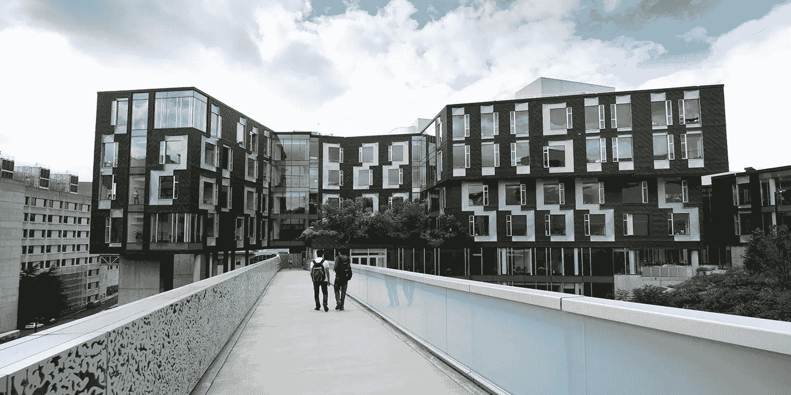
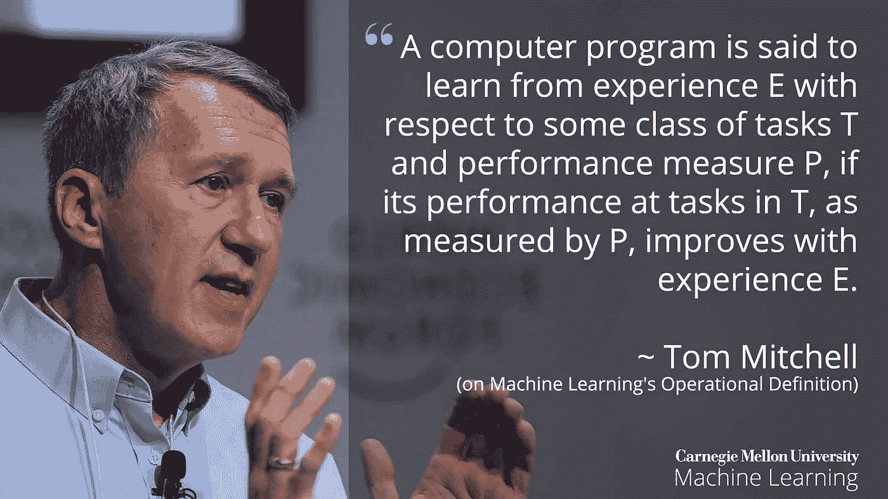
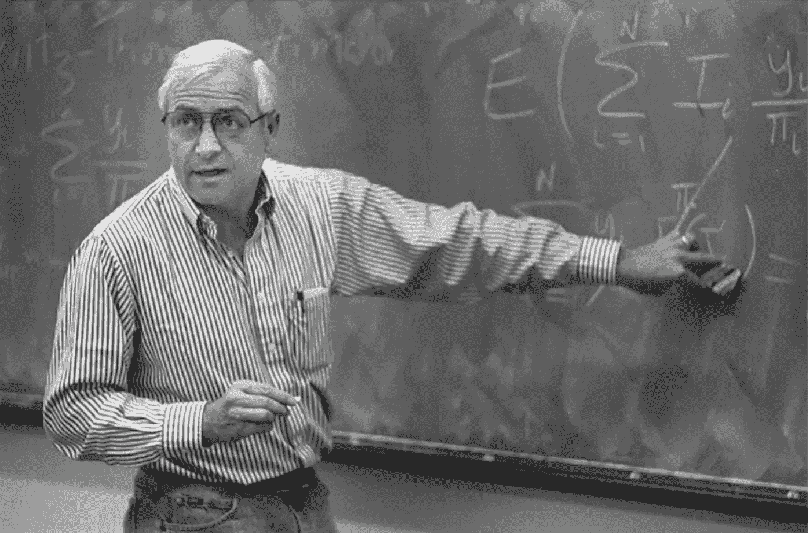
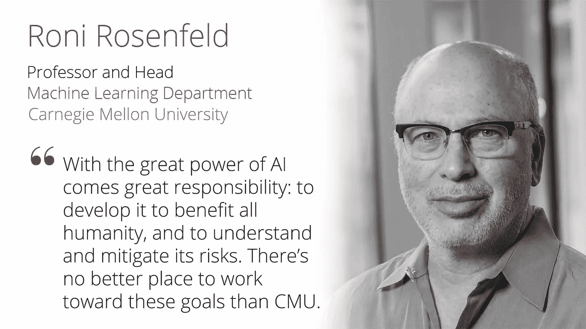

# 卡内基梅隆大学机器学习系的历史

> 原文：<https://pub.towardsai.net/history-of-the-machine-learning-department-at-carnegie-mellon-1998e0ea6c37?source=collection_archive---------1----------------------->

盖茨希尔曼中心描绘。礼貌:[卡内基梅隆大学](https://cmu.edu)

## [机器学习](https://towardsai.net/p/category/machine-learning)

## 第一个[机器学习](https://www.ml.cmu.edu/?utm_source=towardsai.net&utm_medium=towardsai&utm_campaign=advertising&utm_content=machine-learning-academics)学术部门是怎么成立的

[Tom M. Mitchell](http://www.cs.cmu.edu/~tom/) 描绘，机器学习部门主管 1997–1999 和 2002–2015，来源: [CMU](https://cmu.edu) 。

卡内基梅隆大学的机器学习系成立于 2006 年春天，是世界上第一个机器学习学术部门。它是由 1997 年创建的一个名为自动学习和发现中心(CALD)的早期组织演变而来的。CALD 旨在聚集一群对统计学和机器学习有共同兴趣的跨学科研究人员。

第一批 CALD 学院的参与者主要来自统计系和计算机科学学院，但也包括来自哲学、工程、商学院和生物科学的教师。

[斯蒂芬·e·芬伯格](https://en.wikipedia.org/wiki/Stephen_Fienberg)描绘，2000-2001 年机器学习系主任，来源:[自然](https://nature.com)。

统计学教授斯蒂芬·芬伯格和计算机科学教授汤姆·米切尔是参与创建 CALD 的主要教员。1999 年，CALD 开始了它的第一个教育项目，即“知识发现和数据挖掘”硕士学位

2002 年，我们启动了“计算和统计学习”的博士项目，同时将硕士学位项目转变为二级硕士项目，只提供给 CMU 的博士生。一旦 CALD 开始提供教育项目，它也开始雇用其教师。

[Geoff Gordon](http://www.cs.cmu.edu/~ggordon/) 描绘临时部门主管，机器学习部门 2016–2016，来源:[微软](https://www.microsoft.com/en-us/research/uploads/prod/2018/01/Geoff-360x360.jpg)。

到 2006 年春天，我们请求大学将 CALD 改为机器学习系，在 2006 年创建这个学术系时，卡耐基梅隆大学表明了它的信念，即机器学习学科形成了一个具有持久学术重要性的领域，并且它打算成为帮助塑造这个快速发展的领域的领导者。

该系的研究策略是在机器学习的 cure 统计计算理论研究和发明与实际应用相关的新算法和新问题公式的研究之间保持平衡。

[曼努埃拉·贝洛索](http://www.cs.cmu.edu/~mmv/)描绘，2016–2018 年机器学习系系主任，来源: [CMU](https://cmu.edu)

机器学习方面的博士和硕士项目是世界上第一批提供机器学习专门培训的学位项目。该系提供机器学习方面的[博士项目](/academics/machine-learning-phd)，以及统计学和机器学习、机器学习和公共政策、神经计算和机器学习方面的[联合博士项目](/academics/joint-ml-phd)。我们还提供机器学习的[本科辅修](/academics/minor-in-machine-learning)和机器学习的初级和中级[硕士。](/academics/machine-learning-masters-curriculum)

[罗尼·罗森菲尔德](http://www.cs.cmu.edu/~roni/)描绘，2018 年至今，机器学习系系主任，来源: [CMU](https://cmu.edu)

我们的使命是通过在该领域进行领先的研究，开发和宣传该领域的示范学术课程，以及帮助社会从该领域获得的知识中受益，来帮助领导机器学习学科的发展。

*本故事最初发表于*[*https://www.ml.cmu.edu/about/*](https://www.ml.cmu.edu/about/)