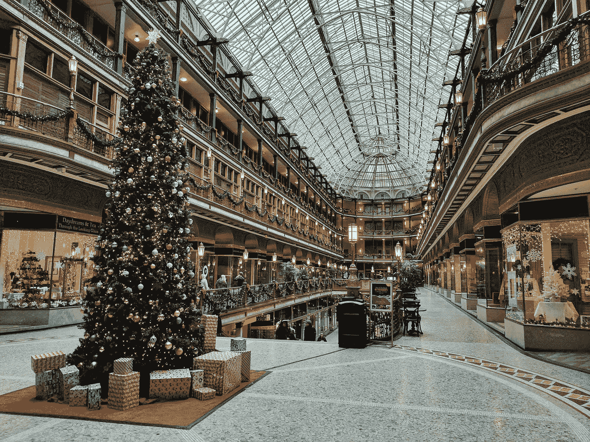
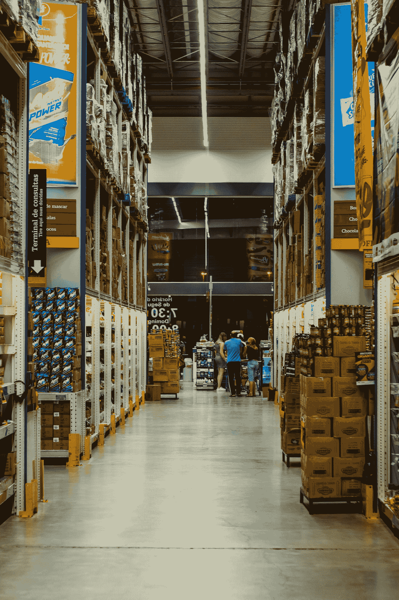
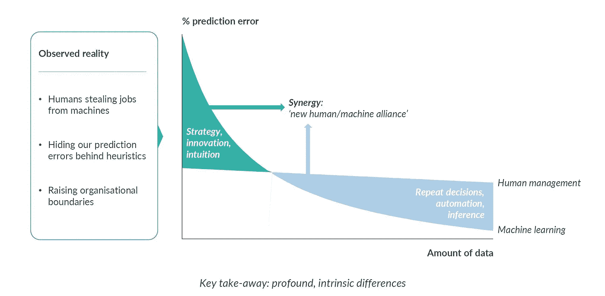
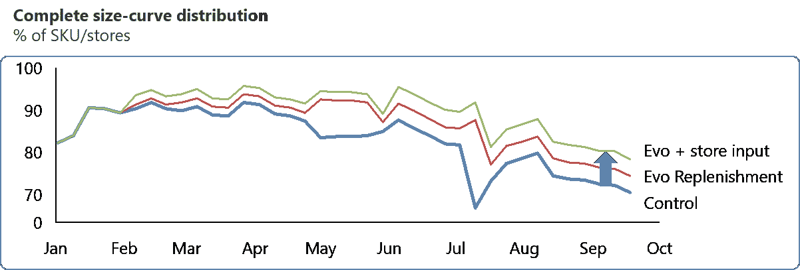

# 我们这些凡人的假日供应链优化

> 原文：<https://pub.towardsai.net/holiday-supply-chain-optimization-for-us-mere-mortals-b2ce6cba3df5?source=collection_archive---------2----------------------->

## [商业科学](https://towardsai.net/p/category/business-science)

## 圣诞老人有魔法。人工智能是我们自己的魔法解决方案吗？



由[罗恩·多芬](https://unsplash.com/@rondomondo?utm_source=medium&utm_medium=referral)在 [Unsplash](https://unsplash.com?utm_source=medium&utm_medium=referral) 上拍摄

现在是假期，虽然庆祝活动可能会在公共场合低调进行，但我仍然喜欢点亮圣诞树，喝热葡萄酒，和家人一起庆祝。

随着圣诞节的临近，不可能不想到圣诞老人——作为优化供应链的人工智能公司[的首席执行官](https://evopricing.com/)，不可能忽视他迫在眉睫的物流挑战。*一夜之间在全球递送数十亿个包裹？这种任务甚至会挑战最复杂的人工智能。*

每年的这个时候，许多人工智能公司都会发表文章，解释圣诞老人如何使用他们的工具来拯救圣诞节，或者更快地把礼物送给乖女孩和男孩。读起来很有趣，但显然很傻。圣诞老人让魔术师担任他的后勤经理。

但是对于我们这些没有魔法的凡人来说，我们如何把包裹准时送到他们需要去的地方呢？

# 假日供应链挑战

对于供应链物流来说，这是一个特别令人担忧的假日季节。**更多的人在网上进行节日采购，是** [**铺天盖地的供应链**](https://www.nytimes.com/2013/12/27/business/holiday-shoppers-overload-holiday-shippers.html) **。**这还没有考虑到由 Covid 引起的所有其他供应链中断。商店关门、工厂延期，甚至是常见的冬季天气挑战，都让我们很难规划何时何地发送货物。


图片由[汉尼斯·艾丁格](https://pixabay.com/users/hutchrock-2563315/?utm_source=link-attribution&utm_medium=referral&utm_campaign=image&utm_content=2900303)来自[皮克斯拜](https://pixabay.com/?utm_source=link-attribution&utm_medium=referral&utm_campaign=image&utm_content=2900303)

[**预测消费者需求**](https://home.kpmg/uk/en/blogs/home/posts/2020/11/predicting-black-friday-and-christmas-demand-a-fool-s-game.html) **对企业来说同样令人沮丧**。正如我在[周五](https://medium.com/towards-artificial-intelligence/recovering-from-bleak-friday-b19e52d00b30)之前警告的那样，对价格敏感的顾客暂时消失了，许多消费者正在缩减节日礼物。这些缩减的假期计划意味着越来越少的人会把冲动购物加入他们的购物车。因此，对于零售商来说，将消费者的需求与正确的产品相匹配变得越来越重要，否则就有失去销售的风险。此外，社交距离使得节日礼物的常规趋势变得不那么可靠。

难怪供应链经理感到不知所措！2020 年创造了**完美风暴，颠覆了供应链的传统方式**。

# 变化世界中的供应链优化



照片由 [Eduardo Soares](https://unsplash.com/@eduschadesoares?utm_source=medium&utm_medium=referral) 在 [Unsplash](https://unsplash.com?utm_source=medium&utm_medium=referral) 拍摄

那么解决办法是什么呢？当同时面临如此多的新障碍时，高管们怎么可能优化供应链？

> 是时候让人工智能比任何人都更快地优化供应链了。

人工智能最大的优势是它比任何人(甚至是一个庞大的团队)更快更准确地处理大量数据的能力。 **AI 并不比人聪明；只是得到了更多的处理能力**。它可以更快地识别新出现的模式[并利用这些数据提出最佳行动方案。有了正确的模型，我们可以及时调整。](https://link.springer.com/chapter/10.1007/978-3-540-24581-0_1)

今年，我们不得不抛弃历史数据。一切都没有按照我们预期的方式运行。在新冠肺炎成为记忆多年后，我们自己可能会找到最佳解决方案。有了人工智能，我们现在可以优化我们的供应链，随着数据实时旋转。

# 是人工智能，不是魔法


照片由[JESHOOTS.COM](https://unsplash.com/@jeshoots?utm_source=medium&utm_medium=referral)在 [Unsplash](https://unsplash.com?utm_source=medium&utm_medium=referral) 上拍摄

但是很多公司已经在用 AI 了吧？那我们怎么还面临 [*shipageddon*](https://www.nytimes.com/2020/10/16/technology/holiday-shipageddon.html) ？为什么这么多公司仍然无法准确预测需求？

简单:**我们没有正确使用 AI**。

> "只有当潮水退去，你才发现谁在裸泳"。—沃伦·巴菲特

当疫情来袭时，中断暴露了太多人工智能模型的致命设计缺陷。许多数据科学家发现，除了干扰本身之外，他们还在与模型漂移作斗争。这是个问题。一个好的模型应该将破坏作为自动学习的机会，而不是解开 T21。

由于对数据的过度依赖， **AI 几乎无法自主创新**。然而，它可以而且应该从新数据中学习。是的，在之前模式的大规模破坏之后，人工智能将变得不那么准确，但一个设计良好的算法应该会调整。一旦有了新的信息，人工智能的学习速度就会比人类快得多。

AI 是一个工具，而不是一个无所不知的神奇实体。圣诞老人可能看到一切，但我们的人工智能只能对我们提供的数据做出反应:它受到我们构建到模型中的约束的限制。然而，我们没有认识到这一事实，而是倾向于对准确性的暂时下降反应过度，或者对我们未能预料到的模型漂移反应不足。

我们设法放大了人工智能的优势，同时忽略了它的盲点。

# 人的因素

解决办法？一个充分利用人类和人工智能最大优势的人机联盟。人工智能和人类管理者扮演着不同但互补的角色。我们制定战略、目标和规则；人工智能为我们实现它们，快速而有效。即使面对我们在这个假期面临的各种干扰，我们一起做得更好。



作者提供的图片(抄送并注明出处)

我总是强调自动化对于人工智能的成功实施是多么重要，但是人的因素仍然同样重要。 *AI 有* ***高度专业化，狭义智力*** *，而人有* ***一般知识，AI 缺乏*** 。我们可以提供人工智能可能错过的见解，并提高其准确性。

事实上，在 [Evo](https://evopricing.com/) 中，我们有意将经理的意见整合到我们的模型中。在我们的第一个[真实世界测试案例](https://www.hbs.edu/faculty/Pages/item.aspx?num=55823)中，仅人工智能就将需求预测的准确性提高了 19 个百分点。**人工智能+人工输入将准确性提高了 5 个百分点。**这 5 个百分点并不是理论上的提高；它带来了实实在在的好处，包括[](https://www.hbs.edu/faculty/Pages/item.aspx?num=55867)****收入**增加 16%。人的因素非常重要，尤其是在这个动荡的时代。**

****

**作者提供的图片(抄送并注明出处)**

# **到 2021 年完全整合、自主物流！**

****

**照片由 [Riccardo Annandale](https://unsplash.com/@pavement_special?utm_source=medium&utm_medium=referral) 在 [Unsplash](https://unsplash.com?utm_source=medium&utm_medium=referral) 上拍摄**

**我们可能没有一个神奇的优化解决方案，可以神奇地修复我们所有的假日供应链问题。尽管如此，我们确实有一个真正的机会来最大限度地利用人工智能取得成果。人工智能并不完美，但当适当利用时，特别是与理解人工智能的人类经理一起，它可以让我们的许多后勤问题消失。**

**2021 年，我们需要利用最好的人工智能来提供优化的推荐，但我们不能指望人工智能独自成为灵丹妙药。将人类的优势整合到自治系统中可以改善结果，并使算法更具弹性。而这正是新的一年最需要的:**有弹性的人工智能模型，可以帮助我们减轻未来意想不到的灾难**。**

**祝大家节日快乐，新年快乐！**愿 2021 年对每个人来说都更光明——*无论是供应链还是*** *之后的生活。***

**PS 我定期写[商业科学](https://medium.com/tag/business-science)。推荐后续阅读:**

**[](https://towardsdatascience.com/5-ways-business-science-will-transform-the-supply-chain-in-2021-626b8f17efda) [## 商业科学将在 2021 年改变供应链的 5 种方式

### 后 Covid 时代零售业的数据科学趋势

towardsdatascience.com](https://towardsdatascience.com/5-ways-business-science-will-transform-the-supply-chain-in-2021-626b8f17efda) [](https://towardsdatascience.com/supply-chain-optimization-worth-it-or-not-20ae4c6e635) [## 供应链优化:值得还是不值得？

### 数学最优化的悖论

towardsdatascience.com](https://towardsdatascience.com/supply-chain-optimization-worth-it-or-not-20ae4c6e635) 

```
Monthly Business Science in your inbox, new software, and University-level learning:[**Free access**](https://evouser.com/register)Questions? Please reach out on [Linkedin](https://www.linkedin.com/in/fabrizio-fantini/)
```