# 用 Python 实现酒店数据可视化

> 原文：<https://pub.towardsai.net/hotel-data-visualization-with-python-5c8b6c2a8051?source=collection_archive---------3----------------------->

## 酒店还是度假村？

亚历山大·考纳斯在 [Unsplash](https://unsplash.com?utm_source=medium&utm_medium=referral) 上的照片

# **简介**

你是否好奇人们是否更喜欢去酒店或度假村？或者人们最喜欢酒店里的哪种饭菜？如果你像我一样好奇，不要担心，这些是一些有趣的发现，我们将在酒店数据的可视化和分析中发现更多

对于喜欢旅游和度假的人来说，可视化酒店预订需求数据对我来说是一件令人兴奋的事情。我发现了关于酒店的一些令人惊奇的事情，以及入住酒店的人的行为模式，我很乐意在这篇文章中与你分享这些令人惊奇的发现，我相信你会喜欢它们的。

因此，请耐心等待，我们将探索酒店的数据

# 数据源

这些数据来自 Kaggle 的数据库。Kaggle 是一个公共在线数据仓库，允许用户访问和分析来自不同来源的数据。酒店数据显示了相当多的特征，这些特征显示了访问酒店的不同人的不同特征。一些特征包括到达日、交付时间、存款类型和更多的特征。你可以在 [**Kaggle**](https://www.kaggle.com/datasets/jessemostipak/hotel-booking-demand) 上找到这里的数据。

# 数据争论和可视化

python 编程语言是一种很酷的语言，因为它有很多很酷的库，使得数据清理、排序、可视化和处理变得很容易。其中最受欢迎的是建在 NumPy 图书馆上面的熊猫图书馆。它管理数据分析中的不同任务，从加载数据到清理和处理数据，甚至是可视化数据。流行的 Matplotlib 库是另一个构建在 panda 库之上的库，通过它提供的不同功能使可视化变得非常容易。Seaborn 库的开发也是为了创建更具吸引力和启发性的统计图形，以提供对绘图的深入了解

如果您需要更多关于这个库以及它们如何工作的信息，您可以查看它们的文档。

下面是数据外观的快速概述

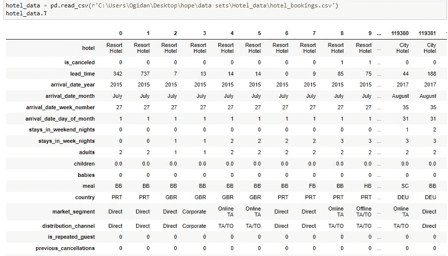

代码可以在 Github 的[这里](https://github.com/hope205/Hotel-Bookings-Demand-Visualization)找到。

让我们直接进入不同列的可视化

## **酒店类型**

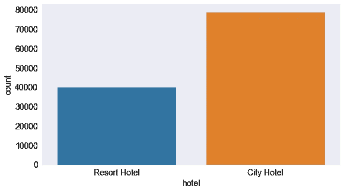

**观察**

我们可以看到，在预订酒店的总人数中，约有两倍的人更喜欢城市酒店，而不是度假酒店。

## 存款类型

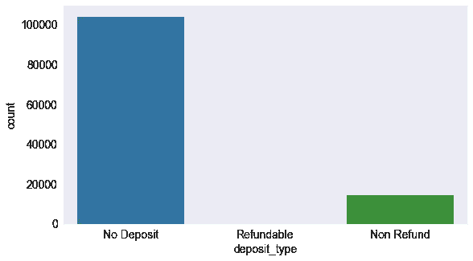

**观察**

这表明相当多的人没有存款。

## 细分市场中的客户类型

**观察**

从图表中，我们可以看到:

*   参观酒店的人数最多的是临时顾客，他们中的绝大多数来自线下 TA/TO 旁边的在线 TA 细分市场
*   很少有人以合同客户的身份预订酒店
*   大量的临时方客户来自与线下 TA/TO 相邻的集团细分市场。

## 抵达月份

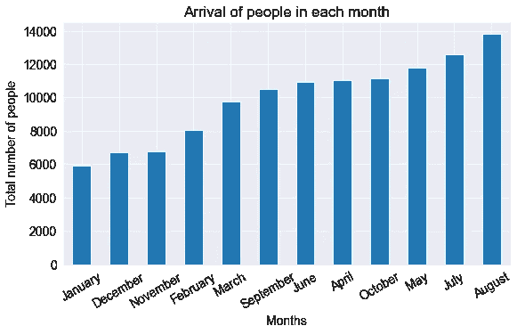

**观察**

8 月份入住酒店的人数较多，而 1 月份入住的人数最少

## 细分市场

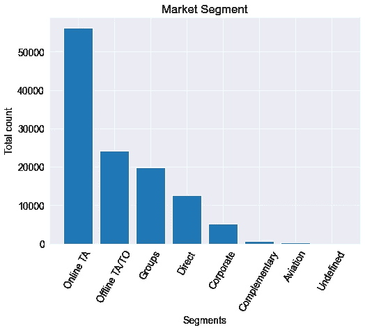

**观察**

光顾酒店的细分市场大多数来自在线 TA，最少来自航空

## 人们哪一天到达酒店最多？

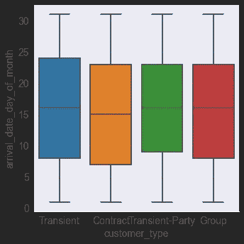

**观察**

平均来说，大多数顾客在每月的第 15 天到达。

## 哪些客户取消预订最多

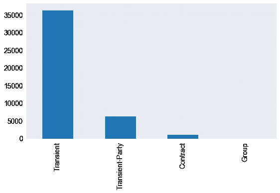

**观察**

大部分被取消的预订来自临时顾客、临时团体顾客、联系顾客和团体顾客。

## 顾客更喜欢哪一餐

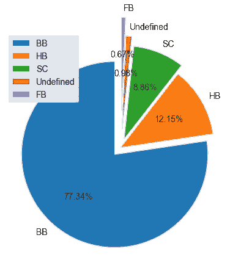

**观察**

从这里我们可以看出，很多顾客更喜欢床上早餐(BB ),只有少数顾客喜欢 FB

## 哪一年是最忙的一年

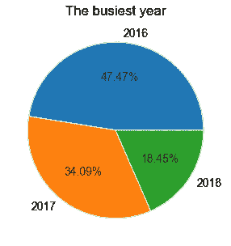

**观察**

从数据来看，2016 年是最忙的一年

## 最常去的游客来自哪个国家

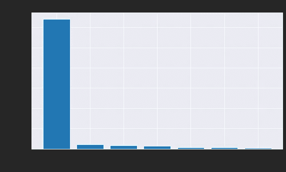

**观察**

这家旅馆的大多数常客来自 PRT

## 哪个细分市场的周末夜入住率最高

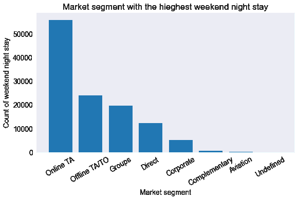

**观察**

在线 TA 在离线 TA/TO 旁边的周末逗留时间比在团体和其他地方的多

## 回头客最喜欢什么类型的饭菜？

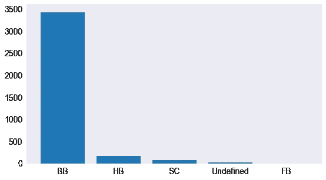

**观察**

大多数回头客也喜欢床上早餐

## 提前期和取消预订之间的关系

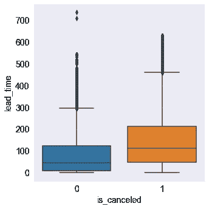

取消预订的人比没有取消预订的人平均提前时间更长。没有取消预订的人之间也存在较高的差异。

代码可在处[找到。](https://github.com/hope205/Hotel-Bookings-Demand-Visualization)

# 建模

在进行了大量的可视化之后，我不得不在所有的分类变量上使用 *Pandas.getdummies* 以便于建模。这是一项分类任务。所以，**逻辑回归**是最适合它的(别担心，它并不像听起来那么专业)。我导入了**混淆 _ 矩阵**和 **f1_score** 来衡量分类精度。

# 结论

*   比起度假酒店，很多人更喜欢去城市酒店
*   更多的人在 8 月份入住酒店，这是完全合理的，因为 8 月份正好是北半球的夏休期，而 1 月份的入住率最低，这是可以解释的，因为 1 月份是一年的开始，而且人们往往更关注工作
*   大多数在酒店预订房间的人都是从网上进入这个细分市场的，因为很多人把大部分时间都花在了网上，这使得他们很容易在酒店预订房间
*   大多数顾客喜欢床上早餐。毕竟谁不喜欢享受呢？

如果你觉得这篇文章很有见地，请鼓掌并分享。你也可以通过 [LinkedIn](https://www.linkedin.com/in/hope-ogidan-82a6b31bb/) 和 [Twitter](https://twitter.com/HopeOgidan) 与我联系