# 使用 Keras 进行房价预测

> 原文：<https://pub.towardsai.net/house-price-predictions-using-keras-3c6accee8a09?source=collection_archive---------1----------------------->

## [深度学习](https://towardsai.net/p/category/machine-learning/deep-learning)

## 使用 Keras 和超参数调整实现神经网络以预测房价。


这是一个关于使用 Keras 建模的入门教程，包括超参数调整和回调。

# 问题陈述

> 创建一个 Keras 回归模型，该模型可以准确地分析给定房屋的特征，并相应地预测价格。

# 涉及的步骤

1.  缺失值的分析和插补
2.  分类特征的一键编码
3.  探索性数据分析(EDA)和异常值检测。
4.  keras-回归建模以及超参数调整。
5.  训练模型以及提前停止回调。
6.  预测和评估

## [**Kaggle 笔记本链接**](https://www.kaggle.com/pratiyushmishra/house-predictions-keras/)

# 导入库

我们将使用 numpy 和 pandas 处理我们的数据集，使用 matplotlib 和 seaborn 进行数据可视化，使用 Keras 实现我们的神经网络。此外，我们将使用 Sklearn 进行异常值检测和扩展我们的数据集。

```
import numpy as np
import pandas as pd
import matplotlib.pyplot as plt
import seaborn as sns
sns.set()
from sklearn.preprocessing import StandardScaler *# Standardization*
from sklearn.ensemble import IsolationForest *# Outlier Detection*
from keras.models import Sequential *# Sequential Neural Network*
from keras.layers import Dense
from keras.callbacks import EarlyStopping *# Early Stopping Callback*
from keras.optimizers import Adam *# Optimizer*
from kerastuner.tuners import RandomSearch *# HyperParameter Tuning*
import warnings
warnings.filterwarnings('ignore') # To ignore warnings.
```

# 加载数据集

这里我们使用了来自[房价——高级回归技术](https://www.kaggle.com/c/house-prices-advanced-regression-techniques)的数据集

```
train = pd.read_csv('../input/house-prices-advanced-regression-techniques/train.csv')
test = pd.read_csv('../input/house-prices-advanced-regression-techniques/test.csv')
y = train['SalePrice'].values
data = pd.concat([train,test],axis=0,sort=False)
data.drop(['SalePrice'],axis=1,inplace=True)
data.head()
```


数据集的前 10 列

# 缺失值的分析和插补

我们首先会看到所有缺少值的特征。这将包括来自训练和测试数据的数据。

```
missing_values = data.isnull().sum()
missing_values = missing_values[missing_values > 0].sort_values(ascending = False)
NAN_col = list(missing_values.to_dict().keys())
missing_values_data = pd.DataFrame(missing_values)
missing_values_data.reset_index(level=0, inplace=True)
missing_values_data.columns = ['Feature','Number of Missing Values']
missing_values_data['Percentage of Missing Values'] = (100.0*missing_values_data['Number of Missing Values'])/len(data)
missing_values_data
```

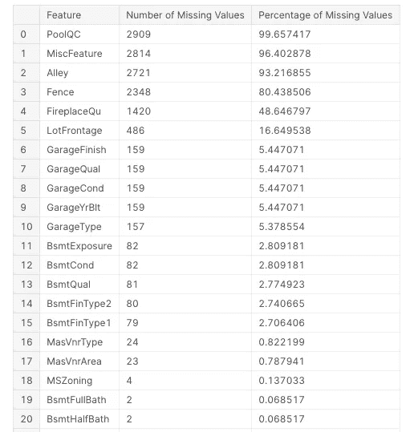

缺失功能的前 20 列

总共有 33 个特征具有缺失值。虽然在一些以缺失值百分比表示的顶级功能中，如 PoolQC，缺失值表示房屋根本没有该功能(在这种情况下，房屋没有游泳池)，这一点从 Pool Area 功能中可以明显看出，PoolQC 功能的所有缺失值对应的值为 0。我们用以下方式填充缺失值:

*   **基底:**这包括 BsmtFinSF1、BsmtFinSF2、TotalBsmtSF 和 BsmtUnfSF **。**我们将用 0 填充所有缺失的值，因为此处的 NAN 值只是表示房子没有地下室，因此地下室的面积将为 0。
*   **电气:**只有一行缺少该特性的值。因此，在人工检查后，我们会将其值设为“FuseA”
*   **KitchenQual** :同样，由于只有一行缺少该值，因此我们将该值设为“TA”，这是数据集中该特性最常见的值。
*   **LotFrontage** :这里我们将首先通过取具有相同值 1stFlrSF 的所有组的 LotFrontage 值的平均值来填充所有缺失值。这是因为 LotFrontage 与 1stFlrSF 的相关性很高。但是，可能会有这样的情况，即对应于特定 1stFlrSF 值的所有 LotFrontage 值都可能会丢失。为了解决这种情况，我们将使用 pandas 的插值函数来线性填充缺失值。
*   **MasVnrArea** :我们将再次应用与前面相同的类比。
*   **其他**:对于其他特征，我们将遵循最通用的方法，也就是说，我们将通过该特征的所有值的平均值来填充数字，对于分类，我们将通过 NA 来填充。

```
data['BsmtFinSF1'].fillna(0, inplace=True)
data['BsmtFinSF2'].fillna(0, inplace=True)
data['TotalBsmtSF'].fillna(0, inplace=True)
data['BsmtUnfSF'].fillna(0, inplace=True)
data['Electrical'].fillna('FuseA',inplace = True)
data['KitchenQual'].fillna('TA',inplace=True)
data['LotFrontage'].fillna(data.groupby('1stFlrSF')['LotFrontage'].transform('mean'),inplace=True)
data['LotFrontage'].interpolate(method='linear',inplace=True)
data['MasVnrArea'].fillna(data.groupby('MasVnrType')['MasVnrArea'].transform('mean'),inplace=True)
data['MasVnrArea'].interpolate(method='linear',inplace=True)for col **in** NAN_col:
    data_type = data[col].dtype
    if data_type == 'object':
        data[col].fillna('NA',inplace=True)
    else:
        data[col].fillna(data[col].mean(),inplace=True)
```

# 添加新功能

在彻底理解数据之后，我们还通过组合给定的特性创建了一些新的特性。

```
data['Total_Square_Feet'] = (data['BsmtFinSF1'] + data['BsmtFinSF2'] + data['1stFlrSF'] + data['2ndFlrSF'] + data['TotalBsmtSF'])

data['Total_Bath'] = (data['FullBath'] + (0.5 * data['HalfBath']) + data['BsmtFullBath'] + (0.5 * data['BsmtHalfBath']))

data['Total_Porch_Area'] = (data['OpenPorchSF'] + data['3SsnPorch'] + data['EnclosedPorch'] + data['ScreenPorch'] + data['WoodDeckSF'])

data['SqFtPerRoom'] = data['GrLivArea'] / (data['TotRmsAbvGrd'] + data['FullBath'] + data['HalfBath'] + data['KitchenAbvGr'])
```

# 分类特征的一种热编码

我们将首先看到数字和分类之间的特征分布。

```
column_data_type = []
for col **in** data.columns:
    data_type = data[col].dtype
    if data[col].dtype **in** ['int64','float64']:
        column_data_type.append('numeric')
    else:
        column_data_type.append('categorical')
plt.figure(figsize=(15,5))
sns.countplot(x=column_data_type)
plt.show()
```

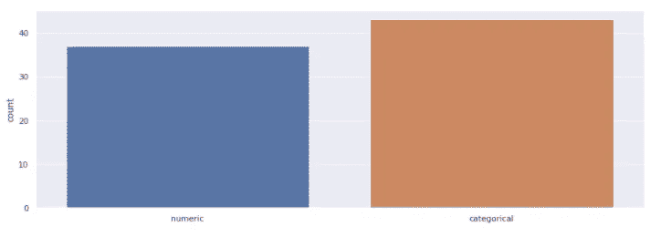

分类和数字特征条形图

这里我们看到分类特征的数量实际上超过了数字特征的数量，这表明这些特征是多么重要。这里我们选择了一种热编码来将这些分类特征转换成数字。

```
data = pd.get_dummies(data)
```

经过这次操作，我们原来的 80 个功能扩展到了 314 个功能。基本上，分类要素的每个标签都会变成一个具有二进制值的新要素(1 表示存在，0 表示不存在)。现在，我们将把合并的数据分成训练和测试数据，对训练数据进行一些探索性分析。

```
train = data[:1460].copy()
test = data[1460:].copy()
train['SalePrice'] = y
```

# 探索性数据分析和异常值检测

我们将首先从我们的训练数据集中提取与销售价格具有最高相关性的顶级特征。

```
top_features = train.corr()[['SalePrice']].sort_values(by=['SalePrice'],ascending=False).head(30)
plt.figure(figsize=(5,10))
sns.heatmap(top_features,cmap='rainbow',annot=True,annot_kws={"size": 16},vmin=-1)
```

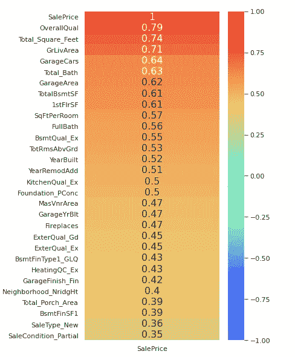

与数据集正相关的前 30 个特征

因此，我们按照降序提取了与销售价格具有最高正相关性的前 30 个特征。现在，我们将根据 SalePrice 绘制其中一些特征，以找出数据集中的异常值。

```
def plot_data(col, discrete=False):
    if discrete:
        fig, ax = plt.subplots(1,2,figsize=(14,6))
        sns.stripplot(x=col, y='SalePrice', data=train, ax=ax[0])
        sns.countplot(train[col], ax=ax[1])
        fig.suptitle(str(col) + ' Analysis')
    else:
        fig, ax = plt.subplots(1,2,figsize=(12,6))
        sns.scatterplot(x=col, y='SalePrice', data=train, ax=ax[0])
        sns.distplot(train[col], kde=False, ax=ax[1])
        fig.suptitle(str(col) + ' Analysis')
```

这是我们用来绘制各种特征的图形的绘图函数。

## 总体平等

```
plot_data('OverallQual',True)
```

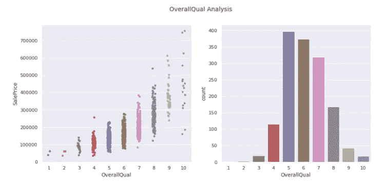

## 我们看到有两个异常值，总体质量为 10，销售价格低于 200000。

```
train = train.drop(train[(train['OverallQual'] == 10) & (train['SalePrice'] < 200000)].index)
```

因此，我们从数据集中剔除了这些异常值。现在我们继续分析另一个特征。

## 总平方英尺

```
plot_data('Total_Square_Feet')
```

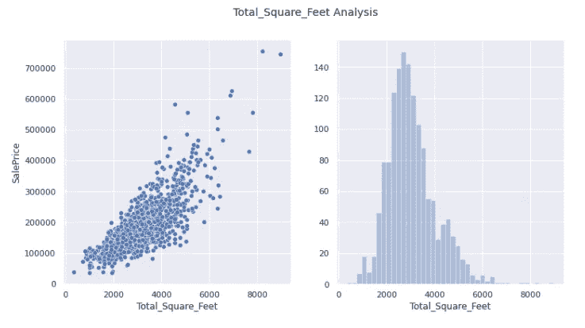

这似乎或多或少是合适的分布，没有任何异常值。

## 格里瓦雷亚

```
plot_data('GrLivArea')
```


同样，没有离群值可以消除。

## 总浴室

```
plot_data('Total_Bath')
```

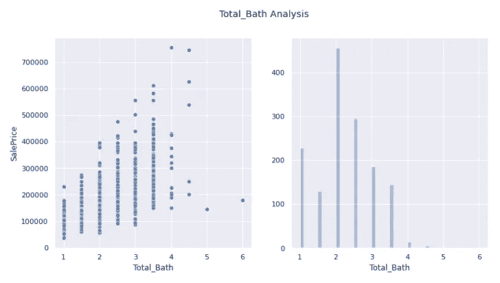

## 这里我们看到两个离群值，它们的 Total_Bath 大于 4，但销售价格小于 200000。

```
train = train.drop(train[(train['Total_Bath'] > 4) & (train['SalePrice'] < 200000)].index)
```

因此我们去除了这些异常值。

## 总计 BsmtSF

```
plot_data('TotalBsmtSF')
```


## 在这里，我们也看到 1 个明显的异常值，其总 BsmtSF 超过 3000，但销售价格低于 300000。

```
train = train.drop(train[(train['TotalBsmtSF'] > 3000) & (train['SalePrice'] < 400000)].index)train.reset_index() # To reset the index
```

既然我们已经处理了数据集的主要特征，我们将使用隔离森林算法进一步移除异常值。我们使用这种算法是因为很难检查所有的特征并手动消除异常值，但是对于与销售价格高度相关的特征，手动进行这种操作是很重要的。

```
clf = IsolationForest(max_samples = 100, random_state = 42)
clf.fit(train)
y_noano = clf.predict(train)
y_noano = pd.DataFrame(y_noano, columns = ['Top'])
y_noano[y_noano['Top'] == 1].index.values

train = train.iloc[y_noano[y_noano['Top'] == 1].index.values]
train.reset_index(drop = True, inplace = True)
print("Number of Outliers:", y_noano[y_noano['Top'] == -1].shape[0])
print("Number of rows without outliers:", train.shape[0])
```

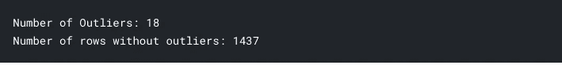

我们将最终使用来自 sklearn 的标准标量来缩放我们的数据。

```
X = train.copy()
X.drop(['SalePrice'],axis=1,inplace=True) # Dropped the y feature
y = train['SalePrice'].values
```

这处理了我们的数据集预处理，我们最终为下一步做好了准备，那就是对我们的数据建模。

# 系统模型化

## 我们将使用来自 Keras 的随机搜索算法进行模型的超参数调整。

```
def build_model(hp):
    model = Sequential()
    for i **in** range(hp.Int('layers', 2, 10)):
        model.add(Dense(units=hp.Int('units_' + str(i),
                                            min_value=32,
                                            max_value=512,
                                            step=32),
                               activation='relu'))
    model.add(Dense(1))
    model.compile(
        optimizer=Adam(
            hp.Choice('learning_rate', [1e-2, 1e-3, 1e-4])),
        loss='mse',
        metrics=['mse'])
    return modeltuner = RandomSearch(
    build_model,
    objective='val_mse',
    max_trials=10,
    executions_per_trial=3,
    directory='model_dir',
    project_name='House_Price_Prediction')
 *tuner.search(X[1100:],y[1100:],batch_size=128,epochs=200,validation_data=validation_data=(X[:1100],y[:1100]))**model = tuner.get_best_models(1)[0]*
```

上面的代码用于调整参数，以便我们可以为数据集生成一个有效的模型。运行上述代码后，我得到了能够为我的数据集提供最有效结果的超参数。我写了一个单独的函数来展示这个模型，因为运行上面的代码会花费很多时间。

```
def create_model():
    *# create model*
    model = Sequential()
    model.add(Dense(320, input_dim=X.shape[1], activation='relu'))
    model.add(Dense(384, activation='relu'))
    model.add(Dense(352, activation='relu'))
    model.add(Dense(448, activation='relu'))
    model.add(Dense(160, activation='relu'))
    model.add(Dense(160, activation='relu'))
    model.add(Dense(32, activation='relu'))
    model.add(Dense(1))
    *# Compile model*
    model.compile(optimizer=Adam(learning_rate=0.0001), loss = 'mse')
    return model
model = create_model()
model.summary()
```

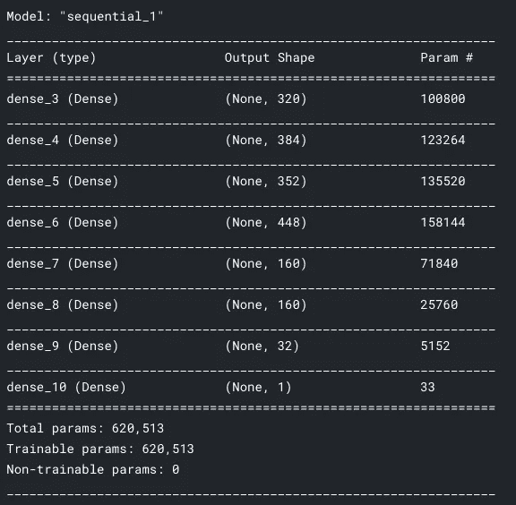

## 我们将使用提前停止回调，并将使用 1/10 的训练数据作为验证，以估计防止过度拟合的最佳时期数

```
early_stop = EarlyStopping(monitor='val_loss', mode='min', verbose=1, patience=10)
history = model.fit(x=X,y=y,
          validation_split=0.1,
          batch_size=128,epochs=1000, callbacks=[early_stop])
losses = pd.DataFrame(model.history.history)
losses.plot()
```

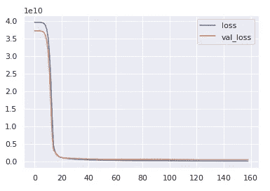

历元数 v/s 损失函数

这段代码显示了在大约 160 处的早期停止，由于我们只使用了 90%的训练数据，因此我们将向它添加 10 作为粗略估计，并将时期数作为 170。因此，我们将再次重置我们的模型，并在完整的训练数据集上训练我们的模型。

```
model = create_model() *# Resetting the model.* history = model.fit(x=X,y=y,
          batch_size=128,epochs=170)
losses = pd.DataFrame(model.history.history)
losses.plot()
```

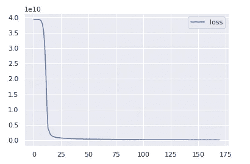

历元数 v/s 损失函数

# 预测和评估

我们现在将根据测试数据集运行我们的模型。但在此之前，我们需要以处理训练数据的相同方式缩放测试数据，为此，我们将再次使用 Sklearn 的 StandardScaler 函数。

```
X_test = scale.transform(test) # Scaling the testing data.
result = model.predict(X_test) # Prediction using model
result = pd.DataFrame(result,columns=['SalePrice']) # Dataframe
result['Id'] = test['Id'] # Adding ID to our result dataframe.
result = result[['Id','SalePrice']]
result.head()
```

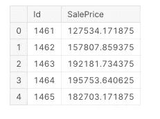

我们模型的预测

因此，我们得到了我们的结果，我们可以提交给 kaggle，看看我们的表现如何。


我在 Kaggle 上的提交

## 注意:最后，我只想说 Keras 不是这个问题最合适的模型，因为这里给出的数据集是不充分的。

感谢您的阅读。这是我的第一篇关于媒体的文章，我希望听到你的反馈！！