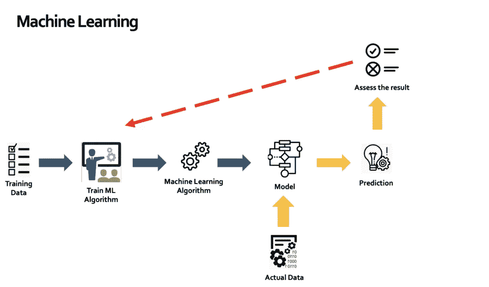
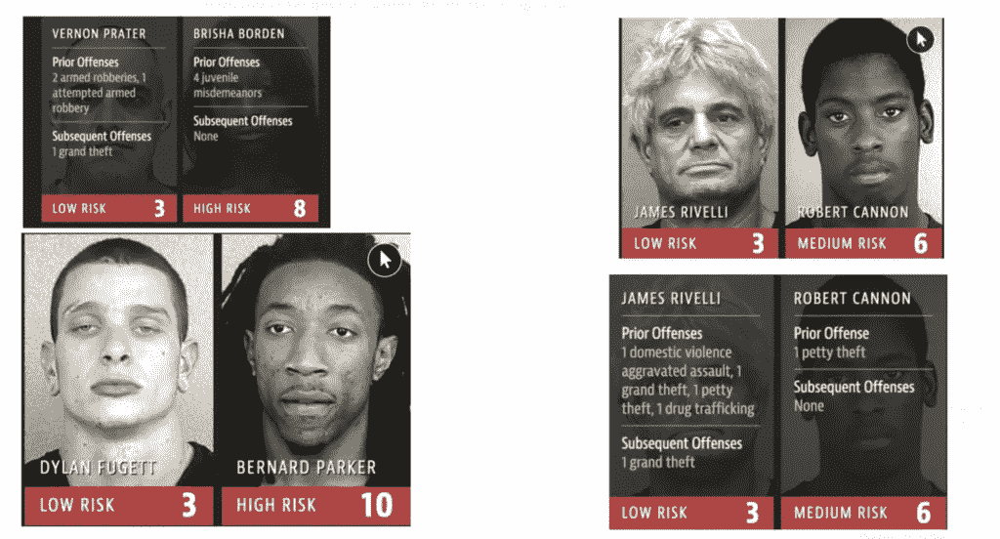

# 人工智能错误如何影响现实生活

> 原文：<https://pub.towardsai.net/how-a-i-mistakes-can-have-real-life-impacts-e0a796e7a030?source=collection_archive---------2----------------------->

## 如果不加以检查，有缺陷的人工智能系统的影响有可能毁掉生命。

大卫·普帕扎在 [Unsplash](https://unsplash.com?utm_source=medium&utm_medium=referral) 上的照片

如今，由**人工智能**驱动的新世界就在我们身边。从 Alexa 到自动驾驶汽车，再到智能家居，人工智能正在改变我们与这个世界互动的方式。

很多人(还有一个叫[埃隆·马斯克](https://www.independent.co.uk/life-style/gadgets-and-tech/news/elon-musk-artificial-intelligence-ai-singularity-a9640196.html)的家伙)也提到了很多关于人工智能的危险，以及它如何带给我们所知道的人类。

> 人工智能会犯错吗？这些错误能有多严重？

正如你所知，我是人工智能的忠实粉丝，并且已经写了很多关于它的文章；但即使是我也意识到，像任何技术一样，人工智能也有被滥用的可能。

我不相信人工智能会像一些人喜欢预测的那样毁灭人类，但如果人工智能没有得到适当的治理和监管，它可能会造成巨大的破坏。让我们来看一个案例研究，以获得人工智能如何犯错误并造成现实生活中的损害的适当背景。

# 机器如何学习(以及它们如何出错)

为了充分理解 AI 是如何犯错的，我们先来理解 AI 背后的驱动力，也就是机器学习。

不要过多地使用技术术语，机器学习是一门在没有硬编码编程指令的情况下教会机器做出决策的科学。

如下图所示，为机器提供了训练数据和理解这些数据的算法。

一旦机器理解了，它就能够创建一个模型来做出决策。对这些决策的准确性进行测试，并输入越来越多的数据，直到对这些决策的准确性有了高度的信心。

来源:作者

所有这些看起来很简单，但也引出了一个问题。机器学习算法的准确性直接取决于输入的训练数据的质量。如果数据向一个特定的方向倾斜会怎样？

> 例如，如果一个面部识别算法只训练了高加索人的脸，那么它会识别另一个种族吗？这是我们开始进入没有正确训练机器学习的有趣含义的地方。

让我们看看人工智能出错的实际例子

# 公司的惨败

2016 年，一个真正可怕的人工智能滥用案件曝光，其中一份报告显示，法庭上使用的一个名为**惩教罪犯管理侧写器替代制裁(COMPAS )** 的人工智能系统对黑人有偏见。

这一系统被用来评估被告，并考虑年龄和以前的被捕史等因素，并利用它来确定一名罪犯是否是“高风险”的。

这可能导致法院判处更严厉的监禁和更重的罚款，因此现实生活中的影响是存在的。

报告显示，该算法在确定罪犯未来是否有可能再次犯罪时犯了两个非常严重的错误:

*   **黑人被告被贴上未来罪犯标签的可能性增加了一倍**
*   **白人被告更有可能被贴上低风险标签**

为了将它放在上下文中，看一看下面的案例和 COMPAS 指定的风险级别。你认为先前的犯罪和指定的风险等级匹配吗？

来源:[https://www . propublica . org/article/machine-bias-risk-assessments-in-criminal-pending](https://www.propublica.org/article/machine-bias-risk-assessments-in-criminal-sentencing)

COMPAS 意义重大，因为它让人们意识到，机器学习算法实际上可以从训练数据中继承种族偏见和成见，而训练数据并不能恰当地代表所有种族。这导致了现实生活中人们得到他们不应该得到的判决。

完整报告可在[这里](https://www.propublica.org/article/machine-bias-risk-assessments-in-criminal-sentencing)阅读

# 如何停止人工智能系统中的偏差

科学家和研究人员提出了人工智能系统中必须存在的某些属性，以便公众信任它们。基本上，该算法应该具有以下特征:

*   **完整性**:模型建立的公平吗？是否对其进行控制以确保其参数不会改变？我们怎么知道没人动过它？
*   **公平性**:必须小心确保数据在收集阶段没有继承任何种族偏见。必须进行测试以确保这一点，并在需要时重新平衡数据。
*   **透明度**:公众需要知道模型是如何制作的，以及它是如何做出决策的。这对于了解模型是否做出任何影响他人福祉的决策至关重要。

这些原则不能在真空中应用，需要一个框架来实施，然后才能生效。你可以在下面阅读更多关于实现这样一个框架的内容。

 [## 如何为你的公司创建一个实用的人工智能风险管理框架

### 以结构化方式降低人工智能风险的简单步骤

pub.towardsai.net](/how-to-create-a-practical-a-i-risk-management-framework-for-your-company-e6d77e5e6c29) 

> 我希望你喜欢读这篇文章。如果你觉得这个话题有趣，可以看看我关于 [*人工智能治理和网络安全*](https://cloudsecguy.gumroad.com/l/aigovernance) *的课程，该课程讲述了新型人工智能风险以及如何减轻它们。*

Taimur Ijlal 是一家获得多项奖项的信息安全领导者，在金融科技行业的网络安全和 IT 风险管理方面拥有 20 多年的国际经验。Taimur 可以在 LinkedIn 或他的 YouTube 频道“Cloud Security Guy”上联系，他经常在上面发布关于云安全、人工智能和一般网络安全职业建议的帖子。

*你可以通过下面的链接注册，每月只需 5 美元就可以获得所有的媒体报道:*

 [## 通过我的推荐链接加入 Medium—tai mur Ijlal

### 阅读 Taimur Ijlal(以及媒体上成千上万的其他作家)的每一个故事。您的会员费直接支持…

taimurcloud123.medium.com](https://taimurcloud123.medium.com/membership)