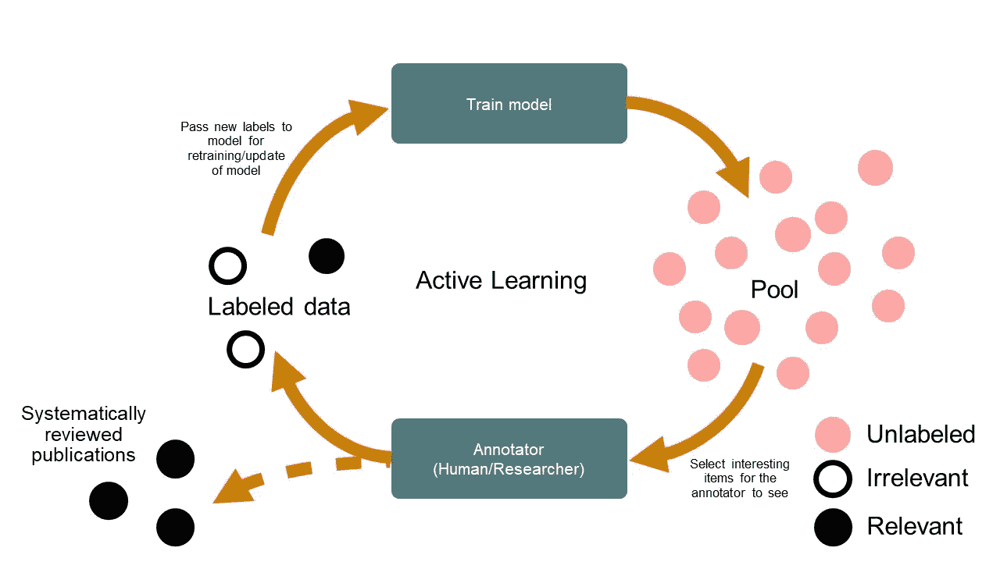

# 作为机器学习的一种形式，主动学习如何帮助显著减少系统复习的工作量

> 原文：<https://pub.towardsai.net/how-active-learning-a-form-of-machine-learning-helps-dramatically-reduce-systematic-review-c3d6f02f8fa5?source=collection_archive---------3----------------------->

## [人工智能](https://towardsai.net/p/category/artificial-intelligence)

创建和及时传播准确和详尽研究的系统性文献综述是循证医学的基石。但是正如我们在[之前的博客文章](https://www.capestart.com/resources/blog/)中所讨论的，单反需要大量的时间来制作——而最耗时的部分通常是搜索和确定相关的研究来收录。

单反到底需要多长时间？[该报告](https://www.ncbi.nlm.nih.gov/pmc/articles/PMC7338918/)显示每次评估大约需要 67 周。这个估计值说是 6 到 18 个月，而这个估计值说是最少 9 到 12 个月。部分原因是随机对照试验(RCT)文献的指数增长(根据 Catalá-López 等人的，1970 年至 2000 年间，RCT 年产量增加了近 3000%。

一句话:单反需要很长时间。因为它们通常需要一个由主题专家、独立评审员、信息专家和统计学家组成的团队——除此之外，它们也可能相当昂贵(根据[这一估计](https://www.sciencedirect.com/science/article/abs/pii/S0950584921000690)，每次评审高达 25 万美元)。

任何减少花费在单反上的时间的方法都可以为研究机构的每个项目节省数万美元。这正是在文章筛选阶段部署主动学习所能达到的效果。

## 系统性文献综述的主动学习

一般来说，机器学习(ML)和自然语言处理(NLP)可以通过自动化或半自动化几个手动(到目前为止，非常缓慢)的过程，在单反创作过程中提供巨大的生产力提升。这些过程包括数据提取(可以使用命名实体识别技术进行改进)，或者通过[主动学习](https://en.wikipedia.org/wiki/Active_learning_(machine_learning))进行文章筛选和选择。

如上所述，并不是所有的 ML 技术都适合每一个特定的 SLR 任务。当谈到文章筛选时，El-Gayar 等人[说](https://www.semanticscholar.org/paper/Active-Learning-for-the-Automation-of-Medical-El-Gayar-Liu/3f8b5570a4603878631bea1a054f7fb6ea2635d8)监督学习技术“前途渺茫”，部分原因是缺乏初始训练数据(然而，研究人员确实表示，这种类型的机器学习在现有单反相机的更新过程中效果很好)。

同样的研究人员表示，主动学习可以“显著减少”花在新的系统性文献综述的文章筛选上的时间——即使是在小的初始训练数据集的情况下。

这是因为主动学习算法特别擅长于[选择](https://www.datacamp.com/community/tutorials/active-learning)最佳未标记数据进行学习。主动学习系统通过选择它们自己的训练文章呈现给人类注释者来工作，然后注释者确认这些记录的相关性。

由于这种独特的工作流程，主动学习系统可以特别擅长识别标题和摘要中的相关文本，召回率达到 95%或以上(这种测量也称为 [WSS@95](https://www.ncbi.nlm.nih.gov/pmc/articles/PMC2995653/#:~:text=They%20introduce%20a%20new%20measure,out%20by%20the%20classifier)'.) )。95%的召回率是大多数机器学习项目的现实目标，因为 100%的召回率几乎是不可能的，即使对于人类评论者来说也是如此)。

## 主动学习周期

然而，主动学习并不是一个开箱即用就能达到那个效率水平的产品。虽然每种分类算法至少略有不同，但对于主动学习系统来说，研究人员也应该遵循一组典型的[步骤](https://asreview.readthedocs.io/en/latest/guides/activelearning.html)来完成其任务:

1.  执行关键字搜索并收集一组未标记的数据(摘要和标题)
2.  然后，审阅者标记上述数据集的一个小子集，它成为您的主动学习系统的训练数据
3.  所选择的主动学习模型基于审阅者的决定从这些标记的记录中学习，将相关性分数分配给所有未标记的文档，并选择新的未标记的记录呈现给审阅者
4.  然后，审阅者评估每个建议文档的相关性，进一步细化每个记录的算法
5.  建议的文档被标记并添加到训练数据集中。重复步骤 3 到 5，直到评估完所需数量的文档

*图片来自* [*ASReview*](https://asreview.readthedocs.io/en/latest/guides/activelearning.html) *。*

然而，正如上面的工作流程所示，主动学习模型不是一劳永逸的工具。相反，该技术作为一种力量倍增器与研究人员携手合作，通过基于算法建议和研究人员确认的充分知情的建议和不断学习来加快文章分类的任务。

以上适用于单反，也称为研究人员在回路中，必须系统地执行，并应遵循 [PRISMA 指南](http://www.prisma-statement.org/)。

## 系统综述中主动学习的例子

最近的几项研究已经证明了主动学习对于 SLR 的省时价值。以下是其中的几个例子:

1.  [van Haastrecht 等人](https://www.frontiersin.org/articles/10.3389/frma.2021.685591/full)开发了一个名为 SYMBALS(融合主动学习和滚雪球的系统评审方法)的系统评审方法，它结合了主动学习和[逆向滚雪球](https://www.wohlin.eu/ease14.pdf)技术。研究人员表明，他们的方法将标题和摘要的筛选速度提高了 6 倍。
2.  [Singh 等人](https://arxiv.org/pdf/1801.09496.pdf)提出了一种基于新奇感的主动学习模型，“在主动学习过程的初始阶段致力于探索不同的主题，然后在后期阶段基于相关性继续进行”，并补充说，该模型在 WSS@95 测量方面优于朴素的主动学习模型。
3.  [Wallace 等人](https://dl.acm.org/doi/10.1145/1835804.1835829)开发了一种新的主动学习模型，该模型利用了人类专家提供的先验领域知识，并补充说，这种方法在三个真实世界数据集上优于其他主动学习策略。

## CapeStart 的机器学习专家

CapeStart 的数据科学家和机器学习工程师每天都与顶级研究机构合作，通过主动学习和其他基于人工智能的工具来改进 SLR 流程。我们在 NLP 和其他机器学习技术方面的专家可以帮助您从 Pubmed、Embase 和 Cochrane 等公开来源快速开发符合 MEDDEV 2.7.1 (Rev. 4)的有效搜索协议。

请立即联系我们，与我们的专家安排一次[简短的调查电话](https://www.capestart.com/about-us/capestart-is-your-end-to-end-data-annotation-machine-learning-and-software-development-partner/)。