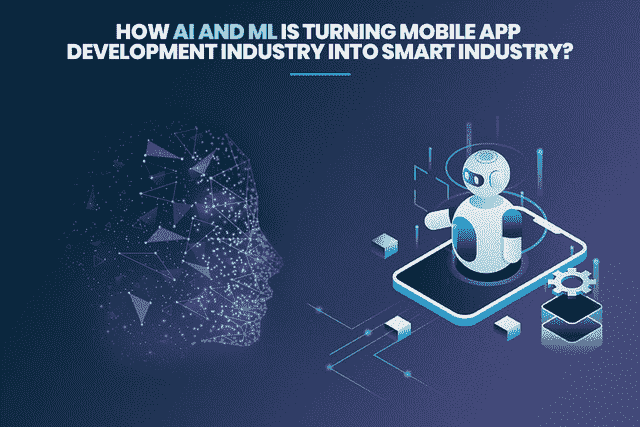
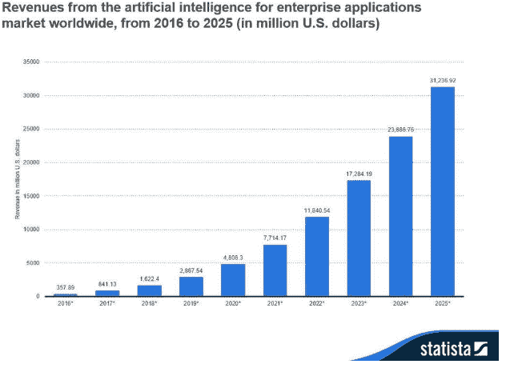
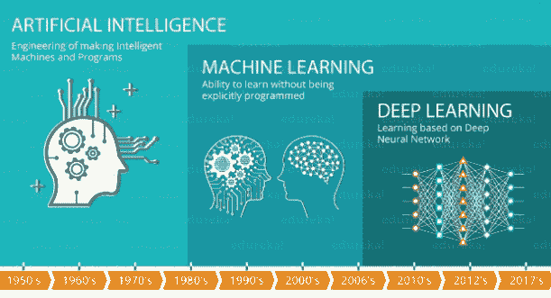
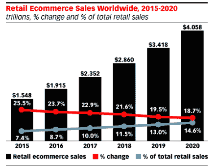
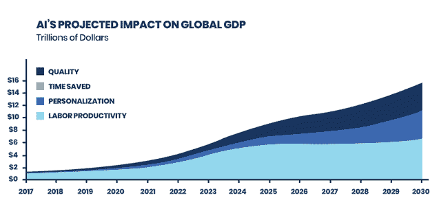
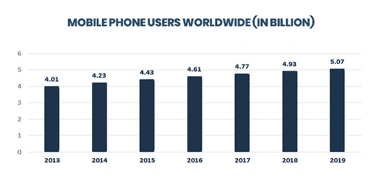

# AI 和 ML 是如何把移动 App 开发行业变成智能行业的？

> 原文：<https://pub.towardsai.net/how-ai-and-ml-are-turning-the-mobile-app-development-industry-into-a-smart-industry-b878931a4e8?source=collection_archive---------1----------------------->

将人工智能(AI)和机器学习(ML)称为开发新时代应用的未来技术是否正确？为什么不呢！

那么，我们可以假设我们已经进入了 2021 年的一个新的现代世界，那里的事物将会高度先进和自动化吗？

嗯，人工智能是一门计算机科学，专注于创造复制人类行为的机器。而人工智能正在慢慢成为明天的现实！

近年来，毫无疑问，移动应用程序开发行业正在发生革命性的变化，并将我们的生活方式变成了人工智能和 ML 驱动的应用程序的智能生活。*从在直播应用上观看你最喜欢的节目，到在 Snapchat 上使用面部多重滤镜，在 tinder 上找到你的灵魂伴侣，再到让 Siri 为你点餐，你会发现人工智能和机器学习无处不在。如今，这项技术在不同领域以多种方式得到应用，包括医疗保健、电子商务、移动应用等。*

**一家领先的 IT 解决方案开发公司 AGC Network 认为，“人工智能不是构建一个头脑；而是解决问题的工具的改进。”**

您知道吗[全球人工智能软件市场](https://www.statista.com/statistics/607716/worldwide-artificial-intelligence-market-revenues/)预计将在未来几年大幅增长，预计到 2025 年将产生约 1186 亿美元的收入。广泛的应用，包括机器学习、机器人过程自动化，也在经济增长中扮演着重要角色。

**来源**:[https://www . Forbes . com/sites/louiscumbus/2018/01/12/10-charts-that-will-change-you-perspective-on-artificial-intelligences-growth/# 42a 23d 324758](https://www.forbes.com/sites/louiscolumbus/2018/01/12/10-charts-that-will-change-your-perspective-on-artificial-intelligences-growth/#42a23d324758)

如果你仍然感到束手无策，抓耳挠腮，想知道人工智能是什么，它如何变革移动应用行业，那么深入挖掘，了解与人工智能相关的一切。这篇博客已经涵盖了以下几点。

> *人工学习(AI)简介*
> 
> *人工智能对不同行业的影响*
> 
> *与人工智能相关的惊人统计*
> 
> *开发具有人工智能和机器学习能力的移动应用的挑战*

进过 [**手机 app 开发公司**](https://www.xicom.biz/offerings/mobile-app-development/) 的人，很容易就能把这几点联系起来，但对于非技术人员来说，解读起来很有挑战性。所以，我们来详细阐述每一点，用简单的语言来理解！

## 什么是人工智能？

聊天机器人，虚拟助手，或者自动化汽车让你着迷吗？如果是，那么你已经知道人工智能了！

嗯，人工智能只不过是一种让计算机能够复制人类行为的现代技术。今天，人工智能在自动驾驶汽车、聊天机器人、虚拟代理等领域最常见的例子，严重依赖于深度学习和自然语言处理。通过使用深度学习、NLP 和集成算法，可以训练计算机通过处理大量数据和评估数据中的特定模式来完成特定任务。

> **data robot 的首席执行官 Jeremy Achine 对人工智能的解释更简单:“人工智能是一个计算机系统，它可以执行通常需要人类智能才能完成的任务。这些人工智能系统由机器学习提供动力。其中许多是由机器学习驱动的；其中一些是由特定的深度学习驱动的；其中一些是由非常无聊的东西驱动的，比如仅仅是规则。”**

图片来源:[https://www . slide share . net/linagora/deep-learning-in-practice-speech-recognition-and-beyond-meetup](https://www.slideshare.net/linagora/deep-learning-in-practice-speech-recognition-and-beyond-meetup)

# 人工智能和机器学习如何成为一个小时的需求？

虽然早期的事情也是以传统的方式管理的，但昨天的科幻小说已经为不同领域的企业打开了新的机会之门。此外，人工智能已经席卷了世界，并彻底改变了人们的思维方式和生活中的每一步。

不管你的企业规模和性质如何，人工智能在几乎每个行业都取得了巨大的成功。**机器学习公司 SparkCognition 的创始人兼首席执行官阿米尔·侯赛因(Amir Husain)说:“人工智能是软件的第二次降临。”它不只是接管人类的智能，而是作为企业的支持工具，以远快于人类的速度访问和分析数千层数据。与传统软件相比，人类可以利用这项技术来提升他们的决策能力。**

## 除此之外，以下是人工智能和人工智能将在 2021 年丰富你的业务的几种方式:

*   **改善搜索结果**

> 根据 2019 年 IT 状况年度报告，买家更有可能在购物上花费比计划多 40%的，尤其是当他们找到个性化的购物体验时。

你知道搜索结果会对你的商业收入产生很大的影响吗，尤其是当你从事电子商务的时候？Twiggle 的首席执行官 mir Konigsberg 说:“你的电子商务搜索引擎必须像人类一样思考。他补充说，如果显示的产品结果经常不相关，顾客通常会停止网上购物。

为了提升用户的购物体验，很大一部分公司开始利用自然语言流程来为在线客户筛选候选名单、提供上下文并改进搜索结果。在 [**外包软件公司**](https://www.xicom.biz/solutions/outsourcing/) 的帮助下，很多商家都开发出了和你一样看世界的智能 app。

[图像来源](https://www.paymentscardsandmobile.com/retail-e-commerce-sales-reach-1-9-trillion/)

*   **提升个性化购物体验**

*根据 2017 年 Ubisend 聊天机器人报告，五分之一的人愿意从聊天机器人购物，* [*40%的顾客使用聊天机器人*](https://www.ubisend.com/insights/2017-chatbot-report) *寻找最新的交易和优惠。*

> **印象深刻吧！**

你曾经使用过亚马逊购物吗？你会明白我们在这里讨论的是什么…

*无论你已经雇佣了* [***安卓应用开发公司***](https://www.xicom.biz/offerings/android-development/) *还是将服务外包给自由职业者，机器学习都可以帮助你根据用户的兴趣和预算来隔离用户。怎么会？*

通过整合深入的数据学习和监控所有设备上的用户活动，他们创建了一个通用的客户视图。换句话说，机器学习帮助你收集数据，以更好地构建你的客户群，并使你能够相应地接近每个客户群，并提供精确符合他们个人需求的内容。

例如，您正在 Flipkart 上搜索智能手表。根据您的需求和预算，搜索引擎不仅会帮助您缩小最佳选择，还能让您合并时尚配件，如购物时使用的可拆卸肩带。

*   **预测用户行为**

> 这就是人工智能可以真正改变企业游戏规则的地方。怎么会？

顶级 [**人工智能应用开发公司**](https://www.xicom.biz/latest-thinking/artificial-intelligence/) 开发的机器学习应用，通过评估不同的数据参数，包括年龄、地区、搜索频率、性别、应用使用频率等，帮助营销人员了解客户的选择、偏好和购物模式。

*   **通过虚拟助手建立更好的用户参与度**

你今天将如何订购货物？你有没有在谷歌上浏览或者让你的 Alexa 帮你下单？

考虑到 2017 年英国网上购物和电子商务的统计数据，得出的结论是，今天的消费者严重依赖网上购物，并估计 [95%的购买将通过语音命令在网上进行](https://www.nasdaq.com/articles/uk-online-shopping-and-e-commerce-statistics-2017-2017-03-14)。

*“嘿，Alexa”，“好的，谷歌”，这些是最近在电子商务中出现的最突出的声音之一。引用今天的现代购物趋势是围绕这些词演变的不会错。*

虽然成千上万的顾客是网上购物的新手，因此他们很少寻求帮助来顺利利用网上购物的好处。这就是人工智能驱动的虚拟助手的出现，只需一个语音命令就可以实现。

例如，通过使用 SIRI，客户可以查看天气预报，预订他们最期待的旅行，预订餐饮等，只需简单地说，嘿 Siri，“为我播放一些音乐或预订门票。”

通过这种方式，虚拟助理正在影响和革新消费者的购买方式，并为商业零售商提供新的机会。

***还在想到底要不要投资人工智能和机器学习？让我们看看一些与人工智能相关的统计数据和事实，并了解它是如何重塑商业的。***

> 与人工智能和机器学习相关的惊人统计数据

*   根据 Brain Curtis 提交的报告，[随着人工智能技术在不同商业领域的迅速普及，预计到 2030 年全球 GDP](https://www.yourtechdiet.com/blogs/artificial-intelligence-stats-facts/) 将达到 15.7 万亿美元。

[图像来源](https://www.forbes.com/sites/greatspeculations/2019/02/25/ai-will-add-15-trillion-to-the-world-economy-by-2030/#3d9e6be11852)

*   **根据 Allied Market Research 的数据，机器学习市场计划在 2023 年** [**赚 55.37 亿美元**](https://www.alliedmarketresearch.com/machine-learning-as-a-service-market) **。**

[图像来源](https://www.statista.com/statistics/274774/forecast-of-mobile-phone-usersworldwide/)

> [**据福布斯**](https://www.forbes.com/sites/cognitiveworld/2018/10/22/artificial-intelligence-in-enterprises-businesses-are-waking-up/#3d0f5143cb27) **报道，超过 50%的企业正在采用机器学习来提炼营销问题，并顺利运营其风险投资。**
> 
> [**据麦肯锡报告**](https://www.mckinsey.com/~/media/McKinsey/Industries/Financial%20Services/Our%20Insights/McKinsey%20on%20Payments%2028%20Special%20edition%20on%20advanced%20analytics%20in%20banking/McK-on-Payments-28-Special-Edition-Advanced-Analytics-in-Banking.ashx) **显示，数百万家银行正在使用 ML 提高客户满意度，减少数据错误。**

> 现在的问题是，用人工智能和机器学习过程开发一个应用程序有多简单？

无论你是创业公司还是企业，如果你还在等待将人工智能应用集成到他们的业务中，那么我会强烈建议你不要再拖延了。这是因为在过去几年里，人工智能将比任何其他技术创新更能推进世界。然而，用人工智能构建一个应用程序并不像你想象的那么简单。任何 Android 应用程序开发公司在开发具有 AI 的应用程序时都需要面临多重挑战。

# 让我们详细讨论一下，并了解如何有效地修复它:

## 了解快速发展的市场趋势

毫无疑问，人工智能正在迅速改变市场趋势，并为企业提供了一个利用机器人解决方案发展的不可思议的机会。

然而，现在的竞赛不仅限于开发人工智能应用程序，还包括确保它拥有丰富的数据质量和数量。

你将如何决定 iOS 应用开发公司 是否为你提供了高质量的 AI 解决方案？系统的质量很大程度上依赖于输入的数据。通常，AI 会考虑各种学习系统像人类一样收集信息，但要检测某种模式，它们需要整合比人类多得多的数据。

你一定想知道人类也能做什么。但这里的区别在于，AI 可以用人类想都不敢想的速度分析多层数据，并快速学习。因此，你输入人工智能应用程序的数据越好，交付给你的结果就越好！

***你会如何解决这个问题？***

解决这个问题的最好方法是了解应用程序中已经有哪些数据，以及需要什么样的模型？要确定您的模型的实际需求，您必须知道您正在处理什么模型。它有结构化数据还是原始数据？通过监控客户的购物模式、现场互动、性别、位置、年龄、兴趣等，从他们那里收集数据。

## 缺乏开发人工智能应用的技术

开发人工智能应用程序的最大挑战之一是缺乏对人工智能技术所基于的原则的更深刻的理解。它有什么功能和限制？

今天，一方面，每个行业都在争先恐后地在业务中采用人工智能技术；另一方面，他们被成千上万个与人工智能有关的神话所包围。从需要雇用内部数据科学专家到幻想科幻机器人快速取代人类，许多神话正让企业陷入巨大的困境。

缺乏开发人工智能应用程序的知识将使许多企业处于中间状态，并使他们意识到不可能达到他们的目标。

***如何解决这个问题？***

我知道这可能听起来让你沮丧或气馁。尽管如此，我还是会建议你雇佣那些精通最新人工智能技术的 [**最好的人工智能应用程序开发人员**](https://www.xicom.biz/latest-thinking/artificial-intelligence/) ，并理解他们可以用来管理你的业务预期的人工智能的可能性。

此外，从高层领导那里获得灵感，浏览他们的案例，了解他们如何部署新技术，以及他们采取了什么策略来引领市场。

# 结尾注释

希望你喜欢阅读这篇文章，并理解人工智能在未来几年将如何被放大。事实上，在未来的几年里，每个行业都在改变他们的核心业务战略，并改变他们现在与客户打交道的方式。通过人工智能和机器学习，他们可以为客户提供更好的用户体验和驱动创新商业机会的能力。

因此，请联系 [**最优秀的人工智能移动应用开发者**](https://www.xicom.biz/offerings/hire-mobile-developers/) ，整合最新技术，提升业务增长！