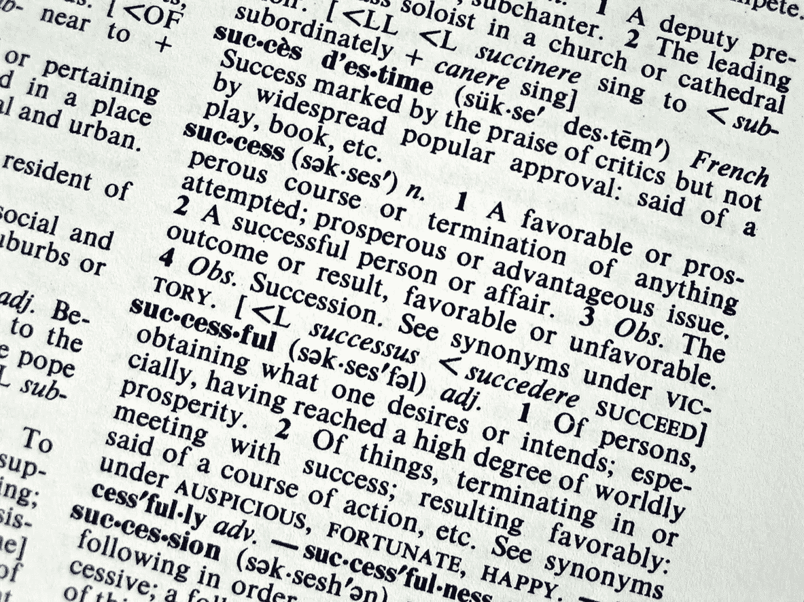
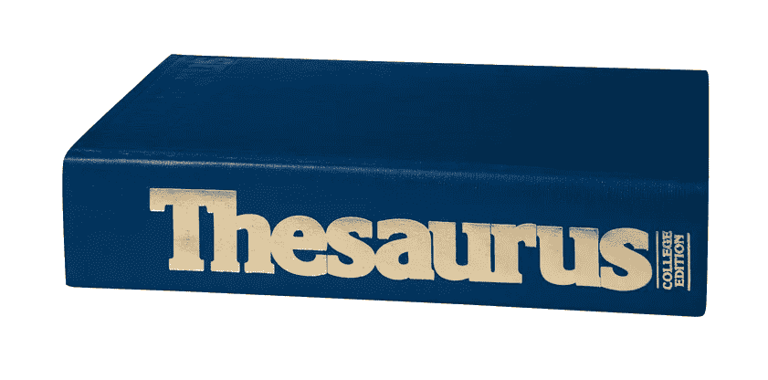
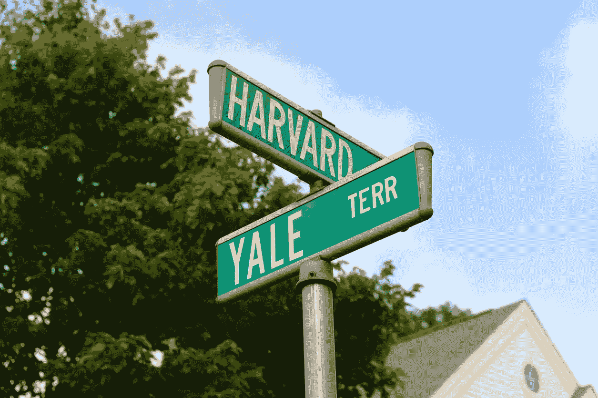

# 人工智能如何让你的大学申请论文为哈佛做好准备

> 原文：<https://pub.towardsai.net/how-ai-can-make-your-college-application-essay-harvard-ready-90f9dde79a90?source=collection_archive---------1----------------------->

## [教育](https://towardsai.net/p/category/education)

## 艾说什么使哈佛和耶鲁成功的招生论文工作。

[fstop123](https://www.gettyimages.com/search/photographer?assettype=image&family=creative&license=rf&photographer=fstop123&sort=best#license) / [获取图像](https://www.gettyimages.com/detail/photo/latin-descent-female-college-student-graduation-on-royalty-free-image/907837926?adppopup=true)

随着大学申请截止日期的临近，全国多达 200 万名大学申请人将在这个假期对大学录取过程中最重要也最令人担忧的部分进行最后的润色:大学申请论文。

因为 COVID，这篇论文今年比以往任何时候都更重要。许多申请人无法参加像 SAT 这样的标准化考试，在这个招生周期中，分数和论文更加重要。

鉴于我对[人工智能讲故事](https://medium.com/swlh/when-ai-meets-the-fairytale-ending-the-future-of-storytelling-is-disney-deep-story-325608a69cd8)的长期兴趣，我从一个简单的问题开始:**人工智能能改善大学申请作文吗？**

答案是响亮的是，不是在几年或几十年后，而是现在。你应该在接下来的几周内提交你的申请论文之前遵循这个建议！

**而我有******的数据为证。****

**我分析了网上找到的 100 多篇[成功申请短文](https://www.essaymaster.com/sample-essays)。[数据集](https://docs.google.com/spreadsheets/d/13Wu9IFj9F9Uv7E5oE_eBaRhIZRV8EBo_kALH1DTHv64/edit?usp=sharing)包括 55 篇成功的哈佛申请论文，50 篇成功的耶鲁录取论文，以及超过 30 篇“之前”和 30 篇“之后”公开发表的论文，这些论文由实际申请人在任何编辑或辅导之前提交，相同的论文在辅导后提交。**

**我通过 Grammarly 的人工智能运行每篇文章，以汇编有用的统计数据并寻找共性。我的问题包括:**

*   **哈佛和耶鲁成功的入学论文有什么不同之处，而不被他们声望较低的兄弟分享吗？**
*   **哈佛的作文比耶鲁的作文得分高吗？**
*   **有什么可操作的见解让申请人提高论文水平？**
*   **有偿作文教练是否根据“前”和“后”来提高作文的分数？**

**虽然我与[在语法上](https://www.grammarly.com/)没有任何联系或关系，但我选择了这个平台，因为它是市场上领先的消费者写作人工智能之一，而且它在*基本上是*免费的。据 TechCrunch 报道，这家公司的[估值](https://techcrunch.com/2019/10/10/grammarly-raises-90m-at-over-1b-valuation-for-its-ai-based-grammar-and-writing-tools/)超过 10 亿美元，而且它已经[在其技术上投资](https://www.crunchbase.com/organization/grammarly)至少 2 亿美元，所以我认为值得一试。此外，我选择 EssayMaster 作为论文的来源，因为他们有许多成功的论文被顶级学校接受，还因为我向那里的创始编辑提供建议，他曾长期担任一所大学的招生负责人。**

# **我糟糕的哈佛入学论文**

****

**[bloggityblog](https://www.istockphoto.com/portfolio/bloggityblog?mediatype=photography)/[iStock](https://www.istockphoto.com/photo/nothing-succeeds-like-it-gm139377324-130919)**

**但是，也许，我掉进这个兔子洞的真正原因是，我只想知道我的申请论文，我为进入哈佛而写的申请论文，是否像我 25 年前想象的那样完美。**

**25 年前，我向哈佛提交了我的论文，除了我之外没有人编辑过它，没有机器或人类。我甚至没有给我的父母看，这很有效，我被录取了。**

**但是根据我的分析，今天我会 ***而不是*** 被录取。我的作文在语法上给 ***打了很烂的*** 分，总分 **83** 。当与现代成功的例子相比时，它甚至不在同一个联盟中。如果一个与我的成绩和考试分数相似的申请人今天向哈佛提交了同样陈腐、糟糕的垃圾，那个可怜的灵魂几乎肯定会被拒绝，而且根据数据，甚至可能耶鲁也不会录取她。**

**我还记得我的论文的名字，我甚至设法找到了它:“徒步走向理解。”恐怕这篇文章并没有比它那令人畏缩的标题更好，今天，我被充满副词的文字吓坏了。在读了斯蒂芬·金的《论写作》之后，我学会了讨厌副词，尽管我显然还不够讨厌它们😊。**

****

**我妹妹的申请论文比我的分数高**

**但是，那个糟糕的分数，那个 83 分，还可以，只要我妹妹凯瑟琳比我小 11 岁，上的是乔治敦大学，分数比我差一点。所以我问她要论文。当我看到她骄傲的标题《我的四个角》时，我觉得我有机会了。**

**她得了一个不太好的 90 分。事实证明，与现代的哈佛和耶鲁毕业生相比，我们都很差劲，但我更差劲。所以现在我有了在家庭聚会上要处理的*。***

**不用说，我永远不会提交 83，因为今天我不会愚蠢到不利用人工智能辅助编辑。事实上，我甚至可以说，提交申请论文而不提及任何人工智能是一种时代错误，就像汽油动力汽车一样。**

**事实是人工智能可以改善你的入学论文，我会告诉你如何改善，但首先，你知道人工智能在做什么是很重要的:**这超出了你的理解。****

> **事实证明，这不是一种侮辱。**

****

**[ipopba](https://www.istockphoto.com/portfolio/ipopba?mediatype=photography) / [iStock](https://www.istockphoto.com/photo/ai-machine-learning-hands-of-robot-and-human-touching-on-big-data-network-connection-gm1206796363-348181260)**

**出于招生论文和本文的目的，关于深度学习算法，你必须知道的是:计算机组成一个句子而不是另一个句子，或者说一件事是错的而不是另一件事的原因，对于试图解构算法的人来说是完全不可理解的， ***甚至原则上*** 。这就是机器学习的本质。**

**不亚于 *Wired Magazine* 的权威人士[观察到](https://www.wired.com/story/our-machines-now-have-knowledge-well-never-understand/)该技术的本质是它“基于如此多的不同条件产生的结果被如此多的神经网络层转化，以至于人类根本无法理解计算机为自己建立的模型。”**

**好了，那么现在你知道自己看不懂了，那 AI 该如何提高一篇招生作文呢？**

# **用人工智能提高大学申请论文的五个简单步骤**

**这是货物。基于[数据](https://docs.google.com/spreadsheets/d/13Wu9IFj9F9Uv7E5oE_eBaRhIZRV8EBo_kALH1DTHv64/edit?usp=sharing)，你应该做以下 5 件事来优化你的文章:**

****

**[齐亚·索莱伊](https://www.gettyimages.com/search/photographer?assettype=image&family=creative&license=rf&photographer=Zia%20Soleil&sort=best#license) / [GettyImages](https://www.gettyimages.com/detail/photo/female-graduate-with-teacher-royalty-free-image/a0071-000270a?adppopup=true)**

## ****1。在语法上的“总分”至少得 95 分****

**数据集中哈佛和耶鲁的成功论文平均分 97.4，中位数 98。与此同时，EssayMaster 数据集中一篇文章的平均“之前”是 88.1 分。这是一个显著的差异，但哈佛和耶鲁的申请人通常比普通申请人写得更好，这并不令人惊讶；然而，数据也显示这一差距是可以弥合的。有趣的是，一篇论文的平均“事后”分数是 97.6 分——这个分数与哈佛或耶鲁大学对学生的期望分数一致。明智的申请人应该通过语法检查他们的论文，这是免费的基本服务，看看你如何得分，并努力提高分数。**

## ****2。所有的大学入学申请论文都应该得到“非常吸引人”的分数****

**这是一个重要的基线。根据 Grammarly 的分数，数据集[中被哈佛或耶鲁录取的每一篇成功的大学入学论文都“非常吸引人”。你有大把的时间来写论文。如果你的文章没有得到“非常吸引人”的分数，你应该考虑一下为什么，看看你是否可以改进它。不用说，我的论文没有达到那个水平。按照 Grammarly 的标准，我 1995 年写的论文有点平淡无奇，显然，哈佛和耶鲁录取的数据集中每篇论文的死亡之吻得分“非常吸引人”不幸的是，我姐姐在乔治敦大学成功的论文也获得了这个奖项，得分为“非常有魅力”恭喜凯瑟琳。](https://docs.google.com/spreadsheets/d/13Wu9IFj9F9Uv7E5oE_eBaRhIZRV8EBo_kALH1DTHv64/edit?usp=sharing)**

## ****3。获得“恰到好处”的交付****

**大约 87%被哈佛和耶鲁录取的论文得分“刚刚好”，其余的“稍差”虽然没有引人入胜重要，但正确的表达和准确的语调对于一篇成功的文章来说是非常重要的。尽管如此，仍有 13%的论文“稍有偏差”进入了哈佛和耶鲁。不足为奇的是，更高比例的“之前”文章“稍有偏差”，接近三分之一。为了提高你的表达能力，有一些免费的资源，比如这个[入学论文帮助课程](https://www.essaymaster.com/college-admissions-essay-help-course)，来学习如何自己提高论文的表达能力。**

## ****4。使用 50–55%的独特单词和大约 33%的罕见单词，但不要使用同义词库！****

**独一无二的单词的百分比是一个衡量文章中单词总数的指标。生僻字的百分比是在英语中不常用的词。哈佛和耶鲁的论文平均有 54%的独特词汇，而其他论文只有 48%。在哈佛和耶鲁的论文中，独特词汇的最小数量是 40%,而在其他论文中是 34%。罕见的话讲述了一个类似的故事。哈佛或耶鲁大学招生论文中使用罕见词的比例为 33%，而“之前”论文中的比例为 31%。**

****

**[品牌 X 图片](https://www.gettyimages.com/search/photographer?family=creative&photographer=Brand+X+Pictures) / [获取图片](https://www.gettyimages.com/detail/photo/thesaurus-royalty-free-image/78367108?adppopup=true)**

> **但是不要使用同义词库。**

**斯蒂芬·金的建议在今天比以往任何时候都更加正确:**

> **“你必须在词典中查找的任何单词都是错误的单词。这条规则没有例外。”—斯蒂芬·金**

**如果这个词对你来说不自然，你可能犯了一个可怕的语言错误，并使它成为招生官员最容易说“不”的话。**

## ****5。至少要“清楚”66%的哈佛和耶鲁论文得分为“非常清楚”****

**在哈佛和耶鲁的论文中，66%在 Grammarly 的清晰度指标上得分“非常清楚”，而 11%是“基本清楚”，23%是“清楚”也就是说，这似乎是 Grammarly 报道的最没用的度量，因为更大比例的“之前”文章非常清楚。要点是:只要你是“清晰的”或更好的，那么你就是一个好公司。**

# **那么，哈佛的论文比耶鲁的论文好吗…等急问。**

****

**[vapal](https://www.istockphoto.com/portfolio/vapal?mediatype=photography) / [iStock](https://www.istockphoto.com/photo/harvard-and-yale-gm146755836-13076273)**

**我们带着几个紧迫的问题开始了这次旅程。以下是答案:**

*   **哈佛和耶鲁的成功论文在语法方面比其他申请者的论文得分高 10 分左右。他们使用更多独特和罕见的词语，他们有“恰到好处”的表达方式。**
*   **在哈佛作文分数是否优于耶鲁作文的问题上，**哈佛以 98 比 98** 击败耶鲁。也就是说，哈佛的论文并不比耶鲁的论文得分高。两者的中位数均为 98。耶鲁的独特词汇略多，哈佛的罕见词汇略多。**
*   **申请人可以做一些非常明显的事情来提高他们的论文。最重要的是，在语法上至少要有 95 分的总分，目标是“非常吸引人”的分数和“恰到好处”的表达分数。不要在意清晰度分数，只要它是“清晰的”或者更好。**
*   **关于有偿论文教练是否提高了论文质量的问题，不言而喻，他们确实提高了，至少从语法人工智能的角度来看是这样的。对于[数据集](https://docs.google.com/spreadsheets/d/13Wu9IFj9F9Uv7E5oE_eBaRhIZRV8EBo_kALH1DTHv64/edit?usp=sharing)中的文章，前一组得到 88 分，后一组得到 98 分。**

**就人工智能在写作实践中的作用而言，在自动化讲故事最终占据优势之前，我们似乎处于一个黄金地带，在这里，最好的作家不仅会熟练掌握自己的技能，还会精通人工智能。**

**我预计，在接下来的十年或二十年里，讲故事的艺术水平将由人工智能辅助的人工编辑组成。在不超过五到十年的时间里，计算机将可靠地为未来的段落建议合理的下一句话和主题，并且，它将在[深度故事 AI](https://medium.com/swlh/when-ai-meets-the-fairytale-ending-the-future-of-storytelling-is-disney-deep-story-325608a69cd8) 的独特性中结束，在那里，人类创作的作品显然不如机器创作的创造力。**

**在未来，复杂的机器正在产生一流的招生论文，那么唯一有能力在这种细微差别上得分的将是其他机器。在这一点上，机器写作的观众将是机器评分。**

**如果人们的看法是，今天的招生委员会在一个明星的房间里运作，那就等着人工智能让他们的候选人决定变得不可理解， ***甚至原则上*** 。也许那一天已经到来了。**

**附:语法上给这篇文章打了 84 分**，敬业度评分**有点平淡**。很抱歉。我想 25 年来没什么变化。🤦****

****感谢阅读。如果你在 Linkedin 上很活跃，请随意打招呼。****