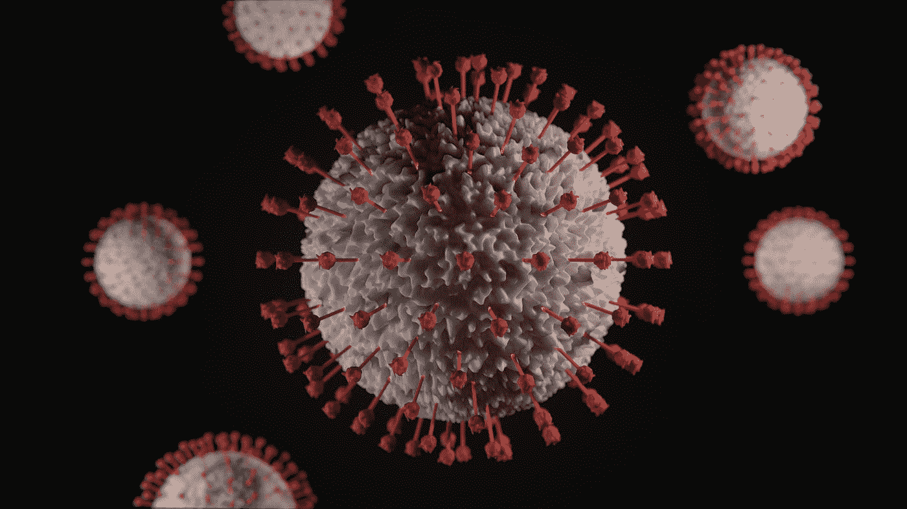
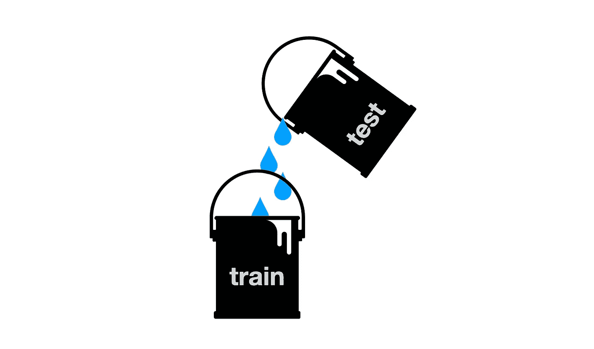
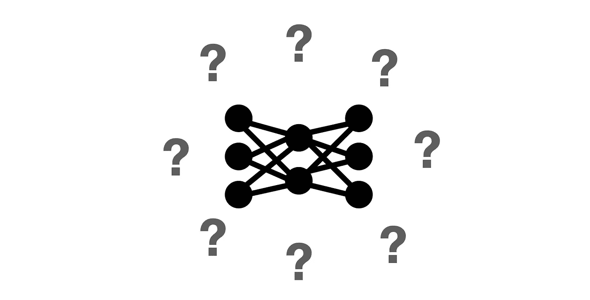
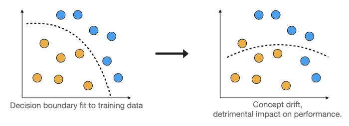
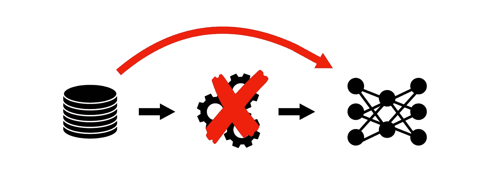

# AI 如何在 COVID 面前失败

> 原文：<https://pub.towardsai.net/how-ai-failed-in-the-face-of-covid-9e1c1177ab8a?source=collection_archive---------1----------------------->

## [人工智能](https://towardsai.net/p/category/artificial-intelligence)

## 数据科学家的五个实践经验和警告

由[维克多·福加斯](https://unsplash.com/@sonance?utm_source=medium&utm_medium=referral)在 [Unsplash](https://unsplash.com?utm_source=medium&utm_medium=referral) 上拍摄的照片

新冠肺炎疫情的突然袭击让医生和医院措手不及。人们对这种新病毒知之甚少，而太多的病人在门口排队等候，无法足够迅速地对他们进行正确诊断和分类。AI 来救援了！

用于诊断 COVID 或预测疾病严重程度的机器学习模型开始如雨后春笋般涌现。其中一些被医院采用并用于“生产”，影响了哪些病人得到治疗，以及如何治疗。英国医学杂志最近的一项研究观察了 200 多个这样的模型，发现没有一个适合临床使用，有些对病人有潜在的危害。

该系统的许多部分都应受到指责，从机器学习和医学研究人员之间缺乏合作，到研究世界的工作方式，促进个人发明而不是集体努力，到缺乏共同的数据标准。所有这些都在麻省理工科技评论的这篇优秀文章中进行了讨论，同时还有一些补救建议。

在这篇文章中，让我专注于我认为足以讨论的唯一部分:机器学习算法以及它们是如何被训练和测试的。事实证明，已经犯下的错误是惊人的明显。其中大多数是一般性的机器学习错误，在医学以外的领域也经常出现。

那么，哪里出了问题，在病人身上使用这种有缺陷的模型会有什么后果呢？让我们来看看五个最令人印象深刻的失败案例。

# 数据泄露

测试数据泄露到训练集中。图片由作者提供。

每个 ML101 课程都提到应该如何[将数据分成训练、验证和测试集](https://towardsdatascience.com/model-selection-assessment-bb2d74229172)。简而言之，训练数据是模型为了优化其成本函数而暴露的数据，验证数据用于比较不同的模型或模型从未见过的数据上的超参数选择，而测试数据用于提供模型在生产中对新的、未见过的数据的表现的估计。

在某些情况下，可能不需要测试集，例如，当我们只想部署最好的模型时，不管它的预期性能如何。医学肯定不是这种情况。如果模型输出要影响人们的生活，我们需要确切地知道它的表现如何。人们希望有一个好的测试集。

不幸的是，与 COVID 相关的数据很少。研究人员正在综合各种来源的数据，以便收集足够多的样本。事实证明，这些“弗兰肯斯坦数据集”包含重复的数据，因此相同的数据样本可能同时出现在训练集和测试集中。这种情况称为数据泄漏:测试样本泄漏到训练数据中。因此，模型是根据直接训练的数据进行评估的，这使得它们看起来比实际情况更好。

> 要点 1:遍历测试集，对于每个例子，都要检查它在训练数据中是否有相同的孪生兄弟。

# 任务模糊性

模特不知道学什么。图片由作者提供。

机器学习模型从例子中学习。他们接触到大量的数据样本和相关的标签来学习。例如，一个人可以将许多猫和狗的图像输入到模型中，每个图像被标记为“猫”或“狗”，并且模型被期望学习这两种动物之间的区别。

如果展示给这样一个模型的所有猫都是黑色的，所有狗都是白色的，你认为会发生什么？该算法很可能会单独提取颜色，认为这是猫和狗之间简单而可靠的区别。如果让这个模型识别一只白猫，它会失败得很惨，因为它会学习一项与预期完全不同的任务:识别动物的颜色而不是种类。

很明显吗？对其中一个诊断模型的作者来说不是。在他们使用的数据集中，健康的胸部扫描样本仅来自儿童，他们的肺不同于成人的肺。这也意味着所有患病患者都来自成年人。该模型很快学会将成人肺部与生病联系起来，因此它将*大多数*儿童归类为健康，将*所有*成人归类为生病。换句话说，该模型学会了区分儿童和成人，而不是健康和患病的肺。

如果在不同类别的例子上评估模型性能，例如儿童对成人，这个错误很容易被发现。对于成年人，我们会观察到一个完美的回忆，这意味着所有生病的成年人都被正确地诊断出来，但精度接近于零，这意味着被模型归类为生病的大多数扫描实际上是健康的。

> 要点 2:确保模型学习了你想要它学习的任务，例如通过评估它在不同类别的例子上的表现。

# 概念漂移

概念漂移，作者带给你的。

碰巧的是，机器学习模型很好地学习了它的任务，并成功地部署到生产中。在一段时间内，它按预期工作，但随后它的性能开始下降。一个常见的原因是模型学习的特征和目标之间的关系在现实世界中已经改变。这被称为[概念漂移](https://towardsdatascience.com/dont-let-your-model-s-quality-drift-away-53d2f7899c09)，可能由于多种原因而发生。毕竟，世界一直在变化。风格和时尚来来去去，企业扩张到(或收缩到)新的地理位置，竞争对手进入或离开市场，宏观经济条件也各不相同。然而，有时概念漂移是通过设计安装在模型中的。

当训练数据中的特征-目标映射不同于实际生产数据中的特征-目标映射时，就会发生这种情况。考虑一组胸部扫描，其中一些是在病人躺下时拍摄的，一些是在他们站起来时拍摄的。研究人员忽略的是，在这家特定医院的数据集中，那些躺着的人这样做是因为他们太虚弱了，无法站起来。这意味着躺着的病人比站着的病人更容易生病。这种联系很强，足以让模型从一个人的位置来预测疾病。这种模式在任何医院都行不通，比如说，所有的胸部扫描都是在病人躺下的情况下进行的。

> 要点 3:确保模型从训练数据中学习的输入-输出映射在生产数据中仍然有效。

# 被忽视的数据预处理

数据预处理被忽略了。图片由作者提供。

训练一个模型只是大多数机器学习系统的冰山一角。同样重要的部分是数据预处理。向模型呈现训练示例的方式可能比模型细节对系统性能有更大的影响。

这一事实正以所谓的以数据为中心的机器学习方法的形式慢慢获得认可，这种方法是由著名的 ML 专家吴恩达等人推动的。与目前流行的以模型为中心的方法相反，在以模型为中心的方法中，目标是为可用数据创建最佳模型，以数据为中心的方法认为应该挑选一些模型并冻结它，同时将精力集中在数据上，试图以模型可以更容易地从中学习的方式对其进行预处理。

一些完全忽略数据预处理的 COVID 研究人员肯定没有遵循以数据为中心的方法。他们只是把肺部扫描照原样放入模型中，没有注意到它们包含了医院特有的标签，在每张图片的角上有几行文字。不足为奇的是，这些模型学会了根据文本来识别特定的医院，而不是病毒。结果，即使是来自有许多 COVID 病例的医院的健康患者也被归类为病人。另一方面，来自病例很少的医院的患病患者往往被归类为健康者。如果按照这种模式，这样的病人被送回家，许多人可能已经失去了生命。

> 要点 4:看看你的训练数据，去掉任何可能误导模型的特征。

# 偏置转移

如果模型输入有偏差，这种偏差就会转移到它的输出。图片由作者提供。

想象一下你得到了一组胸部扫描。你雇佣一个医学专家来标记扫描结果是生病还是健康。然后，你根据这些数据训练一个机器学习模型，小心地避免我们刚才讨论的所有失误。你的模型学什么？如果你很想回答“扫描是来自一个生病的还是健康的病人”，那就要三思了！

该模型对 COVID 一无所知。它在标签上看到的只是医学专家的判断。模型学习模仿他们的诊断，这可能是错误的。人类有偏见，会犯错。这是在 COVID 研究中发生的事情——尽管就统计学而言模型是正确的，但它学会了模仿有偏见的诊断医生。

解决这个问题的简单方法是使用真实数据作为标签。在 COVID 的情况下，标签最好来自聚合酶链式反应测试，这比医生进行胸部扫描更有可能正确检测到病毒的存在。

> 要点 5:确保你的标签是真实的，而不是有偏见的判断。

感谢阅读！

如果你喜欢这篇文章，为什么不在我的新文章上 [**订阅电子邮件更新**](https://michaloleszak.medium.com/subscribe) ？通过 [**成为媒介会员**](https://michaloleszak.medium.com/membership) ，你可以支持我的写作，并无限制地访问其他作者和我自己的所有故事。

需要咨询？你可以问我任何问题，也可以在这里 为我预定 1:1 [**。**](http://hiretheauthor.com/michal)

你也可以试试 [**我的其他文章**](https://michaloleszak.github.io/blog/) 中的一篇。不能选择？从这些中选择一个:

 [## 不要让你的模型质量渐行渐远

### 解决生产 ML 系统中的数据漂移和概念漂移

towardsdatascience.com](https://towardsdatascience.com/dont-let-your-model-s-quality-drift-away-53d2f7899c09)  [## 生产中威胁机器学习系统的 8 种危险

### 维护 ML 系统时需要注意什么

towardsdatascience.com](https://towardsdatascience.com/8-hazards-menacing-machine-learning-systems-in-production-5c470baa0163)  [## 6 有用的概率分布及其在数据科学问题中的应用

### 带有示例和 Python 代码的实用概述。

towardsdatascience.com](https://towardsdatascience.com/6-useful-probability-distributions-with-applications-to-data-science-problems-2c0bee7cef28)