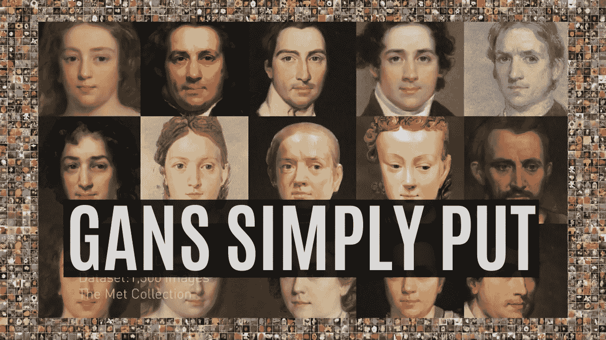
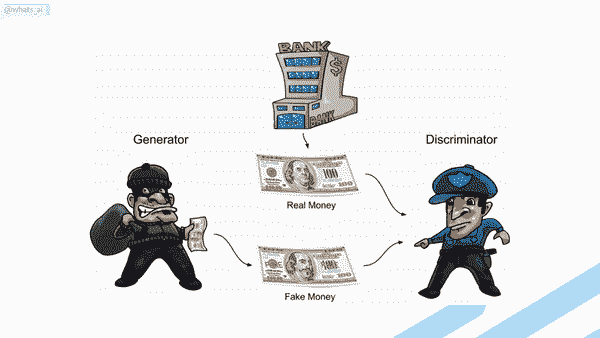
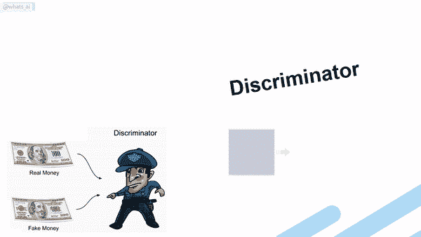

# ⏩人工智能如何生成新图像:简而言之

> 原文：<https://pub.towardsai.net/how-ai-generates-new-images-gans-put-simply-674e413bc22a?source=collection_archive---------0----------------------->

## [机器学习](https://towardsai.net/p/category/machine-learning)

## 理解人工智能如何在 2 分钟内使用生成性对抗网络创建新图像

> 原载于 [louisbouchard.ai](https://www.louisbouchard.ai/how-ai-generates-new-images/) ，前两天在[我的博客](https://www.louisbouchard.ai/how-ai-generates-new-images/)上看到的！

GAN 网络生成器的体系结构。

为了生成新的图像，我们使用了一种叫做生成对抗网络的架构。它与由编码器、解码器和鉴别器组成的发生器一起工作。对于生成器来说，编码器和解码器都是 [**卷积神经网络**](https://www.louisbouchard.ai/how-ai-understand-images/) ，但解码器的工作原理相反。它是这样工作的:编码器接收一个图像，将其编码成一个压缩的表示。解码器采用这种表示来创建改变图像样式的新图像。

GAN 网络的发生器如何工作。

对于我们在训练数据集中的所有图像，这被重复多次，以便编码器和解码器学习如何在训练期间最大化我们想要实现的任务的结果。

一个经典的 GAN 架构将具有一个经过训练的生成器来生成图像，以及一个鉴别器，用于通过猜测它是来自数据集的真实图像还是由生成器生成的伪图像来测量所生成图像的质量。这两个网络通常都由卷积神经网络组成，我在之前的文章的[中提到过。正如我们已经讨论过的，生成器看起来像这样(见下文)，主要包括使用卷积对图像进行下采样以对其进行编码。然后，它使用卷积再次对图像进行上采样，以基于编码生成具有相同风格的图像的新版本。它的目标是生成逼真的图像。](https://www.louisbouchard.ai/how-ai-understand-images/)

发电机制造假图像。

然后鉴别器取生成的图像，或者你的数据集中的一个图像，试图判断它是真的还是生成的，称为假的。这在我们训练数据集中的所有图像中重复了无数次。它也使用卷积神经网络，但只有编码部分，因为它试图拍摄图像并理解它。

鉴别器试图辨别它接收到的图像是真的还是假的。

gan 是一种训练生成模型(生成器)的聪明方法，通过将问题框架化为具有两个子模型的问题:我们训练生成新示例的生成器模型和尝试将示例分类为真实(来自领域)或虚假(生成)的鉴别器模型。这两个模型在一个零和游戏中一起训练，对抗，直到鉴别器模型被愚弄了大约一半的时间，这意味着生成器模型产生了似是而非的例子。在这种情况下，零和意味着当鉴别器成功识别真实和伪造样本时，不需要改变模型参数，但是发生器由于对模型参数的大量更新而受到惩罚(在伪造图像被识别为伪造的情况下，因为发生器未能完成其任务)。或者，当生成器欺骗鉴别器时，不需要改变模型参数，但是鉴别器受到惩罚，并且其模型参数被更新。重要的是，在每一步中，两个网络中只有一个受到惩罚。通过这种方式，两个模型一起得到改进，并且随着时间的推移，生成器生成更真实的图像。

如上图所示，我们可以把发生器想象成一个伪造者，试图制造假币，把鉴别器想象成警察，试图允许合法货币进入并抓住假币。为了在这场游戏中取得成功，伪造者必须学会把钱和真钱区分开来。因此，生成器网络必须学会从与训练数据相同的分布中创建样本，这样它们看起来很像，并用假钱来愚弄警察。

一旦训练完成，你可以发送一个图像到编码器，它会做同样的过程，根据你的需要生成一个新的看不见的图像。它的工作方式非常相似，无论是什么任务，无论是将一张脸的图像转换成另一种风格，如 [**卡通化器**](https://www.louisbouchard.ai/toonify/) ，还是快速绘制出一幅美丽的风景。

感谢您的阅读，

—路易

## 观看短视频！

如果你喜欢我的工作，并想了解人工智能的最新动态，你绝对应该关注我的其他社交媒体账户( [LinkedIn](https://www.linkedin.com/in/whats-ai/) ， [Twitter](https://twitter.com/Whats_AI) )，并订阅我的每周人工智能 [**简讯**](http://eepurl.com/huGLT5) ！

# 支持我:

*   支持我的最好方式是成为这个网站的成员，或者如果你喜欢视频格式，在 [**YouTube**](https://www.youtube.com/channel/UCUzGQrN-lyyc0BWTYoJM_Sg) 上订阅我的频道。
*   在经济上支持我在 [**地区**](https://www.patreon.com/whatsai) 的工作
*   在 [**中**](https://whats-ai.medium.com/) 跟我来