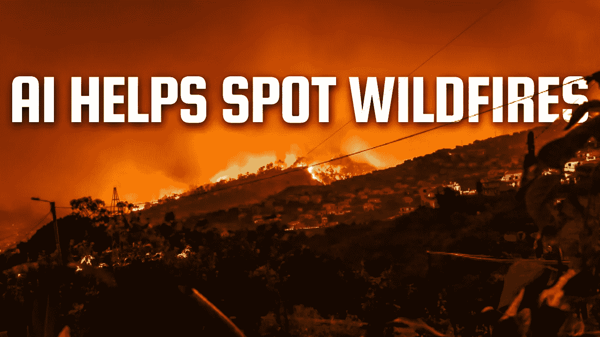
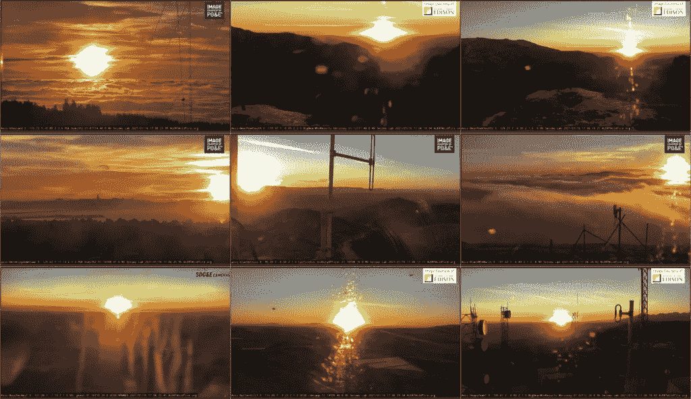
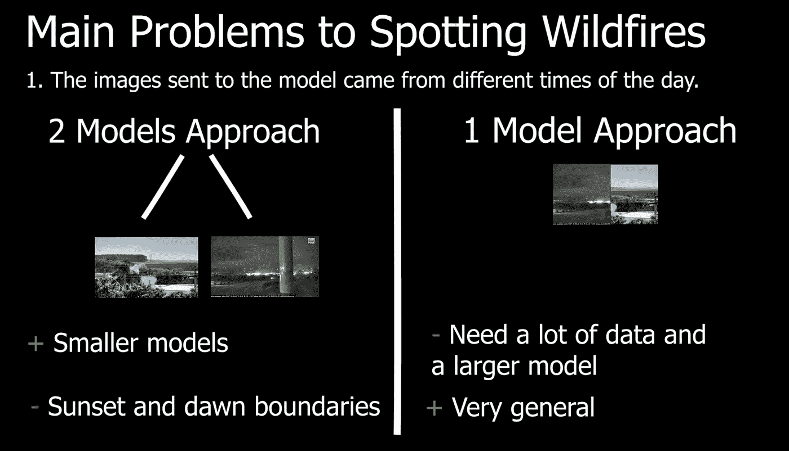
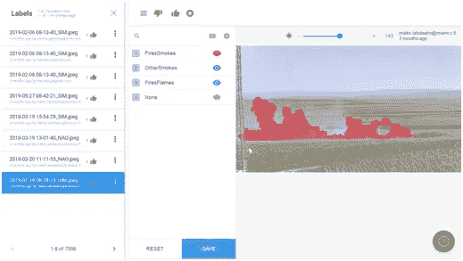
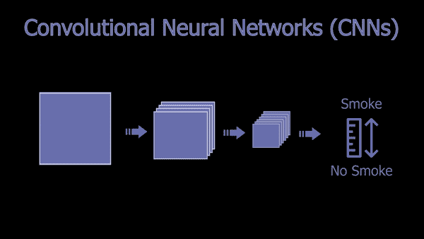
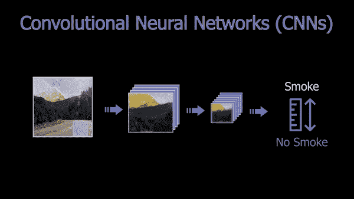
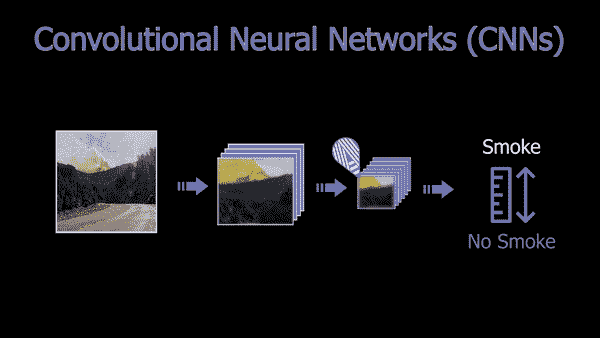
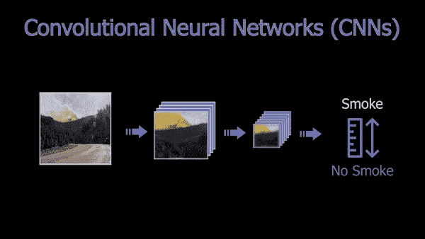
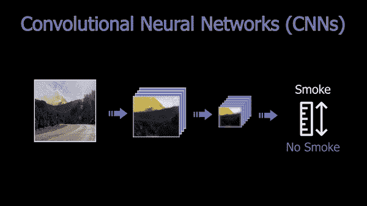

# 人工智能如何帮助发现野火

> 原文：<https://pub.towardsai.net/how-ai-helps-spotting-wildfires-7db5c52ce9f4?source=collection_archive---------1----------------------->

## [计算机视觉](https://towardsai.net/p/category/computer-vision)

## 人工智能比人类更快发现野火。简单解释了一下

> *原载于*[*louisbouchard . ai*](https://www.louisbouchard.ai/how-ai-helps-spotting-wildfires/)*，前两天看了我的博客***！**

**

*照片由[迈克尔在](https://unsplash.com/@michaelheld?utm_source=medium&utm_medium=referral) [Unsplash](https://unsplash.com?utm_source=medium&utm_medium=referral) 上握住*

**听这篇文章……**

*野火在现代社会中越来越多，主要是由热浪、闪电、干旱、气候变化，甚至是汽车火灾和烟头等人类行为引起的。最近我们到处都能看到它，巴西、澳大利亚、美国、加拿大等等。，破坏植物、人类和动物的生命、财产损失，并通过产生大量的 CO2 导致全球变暖。这些国家都有视频墙，就像下面这个县的火灾紧急情况，看看是否发生了什么。*

**

*[syntec sys](https://umgrauemeio.com/)【1】监控摄像头墙。*

*最常见的问题是，它们被发现得太晚，而且已经广泛传播。这是因为你不能让某人整天盯着那面墙，等着发现烟或火。现在你明白这是怎么回事了；这就是人工智能发挥作用的地方。使用一个足够好的人工智能，你可以有更好的东西:它将整天同时盯着所有这些摄像机。它会在一瞬间检测到一些奇怪的东西，然后自动 ping 官方。最棒的是，它可以保存带有可疑烟雾的视频帧，并与此 ping 一起发送，同时推荐战斗动作，使过程更加高效。最糟糕的情况是当局决定忽略一个错误的警报。就是这样一个很酷很实用的 AI 应用，而且已经在现实世界部署了！*

**

*事实上，这种基于人工智能的系统已经在巴西运行了三年，它将火灾探测时间从平均 40 分钟减少到不到 5 分钟。这个系统由一家名为 Sintecsys [1]的巴西公司建造，开始使用安装在分布在巴西的 50 座塔顶部的摄像机。在 Omdena 的人工智能社区的帮助下，许多团队聚集在一起完成这项任务，他们设法为这个用例建立了最佳的人工智能模型。*

# *要攻击的问题*

*他们不得不面对的主要问题是 1。发送给模型的图像来自一天中的不同时间。这意味着不仅白天和夜晚的亮度会有所不同，这对模型来说是一个重要因素，因为它会影响和改变整个图像，使其很难理解发生了什么，而且白天的火灾很容易通过烟雾探测到。相比之下，由于显而易见的原因，通过实弹射击更容易发现夜火。为了解决这个问题，团队可以建立两个独立的模型，一个用于晚上，一个用于白天，或者建立一个更大的模型，并假设烟雾在晚上也是可检测的。*

**

*用深度学习解决这个问题的两种可能方法。*

*后者可以使用足够的训练数据和参数来从这些数据中学习。当然，第一种方法是有问题的，因为仍然存在日落和黎明的问题，在这种情况下可以检测到活的火和烟。他们没有提到他们是如何决定构建最终模型的，但两者都由来自 Omdena 人工智能社区的不同团队进行了测试。*

*在你看来，对于这种情况，你认为最好的解决方案是什么？我会假设一个足够大的模型是他们解决黎明和日落边界问题的最佳选择，而不需要为每个子案例训练一个模型。他们必须面对第二个问题:区分真实的烟雾和类似烟雾的异常现象，如图像中出现的相机眩光、雾、云和锅炉释放的烟雾。*

*最后一个问题是他们从摄像机接收到的图像清晰度低。该模型最初接收从相机发送的高度压缩的图像，因此他们必须在将其发送到他们的模型之前将其放大。*

**

*[标签箱](https://labelbox.com/)用于贴标签、管理和审查标签的界面。*

*正如你现在所知道的，人工智能非常依赖数据，所以他们必须在质量和数量方面拥有最好的训练数据才能成功解决这些问题。**这样一个模型只能和它在训练期间得到的数据一样好**，所以它必须非常宽泛，包含现实世界中可能出现的所有可能的伪像，比如我们刚刚讨论过的云、雾和相机眩光。首先，他们让 20 个人尽可能精确地手工标记 9000 张图片。这意味着他们手动浏览所有画在烟雾上的图像，以帮助模型理解烟雾的样子。这无疑是最昂贵和最乏味的任务，但对于建立现实世界应用中使用的大多数基于深度学习的模型来说，这是至关重要的。*

# *能够探测野火的人工智能模型是如何工作的*

*这样做之后，他们可以开始研究如何攻击烟雾检测，这意味着找到检测图片中是否有烟雾的最佳方法。我们不知道具体选择的型号。尽管如此，他们分享说，他们最终使用了卷积神经网络(CNN)方法，在将图像发送到网络之前对其进行了一些修改。*

**

*一个基本的卷积神经网络架构(CNN)。*

*正如您可能知道的那样，CNN 是一种强大的深度学习架构，用于基于视觉的应用，简单地说，图像被迭代压缩，专注于我们需要的关于图像的信息，同时删除冗余和无信息的空间特征，最终得到一个置信度，通知我们图像是否包含我们正在寻找的内容。这个焦点可以是任何东西，从探测猫、人、物体，到探测烟雾。这完全取决于它被训练的数据，但整体架构和工作将保持不变。你可以看到 CNN 在压缩图像，在每一步都专注于图像的特定特征，随着我们在网络中的深入，越来越压缩，越来越与我们想要的相关。*

**

*卷积神经网络中的滤波器。*

*这是通过使用过滤器来完成的，过滤器将穿过整个图像，将焦点放在特定的特征上，例如具有特定方向的边缘。用多个滤波器进行一次卷积来重复这个过程，这些滤波器就是在训练期间学习到的。在第一次卷积后，我们为每个滤波器获得一个新的更小的图像，我们称之为特征图，每个图像专注于特定的边缘或特征。因此，它们看起来都像是图像的怪异和模糊的放大版本，突出了特定的特征。我们可以根据需要使用尽可能多的过滤器来优化我们的任务。*

*然后，这些新图像中的每一个都被发送到相同的过程中，一遍又一遍地重复，直到图像被压缩到我们有许多根据我们需要的信息优化的这些微小的特征地图，适应我们的数据集包含的许多不同的图像。最后，这些微小的特征地图被发送到我们称之为“完全连接的层”中，以使用权重提取相关信息。*

**

*在我们的 CNN 的结尾，是用于分类的完全连接的层。*

*这最后几层包含所有连接的权重，这些权重将根据输入的图像了解模型应该关注哪个特征，并将信息传递给我们的最终分类。这个过程将进一步压缩信息，最终以一定的置信度告诉我们是否有烟雾。因此，假设模型训练有素，最终结果将是一个模型，它的压缩集中在图像中的烟雾特征上，这就是为什么它如此适合于这项任务或任何涉及图像的任务。*

****

*(左)来自有烟图像的高滤波器响应和(右)来自无烟图像的低滤波器响应。*

*如果有烟雾，过滤器将产生高响应，我们最终将得到一个网络，它以很高的可信度告诉我们图像中有烟雾。如果没有烟雾，这些压缩结果将产生较低的响应，让我们知道在我们试图检测的图像中没有发生任何事情，在这种情况下是火灾。它还将产生置信度在无烟和明显冒烟之间的结果。随着他们的分享，最终的模型以令人印象深刻的 95%到 97%的准确率检测出图像中的烟雾。*

# *如何应用到其他国家*

*当然，这个模型还不完美，正如我所说，它非常依赖于它的训练数据，就像大多数基于深度学习的方法一样。这意味着，当试图在不同类型的环境中使用相同的模型时，它可能不会很好，我们可能需要使用更多的数据来使模型适应新的环境。幸运的是，有许多方法可以用很少的可用数据来调整模型，我们称之为微调模型，这是用不同于训练中使用的新数据来完成的。因此，从他们拥有的这个强大的基线开始，你不需要为你想要运行你的模型的任何新国家标记 9000 张图像。例如，如果我们想在加拿大使用这个模型，在巴西森林图像上训练的这个模型可能需要在来自加拿大森林的几百到几千个图像上再次训练。*

# *结论*

*这是一个令人惊叹的机器学习现实应用，有一个很好的用例，将使每个人受益，特别是在世界各地发生许多野火的这些天。在离开这篇文章之前，我想问你一个问题:有没有任何与环境相关的应用程序可以让你看到人工智能的帮助？请在评论中告诉我，我会寻找它来覆盖其中的任何一个！*

*感谢您的阅读，*

*—路易*

*如果你喜欢我的工作，并想与人工智能保持同步，你绝对应该关注我的其他社交媒体账户( [LinkedIn](https://www.linkedin.com/in/whats-ai/) 、 [Twitter](https://twitter.com/Whats_AI) )并订阅我的每周人工智能[简讯](http://eepurl.com/huGLT5) ！*

# *支持我:*

*   *支持我的最好方式是成为这个网站的成员，或者如果你喜欢视频格式，在[**YouTube**](https://www.youtube.com/channel/UCUzGQrN-lyyc0BWTYoJM_Sg)**上订阅我的频道。***
*   ***在经济上支持我在 T21 的工作***
*   ***跟我来这里上 [**中**](https://whats-ai.medium.com/)***

# ***参考资料:***

1.  ***合成技术系统公司，2021 年:[https://umgrauemeio.com/](https://umgrauemeio.com/)***
2.  ***Odemna 文章“*野火的人工智能:扩大拯救生命、基础设施和环境的解决方案*”，2020 年 12 月:[https://omdena.com/blog/artificial-intelligence-wildfires/](https://omdena.com/blog/artificial-intelligence-wildfires/)***
3.  ***Odemna 的文章“*借力 AI 扑灭野火*”，2021:[https://omdena.com/projects/ai-wildfires](https://omdena.com/projects/ai-wildfires)***