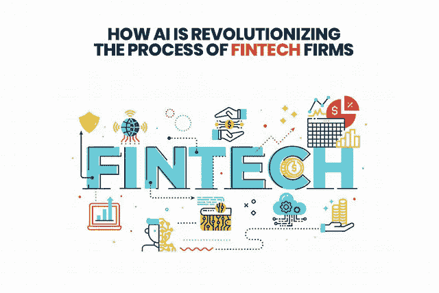
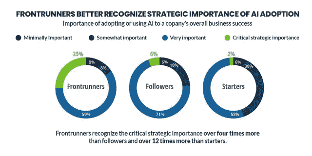
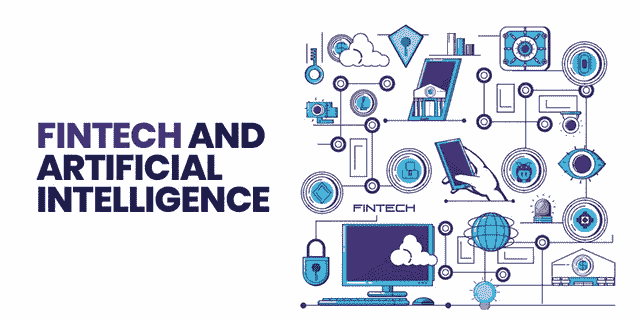
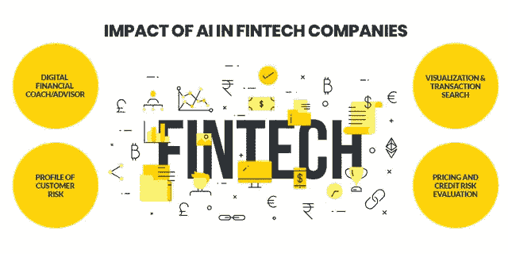

# 人工智能如何彻底改变金融科技公司的流程？

> 原文：<https://pub.towardsai.net/how-ai-is-revolutionizing-the-process-of-fintech-firms-87e057a48d83?source=collection_archive---------1----------------------->

## 人工智能正在通过提高效率来扩大金融科技公司的发展，并解决人类问题。

人工智能如何彻底改变金融科技公司的流程？

人工智能彻底改变了金融业。它不仅提高了行业内的精确度水平，还提高了客户参与度，加快了查询解决周期。在这篇博客中，我们将找到人工智能在金融部门或金融科技公司中的重要性的答案。那么，我们开始吧。

> 到 2030 年，传统金融机构可以削减 22%的成本，根据金融行业自动人工智能最新的 84 页报告。

金融科技公司和金融公司是关系数据库和大型计算机的早期采用者，并热切期待下一代计算和分析能力。人工智能通过提高效率，帮助金融科技公司解决人类问题。人工智能通过应用各种方法来改善结果，这些方法来自超越人类规模的人类智能的各个方面。

过去 20 年的计算军备竞赛彻底改变了金融科技公司。各种最新技术，如人工智能(AI)、机器学习、神经网络、进化算法、大数据分析等，使计算机能够处理比以往任何时候都多的各种各样的深度数据集。

以客户为中心的方法、成本优化、增强的安全性和实时数据集成是当前金融业的关键需求，这些需求模拟了金融科技公司的业务动态。

> 金融科技(FinTech)这个词是舒适、创新和高度接触金融世界的同义词。大多数金融科技的人工智能旨在实现金融包容性，让观众从整体金融体系中受益。

随着人工智能在金融业的出现，人们习惯于寻求 MFI 金融服务和银行业务优势的复杂性和障碍今天已经不存在了。有许多 [**人工智能开发公司**](https://www.xicom.biz/latest-thinking/artificial-intelligence/) 专注于创建基于人工智能的金融解决方案。

除此之外，得益于新一代技术导向的金融机构和人工智能技术，使得目标受众能够使用轻松且高性价比的金融解决方案。

现在，无论你需要客户借入贷款还是投资盈利选项，各种金融科技公司都有满足他们所有要求的解决方案。除此之外，这里唯一要记住的是，没有一家公司能够在市场上提供高性价比的解决方案，除非他们有降低运营成本的优势。

> 此外，FinTechs 可以以相对较低的成本为客户提供优质服务，因为人工智能允许他们在每个阶段控制成本。此外，更好的人机兼容性使他们能够用少量劳动力提供高质量的解决方案。

## ***银行业***

现代技术在 NBFCs 和银行中的应用，使它们能够开发出以更低价格向客户提供更多产品的产品。过去，产品选择有限，随之而来的是严格的政策，这使得客户对银行系统不满和恼火。现在，金融机构对客户有了更好的了解，并根据他们的实际要求和需求提供或推荐选择。

人工智能使用多种算法简化了银行和金融业务。除此之外，FinTechs 评分算法可以帮助您获得每一项的完整信息。另一方面，反向预测分析突出了每个机会，帮助客户选择正确的产品或服务。此外，所有这些信息都可以在金融科技网站和移动应用程序上在线访问。

## **金融科技和人工智能**

金融科技和人工智能

在金融服务和金融科技公司运营中使用人工智能的好处是频繁而广泛的。除此之外，从营销您的产品和服务到客户研究，人工智能与大数据和预测分析相结合，在增加全球金融机构的影响力和范围方面非常有效。

现在，整个贷款过程只需要几个小时，如果一个人在早上申请贷款，贷款资金在同一天还清。除此之外，随着大赦国际进入多方面的金融部门，准确性和速度都提高了。

适应最新技术是日常的需要，但成功企业的关键是根据市场需求提供服务或产品。因此，金融科技公司正在根据不断变化的市场需求进行自我调整。除此之外，他们还通过消除文档和交付产品中的任何复杂性，努力创造一个对客户更友好的金融环境。

> 一些最近的统计数据显示，引入人工智能每年可以减少 23%的损失。

与仍然坚持长篇论文设计的传统银行公司不同，FinTechs 正在通过优化使用大数据、人工智能和预测智能来快速发展。而且， [**软件开发公司**](https://www.xicom.biz/) 已经在利用这些最新技术的特点来创建独特的、功能丰富的金融科技应用。除此之外，这些最新技术已经成为金融科技公司不可或缺的一部分，它们的作用不仅是开发定制的商业解决方案，还在保护客户个人信息和确保金融科技金融资产安全方面发挥着关键作用。

> ***我们来看一些 AI 在 Fintech 公司影响的例子:***

***AI 对 fintech 公司的影响***

## ***1。数字金融蔻驰/顾问***

商业机器人是人工智能最常见的用例之一，可能是由于广泛的应用——跨越所有行业，跨越不同层次。在金融领域，交易机器人也可以用于向用户提供金融咨询或各种其他咨询服务。

把它们想象成帮助用户管理储蓄、财务计划和支出的数字助理。这种特殊的服务提高了用户的参与度，也改善了用户对任何金融产品的整体体验。

除此之外，数字助理可以通过自然语言处理来创建，自然语言处理是一种机器学习模型，可以以人类语言格式处理数据或信息。除此之外，还可以添加产品推荐表单层，允许助理根据算法和人类之间的最新交易来推荐产品或服务。

> 这种移动应用程序的一个著名例子是由 Sun Life 创建的，他创建了一个名为 Ella 的虚拟助手，以帮助退休和退休的用户受益于保险计划。此外，该助手还会根据用户信息向用户发送提醒，如“您的孩子将很快受益”或“医疗保健福利即将到期”。

此外，数字助理还可以用于各种其他金融场景:管理股息、接近任何交易限额、延长到期日或验证通知。

## **2。可视化&交易搜索**

金融机构的管理人员允许机器人访问用户交易(银行)数据，并使用 NLP 来确定发送用户请求(搜索查询)的含义。除此之外，这些请求还可能与余额请求、一般帐户信息、消费习惯等相关。机器人处理各种请求并显示结果。

例如，美国银行使用这种类型的自动化软件(称为 erica)作为其客户群的数字金融助理。此外，人工智能机器人很快获得了认证——三个月内就有 100 万用户。

除此之外，bot 程序提供了一个易于使用的交易搜索，允许用户在他们的历史数据中搜索与特定商家的特定金融交易，同时避免了搜索每个银行账户对账单的麻烦。除此之外，该机器人还计算信用和债务总额——这是用户必须用计算器完成的任务。

## **3。客户风险概况**

银行和保险公司工作的一个重要部分是根据客户的风险水平来定义客户档案。人工智能是这类任务的一个很好的工具，因为它可以根据客户的风险数据从低到高自动进行客户排名。

除此之外，根据分类业务，顾问可能会决定将金融产品与每个风险概况相关联，并自动向客户展示这些产品(产品推荐)。在这个移动应用程序中，分类模型，如 XGBoost 或人工神经网络(ANN)，在顾问提供的历史客户数据和预标记数据中进行训练，以防止数据偏差。

## **4。定价和信用风险评估**

保险公司提供承保服务，尤其是投资和贷款。人工智能模型可以对客户的信用风险进行即时评估，使顾问能够设计最相关的报价。除此之外，使用人工智能来注册服务提高了报价的效率，并改善了客户体验，因为它加快了此类活动的流程和周转时间。

> 总部位于加拿大的金融服务集团宏利(Manulife)是首个将人工智能用于承保服务的公司，使许多加拿大人能够更快地购买基本人寿保险，并且是缩小加拿大保障差距的关键。

除此之外，保险公司采用人工智能决策算法(AIDA)，这是一个私人组织，在过去的承保技术和成本方面受过培训，它可以有各种分类过程，如赔偿或高损失。这种方法不用于保险；它也可以用来评估贷款的贷款。

## **让我们总结一下:**

毫无疑问，人工智能正在为金融机构提供前所未有的动力。现在，越来越多的金融和银行机构正在接受人工智能的功能，以使他们的过程更加精确和迅速。如果你也想拥有自己的金融科技解决方案，那么你可以雇佣一家离岸软件开发公司。有许多软件开发公司，在那里你可以 [**聘请软件开发人员**](https://www.xicom.biz/offerings/hire-software-developers/) 为你的财务项目工作。