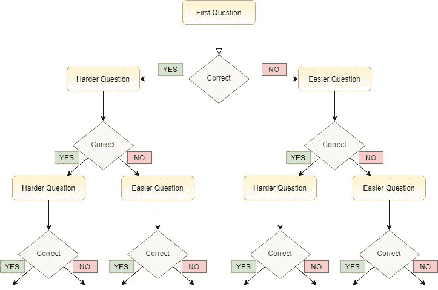
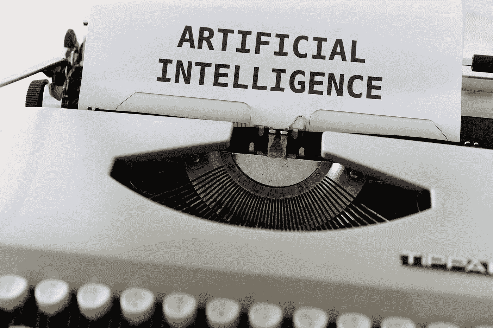

# 人工智能将如何终结人类评估中的一刀切

> 原文：<https://pub.towardsai.net/how-ai-will-end-the-one-size-fits-all-approach-in-human-assessment-4e509f658a76?source=collection_archive---------1----------------------->

## [人工智能](https://towardsai.net/p/category/artificial-intelligence)，[教育](https://towardsai.net/p/category/education)

照片由[马库斯·斯皮斯克](https://www.pexels.com/@markusspiske?utm_content=attributionCopyText&utm_medium=referral&utm_source=pexels)从[派克斯](https://www.pexels.com/photo/one-black-chess-piece-separated-from-red-pawn-chess-pieces-1679618/?utm_content=attributionCopyText&utm_medium=referral&utm_source=pexels)拍摄

假设你走进一家商店，为自己买了一套漂亮的衣服。你在商店里逛了一会儿，终于找到了一个你真正喜欢的好商店。当你请销售助理帮你找到合适的尺码时，她/他会说“我们只卖均码的衣服。你可以在试衣间试穿这套衣服，看看它是否真的适合你。”这个故事对你来说可能听起来像反乌托邦小说，因为今天世界上大多数服装店都提供不同尺寸的衣服和额外的裁剪/修改服务。因此，你可能永远不会买一刀切的西装。

令人惊讶的是，当涉及到人力评估(例如，测试、测验和招聘考试)时，我们恰好是“一刀切”方法的忠实粉丝。当我们需要衡量某项技能或能力时，我们通常更喜欢简单的评估，对所有人都有相同的问题，不管他们的能力水平如何。通过使用这样的评估，我们不知不觉地希望评估将充分“适合”所有的人——这很少发生。这就是为什么我们经常看到一些人认为问题对他们来说要么太简单要么太难，尽管他们接受了相同的评估。对于这些人来说，一刀切的评估无法表明他们的表现有多好(或多差)。

# 定制评估

那么，有没有可能为每个人量身定制评估呢？答案是肯定的！事实上，为每个人量身定制评估的想法可以追溯到 20 世纪初。法国心理学家阿尔夫莱德·比奈创造了第一个智商测试——被称为比奈-西蒙智商测试。比奈的智商测试由一系列问题组成，这些问题根据儿童的实际年龄(从 3 岁到 11 岁)进行规范。测试从一组孩子年龄水平的问题开始。根据孩子的表现(例如，大部分是正确答案或不正确答案)，他在下一个更高(或更低)的年龄水平管理问题[2]。

比奈量身定制的人类评估方法绝对具有创新性和突破性，但有点费力。多亏了现代技术，我们现在能够通过计算机自动化比奈定制的评估方法。

## 计算机化适应性测试

*计算机化自适应测试* (CAT)是一种基于计算机的评估形式，遵循量身定制的人类评估(或量身定制的测试)的思想。CAT 旨在根据每个人对之前管理的问题的回答选择最合适的问题，从而为每个人创建量身定制的评估。例如，如果一个人正确回答了一个中等难度的问题，那么 CAT 会认为这个人的能力水平高于问题的难度水平，因此在下一轮中会提出一个更难的问题。但是，如果个人不能正确回答该问题，则在下一轮中会给她/他一个更简单的问题(参见下面的图 1，了解该过程)。

**图一。**典型猫管理流程图(图片由作者提供)

上述问题选择过程继续，直到满足停止标准(例如，回答最大数量的问题、达到分配的时间、在估计个人的最终分数时具有一定的精度水平)。总体而言，CAT 允许评估根据每个人的能力水平进行调整(或调整),而不是遵循一刀切的方法。使用卡特彼勒的一些好处包括:

*   在评估中使用更少的问题，
*   通过避免太难或太容易的问题来节省时间，以及
*   个人能力水平评估的高而一致的精度。

如今，许多高风险评估，如[武装部队职业能力倾向测验](https://www.officialasvab.com/recruiters/cat-asvab/)(asva b)[国民议会执照考试](https://www.ncsbn.org/nclex.htm) (NCLEX)和[研究生管理入学考试](https://www.gmac.com/gmat-other-assessments/about-the-gmat-exam) (GMAT)，都使用 CAT 方法来评估候选人的能力水平，用于各种目的，如军队入学手续、护士执照和商学院申请。

## 还有什么？

马库斯·温克勒在 [Unsplash](https://unsplash.com?utm_source=medium&utm_medium=referral) 上拍摄的照片

计算机化自适应测试，或 CAT，显然是定制人类评估的一个很好的开始。然而，它不一定是一种**人工智能(AI)** 方法。在人工智能的帮助下，有可能以其他方式进一步定制人类评估。

人工智能在人类评估中最好的应用之一是智能教学系统。这些系统根据个人的能力水平和兴趣领域为个人创造个性化的学习环境。通过深度学习算法训练的数字导师，个人参与数字导师推荐的定制学习材料，完成评估任务，然后接收对他们表现的反馈[3]。例如， [Amira](https://www.amiralearning.com/) 是一款专为一、二年级学生设计的数字阅读助手。当学生以自己的速度大声朗读故事时，Amira 采用自动语音识别实时听取他们的阅读，评估他们的口语阅读流利度，并在必要时进行干预。

**自动论文评分**是另一种先进的技术，它采用自然语言处理(NLP)技术来自动给书面文本评分，范围从简答题到长篇论文。自动论文评分依赖于基于从已经由人类评分者评分的文本中提取的语言特征建立评分算法。评分算法可用于对一组新个体的回答(或文章)进行评分[4]。通过使用自动论文评分的评估，个人有机会在回答问题时使用自己的语言——这是另一种形式的定制。

除了定制评估本身，还可以定制评估的实施方式。例如，我和我的同事最近开发了一个智能推荐系统**，它可以指导教师在学年中何时评估学生的学习。我们的目标是帮助教师为每个学生创建一个“个性化”的评估时间表，考虑学生获取知识的速度。该系统帮助教师根据每个学生的进步找到最佳的评估时间表，从而避免过度测试学生。**

# **下一步是什么？**

**卡耐基梅隆大学的一组研究人员最近创造了[一种新方法](https://www.cmu.edu/news/stories/archives/2020/may/intelligent-tutors.html)，允许教师在智能辅导系统中建立自己的课程和评估。通过这种方法，教师将能够与基于人工智能的数字导师合作，为学生进一步定制学习活动和评估。**

**除了教师和教育工作者，人工智能的使用还将帮助公司和组织为招聘和选择目的创建量身定制的人才评估。例如，一些组织已经开始使用虚拟助理(即聊天机器人)，模拟与候选人的对话，并帮助人力资源(HR)团队做出招聘决定[5]。有了人工智能支持的定制评估，人类偏见和刻板印象对选择决策的影响也将得到缓解。**

**我相信，我们越是接受和拥抱人工智能，我们就能在未来创造出越好(和更有针对性)的评估。**

# **参考**

**[1]比奈，a .，&西蒙，Th .(1905 年)。诊断智力异常的新方法。《心理学年鉴》，第 11 卷第 191-244 页。**

**[http://iacat.org/node/442](http://iacat.org/node/442)**

**[3]帕维奥蒂、罗西和扎尔卡(2012 年)。智能教学系统:综述。 *Pensa 多媒体*，1–176。**

**[4] Gierl，M. J .，Latifi S .，Lai，h .，Boulais，A. P .，De Champlain，A. (2014 年)。自动化论文评分与医学教育中教育评估的未来。*医学教育，48* (10)，950–962。**

**[5][https://www . select software reviews . com/buyer-guide/HR-chat-bots](https://www.selectsoftwarereviews.com/buyer-guide/hr-chat-bots)**