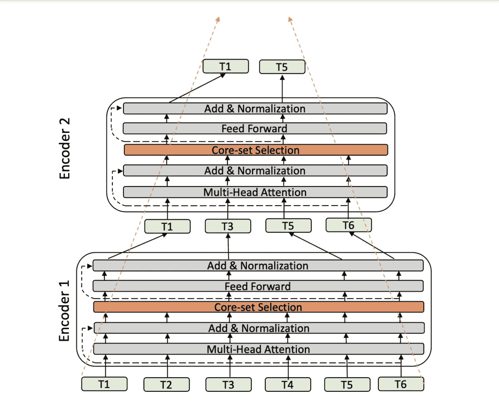
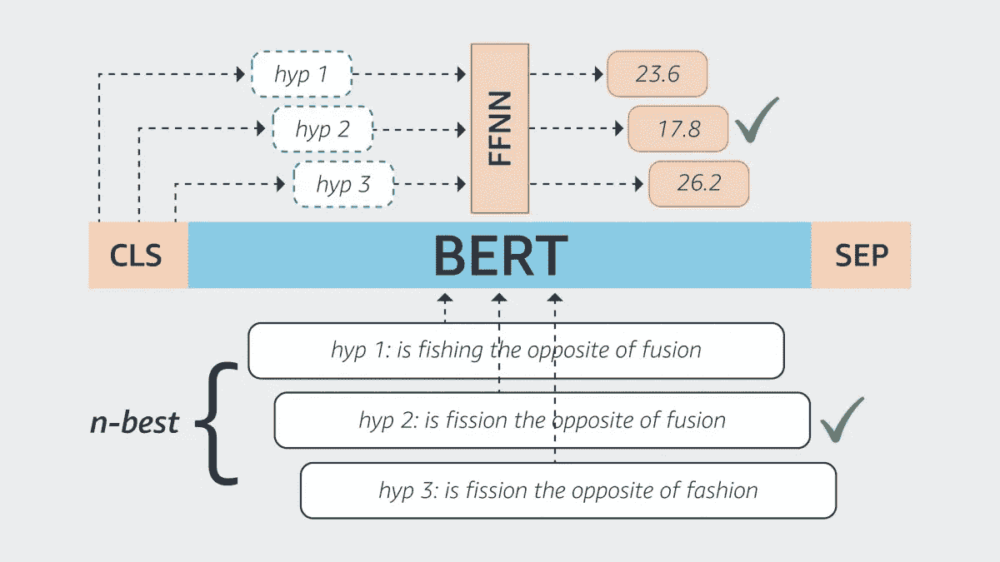
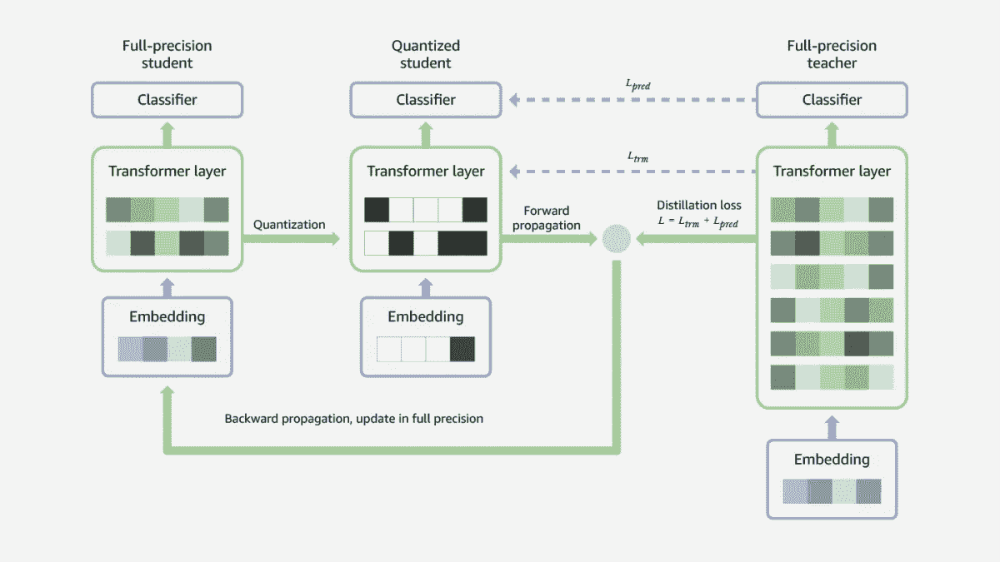

# 亚马逊如何改进 Alexa 中使用的基于 BERT 的模型

> 原文：<https://pub.towardsai.net/how-amazon-is-improving-bert-based-models-used-in-alexa-3b074489bcbf?source=collection_archive---------2----------------------->

## 亚马逊研究在上个月发表了三篇关于基于 BERT 模型的论文。

来源:[https://www . technology review . com/2019/03/26/136354/Alexa-needs-a-robot-body-to-escape-the-boundaries-of-todays-ai/](https://www.technologyreview.com/2019/03/26/136354/alexa-needs-a-robot-body-to-escape-the-confines-of-todays-ai/)

> 我最近创办了一份专注于人工智能的教育时事通讯，已经有超过 125，000 名订户。《序列》是一份无废话(意思是没有炒作，没有新闻等)的 ML 导向时事通讯，需要 5 分钟阅读。目标是让你与机器学习项目、研究论文和概念保持同步。请通过订阅以下内容来尝试一下:

 [## 序列

### 与机器学习、人工智能和数据发展保持同步的最佳资源…

thesequence.substack.com](https://thesequence.substack.com/) 

BERT 已经成为过去十年中最具代表性的机器学习方法之一。自从现在著名的论文在[发表以来，伯特已经启发了一代语言模型，这些模型彻底改变了自然语言理解领域(NLU)。亚马逊一直是基于 BERT 模型的主要采用者之一，特别是在支持 Alexa 数字助理的架构方面。因此，亚马逊研究院定期发布对基于 BERT 的模型的改进，以解决 Alexa 所需的一些大规模场景。几天前，随着三篇不同论文的发表，我们看到了亚马逊研究中心最近在基于 BERT 的模型方面的工作。让我们快速浏览一下这些作品。](https://arxiv.org/abs/1810.04805)

# 1)用金字塔伯特简化伯特

BERT 模型因庞大、缓慢和计算量大而臭名昭著。这种复杂性部分与它们可以处理的输入大小直接相关。在 Pyramid-BERT:通过连续的基于核心集的令牌选择降低复杂性中，Amazon Research 引入了一种方法来减少基于 BERT 的模型的训练时间、内存占用和推理时间，而不牺牲准确性。

金字塔-BERT 的核心思想是使用不同层的编码器来消除中间层中冗余的单个单词嵌入，同时尽量减少完整句子嵌入的影响。这实质上相当于用一种更优化的方法来改变 BERT 中使用的令牌选择试探法。

图片来源:亚马逊研究

关于金字塔伯特建筑的更多细节可以在原文中找到。

# 2)使用 BERT 改进 ASR 评分

第二遍评分是自动语音识别(ASR)系统的一个重要元素。从概念上讲，第二遍评分机制试图提高第一遍编码器的输出。在 [RescoreBERT:使用 BERT 进行区分性语音识别重新评分](https://www.amazon.science/publications/rescorebert-discriminative-speech-recognition-rescoring-with-bert)中，亚马逊研究公司推出了 RescoreBERT，这是一种基于 BERT 的模型，用于 ASR 系统中的第二遍评分。

RescoreBERT 架构增加了一个 BERT 模型来处理第一遍编码器的不同输出。BERT 使用分类令牌对输入进行编码，然后将它们传递给前馈神经网络，该网络计算第二个句子级别的分数。您可以看到下图中编码器产生的不同假设。

图片来源:亚马逊研究

# 3)压缩 BART 模型

双向自回归转换器(BART)是 BERT 的一种变体，在文本摘要、信息提取和问题回答等 NLP 任务中获得了很大的吸引力。然而，BART 模型通常平均超过 5000 亿个参数，这使得在资源受限的环境中执行变得极其昂贵。在[DQ-巴特:通过联合蒸馏和量化的有效序列到序列模型](https://www.amazon.science/publications/dq-bart-efficient-sequence-to-sequence-model-via-joint-distillation-and-quantization)中，亚马逊研究公司提出了一种 BART 模型的压缩方法，实现了超过 16.5 倍的大小增益。

DQ-巴特技术采用师生模型。在这种架构中，教师可以针对特定的 NLP 任务进行微调。教师模型的权重被传递到学生网络，学生网络使用蒸馏感知量化方法来产生低精度模型。然后，该模型用于训练教师产生最佳模型。

图片来源:亚马逊研究

正如你所看到的，BERT 是 Alexa 功能的一个非常相关的元素，亚马逊研究似乎正在积极创新这些架构和方法。在不久的将来，我们应该会在这方面看到更多的贡献。